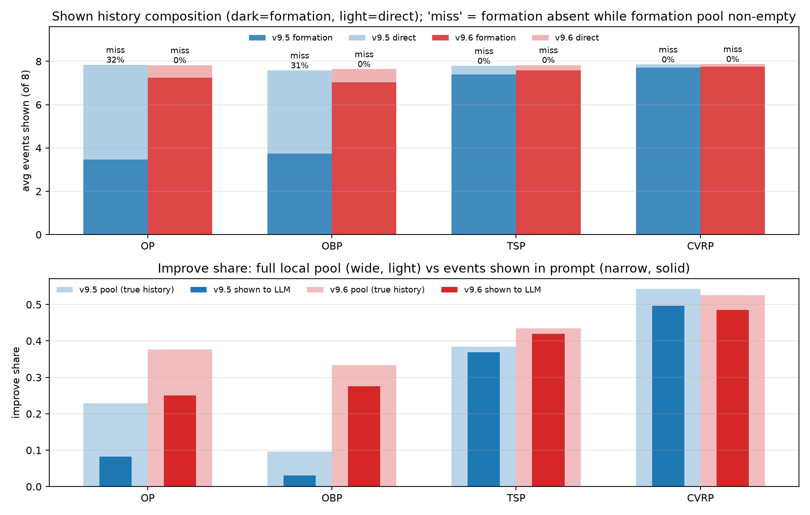
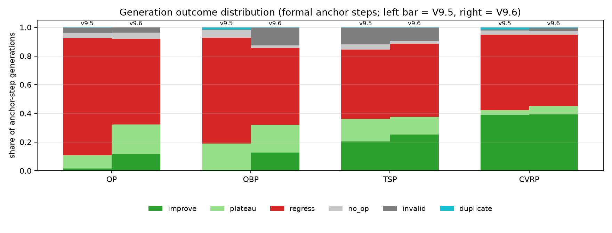
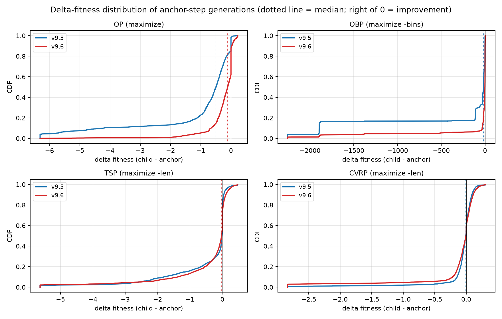
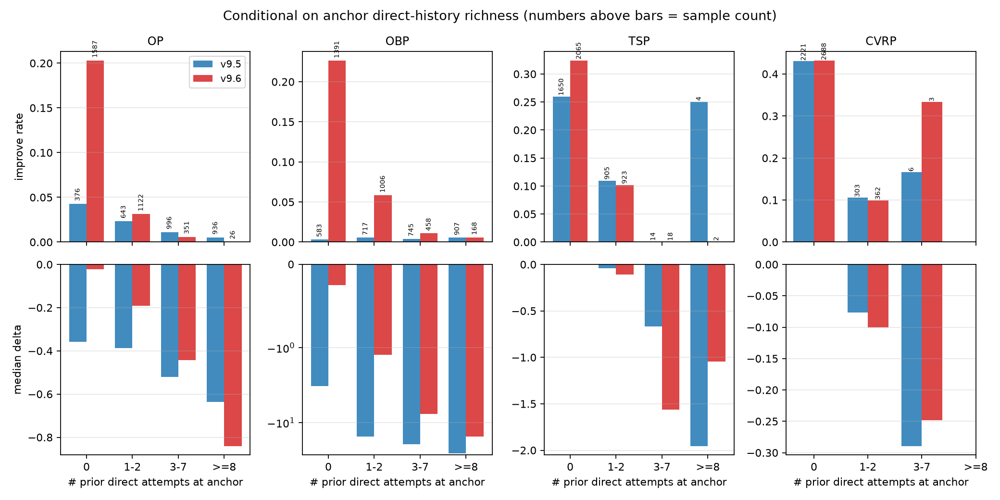
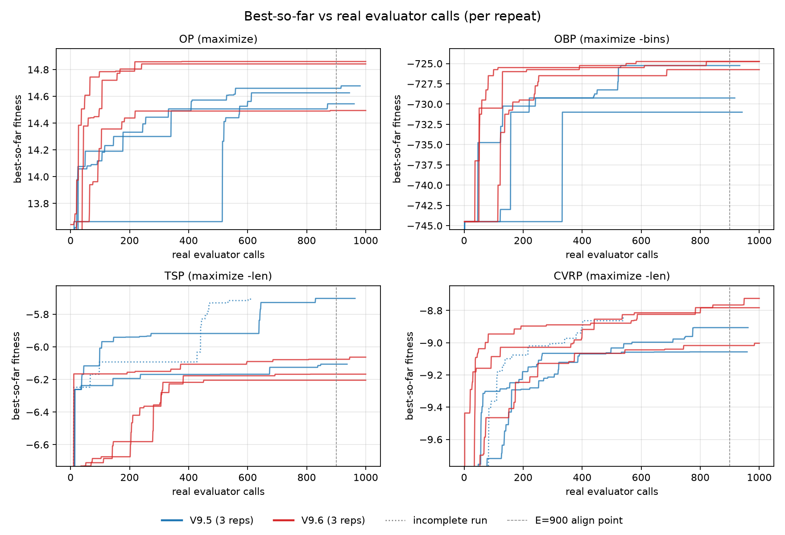

# TraceAAD-V9.5-V9.6机制诊断

V9.5 引入锚点证据与质量—机会分配（10/12 个计划运行完成），V9.6 只改变历史表示与预算单位。

## TraceAAD V9.5 联合机制诊断

V9.5 联合引入 Quality + Opportunity 分配与新的历史证据表示，只有 10/12 个计划运行完成（TSP、CVRP 各缺一次完成运行）。

### 数据完整性

| Task | r1 | r2 | r3 | held-out 聚合 |
| --- | --- | --- | --- | --- |
| TSP | 623 responses 后中断 | 1000，完成 | 1000，完成 | n=2 |
| CVRP | 1000，完成 | 580 responses 后中断 | 1000，完成 | n=2 |
| OP | 1000，完成 | 1000，完成 | 1000，完成 | n=3 |
| OBP | 1000，完成 | 1000，完成 | 1000，完成 | n=3 |

两次中断来自 tokenizer 不可用后产生的假 context overflow；未完成运行不进入均值、方差和排名。

### 最终质量

| Task | Search best（完成运行） | Held-out（完成运行） | 描述性方向 |
| --- | --- | --- | --- |
| TSP | -5.905±0.285（n=2） | 5.907 / 8.273 / 11.980 | 相对 V9 三个测试规模均更低，但重复不完整 |
| CVRP | -8.982±0.106（n=2） | 9.432 / 15.828 / 27.966 | 相对 V9 仅 CVRP200 略低；其余不支持统一改善 |
| OP | 14.616±0.068（n=3） | 14.936 / 29.811 / 52.891 | 三个测试规模均低于 V9 |
| OBP | -728.50±2.95（n=3） | 425.4 / 2036.7 / 4062.7；80.8 / 402.67 / 804.87 | 多数设置弱于 V9 |

V9.5 的描述性正方向集中在 TSP，负方向集中在 OP；CVRP 与 OBP 呈混合结果。TSP、CVRP 只有两个完成运行。

### 预算分配行为

分配分数为 $S=q+s/\sqrt{n+1}$。将实际选择与纯质量选择比较，得到三类运行形态：

| Task | optimism changed rate | 运行形态 |
| --- | --- | --- |
| TSP | 93.4%–95.0% | 乐观项持续改变选择 |
| CVRP | 85.8%–90.9% | 乐观项持续改变选择 |
| OP | 2.1%–14.4% | 接近纯质量选择 |
| OBP | 0%（$s=0$） | 纯质量加平局规则 |

该差异表明分配公式在任务间产生了不同干预强度，但 changed rate 与最终质量没有单调关系：TSP 的高干预对应较强结果，CVRP 没有统一改善；OP 的低干预较弱，OBP 居中。干预强度本身不是优化目标。

### 搜索拓扑与历史组成

多数完成运行将至少 98% 的正式预算集中在一个初始根谱系；OBP r2 的 Top-1 share 为 74.5%。TSP/CVRP 的最终程序具有 110–295 步的连续形成路径，OP/OBP 为 17–53 步。谱系只记录 parent-child 来源，不表示算法思想或语义搜索区域。

历史组成随访问方式变化：

| Task / run | 主要历史组成 |
| --- | --- |
| TSP r2/r3 | formation-heavy，平均约 7.4 条 formation，direct 中位数 0 |
| CVRP r1/r3 | formation-heavy，平均约 7.7 条 formation，direct 中位数 0 |
| OP r3 / OBP r1 | direct-heavy，分别约 6.21 / 6.86 条 direct |
| OP r1/r2 / OBP r2/r3 | formation 与 direct 混合 |

历史组成与锚点新鲜度相关：频繁访问新锚点时 formation 较多，反复重访成熟锚点时 direct 较多。这是搜索内生相关，不能用于判断哪种历史更好。

### 非单调形成路径

| 最终最好程序的形成路径 | improve | plateau | regress |
| --- | ---: | ---: | ---: |
| TSP r3 | 47 | 19 | 43 |
| TSP r2 | 55 | 33 | 51 |
| CVRP r3 | 150 | 9 | 135 |
| OP r3 | 15 | 15 | 0 |
| OP r2 | 13 | 35 | 4 |
| OBP r1 | 10 | 6 | 0 |

TSP/CVRP 的最终最好程序经过大量短期退步，说明若只允许逐步改善，会删除实际出现过的成功形成路径。该观察支持保留可执行的 regression state；它不支持给退步自动加正信用，也不能把事后成功谱系解释为可预知的前瞻价值。

### 后续证据的修正

V9.5 当时无法区分 `Current Code + History` 与 `Current Code Only`。随后固定锚点三臂实验显示，加入父代改进来时路后，四任务的配对 conditional $\Delta q$ 区间均不跨 0；加入已有子代尝试没有稳定额外价值。因此，V9.5 的 formation-heavy / direct-heavy 相关不能承担历史价值的因果解释。

V9.6 的完整搜索比较还表明，历史组成修正、生成分布和分配尺度会共同变化。V9.5 暴露出的核心问题因而应表述为两个独立研究对象：

1. 给定锚点时，哪些形成历史改善单步生成；
2. 给定生成协议时，哪些锚点值得获得下一份预算。

### 结论

- V9.5 的状态、历史和分配机制均实际运行；这只证明可执行，不证明科学有效。
- 三种分配形态和非单调谱系是过程事实，不是机制收益。
- V9.5 的主要科学价值是促成了历史上下文与预算分配的分离识别。

## TraceAAD V9.5 → V9.6 证据链对比

### 证据链四层

比较沿四层证据展开：

1. 历史上下文是否按设计改变；
2. 单步生成结果是否改变；
3. 搜索过程是否改变；
4. 最终测试表现是否改变。

### 数据范围与混杂

| Task | V9.5 三次运行的真实评价数 | V9.6 三次运行的真实评价数 |
| --- | --- | --- |
| OP | 945 / 961 / 981 | 1000 / 1000 / 1000 |
| OBP | 934 / 942 / 917 | 1000 / 1000 / 1000 |
| TSP | 612（中断）/ 937 / 964 | 1000 / 1000 / 1000 |
| CVRP | 959 / 545（中断）/ 962 | 1000 / 1000 / 1000 |

过程比较统一使用真实评价数并在 E=900 截齐。V9.5 的 TSP、CVRP 各有一次基础设施中断，不进入 E=900 聚合和 held-out 均值。两版还共同改变了上下文上限（24576→32768）和 token 计数方式。bootstrap 产生的一步尺度也系统性变化：OP 0.035–0.194→0.374–0.613，OBP 0/0/0→9.13/0/11.25，CVRP 0.73–0.86→1.03–2.45。该尺度是生成结果的下游量，并进一步改变预算分配，因此搜索层结果存在中介混杂。

### 第一层：历史组成按设计改变

| 指标 | OP v9.5→v9.6 | OBP v9.5→v9.6 | TSP v9.5→v9.6 | CVRP v9.5→v9.6 |
| --- | --- | --- | --- | --- |
| avg formation 条数 | 3.47→7.25 | 3.74→7.04 | 7.39→7.59 | 7.72→7.76 |
| avg direct 条数 | 4.37→0.57 | 3.84→0.60 | 0.40→0.24 | 0.13→0.11 |
| formation 缺席率 | 31.6%→0 | 30.8%→0 | 0.2%→0 | 0→0 |
| 池 improve 占比→展示占比 | 22.9%→8.2% ⇒ 37.7%→25.0% | 9.6%→3.1% ⇒ 33.4%→27.6% | 38.4%→36.9% ⇒ 43.5%→41.9% | 54.4%→49.6% ⇒ 52.5%→48.6% |
| 平均 prompt tokens | 4669→3236 | 5291→2542 | 5370→2946 | 6117→3804 |

formation 缺席被消除，提示缩短 31%–52%。展示的 improve 占比仍低于可用池，说明表示偏差缩小但没有清零。池本身也随搜索访问分布变化，因此这不是固定锚点上的纯选择器对照。

### 第二层：单步生成变化具有任务异质性

| 指标 | OP v9.5→v9.6 | OBP v9.5→v9.6 | TSP v9.5→v9.6 | CVRP v9.5→v9.6 |
| --- | --- | --- | --- | --- |
| improve rate | 1.6%→11.6% | 0.5%→12.6% | 20.5%→25.4% | 39.1%→39.3% |
| regress rate | 81.7%→59.7% | 73.6%→53.5% | 48.5%→51.0% | 52.7%→49.7% |
| invalid rate | 3.7%→3.6% | 0.6%→12.3% | 11.5%→9.6% | 0.7%→1.9% |
| median $\Delta q$ | -0.50→-0.11 | -17.25→-1.25 | -0.010→-0.024 | -0.008→-0.003 |
| $P$(new global best) | 1.2%→1.2% | 0.5%→1.1% | 1.5%→1.7% | 4.2%→2.6% |
| 中位改动行数 | 52→44 | 39→17 | 87→42 | 15→17 |

OP 与 OBP 的一步结局分布明显右移；TSP 的 improve rate 上升但中位 $\Delta q$ 没有改善；CVRP 基本不变。OBP 的 invalid 增长主要来自评价超时，说明 V9.6 生成了更慢的启发式并消耗真实预算。四任务的修改幅度总体收缩。

#### 条件化位置

| direct 池大小 | OP improve rate | OBP improve rate | TSP improve rate | CVRP improve rate |
| --- | --- | --- | --- | --- |
| 0 | 4.3%→20.3% | 0.3%→22.7% | 25.9%→32.4% | 43.0%→43.2% |
| 1–2 | 2.3%→3.1% | 0.6%→5.9% | 10.9%→10.2% | 10.6%→10.1% |
| 3–7 | 1.1%→0.6% | 0.4%→1.1% | n<20 | n<10 |
| ≥8 | 0.5%→0.0%（n=26） | 0.55%→0.6% | n<5 | — |

变化集中在 direct 稀疏锚点。direct≥3 的生成占比在 OP 从 65% 降至 12%，在 OBP 从 56% 降至 21%；V9.5 的高 direct 失真状态主要是不再被频繁访问，而不是在相同状态上被修复。分层锚点由搜索内生选择。direct 挑选规则在其目标状态上没有显示独立收益。

### 第三层：搜索过程改变，但方向不统一

| Task | V9.5 E900 / AUC@900 | V9.6 E900 / AUC@900 | 描述 |
| --- | --- | --- | --- |
| OP | 14.61 / 14.28 | 14.73 / 14.62 | V9.6 早期更高，但 2/3 运行在 241/377 次评价后不再刷新 |
| OBP | -728.5 / -732.2 | -725.1 / -726.7 | V9.6 全程更高，末次刷新更晚 |
| TSP | -5.90 / -6.05（V9.5 n=2） | -6.15 / -6.28 | V9.6 三次运行均低于 V9.5 完成运行 |
| CVRP | -8.98 / -9.27（V9.5 n=2） | -8.86 / -9.08 | V9.6 对齐终点与 AUC 更高 |

OP、OBP、CVRP 的过程指标向好，TSP 向差。CVRP 的单步统计没有同步改善，说明过程变化至少部分经过预算分配。TSP 的修改收缩与搜索下降同时出现，但后续固定锚点实验显示，在相同 TSP 锚点上加入来时路时，单步 $\Delta q$ 改善 +1.233 [0.283, 2.375]，且修改同时收缩。因此“历史导致收缩，收缩导致 TSP 退化”的直接因果链不受现有证据支持。

### 第四层：最终结果依赖任务

| Task | Search best：V9.5→V9.6 | Held-out：V9.5→V9.6 |
| --- | --- | --- |
| OP | 14.616±0.068→14.732±0.206 | OP50 14.936→15.020；OP100 29.811→29.312；OP200 52.891→49.976 |
| OBP | -728.50±2.95→-725.08±0.58 | `1k/100` 425.4→411.5；`5k/100` 2036.7→2021.9；`10k/100` 4062.7→4034.9；capacity=500 近似持平 |
| TSP | -5.905±0.285（n=2）→-6.145±0.074 | TSP50 5.907→6.249；TSP100 8.273→8.752；TSP200 11.980→12.531 |
| CVRP | -8.982±0.106（n=2）→-8.837±0.146 | CVRP50 9.432→9.213；CVRP100 15.828→15.667；CVRP200 27.966→28.321 |

OBP 的 capacity=100 三档方向一致且运行间变异缩小；OP 的搜索均值上升，但 OP100/200 被一个泛化较差的运行拖低；CVRP 在 50/100 改善、200 变差；TSP 三档均变差。V9.6 不是对 V9.5 的统一升级。

### 结论

1. V9.6 的历史组成修正确实运行，formation 恢复和提示压缩均有直接过程证据。
2. 完整搜索中的单步变化集中在 direct 稀疏锚点，但该比较受锚点人群变化影响。固定锚点三臂实验随后更直接地支持了父代来时路的单步价值，并没有支持已有子代尝试的稳定额外价值。
3. 搜索与 held-out 结果呈任务依赖。上下文上限、生成分布、bootstrap 尺度和预算分配同时变化，最终差异不能归因于历史表示一项。
4. 修改收缩是可重复的行为变化，在固定锚点实验中与质量改善同向。
5. V9.5 的 TSP、CVRP 各缺一次完成运行。
