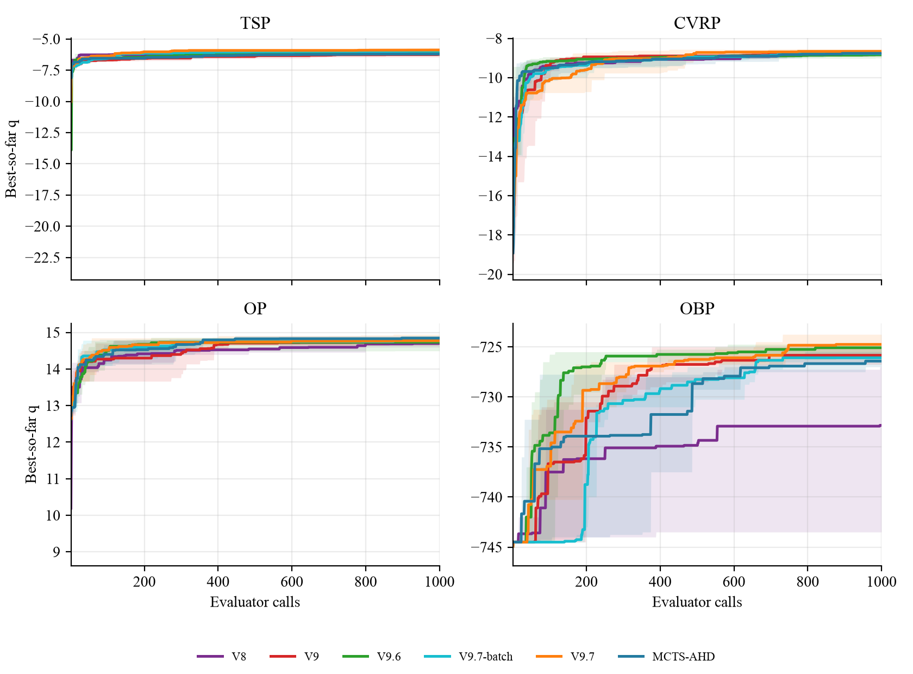
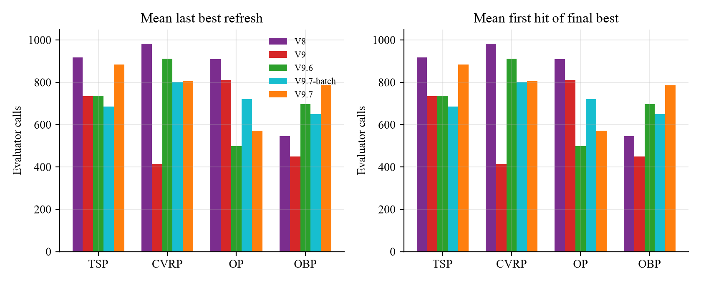
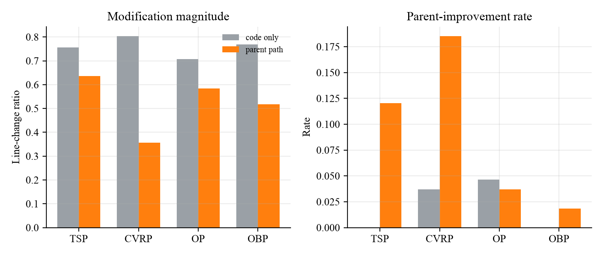
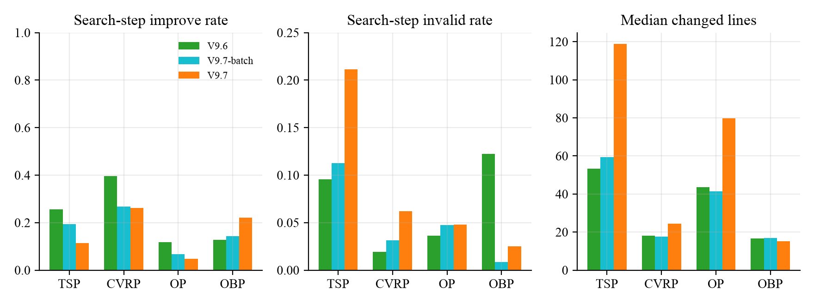
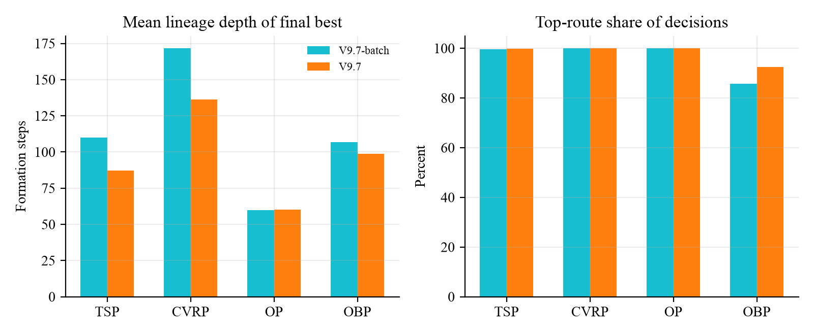

# TraceAAD V9.7：机制有效性与任务异质性

> 分析对象：正统 V9.7（`20260814_150927`）、V9.7-batch（`20260813_184519`）、V9.6、V9、V8 与 MCTS-AHD 的 1000 eval 正式运行；第三轮固定锚点三臂实验。数字与曲线由 `experiments/analysis/analyze_v97_mechanism_value.py` 从原始工件计算，摘要在 [`traceaad_v97_mechanism_value/`](traceaad_v97_mechanism_value/)。
> 时点：2026-08-15。本文回答现有实验里哪些机制有证据、为什么有用；不设计下一版机制。

## 核心判断

V9.7 值得作为稳定研究对象，因为它把轨迹的用途说清楚了：保存程序形成过程，把它当作下一步修改的条件，并用简单的质量—机会规则在历史状态之间分配预算。这比 V9.1–V9.4 的轨迹价值函数更可检验。

现有证据支持三条，且必须分开写：

1. **来时路在固定锚点上改善单步生成**，主要方式是压缩灾难性改写，而不是稳定提高改进频率。
2. **完整 V9.7 在四任务综合比较中很强**，但这是联合协议结果。TSP 相对 V9.6 约 4% 的 held-out 改善，已经出现在仍使用旧历史上下文的 V9.7-batch 上；正统协议相对 batch 在 TSP 上几乎没有再改善。
3. **收益有明显任务依赖。** CVRP 上，去掉子代尝试的正统协议相对 batch 有约 2%–3% 的同向 held-out 改善，并取得 CVRP100/200 列最佳；OP 上 V9.7 明显不占优势，搜索后期几乎不再刷新。

因此不能把“代表性同场平均排名第一”读成“来时路在完整搜索中被识别为净贡献”，更不能写成所有任务上的单调升级。

## 1. 四个组成部分各自处在哪一层证据

V9.7 有四个真正的设计块。它们不是同等程度被支持的。

| 组成部分 | 机制是否运行 | 单步生成 | 完整搜索 / held-out |
| --- | --- | --- | --- |
| Forest / Anchor：同一代码、不同来时路是不同状态 | 运行。最终最好程序的形成深度在 TSP 约 79–93 步、CVRP 约 120–155 步，路径含退步与持平 | 锚点定义了探针的固定单位 | 未单独消融 |
| 两级 $q+s/\sqrt{n+1}$ | 运行，但两层强度极不对称。正统批次 12,152 次决策中，路线乐观项只改变 130 次（1.07%），且全部发生在前 1/3；锚点层改变 7,877 次（64.8%） | 不经过生成探针 | 没有固定历史的分配消融。TSP/CVRP/OP 的顶路线份额为 99.4%–100%；OBP 为 85.9%–98.0% |
| 父代来时路作为生成条件 | 运行。搜索阶段展示的形成事件中位数接近 8 | 四任务配对 $\Delta q$ 区间均不跨 0 | 与 batch 的对照只识别“去掉子代尝试”，不是“有无来时路” |
| 固定 Refine 0.7 / Explore 0.3 | 运行。Refine 的修改行数与 improve rate 都稳定高于 Explore | 无固定锚点意图消融 | 与路线分配同时引入，不能从 V9.6→batch 中拆开 |

V9.7 与 V9.7-batch 共享两级分配和意图混合，只改变历史组成（batch 仍加入已有子代尝试）。这是目前唯一接近单因素的完整搜索对照。V9.6→V9.7-batch 同时改了分配和意图，只能评价联合系统。

## 2. 问题一：TraceAAD 究竟强在哪里

Held-out 数字以各任务结果页为准。下面用搜索过程把四个任务拆开。搜索曲线使用有向质量 $q$，越高越好；它反映搜索集上的 best-so-far，不能替代测试。

### TSP：联合协议把搜索天花板抬高了，来时路收缩不是这一跳的原因

正统 V9.7 的 TSP50/100/200 均值为 5.991/8.390/12.025，相对 V9.6 约低 4.1%/4.1%/4.0%，三个规模同向；相对 V9.7-batch 为 0.08%/0.08%/0.56%。列最佳仍是 V6（TSP50）与 V9.1 Trajectory（TSP100/200）。代表性同场中 V9.7 在 TSP50/100 第 1。

搜索集 $q$ 与测试同向：三次运行终点均值为 V9.7 −5.883、V9.7-batch −5.979、V9.6 −6.145、V8 −6.075、MCTS-AHD −6.209。V9.7 在 100/250/500/1000 eval 上的均值都高于 V9.6 和 batch。也就是说，TSP 的改善在搜索过程里就已经出现，不是测试集上的偶然翻转。

关键拆分是：

- **V9.6 → V9.7-batch** 同时换了两级分配和 Refine/Explore，held-out 已经取得那约 4%；
- **V9.7-batch → 正统 V9.7** 只去掉子代尝试，held-out 不再移动。

因此，TSP 上“轨迹有用”的完整搜索证据，目前支持的是**联合协议相对 V9.6/V9 变强**，而不是“来时路单独造成了 4%”。单步探针里 TSP 的来时路收益是明确的（配对 $\Delta q$ +1.233，区间不跨 0），但它还没有被一个 code-only 完整搜索消融接住。

TSP 的最终最好程序都来自很长的非单调形成链：三次运行的谱系深度为 90/79/93，路径上同时有 improve、plateau 和 regress，末尾连续 improve 只有 1–2 步。最终 best 出现得很晚（sample order 783/930/988）。这与“优秀程序往往经过试错和修正”一致，但不能把深度本身写成因果机制：三次运行把 99.4%–100% 的路线预算都给了同一初始来源，深度首先是单一路线被反复延长的结果。

### CVRP：去掉子代尝试与跨规模测试同向，同分布档仍是 V8

任务页此前把三档列最佳都写成 V8。按均值重核：CVRP50 仍是 V8（8.952 vs V9.7 的 9.021，约 +0.8%）；CVRP100/200 的最低均值是正统 V9.7（15.160/27.265，相对 V8 约 −0.8%/−1.3%）。V9.7 三次运行在 100/200 上并不齐，rep2 最弱，标准差大于 V8。代表性同场里 V9.7 在 CVRP100/200 第 1，与全版本列最佳一致。

相对 V9.7-batch，正统协议三档为 −2.0%/−2.8%/−2.9%，同向。这是目前最接近“历史组成改变完整搜索”的正信号：同一套分配和意图下，只保留来时路、不再展示已有子代，CVRP 的 held-out 变好。它与第三轮探针一致——CVRP 上追加子代尝试没有稳定收益，improve rate 还从 18.5% 降到 9.3%。

搜索过程也支持天花板提高，而不是更早锁死：终点 $q$ 为 V9.7 −8.662、batch −8.779、V8 −8.738。V8 的最后一次刷新更晚（三次均在 979–986），测试同分布档仍然更好。一个可用的读法是：V8 的树搜索在 CVRP50 上找到了更稳的同分布解；V9.7 的长形成链在更大实例上泛化更好。这仍是观察，不是已识别的机制。

CVRP 最终 best 的谱系比 TSP 更深（120/155/134 步），路径上 improve 与 regress 大量交替。同样受单一路线垄断预算的混杂。

### OP：V9.7 不占优势，搜索很早把增益用完

OP50/100/200 的列最佳是 V9 / V5 / V5。正统 V9.7 为 15.003/29.904/52.443，相对 V9 为 −1.1%/−2.4%/−4.5%；代表性同场排名 6/8/8。相对 batch 为 +0.03%/−0.65%/−2.6%，大规模略差。

搜索过程把这个弱势说得更清楚。V9.7 三次运行的 improve rate 只有 4.8%（batch 6.8%，V9.6 11.7%）。90% 的搜索增益平均在第 82 次评价就到达，最后一次刷新的均值为第 571 次，三次分别为 239/875/696。V9 的终点 $q$（14.808）和 MCTS-AHD（14.845）都高于 V9.7（14.773）。OP 上 V9.7 更像是**更早耗尽一个较低的搜索天花板**，不是更强的后期开发。

谱系深度中等（56/81/44），路径里 plateau 明显多于 TSP/CVRP。单步探针里 OP 的来时路 $\Delta q$ 为正但很小（+0.250），improve rate 没有上升（4.6%→3.7%）。完整搜索的弱势与“来时路在 OP 上几乎不增加真正改进、只减少大崩”是相容的。

### OBP：版本差落在噪声里，路线层反而最活跃

六档均值差多在 1% 以内，方向不完全一致。正统 V9.7 在 `5k/100` 取得列最低；`1k/100` 是 V9.6，`10k/100` 是 CALM，capacity=500 的大档是 V9.7-batch。搜索终点 $q$ 也挤在 −725 附近。

OBP 是唯一没有把全部预算交给单一初始来源的任务：正统三次运行的顶路线份额为 98.0%/85.9%/93.5%。路线乐观项干预率 4.03%，仍全部发生在早期，但高于 TSP/CVRP/OP 的 0%–0.3%。任务差距小，因此不能把 OBP 的多路线访问写成质量原因。

## 3. 问题二：V9.7 是更快、更高，还是更稳

按搜索集 best-so-far 读，四个任务不是同一种形态。

**TSP 是更高的天花板，并且仍在后期刷新。** 三次运行的最后刷新在 769/912/974。相对 V9.6，V9.7 从第 100 次评价起就领先，终点也更高；后期刷新带来的是小增量，不是唯一的优势来源。三次运行终点 $q$ 的样本标准差为 0.073，小于 V9（0.185），与 V9.6（0.073）相当。held-out 三规模标准差也小于 V9.4。TSP 上可以同时说：样本效率（前 250 次已拿到约 94% 的搜索增益）和更高终点，两者都有；不能只挑一个。

**CVRP 同样是天花板，不是提前锁死。** 最后刷新均值约 806，与 batch 接近；V8 更晚（983）且同分布测试更好。V9.7 的跨规模测试更强，但 100/200 的运行间标准差（0.432/0.816）大于 V8（0.224/0.415）。这里“更稳”不成立。

**OP 是较早耗尽的较低天花板。** 前 250 次评价已经拿到约 98% 的搜索增益，之后几乎不再产生新的全局最好。这与 held-out 落后是同一件事的过程面。

**OBP 的刷新晚、增益碎。** 正统三次最后刷新均在 732 之后，但总增益小，版本差不能从曲线形态里读出稳定机制。

综合：V9.7 在 TSP/CVRP 上主要提高了搜索可达的质量区域，并保留后期小步刷新；在 OP 上没有提高天花板。它不是一个跨任务的 sample-efficiency 方法。

## 4. 问题三：历史到底改变了 LLM 的什么行为

这一层必须优先使用固定锚点实验。完整搜索里的生成统计是被分配和意图混杂过的。

第三轮 72 个锚点、有无来时路的配对结果：

| 任务 | 修改幅度（line-change ratio） | 父代改进率 | 配对 $\Delta q$ |
| --- | --- | --- | --- |
| TSP | 0.756 → 0.637 | 0 → 12.0% | +1.233 [0.283, 2.375] |
| CVRP | 0.804 → 0.357 | 3.7% → 18.5% | +4.298 [2.475, 6.034] |
| OP | 0.707 → 0.584 | 4.6% → 3.7% | +0.250 [0.078, 0.437] |
| OBP | 0.769 → 0.517 | 0 → 1.9% | +111.8 [14.1, 224.3] |

72 个锚点中，来时路使 64 个修改幅度下降、58 个 $\Delta q$ 更好。TSP/CVRP/OP 落入最差十分位的改写分别从 16%/23%/16% 降到 6%/4%/8%。Idea 重复不是问题：完整搜索里相邻两次声明 Idea 完全相同的比例低于 0.1%，唯一率约 99%。

因此，来时路改变的主要生成统计是：**改得更靠近当前程序，少做会崩的大改写；改进概率的上升只在 TSP/CVRP 上清楚，OP/OBP 上几乎没有。** 这比“看了轨迹所以更好”具体得多，也解释了为什么 OP 的单步 $\Delta q$ 可以略正、完整搜索却不强——OP 上它几乎不增加真正的 improve。

完整搜索里还能看到意图混合确实在运行，而且跨任务同向：

正统 V9.7 的 Refine / Explore：

| 任务 | Refine improve / 中位改动行 | Explore improve / 中位改动行 |
| --- | --- | --- |
| TSP | 14.7% / 73 | 4.2% / 245 |
| CVRP | 36.6% / 11 | 2.1% / 258 |
| OP | 6.3% / 49 | 1.3% / 198 |
| OBP | 29.0% / 8 | 6.3% / 111 |

Explore 稳定地做大改、少改进、更多 invalid。这只证明两种指令产生了不同的修改尺度，不能证明 0.7/0.3 是最优混合，也不能把 V9.6→batch 的 TSP 收益算到意图头上。

正统协议相对 batch，TSP 的搜索步 improve rate 从 19.4% 降到 11.4%，invalid 从 11.3% 升到 21.1%，中位改动行从 60 升到 119。方向与探针一致：更少历史（去掉子代）之后改得更大。TSP 上这个行为变化没有变成 held-out 收益。CVRP 的改动行只从 18 升到 24，improve rate 几乎不变（26.8%→26.2%），held-out 却改善了；所以不能用“改得更小所以更好”做跨任务通解。

最终最好程序的形成路径普遍非单调。保留退步状态是有过程依据的：成功谱系里 regress 不是偶发噪声。这仍然只说明“来时路包含退步事实”，不支持给退步发奖。

## 5. 对“何时轨迹有用”的假设

一个值得保留的工作假设是：当任务的有效改进可以沿着已有设计连续积累时，来时路更有价值；当搜索更依赖大幅机制跳跃时，来时路可能把模型钉在已有设计上。

现有数据与它相容，但还不能证实：

- TSP/CVRP 的成功谱系长、Refine 的 improve rate 明显高于 Explore，held-out 上 V9.7 也相对更强；
- OP 的 improve 稀疏、路径里 plateau 多、来时路几乎不提高改进率，完整搜索落后；
- 可是 TSP 的 4% held-out 跳变发生在分配+意图联合变更之后，不是发生在只保留来时路之后；
- 路线预算在 TSP/CVRP/OP 上几乎塌缩到单一来源，谱系深度与“任务需要深积累”缠在一起。

在没有 code-only 完整搜索消融、也没有按任务读出“可积累性”的独立度量之前，这个假设只用于组织下一轮分析，不能写进结论。

## 6. 失败版本的位置

V9.1–V9.4 把“轨迹有信息”实现成路线推进率、子代均值、三步 rollout 和折扣回传，过程上多数没有稳定改变选择，性能上也没有跨任务正信号。它们不是废料：它们把贡献校准到更可信的位置——**轨迹应当作为生成条件与状态表示保留，不应当被收成一个在线价值函数。** V9.3 混淆的“历史 ≠ 一次提交多步 rollout”，以及 V9.4 恢复的单步原子决策，仍然是 V9.7 的前提。

## 7. 下一步：先读簇结构，不堆 V9.8

当前最有信息量、且仍可用现有工件推进的问题，按这个顺序：

1. 在正统 V9.7 的 lineage 上问：八个根和最终最好程序是不同算法簇，还是同一族的代码变体。没有这个判断，路线塌缩无法在“正确集中 / 没有臂 / 分数看不见”之间分开。
2. 对照 TSP 的长形成链和 OP 的早停，看模型是在族内连续 refine，还是很早钉在一个低上限簇里。这是任务几何，不是“长轨迹 vs 短轨迹”。
3. 按 Refine/Explore 分开统计：谁贡献全局 best，谁只贡献局部 improve；若能做粗簇标注，再看换族率。这仍是观察，但能决定意图消融值不值得做。
4. 来时路的完整搜索净贡献仍然需要固定分配与意图的 code-only 对照，不是新的信用公式。

在簇结构、路线异质性和提议不对称被读出之前，不应当发明新的路线奖励，也不应当根据任务间反差去设计成熟度切换。开放问题见 [research 索引](../research/README.md)。