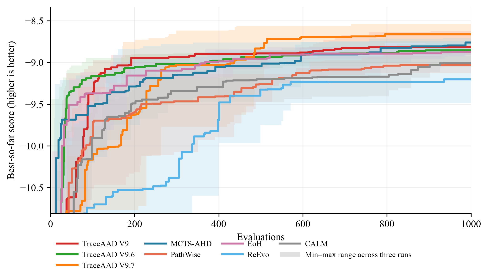

# CVRP-ACO 实验结果

## 实验设置与比较口径

本页比较 CVRP-ACO 方法在固定搜索协议下的测试最优路径长度。Qwen3.6-27B 使用 10 个 CVRP50 实例作为搜索集；测试集为 CVRP50/100/200 各 64 个实例，首档是同分布独立测试集，后两档是不同规模测试集。搜索和测试使用 30 ants、100 iterations、`aco_seed=1234`。每种方法独立运行 3 次，搜索预算均为 1000。指标为平均最优路径长度，越低越好。协议见 [实验配置](../配置.md)。

表中每个数值为 3 次运行的测试均值 ± 样本标准差；± 仅描述运行间变异，不是置信区间，也不支持统计显著性判断。加粗表示该列的最佳均值。

版本边界：表中的 **TraceAAD V9.7-batch** 使用 V9.6 的 `formation + direct attempts` 历史上下文，不是当前仅父代来时路的 V9.7 完整协议。父代来时路批次 `20260814_150927` 的 CVRP 仍有两次搜索未完成，本页暂不列入。含当前 best 的非正式 15 设置快照见[实验总汇](../实验总汇.md)第 4.3 节，不能替代本页正式数字。

## 三次运行平均

| 方法 | CVRP50 | CVRP100 | CVRP200 |
| --- | ---: | ---: | ---: |
| MCTS-AHD | 9.093402 ± 0.157373 | 15.466284 ± 0.212533 | 27.900014 ± 0.389597 |
| PathWise | 9.354221 ± 0.122157 | 15.905908 ± 0.241743 | 28.372643 ± 0.487237 |
| TraceAAD V4 | 9.129223 ± 0.129956 | 15.413780 ± 0.294039 | 27.899936 ± 0.595357 |
| TraceAAD V5 | 9.038972 ± 0.091240 | 15.428279 ± 0.229195 | 27.976674 ± 0.346112 |
| TraceAAD V6 | 9.188645 ± 0.183330 | 15.631601 ± 0.263103 | 28.245510 ± 0.470071 |
| TraceAAD V7 | 9.265195 ± 0.068425 | 15.978142 ± 0.143540 | 28.915410 ± 0.435853 |
| TraceAAD V8 | **8.952075 ± 0.126183** | **15.275853 ± 0.224413** | **27.627429 ± 0.415096** |
| TraceAAD V8.2 | 9.133317 ± 0.130046 | 15.558697 ± 0.255547 | 28.173480 ± 0.587377 |
| TraceAAD V8.3 | 9.360320 ± 0.052991 | 16.067285 ± 0.241536 | 28.928164 ± 0.447767 |
| TraceAAD V9 | 9.083212 ± 0.224008 | 15.497642 ± 0.387292 | 28.106981 ± 0.605392 |
| TraceAAD V9.1 (MCTS-Aligned) | 9.451361 ± 0.317011 | 16.388392 ± 0.715390 | 29.744385 ± 1.443336 |
| TraceAAD V9.1 (Trajectory) | 9.292208 ± 0.078239 | 15.874843 ± 0.373029 | 28.553404 ± 0.828072 |
| TraceAAD V9.2 | 9.339545 ± 0.339300 | 15.754373 ± 0.412693 | 28.233238 ± 0.195958 |
| TraceAAD V9.3 | 9.201345 ± 0.121653 | 15.527869 ± 0.186310 | 27.995836 ± 0.486793 |
| TraceAAD V9.4 | 9.230625 ± 0.146794 | 15.915712 ± 0.479857 | 28.773160 ± 0.759770 |
| TraceAAD V9.6 | 9.213186 ± 0.131177 | 15.666981 ± 0.292299 | 28.321217 ± 0.479384 |
| TraceAAD V9.7-batch | 9.207953 ± 0.132502 | 15.600393 ± 0.284715 | 28.066791 ± 0.596377 |
| EoH | 9.069143 ± 0.035767 | 15.479988 ± 0.123083 | 28.198821 ± 0.148972 |
| ReEvo | 9.471978 ± 0.403672 | 16.025671 ± 0.650593 | 28.416599 ± 1.448043 |
| CALM (w/o GRPO) | 9.313827 ± 0.116081 | 15.900745 ± 0.428614 | 28.820111 ± 0.755127 |

### 结果解释与限制

TraceAAD V8 在 CVRP50/100/200 三个测试规模上的报告均值均最低。

大而一致的观察：V8.2 与 V8.3 三规模均值均高于 V8，V8.3 差距更大；V9.1 Trajectory 三规模均值均低于 MCTS-Aligned（约 1.7%–4.0%），且运行间标准差更小；CALM (w/o GRPO) 三规模均值均高于 V9。V9 系已完成批次（V9–V9.7-batch）之间的均值差多为 0.2%–3%，方向不一致且处于运行间波动量级，读作无信号；这些版本均未取得列最佳。V9.7-batch 的旧历史上下文使其结果不能评价当前 V9.7。

均值排序不代表统计显著性。结论限于给定 CVRP 实例、`aco_seed=1234`、搜索预算、评估设置和 3 次独立运行，不能据此推断对其他实例或运行预算的普遍优势。

搜索曲线提供搜索过程的补充证据，不能替代上述测试结果。

## 结果范围

本页是 CVRP-ACO 的权威任务级汇总。跨任务描述性排名见[实验总汇](../实验总汇.md)，数据划分与方法配置见[实验配置](../配置.md)。
