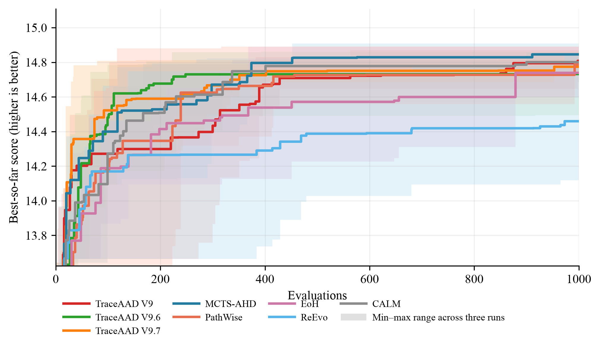

# OP-ACO 实验结果

## 实验设置与比较口径

本页比较 OP-ACO 方法在固定搜索协议下的测试 collected prize。Qwen3.6-27B 使用 OP50 × 5（`seed=1234`）作为搜索集；测试集为 OP50/100/200 各 64 个实例（`seed=4567`），首档是同分布独立测试集，后两档是不同规模测试集。搜索和测试使用 20 ants、50 iterations。每种方法独立运行 3 次，搜索预算均为 1000。指标为平均 collected prize，越高越好。

表中每个数值为 3 次运行的测试均值 ± 样本标准差；± 仅描述运行间变异，不是置信区间，也不支持统计显著性判断。加粗表示该列的最佳均值。

## 三次运行平均

| 方法 | OP50 | OP100 | OP200 |
| --- | ---: | ---: | ---: |
| MCTS-AHD | 15.125559 ± 0.100494 | 30.512176 ± 0.526601 | 54.894583 ± 1.613211 |
| PathWise | 15.038228 ± 0.097637 | 30.324539 ± 0.319138 | 54.214323 ± 0.545583 |
| TraceAAD V4 | 15.069351 ± 0.090613 | 30.216914 ± 0.673457 | 53.509375 ± 2.611692 |
| TraceAAD V5 | 15.111948 ± 0.115030 | **30.710591 ± 0.245109** | **55.792500 ± 0.613045** |
| TraceAAD V6 | 14.957832 ± 0.046858 | 29.705866 ± 0.344617 | 52.015729 ± 1.409646 |
| TraceAAD V7 | 15.038097 ± 0.152669 | 30.055356 ± 0.666976 | 53.636667 ± 2.117391 |
| TraceAAD V8 | 14.930511 ± 0.055848 | 30.238432 ± 0.237306 | 54.048125 ± 1.112009 |
| TraceAAD V8.2 | 15.099413 ± 0.022836 | 30.488170 ± 0.475165 | 54.605625 ± 1.812693 |
| TraceAAD V8.3 | 14.860355 ± 0.207994 | 29.819902 ± 0.622454 | 52.740625 ± 1.850203 |
| TraceAAD V9 | **15.162082 ± 0.108610** | 30.632037 ± 0.268074 | 54.905469 ± 0.977607 |
| TraceAAD V9.1 (MCTS-Aligned) | 14.700298 ± 0.234958 | 28.617514 ± 1.303840 | 48.693333 ± 4.798223 |
| TraceAAD V9.1 (Trajectory) | 14.904806 ± 0.150439 | 29.524884 ± 0.546436 | 51.780469 ± 1.883833 |
| TraceAAD V9.2 | 15.127817 ± 0.135629 | 30.201768 ± 0.774831 | 53.717760 ± 2.735377 |
| TraceAAD V9.3 | 15.056040 ± 0.052817 | 30.373497 ± 0.065891 | 54.461562 ± 0.572181 |
| TraceAAD V9.4 | 15.092839 ± 0.082175 | 30.250537 ± 0.576358 | 53.559010 ± 2.471052 |
| TraceAAD V9.6 | 15.019931 ± 0.213092 | 29.312076 ± 1.863860 | 49.975729 ± 7.092452 |
| TraceAAD V9.7 | 14.998526 ± 0.056494 | 30.098874 ± 0.443066 | 53.825885 ± 1.465502 |
| EoH | 15.119813 ± 0.187204 | 30.445387 ± 0.455741 | 54.754948 ± 1.398744 |
| ReEvo | 14.858840 ± 0.367110 | 30.237583 ± 0.818002 | 54.894583 ± 1.844302 |
| CALM | 15.079566 ± 0.149169 | 30.363169 ± 0.489603 | 54.141094 ± 2.185716 |

### 结果解释与限制

TraceAAD V9 在 OP50 的报告均值最高（首次超过 MCTS-AHD 的 OP50 列），TraceAAD V5 在 OP100 和 OP200 的报告均值最高。

大而一致的观察：V9.1 两协议三规模均值均低于 V9，OP200 差距达 5.7%（Trajectory）与 11.3%（MCTS-Aligned）；V9.6 三规模均值一致弱于 V9（OP100/200 低约 4.3%/9.0%），其 OP200 运行间标准差（7.092）为全场最大，由 rep1 落后驱动（41.867 vs rep2/rep3 的 53.0/55.0）；V8.3 三规模均值一致低于 V8 / V8.2；CALM 三规模均值均弱于 V9。V9.7 三规模均值一致低于 V9（低 1.1%/1.7%/2.0%），幅度在噪声底附近，读作弱信号；相对 V9.6 在 OP100/200 明显回升（高 2.7%/7.7%，V9.6 的 OP200 塌陷 rep 未重现），OP50 持平。V9.2、V9.3、V9.4 之间及其与 V9 的差距多在 0.2%–2.5%，在运行间波动量级内，读作无信号，不逐对叙述。

均值排序不代表统计显著性。结论限于给定 OP 实例、`seed=4567`、搜索预算、ACO 设置和 3 次独立运行，不能据此推断对其他实例或规模的普遍优势。

搜索曲线提供搜索过程的补充证据，不能替代上述测试结果。

## 可复现性工件

正式工件：V4 位于
[`traceaad_v4/version4`](../../../experiments/op_aco/traceaad_v4/)，
V5 位于
[`traceaad_v5/version5`](../../../experiments/op_aco/traceaad_v5/)（正式批次
`20260728_151736`；测试
[`eval_best_20260728_151736`](../../../experiments/op_aco/traceaad_v5/eval_best_20260728_151736/)），
EoH 位于
[`eoh`](../../../experiments/op_aco/eoh/)（批次
`eoh_paper_20260729_2350`；测试
[`eval_best_eoh_paper_20260730`](../../../experiments/op_aco/eoh/eval_best_eoh_paper_20260730/)），
PathWise 位于
[`pathwise`](../../../experiments/op_aco/pathwise/)（批次
`20260730_1755`；测试
[`eval_best_20260730`](../../../experiments/op_aco/pathwise/eval_best_20260730/)）。
ReEvo 位于
[`reevo`](../../../experiments/op_aco/reevo/)（测试
[`eval_best_20260730`](../../../experiments/op_aco/reevo/eval_best_20260730/)）。
TraceAAD V6 位于
[`traceaad_v6/version6`](../../../experiments/op_aco/traceaad_v6/)（正式批次
`20260802_170400`；测试
[`eval_best_20260802_170400`](../../../experiments/op_aco/traceaad_v6/eval_best_20260802_170400/)），
TraceAAD V7 位于
[`traceaad_v7/version7`](../../../experiments/op_aco/traceaad_v7/)（正式批次
`20260804_001931`；测试
[`eval_best_20260804_001931`](../../../experiments/op_aco/traceaad_v7/eval_best_20260804_001931/)），
TraceAAD V8 位于
[`traceaad_v8/version8`](../../../experiments/op_aco/traceaad_v8/)（正式批次
`20260804_173300`；协议 `traceaad-v8`；测试
[`eval_best_20260804_173300`](../../../experiments/op_aco/traceaad_v8/eval_best_20260804_173300/)），
TraceAAD V8.2 同目录（正式批次 `20260804_203128`；协议
`traceaad-v8.2-adaptive-expand`；测试
[`eval_best_20260804_203128`](../../../experiments/op_aco/traceaad_v8/eval_best_20260804_203128/)），
TraceAAD V8.3 位于
[`traceaad_v8_3/version8_3`](../../../experiments/op_aco/traceaad_v8_3/)（正式批次
`20260805_final`；协议 `traceaad-v8.3`；测试
[`eval_best_20260805_final`](../../../experiments/op_aco/traceaad_v8_3/eval_best_20260805_final/)），
TraceAAD V9 位于
[`traceaad_v9/version9`](../../../experiments/op_aco/traceaad_v9/)（正式批次
`20260807_123753`；测试
`eval_best_20260807_123753`），
TraceAAD V9.1 位于
[`traceaad_v9_1`](../../../experiments/op_aco/traceaad_v9_1/)（MCTS-Aligned 协议批次
`20260808_135000`；测试
[`eval_best_20260808_135000`](../../../experiments/op_aco/traceaad_v9_1/eval_best_20260808_135000/)；Trajectory 协议批次
`20260808_200840`；测试
[`eval_best_20260808_200840`](../../../experiments/op_aco/traceaad_v9_1/eval_best_20260808_200840/)），
TraceAAD V9.2 位于
[`traceaad_v9_2`](../../../experiments/op_aco/traceaad_v9_2/)（正式批次
`20260809_120403`；测试
[`eval_best_20260809_120403`](../../../experiments/op_aco/traceaad_v9_2/eval_best_20260809_120403/)），
TraceAAD V9.3 位于
[`traceaad_v9_3`](../../../experiments/op_aco/traceaad_v9_3/)（正式批次
`20260809_134642`；测试
[`eval_best_20260810_v93`](../../../experiments/op_aco/traceaad_v9_3/eval_best_20260810_v93/)），
TraceAAD V9.4 位于
[`traceaad_v9_4`](../../../experiments/op_aco/traceaad_v9_4/)（正式批次
`20260810_0024`；测试
[`eval_best_20260810_v94`](../../../experiments/op_aco/traceaad_v9_4/eval_best_20260810_v94/)），
TraceAAD V9.6 位于
[`traceaad_v9_6`](../../../experiments/op_aco/traceaad_v9_6/)（正式批次
`20260812_191011`；测试
[`eval_best_20260812_191011`](../../../experiments/op_aco/traceaad_v9_6/eval_best_20260812_191011/)），
TraceAAD V9.7 位于
[`traceaad_v9_7`](../../../experiments/op_aco/traceaad_v9_7/)（正式批次
`20260813_184519`；测试
[`eval_best_20260814_1020`](../../../experiments/op_aco/traceaad_v9_7/eval_best_20260814_1020/)），
CALM 位于
[`calm`](../../../experiments/op_aco/calm/)（正式批次
`20260807_183000`；测试
[`eval_best_20260807_183000`](../../../experiments/op_aco/calm/eval_best_20260807_183000/)）。
