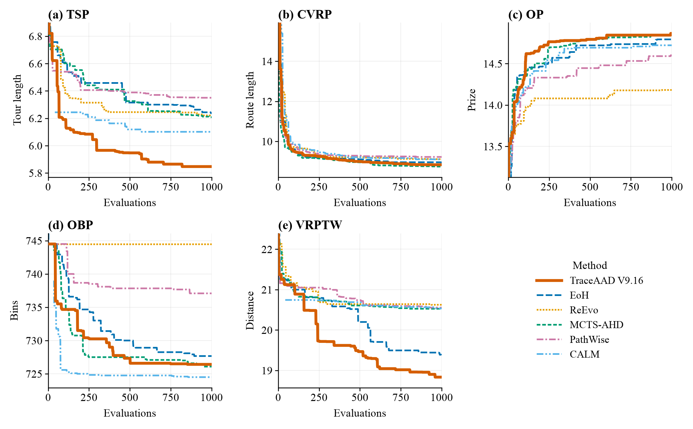

# 主实验结果

五个任务。数值为 3 次运行均值 ± 样本标准差；加粗为该列最佳均值。搜索列为 1000 次真实评价内的训练集 best，其余列为未参与训练的不同规模新实例。

对照：EoH、ReEvo、MCTS-AHD、PathWise、CALM (w/o GRPO)。TraceAAD：V9、V9.16、V9.17、V9.19、V9.20。协议见[配置](配置.md)。其余版本见[历史版本](../其他实验/历史版本.md)。

## TSP Construct

平均 tour length，越低越好；训练集为 16 个 TSP50 实例（seed 2024）。

| 方法 | 搜索 (训练集) ↓ | TSP50 (Held-out) ↓ | TSP100 (Held-out) ↓ | TSP200 (Held-out) ↓ |
| --- | ---: | ---: | ---: | ---: |
| EoH | 6.183324 ± 0.128799 | 6.228240 ± 0.103448 | 8.642466 ± 0.119373 | 12.145391 ± 0.246453 |
| ReEvo | 6.394015 ± 0.366455 | 6.596210 ± 0.447923 | 9.105136 ± 0.561099 | 12.769022 ± 0.583434 |
| MCTS-AHD | 6.209092 ± 0.104787 | 6.318157 ± 0.127192 | 8.719380 ± 0.175825 | 12.234488 ± 0.264339 |
| PathWise | 6.282777 ± 0.148980 | 6.490129 ± 0.186413 | 8.895653 ± 0.319771 | 12.409647 ± 0.347392 |
| CALM (w/o GRPO) | 6.181186 ± 0.054866 | 6.250545 ± 0.079386 | 8.684303 ± 0.048566 | 12.119953 ± 0.114974 |
| TraceAAD V9 | 6.243422 ± 0.185335 | 6.361908 ± 0.090497 | 8.833273 ± 0.149388 | 12.363585 ± 0.320939 |
| TraceAAD V9.16 | **5.846821 ± 0.038020** | **5.850178 ± 0.073481** | 8.343712 ± 0.040299 | 11.763590 ± 0.119956 |
| TraceAAD V9.17 | 5.948019 ± 0.166248 | 5.965609 ± 0.229844 | 8.246395 ± 0.273067 | 11.741573 ± 0.187536 |
| TraceAAD V9.19 | 5.900364 ± 0.043101 | 5.955002 ± 0.044000 | **8.203401 ± 0.085277** | **11.505629 ± 0.064167** |

V9.17 的 TSP200 rep1 首评在 1000 秒超时，以 3000 秒复测得 11.787，计入三重复统计。

## CVRP-ACO

平均最优路径长度，越低越好；训练集为 10 个 CVRP50 实例（seed 1234）。

| 方法 | 搜索 (训练集) ↓ | CVRP50 (Held-out) ↓ | CVRP100 (Held-out) ↓ | CVRP200 (Held-out) ↓ |
| --- | ---: | ---: | ---: | ---: |
| EoH | 8.853494 ± 0.036702 | **9.069143 ± 0.035767** | 15.479988 ± 0.123083 | 28.198821 ± 0.148972 |
| ReEvo | 9.202736 ± 0.400839 | 9.471978 ± 0.403672 | 16.025671 ± 0.650593 | 28.416599 ± 1.448043 |
| MCTS-AHD | 8.761093 ± 0.055992 | 9.093402 ± 0.157373 | 15.466284 ± 0.212533 | **27.900014 ± 0.389597** |
| PathWise | 9.030611 ± 0.137206 | 9.354221 ± 0.122157 | 15.905908 ± 0.241743 | 28.372643 ± 0.487237 |
| CALM (w/o GRPO) | 9.011889 ± 0.076460 | 9.313827 ± 0.116081 | 15.900745 ± 0.428614 | 28.820111 ± 0.755127 |
| TraceAAD V9 | 8.813884 ± 0.163928 | 9.083212 ± 0.224008 | 15.497642 ± 0.387292 | 28.106981 ± 0.603952 |
| TraceAAD V9.16 | 8.833079 ± 0.015642 | 9.177615 ± 0.204658 | 15.551875 ± 0.226103 | 28.065068 ± 0.592583 |
| TraceAAD V9.17 | **8.725003 ± 0.137187** | 9.091123 ± 0.174908 | **15.381334 ± 0.251921** | 27.934071 ± 0.539168 |
| TraceAAD V9.19 | 8.694822 ± 0.125035 | 9.078121 ± 0.111296 | 15.474430 ± 0.162208 | 27.998437 ± 0.440039 |
| TraceAAD V9.20 | 8.839340 ± 0.041789 | 9.142380 ± 0.064059 | 15.681668 ± 0.157686 | 28.215557 ± 0.330665 |

## OP-ACO

平均 collected prize，越高越好；训练集为 5 个 OP50 实例（seed 1234）。

| 方法 | 搜索 (训练集) ↑ | OP50 (Held-out) ↑ | OP100 (Held-out) ↑ | OP200 (Held-out) ↑ |
| --- | ---: | ---: | ---: | ---: |
| EoH | 14.738667 ± 0.146292 | 15.119813 ± 0.187204 | 30.445387 ± 0.455741 | 54.754948 ± 1.398744 |
| ReEvo | 14.459333 ± 0.364935 | 14.858840 ± 0.367110 | 30.237583 ± 0.818002 | 54.894583 ± 1.844302 |
| MCTS-AHD | 14.845333 ± 0.066252 | 15.125559 ± 0.100494 | 30.512176 ± 0.526601 | 54.894583 ± 1.613211 |
| PathWise | 14.787333 ± 0.088934 | 15.038228 ± 0.097637 | 30.324539 ± 0.319138 | 54.214323 ± 0.545583 |
| CALM (w/o GRPO) | 14.800667 ± 0.063066 | 15.079566 ± 0.149169 | 30.363169 ± 0.489603 | 54.141094 ± 2.185716 |
| TraceAAD V9 | 14.808000 ± 0.105660 | 15.162082 ± 0.108610 | **30.632037 ± 0.268074** | 54.905469 ± 0.977607 |
| TraceAAD V9.16 | **14.865333 ± 0.020429** | **15.171288 ± 0.074001** | 30.616080 ± 0.272446 | **55.027708 ± 0.745524** |
| TraceAAD V9.17 | 14.756000 ± 0.192260 | 15.015256 ± 0.253462 | 30.088746 ± 0.941711 | 53.615938 ± 3.185063 |
| TraceAAD V9.19 | 14.734667 ± 0.142300 | 15.139684 ± 0.161578 | 30.467805 ± 0.430684 | 54.503281 ± 1.485403 |
| TraceAAD V9.20 | 14.691333 ± 0.103968 | 15.033348 ± 0.169956 | 30.143891 ± 0.467672 | 53.829792 ± 1.323517 |

## Online Bin Packing

平均使用箱数，越低越好；训练集为 4 个固定实例（`1k/5k × capacity=100/500`，seed 2024）。

| 方法 | 搜索 (训练集) ↓ | 1k_100 ↓ | 5k_100 ↓ | 10k_100 ↓ | 1k_500 ↓ | 5k_500 ↓ | 10k_500 ↓ |
| --- | ---: | ---: | ---: | ---: | ---: | ---: | ---: |
| EoH | 737.333 ± 7.816 | 417.067 ± 3.591 | 2058.533 ± 30.901 | 4108.133 ± 63.686 | 81.600 ± 1.386 | 404.067 ± 1.501 | 806.600 ± 1.217 |
| ReEvo | 739.250 ± 9.093 | 416.800 ± 5.196 | 2069.667 ± 34.526 | 4128.067 ± 67.088 | **80.800 ± 0.000** | 403.067 ± 0.231 | 805.600 ± 0.346 |
| MCTS-AHD | 726.417 ± 0.804 | 414.067 ± 3.062 | 2026.600 ± 3.219 | 4043.600 ± 5.892 | 80.933 ± 0.416 | 402.733 ± 0.643 | 804.867 ± 1.137 |
| PathWise | 735.500 ± 7.794 | 424.067 ± 3.700 | 2068.067 ± 18.649 | 4124.933 ± 36.890 | 80.867 ± 0.115 | 403.067 ± 0.231 | 805.800 ± 0.200 |
| CALM (w/o GRPO) | **725.083 ± 0.144** | 415.067 ± 0.833 | 2020.800 ± 1.039 | **4026.733 ± 2.802** | 81.800 ± 1.249 | 403.400 ± 0.721 | 805.733 ± 1.419 |
| TraceAAD V9 | 725.833 ± 0.878 | 411.667 ± 4.623 | **2020.733 ± 2.810** | 4033.467 ± 2.914 | 80.867 ± 0.306 | 402.733 ± 0.702 | 804.667 ± 0.945 |
| TraceAAD V9.16 | 726.417 ± 1.041 | 420.467 ± 8.769 | 2027.467 ± 9.979 | 4044.533 ± 17.810 | **80.800 ± 0.000** | **402.333 ± 0.757** | **804.267 ± 1.553** |
| TraceAAD V9.17 | 725.833 ± 0.289 | **410.600 ± 3.124** | 2022.867 ± 2.838 | 4039.067 ± 3.233 | 80.867 ± 0.231 | 402.800 ± 0.200 | 804.400 ± 0.200 |

## VRPTW Construct

平均总距离，越低越好。训练集为 16 个 VRPTW50 实例（seed 2024）。测试为 100、200 节点各 16 个实例（seed 2025），另列 50 节点独立实例。V9 未跑该任务。

| 方法 | 搜索 (训练集) ↓ | VRPTW50 (Held-out) ↓ | VRPTW100 (Held-out) ↓ | VRPTW200 (Held-out) ↓ |
| --- | ---: | ---: | ---: | ---: |
| EoH | 19.381615 ± 0.463359 | 19.520666 ± 0.544388 | 32.600220 ± 0.561485 | 54.730259 ± 1.708209 |
| ReEvo | 20.625335 ± 0.185514 | 20.926078 ± 0.071295 | 34.719669 ± 0.191358 | 57.546709 ± 0.691021 |
| MCTS-AHD | 20.527017 ± 0.061399 | 20.835880 ± 0.050207 | 35.142813 ± 1.008636 | 63.430645 ± 9.810073 |
| PathWise | 20.555948 ± 0.149248 | 21.009466 ± 0.682553 | 34.863268 ± 0.355483 | 58.405659 ± 1.412384 |
| CALM (w/o GRPO) | 20.531985 ± 0.167164 | 20.851889 ± 0.187868 | 34.746520 ± 0.383774 | 58.385329 ± 0.234196 |
| TraceAAD V9.16 | 18.834263 ± 0.220090 | **18.821875 ± 0.227396** | 32.125820 ± 0.617704 | **52.904945 ± 1.081021** |
| TraceAAD V9.17 | 19.063825 ± 0.294948 | 19.084080 ± 0.597690 | **31.986638 ± 0.352944** | 53.349529 ± 0.785994 |
| TraceAAD V9.19 | **18.817694 ± 0.211116** | 18.847880 ± 0.395444 | 32.125781 ± 0.494712 | 53.285851 ± 0.804162 |
| TraceAAD V9.20 | 19.123052 ± 0.175692 | 18.932474 ± 0.275628 | 32.160585 ± 0.330981 | 52.991505 ± 1.136148 |

## TraceAAD 单版本排名

每次只放入一个 TraceAAD 版本与五个外部对照，在 15 个规模（TSP/CVRP/OP 各 3 + OBP 6）上按 held-out 均值逐列排名后取平均。VRPTW 单独计：V9.16 为 1.333，V9.17 为 1.667。

| 版本 | 平均名次 | 六方法中位置 | 相对 MCTS-AHD |
| --- | ---: | ---: | ---: |
| TraceAAD V9.16 | 1.900 | 1/6 | −0.467 |
| TraceAAD V9 | 2.067 | 1/6 | −0.333 |
| TraceAAD V9.17 | 2.367 | 1/6 | −0.067 |

## 搜索曲线

best-so-far，3 次运行均值。对照在 TSP/CVRP/OP/OBP 上为 `20260824_rerun`，VRPTW 为原批；TraceAAD 为 V9.16。纵轴从第 20 次评价起显示。

