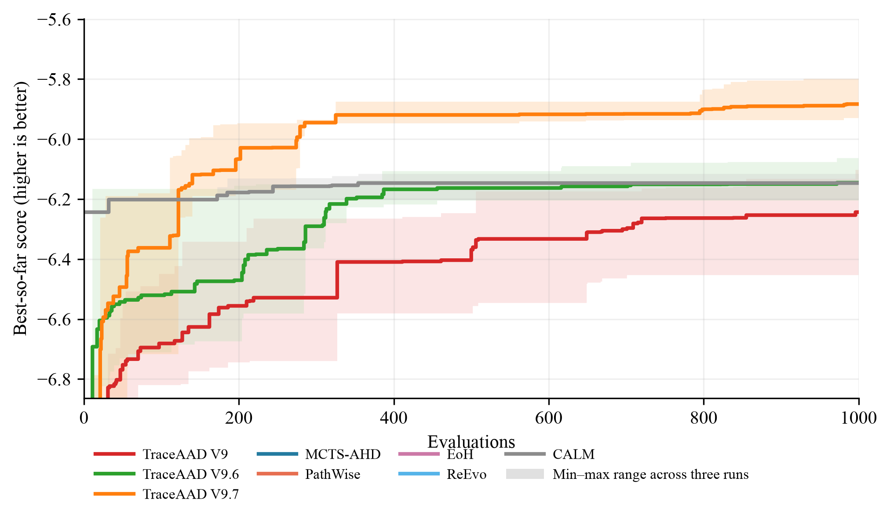
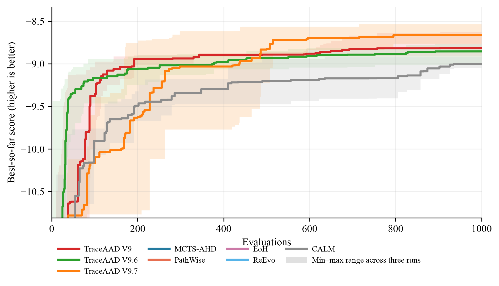
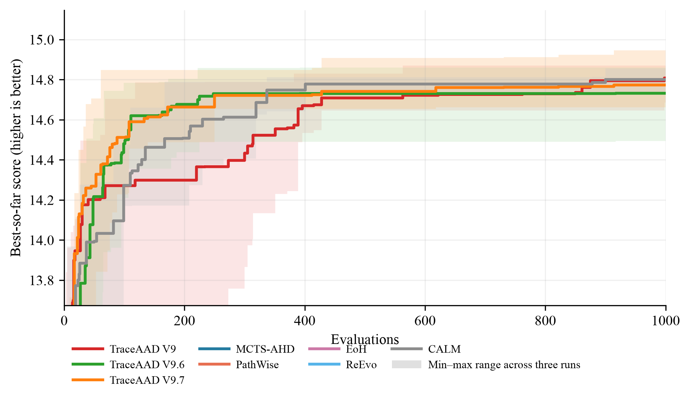
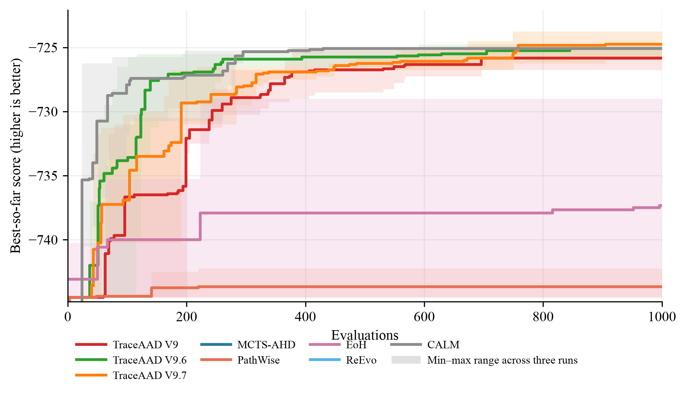

# 跨任务实验总汇

## 1. 比较协议与解释边界

所有方法使用 Qwen3.6-27B 和 1000 次搜索评估。测试实例均不参与搜索；各任务同时报告同分布独立测试集与不同规模测试集，具体划分见下表。比较单位是某方法在一个任务及其一个测试设置上的一次完整搜索运行；每种方法独立运行 3 次。表中结果为 3 次运行的测试均值 ± 样本标准差。该不确定性量化反映运行间变异，不是置信区间，也不构成统计显著性检验。加粗仅表示该列的最佳均值。

判读纪律：三重复比较报告实际均值差与方向。三个重复同向的差距按幅度记录，约 1%–2% 的改进同样计入；方向不一致时只陈述各规模数字。

版本边界：正统 **TraceAAD V9.7** 是仅父代来时路的完整协议（批次 `20260814_150927`），四任务三次 1000 eval 与 held-out 均已完成，进入第 4.1–4.2 节。**TraceAAD V9.8**（批次 `20260815_225000`，`q_u_c_m`）四任务三次搜索与 held-out 也已完成，进入主结果表和第 4.1–4.2 节。**TraceAAD V9.7-batch**（`20260813_184519`）使用 V9.6 的 `formation + direct attempts` 历史上下文，只出现在任务页，不进入代表性同场。

任务指标的方向如下。TSP Construct、CVRP-ACO 和 Online Bin Packing 的指标越低越好；OP-ACO 的指标越高越好。搜索曲线统一转换为越高越好，但最终测试表保留原始指标方向。

| Task               | 搜索协议                                                      | 测试协议                                       | 指标与方向                |
| -------------------- | --------------------------------------------------------------- | ------------------------------------------------ | --------------------------- |
| TSP Construct      | TSP50 × 16，`seed=2024`                                      | TSP50/100/200，各 16 个实例，`seed=2025`       | tour length，越低越好     |
| CVRP-ACO           | 10 个 CVRP50 实例，30 ants × 100 iterations，`aco_seed=1234` | CVRP50/100/200，各 64 个实例                   | 最优路径长度，越低越好    |
| OP-ACO             | OP50 × 5，`seed=1234`，20 ants × 50 iterations              | OP50/100/200，各 64 个实例，`seed=4567`        | collected prize，越高越好 |
| Online Bin Packing | `1k/5k × capacity={100,500}` 固定实例                        | `1k/5k/10k × capacity={100,500}`，各 5 个实例 | 箱数，越低越好            |

## 2. 最终测试结果

逐任务的三次运行平均测试表（TSP/CVRP/OP 三规模与 OBP 六设置）统一放在[实验结果](实验结果.md)；V9.9 当前已完成的三个任务也已并入对应主表。跨任务的综合结论见下文第 4、5 节。

## 2.1 TraceAAD V9.8 当前状态

正式批次 `20260815_225000` 使用 V9.8 完整 `q_u_c_m` 协议，四任务各三次、每次 1000 次真实评价。四任务三次搜索和 held-out 均已完成。V9.8 已集成到四个任务的“三次运行平均”主表，并纳入第 4 节的总体排名与单独排名。V9.8 的 Stage P 行为证据与正式搜索状态见[TraceAAD V9.8 机制识别实验](TraceAAD-V9.8机制识别实验.md)。

## 2.2 TraceAAD V9.9 当前状态

正式批次 `20260816_154200` 使用 V9.9 完整协议。四任务三次 1000-eval 搜索与 held-out 均已完成（CVRP 于 2026-08-18 补齐，三路实际于 08-17 15:08–17:01 结束搜索）：CVRP50/100/200 = 9.362723 ± 0.328244 / 16.143917 ± 0.710780 / 29.033141 ± 1.076603，相对 V9.8 三档高 1.5%/2.5%/2.0%（方向一致偏差），rep2 端到端最弱。V9.9 已进入第 4.2 节单独排名（平均名次 3.400，第 4/6）；代表性同场（4.1）未纳入。

## 2.3 TraceAAD V9.10 当前状态

正式批次 `v9_10_20260817_222517` 使用 V9.10 完整协议（折扣 Thompson 联合分配）。TSP、OBP、OP 三任务已完成三次搜索与 held-out；CVRP 三路搜索仍在进行。OP 的 held-out 中 rep3 的 best 程序在 OP200 产生非有限矩阵、按无效处理，OP200 为 n=2：三档 14.680024 ± 0.262076 / 28.950195 ± 1.549586 / 47.611953 ± 0.937469，相对 V9.9 低 2.3%/4.5%/13.0%（方向一致），是近期版本在 OP 上最弱的一批。四任务未齐，不进入跨任务排名。

四版本的阶段性比较见[TraceAAD V9.9、V9.8、V9.7 与 V9 综合对比](../analysis/TraceAAD-V9.9与V9.8-V9.7-V9综合对比.md)；其中 V9.9 的 12 设置名次仅作临时诊断，不替代四任务 15 设置正式排名。

## 2.4 本地 Qwen3.8 批次当前状态

批次 `v9_7_qwen38_20260815_010107` 使用 V9.7 协议和本地 Qwen3.8 服务源（模型记录口径统一为 Qwen3.6-27B）。四任务均已完成三次 1000-eval 搜索和 held-out，结果作为本地批次诊断行写入对应任务主表；CVRP 于 2026-08-18 完成补测（rep1 重启后自 checkpoint 恢复）。本地行为生成模型对照，不进入总体或单独排名。测试工件：TSP、OP、OBP 为各任务 `traceaad_v9_7/eval_best_20260817_qwen38/results.json`，CVRP 为 `traceaad_v9_7/eval_best_20260818_qwen38_complete/results.json`。

Qwen3.6 与 Qwen3.8 的 V9.7 批次比较见[模型对比分析](../analysis/TraceAAD-V9.7-Qwen3.6与Qwen3.8模型对比.md)。四个共同任务中，Qwen3.8 在 TSP 三个规模一致更低（更好），在 OP 与 CVRP 均值占优但重复方向混合（CVRP 由单重复驱动、路间标准差为 Qwen3.6 的 3–6 倍），在 OBP 六个设置中仅 `1k/500` 更低且 capacity=100 三重复同向变差；方向按任务分化，不形成模型排名。

## 3. 搜索曲线

以下为四任务各 8 方法的 best-so-far 搜索曲线（V9 / V9.6 / 正统 V9.7 与 5 个外部对照）：曲线为 3 次运行均值，色带为 min–max 范围，横轴为 1000 次搜索评估，分数统一转换为越高越好。TraceAAD V9.7 均为父代来时路完整协议（`20260814_150927`）。该曲线方法集用于展示近期内部迭代与外部对照的搜索过程，与第 4.1 节代表性同场不完全相同；V9.8 的最终测试结果已纳入主表和排名，但尚未替换该历史曲线方法集。

搜索曲线反映搜索过程（何时推进、是否停滞），测试结果反映最终泛化，两者不能相互替代。四个任务上 V9.7 的推进形态不同：TSP/CVRP 提高搜索天花板并保留后期小步刷新，OP 很早耗尽较低天花板。过程证据见[V9.7 机制有效性与任务异质性](../analysis/TraceAAD-V9.7机制有效性与任务异质性.md)。

## 4. 跨规模平均排名

比较单位为 15 个测试设置：TSP50/100/200，CVRP50/100/200，OP50/100/200，以及 OBP 的 `1k/5k/10k × C=100/500`。每个设置先对参与方法排名，再对名次取平均；1 最好，完全相同均值取并列平均名次。该排名是描述性汇总，不代表统计显著性。以下结果由 `experiments/analysis/recompute_rankings.py --cvrp-mcts batch2` 于 2026-08-18 重算（V9.9 纳入单独排名）。

总体同场放入四个有独立设计角色的 TraceAAD：V8（树骨架，CVRP50 仍列最佳）、V9、正统 V9.7（父代来时路完整协议）和 V9.8（`q_u_c_m`），再加[实验配置](配置.md)中的 5 个外部对照，共 9 方法。V4–V7、V8.2、V8.3、V9.6 与 V9.7-batch 仍出现在任务页；单独排名比较全部已完成内部版本（V9.7 为正统协议，V9.8 为 `q_u_c_m` 正式批次）。

### 4.1 总体排名：代表性方法同场

| 名次 | 方法            | 15 个测试设置平均名次 |
| ------ | ----------------- | ----------------------: |
| 1    | TraceAAD V9.7   |                 3.367 |
| 2    | TraceAAD V9     |                 3.733 |
| 3    | TraceAAD V8     |                 3.933 |
| 4    | MCTS-AHD        |                 4.267 |
| 5    | TraceAAD V9.8   |                 4.333 |
| 6    | EoH             |                 5.467 |
| 7    | CALM (w/o GRPO) |                 5.600 |
| 8    | PathWise        |                 7.000 |
| 9    | ReEvo           |                 7.300 |

V9.7 平均名次 3.367 居第 1。V9（3.733）与 V8（3.933）随后；MCTS-AHD 为 4.267（CVRP 用 20260812 批次），V9.8 为 4.333 居第 5。V9.7 在 TSP50/100、CVRP100/200 与 OBP `5k/100`、`10k/500` 为该场第 1；OP 三档为 6/8/8。

### 4.2 单独排名：单版本上场（去掉其他 TraceAAD）

每次只保留一个 TraceAAD 版本，与 MCTS-AHD、PathWise、EoH、ReEvo、CALM (w/o GRPO) 共 6 方法，再按同样的 15 个测试设置平均名次。该口径回答“若只交一个正式 TraceAAD，相对全部外部对照谁更强”。

| 单独上场版本  | 15 个测试设置平均名次 | 在 6 方法中 | 相对 MCTS 的名次差 | 相对 5 个基线的平均名次优势 |
| --------------- | ----------------------: | ------------- | -------------------- | ----------------------------: |
| TraceAAD V9   |             **2.067** | 第 1        | −0.333            |                  **+1.720** |
| TraceAAD V5   |                 2.133 | 第 1        | −0.100            |                      +1.640 |
| TraceAAD V9.7 |                 2.200 | 第 1        | −0.300            |                      +1.560 |
| TraceAAD V8.2 |                 2.367 | 第 2        | +0.333             |                      +1.360 |
| TraceAAD V8   |                 2.433 | 第 2        | +0.067             |                      +1.280 |
| TraceAAD V4   |                 2.600 | 第 2        | +0.300             |                      +1.080 |
| TraceAAD V9.8 |                 2.667 | 第 2        | +0.367             |                      +1.000 |
| TraceAAD V9.6 |                 3.033 | 第 2        | +0.800             |                      +0.560 |
| TraceAAD V9.9 |                 3.400 | 第 4        | +1.367             |                      +0.120 |
| TraceAAD V6   |                 3.433 | 第 3        | +1.400             |                      +0.080 |
| TraceAAD V7   |                 4.167 | 第 4        | +2.333             |                     −0.800 |
| TraceAAD V8.3 |                 4.167 | 第 5        | +2.233             |                     −0.800 |

相对优势按“基线名次 − 本版本名次”在 15 个规模上再对 5 个基线取平均；越大表示相对外部方法越好。名次差为本版本平均名次减去同场 MCTS-AHD 平均名次（负值表示平均名次优于 MCTS）。按该描述性口径，V9 以 2.067 超过 MCTS-AHD（同场 2.400）居第 1（名次差 −0.333），相对基线优势 +1.720 最高；V5（2.133）次之。正统 V9.7 为 2.200，6 方法中第 1（名次差 −0.300，相对基线 +1.560）。V9.8 为 2.667，6 方法中第 2（名次差 +0.367，相对基线 +1.000），随后是 V9.6、V6、V7 与 V8.3。

## 5. 结论与限制

在当前任务、测试设置、实例和 3 次重复的协议下：

- **最佳报告均值随任务与测试尺度变化。** TSP50 为 V6，TSP100/200 为 V9.1 (Trajectory)；CVRP50 为 V8，CVRP100/200 为正统 V9.7；OP50 为 V9，OP100/200 为 V5；OBP 六个设置分别由 V9.6、V9.7、V9.7-batch 与 CALM (w/o GRPO) 取得最低均值或并列最低。逐列数字与限制见各任务页。
- **没有统一的版本升级序列。** 代表性同场中正统 V9.7 平均名次最好，但列最佳仍随任务变化：CVRP50 仍是 V8，OP 仍是 V9/V5。V9.7 相对 V9.7-batch：TSP 0.08%/0.08%/0.56%，CVRP −2.0%/−2.8%/−2.9%，OP +0.03%/−0.65%/−2.6%，OBP 六档均在 1% 以内。TSP 相对 V9.6 约 4% 的三规模改善与 V9.7-batch 同向，因此不能把该跳变归因于去掉子代尝试。过程拆解见[V9.7 机制有效性与任务异质性](../analysis/TraceAAD-V9.7机制有效性与任务异质性.md)。
- **描述性综合排名。** 代表性同场（9 方法）中 V9.7 为 3.367 第 1，V9 为 3.733，V8 为 3.933，MCTS-AHD 为 4.267，V9.8 为 4.333 第 5。单版本上场（6 方法）时 V9 为 2.067，V5 为 2.133，V9.7 为 2.200，V9.8 为 2.667 第 2。

上述结论仅描述当前任务、实例、预算和 3 次重复下的均值与运行间变异，不构成显著性结论。搜索曲线与最终测试分别反映搜索过程和泛化结果，不能相互替代。

## 6. 结果来源

- [实验结果](实验结果.md)
- [实验配置](配置.md)
- [实验覆盖](覆盖.md)
- [V9.7 机制有效性与任务异质性](../analysis/TraceAAD-V9.7机制有效性与任务异质性.md)
