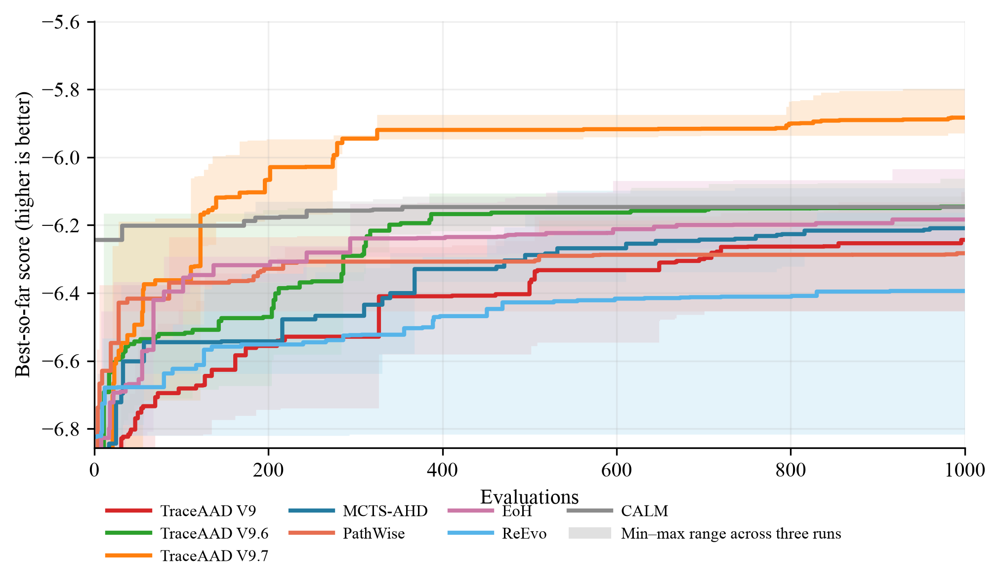
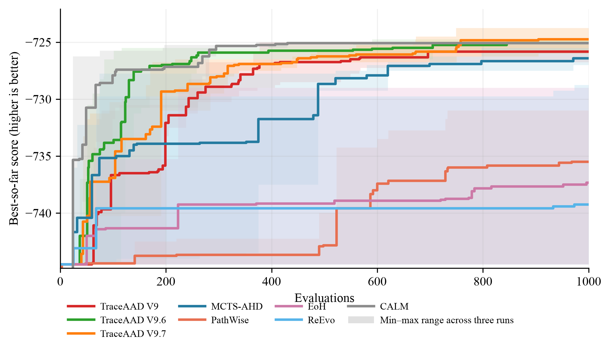

# 跨任务实验总汇

## 1. 比较协议与解释边界

所有方法使用 Qwen3.6-27B 和 1000 次搜索评估。测试实例均不参与搜索；各任务同时报告同分布独立测试集与不同规模测试集，具体划分见下表。比较单位是某方法在一个任务及其一个测试设置上的一次完整搜索运行；每种方法独立运行 3 次。表中结果为 3 次运行的测试均值 ± 样本标准差。该不确定性量化反映运行间变异，不是置信区间，也不构成统计显著性检验。加粗仅表示该列的最佳均值。

判读纪律：三重复比较只承认大而一致的差距——三个重复同向，且幅度明显超过同方法批次间的抖动（held-out 约 2%）；达不到标准的差距读作无信号，不据此构造任务级叙事。

版本边界：表格中的 **TraceAAD V9.7-batch** 指正式批次 `20260813_184519`，使用 V9.6 的 `formation + direct attempts` 历史上下文。当前仅父代来时路的 **TraceAAD V9.7**（批次 `20260814_150927`）已完成 TSP、OP、OBP 三次搜索与 held-out，数字见各任务页；CVRP 仍有两次搜索未完成，因此跨任务排名与本节综合结论暂不纳入该完整协议。V9.7-batch 评价的是“两级分配 + 旧历史上下文 + Refine/Explore”的联合系统。

任务指标的方向如下。TSP Construct、CVRP-ACO 和 Online Bin Packing 的指标越低越好；OP-ACO 的指标越高越好。搜索曲线统一转换为越高越好，但最终测试表保留原始指标方向。

| Task | 搜索协议 | 测试协议 | 指标与方向 |
| --- | --- | --- | --- |
| TSP Construct | TSP50 × 16，`seed=2024` | TSP50/100/200，各 16 个实例，`seed=2025` | tour length，越低越好 |
| CVRP-ACO | 10 个 CVRP50 实例，30 ants × 100 iterations，`aco_seed=1234` | CVRP50/100/200，各 64 个实例 | 最优路径长度，越低越好 |
| OP-ACO | OP50 × 5，`seed=1234`，20 ants × 50 iterations | OP50/100/200，各 64 个实例，`seed=4567` | collected prize，越高越好 |
| Online Bin Packing | `1k/5k × capacity={100,500}` 固定实例 | `1k/5k/10k × capacity={100,500}`，各 5 个实例 | 箱数，越低越好 |

## 2. 最终测试结果

逐任务的三次运行平均测试表（TSP/CVRP/OP 三规模与 OBP 六设置）与搜索曲线见各任务结果汇总页：

- [TSP Construct 结果汇总](tsp_construct/结果汇总.md)
- [CVRP-ACO 结果汇总](cvrp_aco/结果汇总.md)
- [OP-ACO 结果汇总](op_aco/结果汇总.md)
- [Online Bin Packing 结果汇总](online_bin_packing/结果汇总.md)

跨任务的综合结论见下文第 4、5 节。

## 3. 搜索曲线

以下为四任务各 8 方法的 best-so-far 搜索曲线：曲线为 3 次运行均值，色带为 min–max 范围，横轴为 1000 次搜索评估，分数统一转换为越高越好。TSP、OP、OBP 中的 TraceAAD V9.7 为父代来时路完整协议（`20260814_150927`）；CVRP 曲线仍为 V9.7-batch（`20260813_184519`），待剩余两次搜索完成后替换。

搜索曲线反映搜索过程（何时推进、是否停滞），测试结果反映最终泛化，两者不能相互替代。

## 4. 跨规模平均排名

比较单位为 15 个测试设置：TSP50/100/200，CVRP50/100/200，OP50/100/200，以及 OBP 的 `1k/5k/10k × C=100/500`。每个设置先对参与方法排名，再对名次取平均；1 最好，完全相同均值取并列平均名次。该排名是描述性汇总，不代表统计显著性。正式口径为十五方法同场（含 TraceAAD V8、V8.2、V8.3、V9、V9.6、V9.7-batch 与 CALM (w/o GRPO)）。单版本上场为 1 个 TraceAAD 与 5 个外部对照共 6 方法，与[实验配置](配置.md)一致。整体同场数字于 2026-08-14 从正式逐运行测试结果统一重算；单版本上场于 2026-08-15 补入 CALM，不再使用漏掉该对照的旧 5 方法场。

### 4.1 全部方法同场

| 名次 | 方法 | 15 个测试设置平均名次 |
| --- | --- | ---: |
| 1 | TraceAAD V9 | 4.933 |
| 2 | TraceAAD V8 | 5.667 |
| 3 | MCTS-AHD | 5.700 |
| 4 | TraceAAD V8.2 | 6.033 |
| 5 | TraceAAD V4 | 6.267 |
| 5 | TraceAAD V9.7-batch | 6.267 |
| 7 | TraceAAD V5 | 6.633 |
| 8 | TraceAAD V9.6 | 7.667 |
| 9 | EoH | 8.600 |
| 10 | CALM (w/o GRPO) | 8.667 |
| 11 | TraceAAD V6 | 8.800 |
| 12 | TraceAAD V7 | 10.833 |
| 13 | TraceAAD V8.3 | 11.067 |
| 14 | PathWise | 11.200 |
| 15 | ReEvo | 11.667 |

在全部方法同场的描述性排名中，V9 平均名次 4.933 居第 1，V8（5.667）与 MCTS-AHD（5.700，以 CVRP 20260812 批次为准）次之，随后为 V8.2、V4；V9.7-batch（6.267）与 V4 并列第 5，介于 V8.2 与 V5 之间；V9.6 第 8（7.667），介于 V5 与 EoH 之间。

### 4.2 单版本上场（去掉其他 TraceAAD）

每次只保留一个 TraceAAD 版本，与 MCTS-AHD、PathWise、EoH、ReEvo、CALM (w/o GRPO) 共 6 方法，再按同样的 15 个测试设置平均名次。该口径回答“若只交一个正式 TraceAAD，相对全部外部对照谁更强”。

| 单独上场版本 | 15 个测试设置平均名次 | 在 6 方法中 | 相对 MCTS 的名次差 | 相对 5 个基线的平均名次优势 |
| --- | ---: | --- | --- | ---: |
| TraceAAD V9 | **2.067** | 第 1 | −0.333 | **+1.720** |
| TraceAAD V5 | 2.133 | 第 1 | −0.100 | +1.640 |
| TraceAAD V8.2 | 2.367 | 第 2 | +0.333 | +1.360 |
| TraceAAD V8 | 2.433 | 第 2 | +0.067 | +1.280 |
| TraceAAD V4 | 2.600 | 第 2 | +0.300 | +1.080 |
| TraceAAD V9.7-batch | 2.767 | 第 2 | +0.533 | +0.880 |
| TraceAAD V9.6 | 3.033 | 第 2 | +0.800 | +0.560 |
| TraceAAD V6 | 3.433 | 第 3 | +1.400 | +0.080 |
| TraceAAD V7 | 4.167 | 第 4 | +2.333 | −0.800 |
| TraceAAD V8.3 | 4.167 | 第 5 | +2.233 | −0.800 |

相对优势按“基线名次 − 本版本名次”在 15 个规模上再对 5 个基线取平均；越大表示相对外部方法越好。名次差为本版本平均名次减去同场 MCTS-AHD 平均名次（负值表示平均名次优于 MCTS）。按该描述性口径，V9 以平均名次 2.067 超过 MCTS-AHD（同场 2.400）居第 1（名次差 −0.333），相对基线优势 +1.720 为所有版本最高；V5（2.133）次之。V8.2（2.367）与 V8（2.433）随后，二者在 6 方法场中均为第 2。V9.7-batch（2.767，名次差 +0.533，相对基线优势 +0.880）介于 V4 与 V9.6 之间，弱于同场 MCTS。V7 与 V8.3 的平均名次同为 4.167；单版本上场时 V8.3 落在第 5。

### 4.3 父代来时路 V9.7 的非正式 15 设置快照

批次 `20260814_150927` 的 TSP、OP、OBP 已完成三次 1000 eval 搜索与 held-out。CVRP rep1 已完成；rep2、rep3 在 859 与 947 次真实评价时冻结当时 search-best 再测 held-out。该 CVRP 数字不是正式三重复，不能写入第 4.1–4.2 节，也不能更新结果页。快照工件在 `eval_best_20260815_parentpath_incomplete`。

若用该快照替换十五方法场中的 V9.7-batch，平均名次为：

| 名次 | 方法 | 15 个测试设置平均名次 |
| --- | --- | ---: |
| 1 | TraceAAD V9.7（快照） | 4.733 |
| 2 | TraceAAD V9 | 5.133 |
| 3 | TraceAAD V8 | 5.800 |
| 4 | MCTS-AHD | 5.967 |
| 5 | TraceAAD V8.2 | 6.167 |

单独上场（6 方法）时，该快照平均名次 2.200，在 6 方法中第 1（相对 MCTS −0.300，相对 5 基线 +1.560），介于正式表的 V5 与 V8.2 之间。V9 单独上场仍为 2.067，略强于该快照。

快照的杠杆几乎全在 CVRP：CVRP50/100/200 均值为 9.012/15.131/27.245，相对 V9.7-batch 约 2.1%/3.0%/2.9% 且三档同向；CVRP100/200 的 15 方法场名次为第 1。三个重复并不一致：已完成的 rep1 明显更强，rep2 在 CVRP100/200 上弱于 V8 均值。OP 三档名次仍为 11/12/13。当前 best 仍可能被替换，正式排名待两次搜索跑完 1000 eval 后再算。

## 5. 结论与限制

在当前任务、测试设置、实例和 3 次重复的协议下：

- **最佳报告均值随任务与测试尺度变化。** TSP50 为 V6，TSP100/200 为 V9.1 (Trajectory)；CVRP 三规模为 V8；OP50 为 V9，OP100/200 为 V5；OBP 六个设置分别由 V9.6、V9.7、V9.7-batch 与 CALM (w/o GRPO) 取得最低均值或并列最低。逐列数字与限制见各任务页。
- **没有统一的版本升级序列。** V9 在当前描述性跨设置排名中最好，但相对 V8 的优势集中在 OP 与 OBP capacity=100，TSP、CVRP 与 OBP capacity=500 更弱。V9.7-batch 相对 V9.6 在 TSP 和 OP100/200 改善，但相对 V9 仍呈任务依赖。父代来时路 V9.7 在已完成的 TSP/OP/OBP 上与 V9.7-batch 的差距均未穿过约 2% 噪声底；TSP 相对 V9.6 约 4% 的三规模改善与 V9.7-batch 同向。含未完成 CVRP 的 15 设置快照见第 4.3 节，不能替代正式排名。
- **描述性综合排名。** 全部方法同场时 V9（4.933）第 1，V8（5.667）与 MCTS-AHD（5.700）随后，V9.7-batch（6.267）与 V4 并列第 5，V9.6（7.667）第 8。单版本上场（6 方法）时 V9 为 2.067，V5 为 2.133，V8.2 为 2.367，V8 为 2.433，V9.7-batch 为 2.767。该正式排名仍以 V9.7-batch 为 V9.7 系代表。

上述结论仅描述当前任务、实例、预算和 3 次重复下的均值与运行间变异，不构成显著性结论。相邻名次和小幅均值差应读作无信号；搜索曲线与最终测试分别反映搜索过程和泛化结果，不能相互替代。

## 6. 结果来源

- [TSP Construct 结果汇总](tsp_construct/结果汇总.md)
- [CVRP-ACO 结果汇总](cvrp_aco/结果汇总.md)
- [OP-ACO 结果汇总](op_aco/结果汇总.md)
- [Online Bin Packing 结果汇总](online_bin_packing/结果汇总.md)
- [实验配置](配置.md)
- [实验覆盖](覆盖.md)
