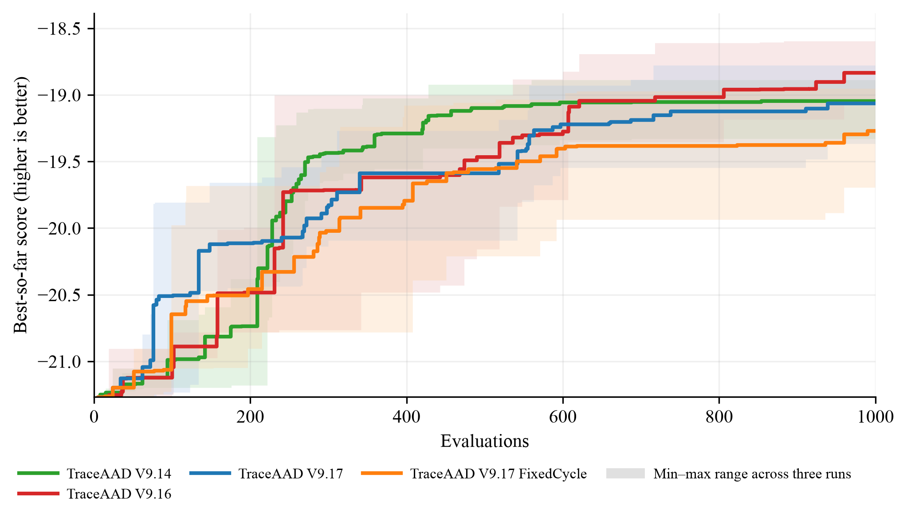

# 实验结果

五个任务的正式测试结果与搜索曲线。表中每个数值为 3 次运行的测试均值 ± 样本标准差，加粗表示该列的最佳均值。VRPTW 为单规模任务，不设跨规模列。

## TSP Construct

平均 tour length，越低越好。

| 方法 | TSP50 | TSP100 | TSP200 |
| --- | ---: | ---: | ---: |
| EoH | 6.228240 ± 0.103448 | 8.642466 ± 0.119373 | 12.145391 ± 0.246453 |
| ReEvo | 6.596210 ± 0.447923 | 9.105136 ± 0.561099 | 12.769022 ± 0.583434 |
| MCTS-AHD | 6.318157 ± 0.127192 | 8.719380 ± 0.175825 | 12.234488 ± 0.264339 |
| PathWise | 6.490129 ± 0.186413 | 8.895653 ± 0.319771 | 12.409647 ± 0.347392 |
| CALM (w/o GRPO) | 6.250545 ± 0.079386 | 8.684303 ± 0.048566 | 12.119953 ± 0.114974 |
| TraceAAD V4 | 6.040012 ± 0.160757 | 8.503962 ± 0.223707 | 11.886306 ± 0.140818 |
| TraceAAD V5 | 6.187259 ± 0.062425 | 8.569365 ± 0.197009 | 12.046895 ± 0.364253 |
| TraceAAD V8 | 6.157917 ± 0.029175 | 8.468276 ± 0.018127 | 11.842850 ± 0.015395 |
| TraceAAD V9 | 6.361908 ± 0.090497 | 8.833273 ± 0.149388 | 12.363585 ± 0.320939 |
| TraceAAD V9.7 | 5.990581 ± 0.107389 | 8.389582 ± 0.155066 | 12.025246 ± 0.342693 |
| TraceAAD V9.9 | 5.976288 ± 0.282379 | 8.424565 ± 0.378723 | 11.954665 ± 0.481041 |
| TraceAAD V9.14 | **5.749804 ± 0.126348** | **8.094207 ± 0.175829** | **11.494031 ± 0.308433** |
| TraceAAD V9.15 | 5.810646 ± 0.154429 | 8.199291 ± 0.405792 | 11.786740 ± 0.474832 |
| TraceAAD V9.16 | 5.850178 ± 0.073481 | 8.343712 ± 0.040299 | 11.763590 ± 0.119956 |

## CVRP-ACO

平均最优路径长度，越低越好。

| 方法 | CVRP50 | CVRP100 | CVRP200 |
| --- | ---: | ---: | ---: |
| EoH | 9.069143 ± 0.035767 | 15.479988 ± 0.123083 | 28.198821 ± 0.148972 |
| ReEvo | 9.471978 ± 0.403672 | 16.025671 ± 0.650593 | 28.416599 ± 1.448043 |
| MCTS-AHD | 9.093402 ± 0.157373 | 15.466284 ± 0.212533 | 27.900014 ± 0.389597 |
| PathWise | 9.354221 ± 0.122157 | 15.905908 ± 0.241743 | 28.372643 ± 0.487237 |
| CALM (w/o GRPO) | 9.313827 ± 0.116081 | 15.900745 ± 0.428614 | 28.820111 ± 0.755127 |
| TraceAAD V4 | 9.129223 ± 0.129956 | 15.413780 ± 0.294039 | 27.899936 ± 0.595357 |
| TraceAAD V5 | 9.038972 ± 0.091240 | 15.428279 ± 0.229195 | 27.976674 ± 0.346112 |
| TraceAAD V8 | **8.952075 ± 0.126183** | 15.275853 ± 0.224413 | 27.627429 ± 0.415096 |
| TraceAAD V9 | 9.083212 ± 0.224008 | 15.497642 ± 0.387292 | 28.106981 ± 0.603952 |
| TraceAAD V9.7 | 9.020912 ± 0.075268 | **15.160426 ± 0.431644** | **27.264858 ± 0.816261** |
| TraceAAD V9.9 | 9.362723 ± 0.328244 | 16.143917 ± 0.710780 | 29.033141 ± 1.076603 |
| TraceAAD V9.14 | 9.141101 ± 0.027146 | 15.788042 ± 0.038298 | 28.422103 ± 0.035542 |
| TraceAAD V9.15 | 9.406878 ± 0.369315 | 16.102769 ± 0.761063 | 29.023189 ± 1.300109 |
| TraceAAD V9.16 | 9.177615 ± 0.204658 | 15.551875 ± 0.226103 | 28.065068 ± 0.592583 |

## OP-ACO

平均 collected prize，越高越好。

| 方法 | OP50 | OP100 | OP200 |
| --- | ---: | ---: | ---: |
| EoH | 15.119813 ± 0.187204 | 30.445387 ± 0.455741 | 54.754948 ± 1.398744 |
| ReEvo | 14.858840 ± 0.367110 | 30.237583 ± 0.818002 | 54.894583 ± 1.844302 |
| MCTS-AHD | 15.125559 ± 0.100494 | 30.512176 ± 0.526601 | 54.894583 ± 1.613211 |
| PathWise | 15.038228 ± 0.097637 | 30.324539 ± 0.319138 | 54.214323 ± 0.545583 |
| CALM (w/o GRPO) | 15.079566 ± 0.149169 | 30.363169 ± 0.489603 | 54.141094 ± 2.185716 |
| TraceAAD V4 | 15.069351 ± 0.090613 | 30.216914 ± 0.673457 | 53.509375 ± 2.611692 |
| TraceAAD V5 | 15.111948 ± 0.115030 | **30.710591 ± 0.245109** | **55.792500 ± 0.613045** |
| TraceAAD V8 | 14.930511 ± 0.055848 | 30.238432 ± 0.237306 | 54.048125 ± 1.112009 |
| TraceAAD V9 | 15.162082 ± 0.108610 | 30.632037 ± 0.268074 | 54.905469 ± 0.977607 |
| TraceAAD V9.7 | 15.002639 ± 0.156166 | 29.904167 ± 0.787777 | 52.443333 ± 2.732800 |
| TraceAAD V9.9 | 15.022635 ± 0.125094 | 30.324871 ± 0.254084 | 54.696771 ± 0.939907 |
| TraceAAD V9.14 | 15.061859 ± 0.137989 | 30.040432 ± 0.788832 | 52.642135 ± 1.754525 |
| TraceAAD V9.15 | 15.137907 ± 0.027297 | 30.625471 ± 0.196485 | 54.843958 ± 0.543628 |
| TraceAAD V9.16 | **15.171288 ± 0.074001** | 30.616080 ± 0.272446 | 55.027708 ± 0.745524 |

## Online Bin Packing

列为 item 数（`1k/5k/10k`）× capacity（`100/500`）的六个测试设置；平均使用箱数，越低越好。

| 方法 | 1k_100 | 5k_100 | 10k_100 | 1k_500 | 5k_500 | 10k_500 |
| --- | ---: | ---: | ---: | ---: | ---: | ---: |
| EoH | 417.067 ± 3.591 | 2058.533 ± 30.901 | 4108.133 ± 63.686 | 81.600 ± 1.386 | 404.067 ± 1.501 | 806.600 ± 1.217 |
| ReEvo | 416.800 ± 5.196 | 2069.667 ± 34.526 | 4128.067 ± 67.088 | **80.800 ± 0.000** | 403.067 ± 0.231 | 805.600 ± 0.346 |
| MCTS-AHD | 414.067 ± 3.062 | 2026.600 ± 3.219 | 4043.600 ± 5.892 | 80.933 ± 0.416 | 402.733 ± 0.643 | 804.867 ± 1.137 |
| PathWise | 424.067 ± 3.700 | 2068.067 ± 18.649 | 4124.933 ± 36.890 | 80.867 ± 0.115 | 403.067 ± 0.231 | 805.800 ± 0.200 |
| CALM (w/o GRPO) | 415.067 ± 0.833 | 2020.800 ± 1.039 | **4026.733 ± 2.802** | 81.800 ± 1.249 | 403.400 ± 0.721 | 805.733 ± 1.419 |
| TraceAAD V4 | 413.600 ± 3.292 | 2023.600 ± 7.203 | 4037.333 ± 16.008 | 81.333 ± 0.462 | 403.133 ± 0.902 | 805.133 ± 1.332 |
| TraceAAD V5 | 415.467 ± 3.802 | 2050.133 ± 32.883 | 4093.400 ± 64.420 | 81.200 ± 0.693 | 403.600 ± 0.529 | 805.533 ± 0.987 |
| TraceAAD V8 | 417.933 ± 1.102 | 2049.267 ± 31.298 | 4088.400 ± 65.038 | **80.800 ± 0.000** | 402.400 ± 0.721 | 804.400 ± 1.311 |
| TraceAAD V9 | **411.667 ± 4.623** | 2020.733 ± 2.810 | 4033.467 ± 2.914 | 80.867 ± 0.306 | 402.733 ± 0.702 | 804.667 ± 0.945 |
| TraceAAD V9.7 | 413.000 ± 2.425 | **2019.200 ± 2.030** | 4027.533 ± 0.702 | 81.200 ± 0.400 | 402.400 ± 0.721 | **804.200 ± 1.114** |
| TraceAAD V9.9 | 417.800 ± 9.865 | 2032.267 ± 19.054 | 4052.133 ± 31.935 | 81.400 ± 0.872 | 403.000 ± 1.000 | 804.600 ± 0.917 |
| TraceAAD V9.14 | 417.933 ± 1.724 | 2030.200 ± 8.697 | 4046.267 ± 14.883 | 81.267 ± 0.231 | 403.067 ± 0.702 | 805.267 ± 1.405 |
| TraceAAD V9.15 | 413.200 ± 2.433 | 2022.867 ± 4.438 | 4033.000 ± 7.000 | 81.133 ± 0.416 | **402.333 ± 0.757** | 803.867 ± 1.026 |
| TraceAAD V9.16 | 420.467 ± 8.769 | 2027.467 ± 9.979 | 4044.533 ± 17.810 | **80.800 ± 0.000** | **402.333 ± 0.757** | 804.267 ± 1.553 |

## VRPTW Construct

VRPTW50 独立测试集（16 实例，seed 2025）平均总距离，越低越好；单规模任务，不设跨规模列。参考最优均值 16.281844，16 实例全部证明最优（`experiments/_logs/reference_optima_server3/summary.json`）。该任务由五个外部对照与 V9.14、V9.16 参跑。

| 方法 | VRPTW50 |
| --- | ---: |
| EoH | 19.520666 ± 0.544388 |
| ReEvo | 20.926078 ± 0.071295 |
| MCTS-AHD | 20.835880 ± 0.050207 |
| PathWise | 21.009466 ± 0.682553 |
| CALM (w/o GRPO) | 20.851889 ± 0.187868 |
| TraceAAD V9.14 | 19.388871 ± 0.748088 |
| TraceAAD V9.16 | **18.821875 ± 0.227396** |

## TraceAAD 单版本排名

每次只放入一个 TraceAAD 版本与五个外部对照，在 15 个规模（TSP/CVRP/OP 各 3 + OBP 6）上按上表均值逐列排名后取平均名次；由 `experiments/analysis/recompute_rankings.py --markdown` 生成。V4–V9.12 的评估工件已在 2026-08-21 清理中删除，其行保留本页记录，脚本只重算工件仍存在的版本。VRPTW 只有一列且仅基线与 V9.14/V9.16 参跑，按上节表内名次（V9.16 第 1、V9.14 第 2、EoH 第 3、MCTS-AHD 第 4、CALM 第 5、ReEvo 第 6、PathWise 第 7），不进入平均名次。

| 版本 | 平均名次 | 六方法中位置 | 相对 MCTS-AHD |
| --- | ---: | ---: | ---: |
| TraceAAD V9.16 | 1.900 | 1/6 | -0.467 |
| TraceAAD V9 | 2.067 | 1/6 | -0.333 |
| TraceAAD V5 | 2.133 | 1/6 | -0.100 |
| TraceAAD V9.7 | 2.200 | 1/6 | -0.300 |
| TraceAAD V8.2 | 2.367 | 2/6 | +0.333 |
| TraceAAD V9.15 | 2.400 | 1/6 | -0.033 |
| TraceAAD V8 | 2.433 | 2/6 | +0.067 |
| TraceAAD V4 | 2.600 | 2/6 | +0.300 |
| TraceAAD V9.8 | 2.667 | 2/6 | +0.367 |
| TraceAAD V9.12 | 2.833 | 2/6 | +0.667 |
| TraceAAD V9.6 | 3.033 | 2/6 | +0.800 |
| TraceAAD V9.14 | 3.333 | 3/6 | +1.367 |
| TraceAAD V9.9 | 3.400 | 4/6 | +1.367 |
| TraceAAD V6 | 3.433 | 3/6 | +1.400 |
| TraceAAD V7 | 4.167 | 4/6 | +2.333 |
| TraceAAD V8.3 | 4.167 | 5/6 | +2.233 |

## 搜索曲线

best-so-far 曲线，3 次运行均值，色带为 min–max 范围；横轴为 1000 次搜索评估，分数统一转换为越高越好。曲线方法集为逐样本历史仍可读取的 TraceAAD V9.7、V9.14、V9.15、V9.16；VRPTW 面板只有 V9.14 与 V9.16 参跑过该任务。其余版本与五个外部对照的逐样本历史已在 2026-08-21 的清理中删除，曲线无法重绘，含对照的旧图保存在 git 历史。

