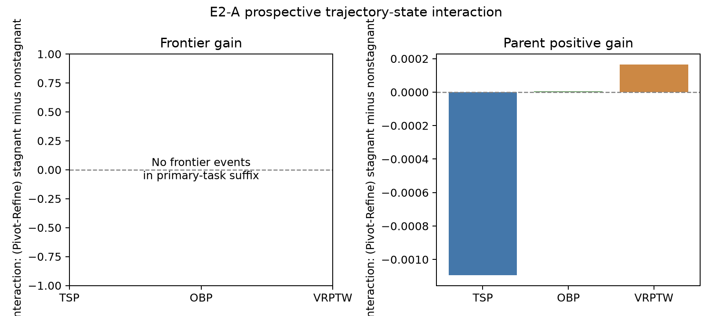

# E2-A 结果：行为轨迹状态与 Refine/Pivot 响应

数据冻结：`2026-09-07T05:09:30.837188+00:00`。**阶段判断：未达到最低信息量，只能判未决；不修改在线机制，也不自动启动E2-B。**

本实验使用E1冻结点之后的未见suffix；TSP、OBP、VRPTW用于行为交互，五任务用于Q_kernel审计。没有新增LLM生成或正式evaluator调用。

## 1. 数据与状态覆盖

冻结15路共 1108 个新尝试。行为主任务中有 462 个requested=executed Refine/Pivot动作，424 个具有完整非根轨迹状态；其中 232 个满足2/3停滞定义，46 个三项全部满足。

| 任务 | Prefix状态数 | Move中位数 | Revisit中位数 | Suffix可分析动作 | 停滞动作 |
| --- | ---: | ---: | ---: | ---: | ---: |
| TSP | 894 | 0.389059 | 0.110536 | 95 | 54 |
| OBP | 1413 | 0.178419 | 0.000000 | 208 | 109 |
| VRPTW | 966 | 0.385549 | 0.106965 | 121 | 69 |

D_revisit使用action前完整有效archive，排除当前节点及其直接形成父节点；阈值只由E1 prefix确定。根节点、画像失败或参考集不足不填零，排除并计入覆盖。另有 37 个状态因二元Pivot propensity不在[0.05,0.95]而排除，结论只适用于overlap population。

## 2. 停滞状态 × 算子响应

主frontier_gain交互的三任务宏平均为 0.000000，task内分层run bootstrap 95%区间 [0.000000, 0.000000]；0/3任务方向为正。固定门槛判定为 **未通过**。

| Outcome | 非停滞 Pivot−Refine | 停滞 Pivot−Refine | 交互Δτ（三任务宏平均） | 95% bootstrap区间 |
| --- | ---: | ---: | ---: | ---: |
| frontier_gain | 0.000000 | 0.000000 | 0.000000 | [0.000000, 0.000000] |
| frontier | 0.000000 | 0.000000 | 0.000000 | [0.000000, 0.000000] |
| parent_positive_gain | -0.000161 | -0.000299 | -0.000308 | [-0.004403, 0.001004] |
| valid | -0.022796 | -0.006580 | 0.041679 | [-0.027199, 0.243216] |
| parent_signed_gain_valid | -0.296129 | -0.773742 | -0.397456 | [-0.622887, -0.024955] |

frontier两行的全零与[0,0]区间来自主任务suffix中没有任何frontier event，是不可识别的退化结果，不是“效应被精确估计为零”。主表前两列是三任务池化Hájek估计，交互列是三个任务等权平均，因此数值不要求由前两列直接相减。`parent_signed_gain_valid`条件于处理后的valid，只用于描述，不作因果主结论。

| 层 | Refine n / ESS | Pivot n / ESS | Refine frontier gain | Pivot frontier gain |
| --- | ---: | ---: | ---: | ---: |
| 非停滞 | 154 / 153.1 | 38 / 34.2 | 0.000000 | 0.000000 |
| 停滞 | 180 / 179.7 | 52 / 46.3 | 0.000000 | 0.000000 |

辅助超父结果没有显示Pivot优势：非停滞层Refine/Pivot分别有 6/1 次正增益，停滞层为 5/0；严格三项停滞子集也只有Refine 1/35、Pivot 0/11。这些事件太少，不能形成稳定负效应估计，但方向并不支持花费生成预算启动E2-B。

给定候选有效时，signed parent gain的三任务宏平均交互为 -0.397456，bootstrap区间 [-0.622887, -0.024955]，且三个任务方向均为负。valid是处理后的变量，不能把这个条件分析当作无偏因果效应；它只能说明现有suffix没有出现值得据此投入E2-B的正向质量迹象。

图中同时给出frontier gain与parent positive gain的逐任务交互。正值表示停滞状态下Pivot相对Refine的优势比非停滞状态更大。

### 分任务主结果

| 任务 | Frontier交互 | Parent-positive交互 | 停滞Refine/Pivot n |
| --- | ---: | ---: | ---: |
| TSP | 0.000000 | -0.001093 | 39/15 |
| OBP | 0.000000 | 0.000004 | 87/22 |
| VRPTW | 0.000000 | 0.000165 | 54/15 |

## 3. Q_kernel prospective suffix audit

五任务suffix包含 539 次严格Refine、30 次超父和 2 次前缘突破。Q与M1在E1 prefix上的重构最大误差分别为 1.11e-16 和 0。4/15个run没有Refine正例，这些run的Brier/log loss仍保留，lift只对可定义run求宏平均。

| 模型 | Brier（池化）↓ | Brier（run宏平均）↓ | AP↑ | Lift（宏平均）↑ | Top20% parent gain↑ | Top20% frontier gain↑ |
| --- | ---: | ---: | ---: | ---: | ---: | ---: |
| M0 | 0.051602 | 0.058571 | 0.0954 | 0.056 | 0.000393 | 0.000000 |
| M1 | 0.047365 | 0.052891 | 0.2792 | 2.818 | 0.002251 | 0.000027 |
| Q_kernel | 0.050127 | 0.056864 | 0.1645 | 1.917 | 0.001734 | 0.000000 |

Q_kernel在 2/5 个任务上Brier优于M1，allocation candidate门槛判定为 **未通过**。该门槛同时要求parent与frontier两种top组收益不低于M1，避免把校准改善直接写成预算价值。

这次不是只在排序上失败：Q_kernel的池化Brier为 0.050127，也弱于M1的 0.047365；AP、run宏平均lift和两项top组gain均更低。E1中观察到的Q校准优势没有在未见suffix复制。

## 4. 研究判断

主任务suffix只有 0 个frontier event；停滞层action ESS已达最低要求，因此无法把未通过门槛解释为机制不存在。结果只能记为未决，且信息不足本身不自动授权E2-B。

Q_kernel既没有复制校准优势，也没有改善预算相关排序，因此不再保留为选父候选；E1中的优势应视为特定prefix上的不稳定校准现象。

E1已经关闭静态行为邻域的Refine响应共享；E2-A只检验行为作为轨迹传感器的一个固定状态定义。未通过不否定行为移动、重访对Pivot/Fuse或多步continuation的其他作用，但后续问题必须用新的独立数据或固定锚点回答，不能继续在本suffix寻找切点。

### 后续复审

复审确认本轮实现与IPW没有足以推翻结果的错误，但发现原estimand不能作为两步实验的gate：

- 当前“停滞”只看parent的形成边、祖先近期收益和archive重访，没有纳入该parent出生后接受过多少development attempts，因此更准确地说是ancestral formation state；
- Pivot的假设价值本来允许一步退化后再兑现，以一步frontier gain要求两步option value先呈正向，逻辑上过强；
- overlap限制虽有利于同parent因果比较，却排除了Pivot在V10.6中路由到低 \(p_0\) parent的特殊工作区域。

因此“不自动启动E2-B”只属于原冻结gate的执行结论，不能理解为“两步价值已经被否定”。后续用独立的固定锚点随机干预绕过该gate，结果见[E2-B' Pivot两步选择价值](../2026-09-07-E2-B-Pivot两步选择价值/结果.md)。

## 5. 成本与复现

行为画像覆盖：4603/4608 个archive节点；复用E1成功画像 1166 个，新画像任务 3442 个。新增画像worker池墙钟 5.0 分钟，不含随后距离矩阵汇总时间。

[固定实验设计](实验设计.md)；[执行入口](../../../../experiments/traceaad_e2_a/README.md)。机器可读产物位于 `experiments/_logs/traceaad_e2_a_20260907/`。
