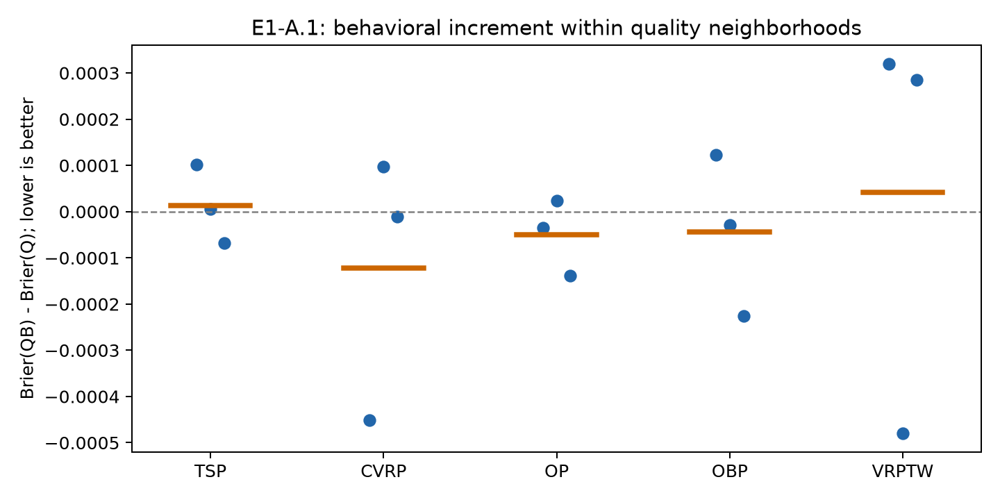

# E1-A.1 结果：质量条件下的行为增量检验

**阶段判断：未观察到达到固定门槛的质量条件行为增量，不启动原版 E1-B。**

本分析由 E1-A 的后验发现触发，复用同一冻结数据和严格时间回放。它不修改 E1-A 的主结论，也不新增 LLM 生成、正式 evaluator 调用或在线控制改动。

## 1. 核心结果

QB_kernel 相对 Q_kernel 的 run 宏平均 Brier 变化为 **-0.05%**，4/5 个任务、8/15 个 run 改善。配对差为 -0.000032，run bootstrap 95% 探索性区间 [-0.000149, +0.000074]。

真实 QB 的宏平均 Brier 优于 64.9% 的邻域内行为置乱，单侧经验比例对应 p=0.3516。固定门槛要求至少2%相对改善、3/5任务同向、log loss不变差且优于至少95%的置乱；本次判定为 **未通过**。

| 模型 | Brier（池化）↓ | Brier（run宏平均）↓ | Log loss（宏平均）↓ | AP（池化）↑ | Lift（宏平均）↑ | Top20%相对正部增益↑ |
| --- | ---: | ---: | ---: | ---: | ---: | ---: |
| M1 | 0.061958 | 0.062415 | 0.245495 | 0.0991 | 1.677 | 0.001372 |
| M3_static | 0.062465 | 0.063418 | 0.245839 | 0.1100 | 1.842 | 0.001198 |
| Q_kernel | 0.058677 | 0.059545 | 0.233979 | 0.1053 | 1.620 | 0.001166 |
| QB_kernel | 0.058630 | 0.059513 | 0.232829 | 0.1044 | 1.699 | 0.001272 |

1000次 QB_permuted 的宏平均 Brier 中位数为 0.059524，95%范围 [0.059459, 0.059586]。置乱只打乱同一质量局部组内行为权重与parent身份的对应关系。

## 2. 分任务结果

| 任务 | Q Brier | QB Brier | QB−Q | 置乱Brier中位数 | 真实QB优于置乱比例 |
| --- | ---: | ---: | ---: | ---: | ---: |
| CVRP | 0.071101 | 0.070959 | -0.000142 | 0.070999 | 87.8% |
| OBP | 0.051546 | 0.051499 | -0.000047 | 0.051467 | 25.3% |
| OP | 0.042645 | 0.042592 | -0.000053 | 0.042663 | 92.4% |
| TSP | 0.080998 | 0.080996 | -0.000001 | 0.081016 | 57.5% |
| VRPTW | 0.052975 | 0.053002 | +0.000027 | 0.052976 | 36.1% |

图中每点代表一个run，短线是每任务三个run的均值；纵轴低于零才表示行为重加权改善了质量核。

## 3. 覆盖与稳健性

主比较包含 3603 次预热后尝试和 228 次严格改善。当前parent有行为画像 3602 次；质量局部组全部拥有行为画像 3602 次。重算 Q_kernel 与 E1-A 已保存预测的最大绝对差为 1.11e-16。

| 子集 | 尝试数 | Q Brier | QB Brier | QB−Q |
| --- | ---: | ---: | ---: | ---: |
| 全部主样本 | 3603 | 0.058677 | 0.058630 | -0.000047 |
| first-parent-use | 1483 | 0.080743 | 0.080764 | +0.000021 |
| 完整行为支持 | 3602 | 0.058446 | 0.058400 | -0.000047 |

first-parent-use 用于检验新节点能否借用其他节点的历史响应；完整支持子集用于排除行为画像缺失造成的回退。两者均沿用原warmup和当前parent排除规则。

## 4. 研究含义

本轮不能把 Q_kernel 的优势归因于被fitness掩盖的行为局部性。若 QB 与置乱相当或弱于Q，说明当前BehaveSim没有展示出控制质量后的独立响应信息；继续做原版behavior Near/Far E1-B缺少依据。

无论本轮结果如何，Q_kernel 的好表现仍可能只是对非线性 `fitness → improvement rate` 的非参数校准，并不自动等价于更好的预算分配。AP、lift和top组收益只作为后验控制器诊断，不能替代Brier主判断。

控制器诊断本身也不一致：QB 的 pooled AP 从 0.1053 变为 0.1044，run 宏平均 lift 从 1.620 变为 1.699，top组相对正部增益从 0.001166 变为 0.001272。其中收益改善只出现在2/5个任务，且本实验没有为这些排序指标建立置乱门槛，因此不能把宏平均lift的上升解释为稳定的预算集中能力。first-parent-use的Brier也略微恶化，行为重加权没有解决新节点缺少自身反馈的问题。

E1-A已经显示ACO任务的局部邻居对probe和随机流较敏感；本实验复用这些距离，不能消除该测量限制。另一方面，TSP测量较稳定而原响应共享仍失败，因此也不能把所有负结果归因于ACO噪声。

本轮联合核沿用E1-A的k=10、自适应高斯带宽和收缩强度，只检验这一固定形式。未通过意味着当前BehaveSim条件核没有可用增量，不构成对所有行为表示、核带宽或控制目标的普遍否定。后续不再为Refine响应共享事后调这一批数据；行为信息转去停滞/重访、Pivot切换和Fuse互补性，Q_kernel则需用独立时间段验证其校准与排序价值。

## 5. 复现与产物

[固定设计](E1-A.1实验设计.md)；[运行入口](../../../../experiments/traceaad_refine_e1/README.md)。机器可读结果位于 `experiments/_logs/refine_e1_20260907/e1a1_summary.json`、`e1a1_predictions.jsonl` 和 `e1a1_permutation_macro_brier.npy`。
