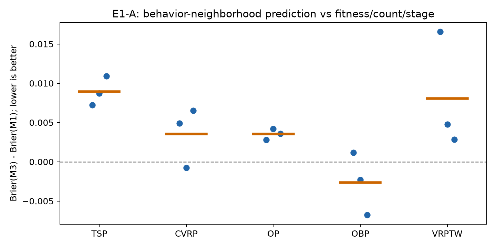

# E1-A 结果：V10.6 Refine 局部响应历史回放

数据冻结：`2026-09-07T03:17:35.679841+00:00`。状态：E1-A 已完成；E1-B 未执行。

**阶段判断：未达到事先固定的进入 E1-B 筛选门槛；本轮不据此自动启动固定锚点生成或修改在线选父。**

M3 相对 M1 的 run 宏平均 Brier 变化为 **+6.87%**（负值更好），1/5 个任务的池化 Brier 改善。下面同时给出简单 prior、embedding 和质量邻域对照，避免将局部相关性误写成潜力已可识别。

### 研究判断

本轮不支持把当前 BehaveSim 邻域及响应特征直接加入选父控制器。M3 的 Brier、log loss 和排序指标均未稳定超过 M1；去掉唯一缺失画像样本后，以及只看父节点首次被开发时，结论方向不变。加入局部响应的 M3 也弱于仅用静态行为量的 M3_static，因此不能声称已验证轨迹反馈共享的增量。

同时，结果不能简化为“局部反馈无用”。无需拟合的 B_kernel 宏平均 Brier 为0.06108，优于 M1 的0.06242，但配对差的探索性95%区间跨0。更便宜的 Q_kernel 为0.05954，且在五个任务的池化 Brier 上都优于 B_kernel。当前证据更支持先检查质量条件化的收缩估计；尚未证明行为几何有独立于质量相近性的额外价值。拟合模型弱于直接收缩估计，提示有限正例下的拟合与校准可能是瓶颈，但本轮没有通过额外调参来验证这一解释。

OBP 是唯一 M3 任务池化改善的任务，三个重复中两个改善；但该任务 M3 仍弱于全局 prior（0.05559 对0.05196），也弱于静态行为模型（0.05409）。因此，仅凭 OBP 相对 M1 的改善，不足以支持缩小范围后立即进入 E1-B。ACO 的随机流敏感性则提示行为距离还需要更充分的可靠性核验。

后续已经用同一冻结数据完成[E1-A.1](E1-A.1结果.md)：在质量近邻内加入行为重加权只使run宏平均Brier改善0.05%，且只优于64.9%的邻域内行为置乱，未达到固定门槛。因此不启动原版E1-B。下一步应在独立时间段检验Q_kernel是否只是更好的非线性校准，并将行为信息转向停滞/重访、Pivot切换和Fuse互补性。E1-A继续保留原门槛和全部负结果，不通过事后更换主模型改判为通过。

### 复核后补充认识

实现复核没有发现会推翻结论的时序泄漏或标签处理错误。预测严格发生在当前结果入档之前，run 之间不共享未来信息，失败尝试进入无条件标签，统计也以 run 为重复单位。唯一实质性协议妥协是：行为几何只覆盖此前已经成为 Refine parent 的历史节点，而不是当时完整 archive。它仍能检验历史 Refine-parent 子空间中的响应迁移，但不能外推为完整 algorithm landscape 的局部性。

首次开发子集尤其直接地反驳了原始叙事：新 parent 没有自身动作历史时，M3 仍从 M1 的0.08690恶化到0.09304。因此当前数据不支持用行为近邻解决新节点反馈稀疏。另一方面，M3_static 的 pooled AP 从0.0991升到0.1100，run 宏平均 top-20% lift 从1.677升到1.842；这只留下“行为状态可能帮助排序”的线索，不能证明近邻响应可以共享。

B_kernel 的 Brier 和 log loss 略优于 M1，但 AP 与 lift 更低，说明它更像改善了收缩和校准，没有证明能把预算集中到更有潜力的 parent。Q_kernel 又优于 B_kernel，但同样可能只是更好地拟合了非线性的 `fitness → improvement rate`，不能直接解释成 evolvability。由此产生的关键未决问题是：控制 fitness 后，行为距离是否仍有独立信息。该问题由[E1-A.1](E1-A.1实验设计.md)单独检验，不改写本实验的 no-go 结论。

行为测量的局部可靠性也是机制限制。CVRP 和 OP 的 kNN overlap 分别只有0.262和0.337，同算法更换随机流的距离甚至可超过跨算法最近邻距离；但 TSP 的随机流检查稳定，M3 仍明显恶化。因此测量噪声只能解释部分失败，不能据此假定修好随机流后原假设必然成立。更合适的概念拆分是：

$$
\text{solution behavior similarity}\neq\text{variation-response similarity}.
$$

LLM Refine 同时受代码结构、实现摘要、形成路径和可修改空间影响，外部求解行为相近并不保证 proposal kernel 或未来增益分布相近。

## 1. 实际数据与执行范围

冻结15路修订版 V10.6，共 4353 次请求且执行 Refine、1843 个父节点、321 次严格改善。每路前50次 Refine 为预热，主比较包含 3603 次尝试。原始事件与评价收据已逐路核对；解析失败、评价失败均保留为未改善，未完成请求排除。冻结数据中没有请求算子与执行算子不一致的记录，故无 Fuse 回退样本需要单列。

| 任务 | 重复 | 已用评价截点 | Refine尝试 | 父节点 | 严格改善 |
| --- | ---: | ---: | ---: | ---: | ---: |
| TSP | 1 | 279 | 199 | 57 | 16 |
| CVRP | 1 | 467 | 314 | 139 | 36 |
| OP | 1 | 450 | 281 | 101 | 16 |
| OBP | 1 | 581 | 337 | 165 | 19 |
| VRPTW | 1 | 515 | 284 | 117 | 13 |
| TSP | 2 | 402 | 239 | 97 | 21 |
| CVRP | 2 | 422 | 272 | 105 | 25 |
| OP | 2 | 479 | 283 | 112 | 21 |
| OBP | 2 | 596 | 426 | 177 | 16 |
| VRPTW | 2 | 497 | 269 | 133 | 30 |
| TSP | 3 | 500 | 303 | 151 | 30 |
| CVRP | 3 | 404 | 269 | 119 | 22 |
| OP | 3 | 477 | 303 | 100 | 20 |
| OBP | 3 | 663 | 360 | 176 | 19 |
| VRPTW | 3 | 407 | 214 | 94 | 17 |

预热后样本中，实际提交评价 2832 次，得到有限fitness 2632 次。无条件改善率为 6.33%；给定已提交评价为 8.05%；给定有限fitness为 8.66%。

## 2. 测量校验与画像覆盖

每任务首路运行按node ID选两个最早入档的Refine父节点、两个面板共20个校验案例，重复PSTraj一致，正式评价器与画像过程在相同probe上的得分差均为0。这是有限候选一致性检查，不是所有可能程序的等价证明。

| 任务 | 安排画像父节点 | 双面板成功 | 面板Spearman均值 | kNN重合均值 | 累计worker墙钟秒 |
| --- | ---: | ---: | ---: | ---: | ---: |
| TSP | 305 | 305 | 0.735 | 0.581 | 2203.1 |
| CVRP | 363 | 363 | 0.473 | 0.262 | 26922.3 |
| OP | 313 | 313 | 0.648 | 0.337 | 4249.0 |
| OBP | 518 | 517 | 0.912 | 0.726 | 112.2 |
| VRPTW | 344 | 344 | 0.822 | 0.538 | 97.5 |

### 随机流敏感性

| 任务 | 同算法跨随机流平均距离（2锚点） | 已画像父节点最近邻距离中位数（run均值） |
| --- | ---: | ---: |
| TSP | 0.000 | 0.083 |
| CVRP | 0.811 | 0.659 |
| OP | 0.730 | 0.000 |
| OBP | 0.000 | 0.000 |
| VRPTW | 0.177 | 0.092 |

随机流检查使用每任务两个最早锚点，改变候选程序随机种子，并在ACO任务中改变ACO采样种子；只在面板A检查。若同算法跨随机流差异与跨算法距离接近，固定随机流的近邻可能含有显著采样噪声。此处是小样本敏感性检查，不能据两个锚点推断任务的完整噪声分布。

画像失败的类别与每个候选详情保存在本地 `profiles/` 和 `costs.json`，失败不填成零距离。面板稳定性是观测可靠性的描述；密度等特征仅针对当时已被选择为Refine parent的历史子集，并非全archive。

OP面板B使用seed=20260907的独立训练probe；CVRP面板B使用训练集4–7号实例。未读取validation/test。与旧v3采用validation面板的数值不能直接等同比较。

## 3. 严格时间预测结果

各run独立扩展窗口，每10次尝试仅用此前结果重拟合固定C=1逻辑回归；没有跨run未来训练或根据测试分数选超参。M2/M3采用相同预测器和可见邻域规则。AP为average precision，lift为本组最高20%预测的实际改善率/本组总体改善率。

| 模型 | Brier（池化）↓ | Brier（run宏平均）↓ | Log loss（宏平均）↓ | AP（池化）↑ | Lift（宏平均）↑ |
| --- | ---: | ---: | ---: | ---: | ---: |
| M0 | 0.06089 | 0.06196 | 0.24789 | 0.0708 | 0.846 |
| M1 | 0.06196 | 0.06242 | 0.24550 | 0.0991 | 1.677 |
| M2 | 0.06346 | 0.06413 | 0.25785 | 0.1057 | 1.552 |
| M3_static | 0.06247 | 0.06342 | 0.24584 | 0.1100 | 1.842 |
| M3 | 0.06565 | 0.06670 | 0.25976 | 0.0914 | 1.527 |
| M3_samecode_excluded | 0.06565 | 0.06670 | 0.25976 | 0.0914 | 1.527 |
| M3_self_history | 0.06601 | 0.06705 | 0.26130 | 0.0908 | 1.575 |
| M_quality | 0.06237 | 0.06332 | 0.25250 | 0.1026 | 1.730 |
| B_kernel | 0.06023 | 0.06108 | 0.24070 | 0.0899 | 1.605 |
| E_kernel | 0.06061 | 0.06173 | 0.24626 | 0.0806 | 1.382 |
| Q_kernel | 0.05868 | 0.05954 | 0.23398 | 0.1053 | 1.620 |

M0=历史平滑prior；M1=fitness/count/stage；M2=embedding邻域；M3_static=行为静态局部量；M3=进一步加入局部历史响应；M3_samecode_excluded=排除同代码邻居；M3_self_history=允许同父反馈；M_quality=质量距离邻域；B_kernel/E_kernel/Q_kernel分别直接输出行为/embedding/质量邻域的收缩改善率，作为无需拟合的诊断对照。

| 任务 | M1 Brier | M2 Brier | M3_static Brier | M3 Brier | M3−M1 |
| --- | ---: | ---: | ---: | ---: | ---: |
| CVRP | 0.07238 | 0.07396 | 0.07220 | 0.07599 | +0.00361 |
| OBP | 0.05830 | 0.05716 | 0.05409 | 0.05559 | -0.00271 |
| OP | 0.04452 | 0.05080 | 0.04456 | 0.04805 | +0.00353 |
| TSP | 0.08705 | 0.08882 | 0.09409 | 0.09632 | +0.00927 |
| VRPTW | 0.05204 | 0.05184 | 0.05506 | 0.06077 | +0.00873 |

以run为重采样单位，M3−M1的Brier宏平均差为 +0.00428，探索性bootstrap 95%区间 [+0.00162, +0.00704]；3/15个run改善。每任务仅3个run，不将候选边数视为独立重复，不据此声称已识别因果效应。

图中每点代表一个run，橙色短线为该任务三个run的均值；纵轴小于零表示M3优于M1。

## 4. 缺失画像与首次开发检查

| 测试子集 | 尝试数 | M1 Brier | M2 Brier | M3 Brier |
| --- | ---: | ---: | ---: | ---: |
| 全部 | 3603 | 0.06196 | 0.06346 | 0.06565 |
| 行为画像与历史邻居均可用 | 3602 | 0.06175 | 0.06321 | 0.06553 |
| 父节点第一次被Refine开发 | 1483 | 0.08690 | 0.08843 | 0.09304 |

首次开发子集用于检查新节点泛化；同父历史消融用于区分跨节点共享与重复开发记忆。按backend、run的指标、校准分组、top组正部收益、超当前best及退化率均保留在机器可读汇总中。backend分组同时受任务构成影响，不用于推断后端优劣。

## 5. 辅助目标

除严格改善外，另用相同时间回放预测灾难性退化（有效候选相对退步超过10%）与超当前best，并用固定Ridge(alpha=1)预测相对正部增益。辅助目标按原设计补充实现，基础对照跑通后单列检查，不参与调参或主筛选门槛。

| 目标与误差（run宏平均） | M0 | M1 | M2 | M3 |
| --- | ---: | ---: | ---: | ---: |
| 严重退化 Brier | 0.120688 | 0.122825 | 0.127727 | 0.132236 |
| 全局突破 Brier | 0.009893 | 0.009780 | 0.011584 | 0.011077 |
| 相对正部增益 MSE | 0.000018 | 0.000141 | 0.000129 | 0.000121 |

## 6. 成本、限制与下一步

本轮新增生成LLM调用为0，新增正式搜索评价账本调用为0；实际执行了 3686 次行为面板画像，每个成功面板包含4个实例，累计画像耗时 9.33 worker小时（并行累计，不等于墙钟时间）。另有20个一致性案例的重复画像与评价器核验，以及10个锚点的原始/替代随机流双画像。embedding计算约 1158.1 秒，全部在CPU；这些重放和表示成本不隐去。

embedding采用固定版本all-MiniLM-L6-v2，完整代码/摘要分块池化。它是便宜的通用表示对照，并非最强代码embedding，因此不能把M2结果外推为所有表示方法的上限。主预测器未作超参搜索；弱信号可能来自小样本、时变响应、行为测量噪声或模型欠拟合，不能把一次不通过门槛解释为所有形式的locality均不存在。

本轮没有单独验证多步停滞窗口或切换动作收益，不能将预测未改善直接称为饱和检测成功。本实验只评估旧策略实际访问状态上的预测能力；top组lift不是离策略预算收益。未建立“相近状态的反馈可无偏迁移”，也未测量新选父策略的终局效果。是否进入E1-B应同时参考跨任务方向、画像稳定性、首次开发子集和基线比较，而非只看单一总体相关系数。

## 7. 复现与产物

[运行入口与实际协议](../../../../experiments/traceaad_refine_e1/README.md)。本地原始工件位于 `experiments/_logs/refine_e1_20260907/`：`snapshot.json`、`experiment_config.json`、`validation.json`、`profiles/`、`stability.json`、`embedding_metadata.json`、`replay_predictions.jsonl`、`summary*.json`、`costs.json`。
