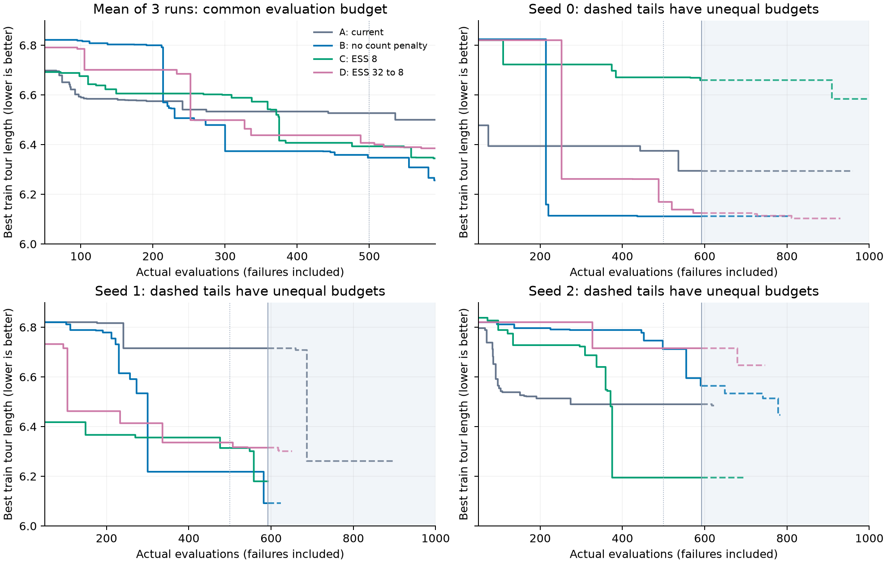

# TSP 预算分配消融：提前结束与研究判断

2026-09-10。**状态：提前结束、分析结项，不再续跑或监控。** 批次 `20260909_v108_allocation_tsp`，四组各三个独立搜索。结项读取到 9311/12000 次真实评价，12 路均超过半程，C/seed0 跑满，其余 11 路停在 592–960 次。最后事件集中在当日 10:52–12:24；本次核查时已无消融运行会话或自动补位进程，未再次操作搜索进程。

**目前最值得保留的判断：去掉次数衰减有中期正向信号；进一步集中开发、逐渐集中均未显示一致收益。调度干预确实改变了机会分配，但尚未解决生成有效算法结构并继续改好的问题。因此停止这批参数筛选、降低该方向优先级是合理选择。** 这不等于证明四组相同，也不等于证明预算分配无关紧要。

## 1. 当时要判断什么

最初的[预算分配核查](../../../analysis/诊断性分析/2026-09-09-预算分配核查/结论与消融方案.md)发现：次数衰减会把机会转向少尝试节点，ESS 随档案增长使后期开发变散。随后在 [AAD 视角修订](../../../analysis/诊断性分析/2026-09-09-预算分配核查/AAD视角修订.md)中，把问题改写为：**有限预算下，质量优先、持续精炼和早宽后窄，能否帮助发现并完善更好的算法？**

原 CVRP 启动批因评价 CPU 开销停止，用户指定换成 TSP；本批不是为了证明 TSP 上限，也不是历史表示或算子比例的消融。[启动记录](../../../../experiments/traceaad_v10_8/launch_allocation_tsp_20260909.md)规定如下顺序：

| 对照 | 改变什么 | 原本需要检验的假设 |
| --- | --- | --- |
| B − A | 去掉父代权重中的 `(1+c)^(-0.5)`，保留质量 ESS=`max(2,0.1N)` | 对重复开发的惩罚是否压低了仍有价值的机会？ |
| C − B | 无次数惩罚，质量 ESS 改为 8 | 档案变大后，聚焦较少有效竞争节点是否更好？ |
| D − C | 无次数惩罚，质量 ESS 从 32 按 `32^(1-r)×8^r` 下降 | 保留较宽的早中期选择，是否比持续集中更有利？ |

其中 `N` 是可选节点数，`r` 是评价预算使用比例，目标受 N 和最高分并列下限限制。ESS 是概率分布的有效规模，不能当成算法模式数；C 也不是只允许八个节点获得机会。

共同冻结版本为 **V10.8 1081**。各组固定 8 个有效根、Refine/Pivot/Fuse=.50/.15/.35、Pivot 一半均匀起点、相同形成轨迹和去重规则、32K 上下文、16K 输出预留。**本批没有改变 Init 数量、Pivot 比例或其时间安排。**

## 2. 对比口径与证据范围

所有运行使用同一训练面板：TSP50、16 个实例、实例 seed=2024、timeout=20 秒；原始 `fitness=-平均路径长度`，下文统一报告**路径长度，越低越好**。核对了十二路配置、机制及冻结源码哈希，评价器和算法源码一致，只有预定分配参数不同。

- **主要读数取预定的 e500**，因为全部运行都覆盖该预算。e200 用于观察早期，e592 是所有运行共同覆盖的最大前缀，用作补充；它是由实际停止位置决定的读数，不冒充预注册终点。
- 初始化和失败评价均占预算；无效输出、父代/donor 精确复制拒绝只计模型成本。逐路核对检查点、事件、评价收据，评价编号连续；曲线由有效原始 fitness 的累计最好值重算，并与事件 `best_so_far` 一致。
- seed 0/1/2 只固定搜索随机源。**LLM 没有设置生成 seed，四组独立生成根。** 因而这是每组三个独立搜索的筛选，不是同一初始化分叉的严格配对反事实。相同 seed 标签的差值用于展示重复差异。
- 沿用用户已明确的等价模型服务口径合并分析。恢复时存在服务切换，不以服务器位置解释组间好坏；实际模型名称、调用及 tokens 保留在证据中。
- 不以各路最后值组成“终局排名”，不补齐未运行预算，不将停滞曲线外推到 e1000。仅一条完整运行无法组成终局比较；本批未做 held-out，不能推出未知实例或跨规模优势。

此次冻结包含 **10207 条已返回模型调用、9311 条评价收据**：8833 次有效评价、478 次失败评价，另有 550 次无效输出、346 次精确复制拒绝。11 个未完成检查点仍留有 `selected` 候选；未返回请求的实际服务消耗未知，不能将 10207 解释为包含所有在途请求的精确总消耗。

## 3. 同预算表现：B 有信号，C/D 没有一致增益

以下均为三次搜索平均；± 为三重复样本标准差，不是置信区间。

| 组别 | 初始化最好值均值 | e200 | e500 | e592 |
| --- | ---: | ---: | ---: | ---: |
| A 当前规则 | 6.8897 | 6.5746 | 6.5267 ± 0.1732 | 6.4998 ± 0.2107 |
| B 无次数衰减 | 7.0308 | 6.7997 | **6.3471 ± 0.3205** | **6.2558 ± 0.2677** |
| C 持续集中 | 7.0977 | 6.6056 | 6.3930 ± 0.2477 | 6.3444 ± 0.2725 |
| D 逐渐集中 | 6.9328 | 6.7009 | 6.4068 ± 0.2799 | 6.3850 ± 0.3015 |

初始化按得到八个有效根时统计，不固定取 e8；个别运行用了 9–11 次评价。



图从 e50 展示。左上均值只使用全部运行共同覆盖的预算；其余面板在 e592 后用虚线和底色标明不等长观测，线止于真实停止位置。[PDF](budget_curves.pdf) 可用于汇报。

按设计的三个比较，负差值表示前一组更好：

| 比较 | e500：seed0 / seed1 / seed2 差值 | e500 平均差 | e592 平均差 | 解释 |
| --- | --- | ---: | ---: | --- |
| B − A | −0.2638 / −0.4971 / +0.2222 | **−0.1796** | **−0.2440** | 两重复改善、一重复退步；存在正向筛选信号 |
| C − B | +0.5595 / +0.0956 / −0.5174 | +0.0459 | +0.0886 | 强集中在 seed2 有帮助，但另两次更差 |
| D − C | −0.5014 / +0.0221 / +0.5207 | +0.0138 | +0.0406 | seed0 获益被其他重复抵消，未支持阶段安排 |

**B 对 A：值得记住，尚不足以定默认。** e500 均值下降 2.75%，e592 下降 3.75%；B 初始化和 e200 均值反而较差，后续突破才使排序翻转。这排除了“B 只因平均起点更好而领先”的简单解释，但没有隔离初始化的后续可开发性与随机生成差异，也没有三重复一致或 e1000 证据。

**C 对 B：快速改善和最终可达质量不是一回事。** e200 时 C 三个标签都优于 B；到 e500/e592，C 已有两个更差。它说明中途某个检查点的领先不宜直接当成调度原则。固定集中可以让一条有效路线迅速发展，也可能持续投资到较弱的结构。

**D 对 C：目前没有支持“先宽后窄”更好的证据。** 还须注意 D 在 e592 的名义目标约为 14.1，只有到 e1000 才降至 8。因此当前 D−C 同时包含早期历史差异与仍在持续的集中强度差异，尚未观测到“共同后期强度下”的完整结局。本次结项保留未决判断，不宣布阶段调度普遍无效。

检查整段曲线也没有改变主要排序：e200–592 每个整数预算点的平均最好路长，再跨三次运行平均，为 A/B/C/D=**6.5317/6.4043/6.4810/6.4720**。这是探索性曲线摘要，不能把数百个高度相关的时点当成数百个独立样本。

### 当前快照，专用于交接

| 组/seed | 已评价 / 1000 | e500 | e592 | 最后最好值 | 最好首次出现 e |
| --- | ---: | ---: | ---: | ---: | ---: |
| A/0 | 960 | 6.374853 | 6.294261 | 6.294261 | 536 |
| A/1 | 900 | 6.715332 | 6.715332 | 6.261642 | 687 |
| A/2 | 623 | 6.489784 | 6.489784 | 6.484859 | 617 |
| B/0 | 805 | 6.111099 | 6.111099 | 6.111099 | 436 |
| B/1 | 624 | 6.218196 | 6.091596 | 6.091596 | 582 |
| B/2 | 784 | 6.711987 | 6.564690 | 6.447634 | 778 |
| C/0 | **1000** | 6.670646 | 6.658872 | 6.584192 | 909 |
| C/1 | 592 | 6.313769 | 6.179649 | 6.179649 | 558 |
| C/2 | 695 | 6.194584 | 6.194584 | 6.194584 | 375 |
| D/0 | 930 | 6.169265 | 6.124555 | 6.102377 | 813 |
| D/1 | 651 | 6.335883 | 6.315089 | 6.300220 | 619 |
| D/2 | 747 | 6.715332 | 6.715332 | 6.646372 | 679 |

### 成本没有让 B 的信号消失，但不支持 token 效率结论

| 组别 | 达到 e592 的平均模型调用数 | 平均输入+输出 tokens | 统一前 659 次模型调用的最好路长均值 | e592 失败评价 / 1776 |
| --- | ---: | ---: | ---: | ---: |
| A | 649.0 | 3.621M | 6.4982 | 120 |
| B | 644.3 | 4.008M | **6.2558** | 143 |
| C | 647.7 | 4.090M | 6.3444 | 69 |
| D | 644.7 | 3.300M | 6.3850 | 42 |

659 是全部运行共同覆盖的最大已记录模型调用数，本批每个完成候选恰有一次已返回生成调用。等调用数的排序一致，B 的中期领先并非简单来自更多调用。不过 B 的上下文/输出总量高于 A，不能宣称它在相同 tokens 或墙钟时间下更高效。失败评价仍留在预算分母；例如 A/seed2 全程 100 次 timeout、B/seed1 33 次 timeout，既可能涉及程序复杂度，也受运行负载影响，现有资料不能把时间失败全部归因于某个选择参数。

## 4. 干预生效以后，为什么仍可能停滞

### 机会分配确实变了

下表在所有运行共同覆盖的“请求前已用预算 200–591”区间统计；ESS 为 R/F 使用的基础分布，Pivot 还会再混入均匀分布。

| 组别 | 三次运行的基础 ESS 中位数 | 首次开发父代比例，逐路平均 | 该区间直接前沿改善 / 生成尝试 |
| --- | --- | ---: | ---: |
| A | 65.31 / 52.42 / 36.73 | 33.7% | 4 / 1293 |
| B | 39.60 / 34.80 / 38.60 | 30.7% | 17 / 1293 |
| C | 8.00 / 8.00 / 8.00 | 20.8% | 15 / 1280 |
| D | 18.44 / 18.56 / 21.98 | 25.3% | 10 / 1289 |

C 明显集中且重复开发更多，未因并列下限而整体失效。D/seed2 部分状态受并列限制，实际 ESS 高于名义目标。A 的次数项会改变质量校准后的分布，所以不能只看名义 `.1N`。

前沿次数只用于解释过程：C 有 15 次而 B 有 17 次，并不刻画每次改善幅度和最终质量；这些尝试也不是独立重复。

### 关键改善常涉及补全结构，而非仅调整选点系数

以下依据[保留的真实程序](programs.json)，不以 Idea 自述或算子名字代替代码分析。每个编号都须和组别、seed 一起使用。

| 证据 | 实际修改 | 能说明什么 |
| --- | --- | --- |
| B/seed0：n131/e135 → n210/e214 | 从局部距离/回程加权改为逐候选模拟完整贪心补全，7.106600→6.158578 | 好结构出现可带来大幅跃迁；父代未必已很强 |
| B/seed0：n198 + donor n210 → n216/e220 | 补全结构作为 donor 进入新程序，再改阶段权重，达到 6.113664 | 存在跨程序传播和后续精炼，不是仅一次幸运终点 |
| B/seed1：n258/e300 → n263/e305 → n486/e582 | 完整补全被换回短程评分，后来恢复补全并保留小尾部 DP，最终 6.091596 | 同为 Refine 也可能改掉/恢复核心结构；算子名不是结构保持的保证 |
| C/seed2：n366/e371 → n370/e375 | 从只在剩余≤20时前瞻，改为小尾部穷举、其余阶段尝试两步并贪心补全，6.481065→6.194584 | 集中组也能发现有用结构；该修改同时删了原尾部 2-opt，不能只归因于一个组件 |
| A/seed1：n452/e459 → n677/e687 | 父代实码因 `inf` 运算退化为最近邻，子代改成逐候选完整补全，6.823969→6.261642 | 突破可以很晚发生；e592 之后的实例不能混进中期性能比较 |
| C/seed0：n659/e672 → n893/e909 | 仍用即时距离、回程与平均连接距离的标量评分，换偏差特征并调权重，6.658872→6.584192 | 跑满且较集中也未必进入同样强的结构 |

这些是有目的选取的代表性案例，不是对全部候选的行为分类；不能据此估算哪组“模式探索更多”，也没有新增探针执行来测全分布行为相似度。

### 一个停滞实例已经获得大量机会

C/seed2 的 n370 在 e375 达到 6.194584，到 e592 获得 **59 次直接开发**：42 个有效子代中，**41 个退步、1 个同分、0 个超父**；另有 11 次评价失败、6 次无效输出。40 次 Refine 的完整提示 SHA-256 完全相同，见[代表提示](C_seed2_n370_refine.prompt.txt)及 [summary.json](summary.json) 的 `diagnostic`。

提示保留当前程序及固定形成历史，没有随着这些兄弟试验加入新反馈。实际生成仍有变化：n377 又让早段退回局部评分，n430 又让剩余>20时走最近邻；n524 仅删除注释，执行语句与父代相同、评分相同。这说明**有足够直接机会不保证延续有效结构，也不保证利用新增试错结果**。相同提示不意味着输出相同；本例说明的是条件信息没有随尝试更新。

它支持把研究注意力从“再给多少机会”移向“机会怎样产生有针对性的修改”。但未做上下文随机干预，不能说形成历史导致退化，更不能直接断言加入失败反馈就能解决。C/seed0 的部分低直接收益节点后来仍经后代改善，也不能用超父率把路线判死刑。

## 5. “各组都比较差”应相对什么来说

相对本批初始化，四组都有改善；相对已有强程序，本批仍有明显距离。最接近的历史参照是 **V10.6 revised**：同为 Qwen3.8、同 TSP50 面板，任务评价器和基础执行器哈希相同。重新读取原检查点得到：

| 参照 | e500 三重复 | e1000 三重复 |
| --- | --- | --- |
| V10.6 revised | 5.816405 / 5.955931 / 5.877028 | 5.805797 / 5.933304 / 5.871919 |

其 e500 均值 **5.883121**，本批 e500 最好的组均值 B 为 6.347094，仍高约 **7.89%**；本批十二路全部已见最好值中最低的 6.091596，也尚未达到这个历史批最弱终点 5.933304。证据见 [historical_reference.json](historical_reference.json)，保留配置、检查点哈希和一个强程序。

这能说明“已有任务协议下存在更强算法，当前四种分配尚未稳定找回它们”。**V10.6 的生成流程、历史表示、调用成本与本批不同，因此只是同评价预算的历史性能参照，不是次数项或 ESS 的因果对照。** 更不能把 e500 差异写成同模型调用或同求解时间的效率优势。

V10.6 rep1 的 n358/e802 实码包含候选筛选、贪心补全、剩余路径 2-opt 和小尾部 DP。接口每次只提交一个下一节点，不能重写已走前缀；它仍提供完整距离矩阵和未访问节点，允许内部规划剩余路径。历史强程序说明当前分数不是接口规定的上限。这些内部搜索也消耗更多求解计算，算法质量差距和设计器效率必须区分。

另一个容易混淆的参照是 V10.8 正式批 `20260909_v108_formal`。本次原始检查点核验为 **1080**，按代码组分配；本消融为 1081，按个体分配并拒绝精确父代/donor 复制。**正式批不能补入 A 组增加重复数。** 同步纠正其结果页中误写的版本，以及把 TSP rep3 最大路长误称“训练最好”的方向错误。

## 6. 结项决定与不再开展的内容

本批作为**未完成预算的机制筛选**保留，研究判断如下：

1. **保留 B 的正向线索，不据此宣布默认参数已被验证。** 本轮没有足够证据推翻次数项在其他任务或更长预算下的价值。
2. **暂停沿 ESS 强度和阶段安排继续调参。** 当前干预幅度足够明显，却未识别出一致提升；继续补这批后段的研究优先级低于理解生成与结构保持。
3. **把“发现有效结构，并用试错继续改善”作为更有依据的问题定位。** 这是一项研究推论，当前数据没有验证任何新的提示、反馈或初始化机制；本次不据此新增实验。

以下均标记为**本批不再执行**：补齐其余 11 路到 1000；扩大种子；为本批新做 held-out/跨规模评价；根据本批续开 ESS 档位、锦标赛、Pivot 时间调度或跨任务确认；恢复自动补位与训练监控。原设计里相应“后续再做”的表述已加结项说明，历史论证和源码保留。

共享可视化已移除 `v10_8a/b/c/d` 注册及四个选择项，使默认后台刷新不再扫描这些运行；V10.8 正式批及其他版本继续保留。仅移除消融入口不删除检查点、原始请求或评价收据。监控生效及回归结果见下节。

## 7. 证据与复查

- [summary.json](summary.json)：逐运行预算点、成本、真实 ESS、前沿轨迹、三组差值和 n370 诊断。
- [events.csv.gz](events.csv.gz)：10207 行压缩事件与调用成本；保留 candidate/evaluation/node 标识、分数、状态、选择字段、提示/代码哈希。去掉完整请求响应与服务地址，约 1 MB。
- [snapshot.json](snapshot.json)：停止位置、八根评分、统一协议、原始文件 SHA-256、冻结源码身份。`manifest_status_at_snapshot` 保留读取时的旧状态，**其中 running 不代表当前仍在运行**。
- [closure.json](closure.json)：22:27（北京时间）结项核查，消融会话/搜索进程均为零；共享监控已移除四组，三版正式实验各保留 15 路。
- [programs.json](programs.json)：十二路最好程序及表中关键父代、donor、子代；[代表提示](C_seed2_n370_refine.prompt.txt)展示 n370 的真实输入。
- [analyze.py](analyze.py)：仅回放与校验，不执行候选、不调用 LLM 或 evaluator；图由同一份压缩事件生成。

在仓库根目录运行：

```bash
# 只依赖标准库，从保留证据重算所有主要统计并比对 summary。
python3 docs/experiments/机制验证/2026-09-10-TSP预算分配消融结项/analyze.py

# 有本地原始归档时，额外核对源文件哈希和历史参照的预算值。
python3 docs/experiments/机制验证/2026-09-10-TSP预算分配消融结项/analyze.py --check-source

# 重画静态 PNG/PDF；使用现有 matplotlib 环境。
.venv/bin/python docs/experiments/机制验证/2026-09-10-TSP预算分配消融结项/analyze.py --plot
```

`--snapshot` 会重读本地原始档案并覆盖证据快照，仅供明确需要重新冻结时使用；日常核查使用默认命令。完整搜索档案继续留在本地 `experiments/traceaad_v10_8/results/tsp_construct/`，无需复制进文档目录。

验证：压缩证据重放、原始源文件校验、代表代码哈希核对通过；V10.6–V10.10 监控相关测试 16 项通过。没有增加模型生成或评价预算。
