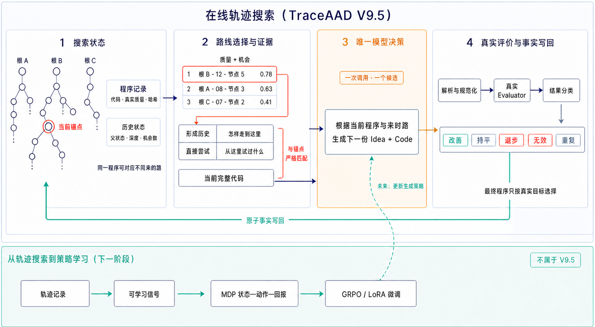
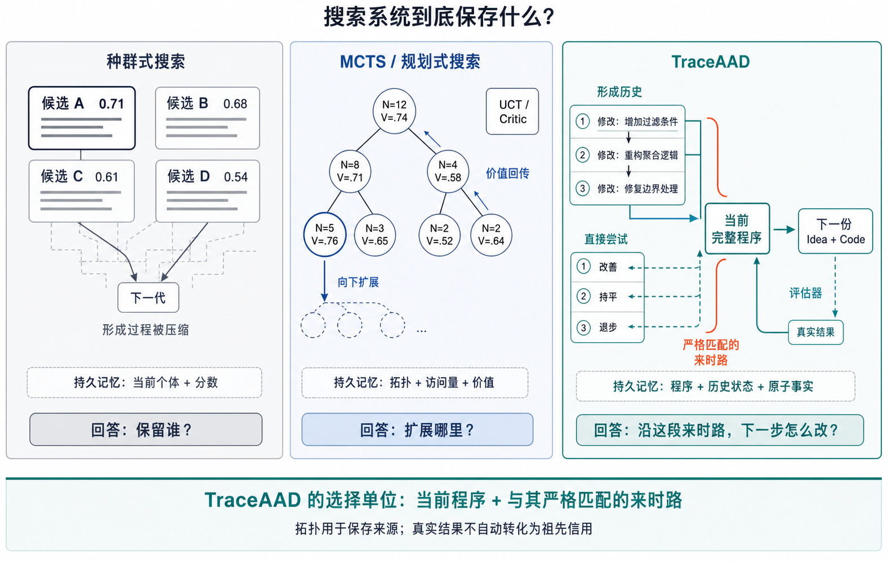
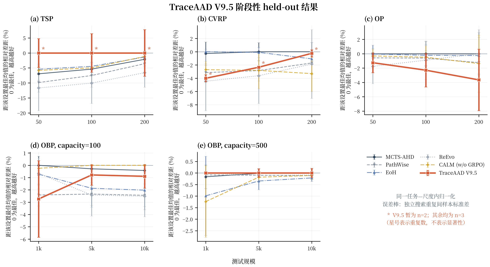

# TraceAAD：面向自动算法设计的基于轨迹搜索研究

> 本报告面向组会汇报，方法描述以 [TraceAAD V9.5 完整机制设计](../methods/TraceAAD-v9.5完整机制设计.md) 为准。实验结论记录于 2026-08-12：OP 与 Online Bin Packing 已完成三次独立重复，TSP 与 CVRP 各缺一次替代重复，相关均值与排名均属于阶段性结果。
> 后续：TSP/CVRP 替代重复因基础设施失败最终未完成，V9.5 结果未进入正式结果页；此后方法演化为 V9.6 与 V9.7，当前判断见[研究认识](研究认识.md)。

## 1. 引言

自动算法设计（Automated Algorithm Design, AAD）旨在把依赖专家经验的算法构思、程序实现、运行验证和迭代修改组织为可执行的自动闭环。AAD 生成的是可在一类问题实例上复用的程序，例如构造规则、局部搜索评价函数或元启发式组件，而非某个实例的一次性解。给定搜索集 $S_{\mathrm{train}}$、程序空间 $\mathcal P$ 和真实评价器 $\operatorname{Eval}$，其基本目标为

$$
p^*=\arg\max_{p\in\mathcal P}q(p;S_{\mathrm{train}}),
$$

其中 $q$ 统一表示“越大越好”的有向质量。最终泛化能力需要在与搜索过程隔离的 $S_{\mathrm{test}}$ 上重新评价，搜索集最好值本身不能替代 held-out 结果。

大语言模型能够联合读取任务、程序和自然语言反馈，并生成同时包含算法思想与可执行实现的候选。FunSearch、EoH 和 ReEvo 表明，LLM 与自动评价器结合后可以持续生成并筛选算法程序 [1–3]。LLM 决定候选分布；在有限预算下，最终质量还取决于搜索系统如何保存历史、选择起点并利用真实反馈。

### 1.1 问题特性与核心困难

LLM 驱动的 AAD 具有四个相互耦合的特性。

第一，搜索空间是开放的离散程序空间。候选之间的差异同时涉及算法思想、控制流、参数和实现细节，文本距离或代码长度无法稳定代表行为距离。LLM 的预训练先验使搜索不再是均匀随机枚举，也使“变异算子”随父代、提示、历史和反馈共同变化 [18,19]。

第二，反馈昂贵且稀疏。一次候选需要经历解析、执行和实例评价，真正刷新全局最好值的事件只占少数。无效、重复、平台和退步都消耗预算，但又包含不同的信息：无效程序反映执行约束，重复反映有效搜索空间收缩，退步程序则可能是尚未完成的中间状态。

第三，算法形成过程通常非单调。重要思想可能需要多轮引入、调试和重构，一次局部退步不足以判定路线无价值。只保留当前最好程序会丢失它怎样形成、此前尝试过什么以及哪些修改尚未完成；把一次成功无条件回传给整条祖先链，又会把事后相关误写成前瞻信用。

第四，搜索与泛化存在分离。搜索机制直接优化 $S_{\mathrm{train}}$ 上的评价，最终研究结论却关心 $S_{\mathrm{test}}$ 上的稳定表现。更高的搜索最好值、更多的新颖候选或更活跃的探索均属于过程证据，只有完成的独立重复与 held-out 评价才能支持最终性能判断。

这些特性引出三个核心问题：如何把历史组织成与当前程序匹配且模型可用的生成上下文；如何在高质量路线与尚未充分尝试的路线之间分配有限评价预算；如何从联合系统结果中识别历史表示、生成协议和预算分配各自的贡献。

### 1.2 现有范式的局限及其后果

主流种群方法以当前候选集合为主要记忆，通过精英保留、交叉、变异和多样性维护持续演化。该范式简单、并行友好，也能抵抗单个候选失败；其信息压缩单位主要是“当前个体及其分数”。当父代进入下一轮时，导致它形成的连续试错往往被省略或压缩成自由文本反思。由此产生的直接后果是：模型反复从终点程序重新猜测改进方向，曾经失败的实现、尚未完成的思想和已验证的局部修正难以与当前代码保持严格对应。

树搜索与规划方法进一步保存派生结构，并用访问次数、价值回传、critic 或世界模型决定扩展位置。它们把平坦种群提升为“路线选择”，但传统 MCTS 语义在 LLM 程序搜索中面临新的偏差：同一节点随着历史窗口更新而诱导不同生成分布，叶子回报也可能来自多处耦合修改。因此，节点值和祖先回传更适合作为启发式调度量，不能自然解释为稳定、无偏的动作价值。若价值代理与未来突破不一致，系统会长期投入已经成熟但不再生产突破的路线，或因短期退步过早放弃需要多步形成的算法。

训练型方法开始把搜索反馈写入模型参数，使历史利用从提示上下文扩展到生成策略本身。然而，若搜索阶段没有保存真实父代、历史窗口、实际代码、失败和成本，后续训练只能模仿幸存程序，难以建立可审计的信用。参数更新还会改变数据分布，使“搜索器更好”和“模型更强”进一步耦合。

### 1.3 我们的观点：算法改进的“来时路”是决策信息

本研究从算法改进过程本身出发：一个程序的意义不仅由当前代码和分数决定，也由它从什么方案出发、引入过什么思想、得到什么结果以及经历过哪些修正共同决定。我们将这段可验证历史称为算法改进的“来时路”。

TraceAAD 的核心主张是：**与当前程序真实匹配的改进轨迹，应成为下一次 `Idea + Code` 生成与有限预算路线选择的主要信息来源。** 树结构、证据窗口、机会分配和失败记录用于支撑这一主张。模型层每一步只完成一个决策：根据当前程序及其来时路生成新的 `Idea + Code`。继续、修复、回退或换方向可以体现在生成内容中，无需预定义为一组强制动作。

这一观点把研究问题拆为两个可独立检验的假设：在当前代码固定时，匹配历史能否改善下一步生成；在生成接口固定时，轨迹相关的预算分配能否提高共同预算结束时的最好程序。联合版本变强只能说明完整系统有竞争力，不能自动证明任一假设。

## 2. 相关工作

本文从三个底层维度组织相关工作：系统把什么作为持久记忆，如何把评价结果分配给历史状态，以及模型在下一次生成时实际看见什么。该视角能够越过“进化”“树”或“智能体”等方法名称，直接比较其搜索语义。

### 2.1 种群搜索：以当前候选为主要记忆

FunSearch 使用岛屿化程序库、优秀程序提示和自动 evaluator 建立大规模程序搜索闭环 [1]；EoH 将自然语言思想与代码共同作为个体，并用探索、开发等生成操作维护种群 [2]；ReEvo 通过候选对比形成短期反思，再递归汇入长期反思，为后续交叉与变异提供“verbal gradient” [3]。AlphaEvolve 和 ShinkaEvolve 将这一范式扩展到开放式程序进化，加入多模型编码、程序数据库、历史 patch 和经验摘要 [4,5]。

这一路线的主要贡献是把 LLM 的语义生成能力嵌入可验证选择，使搜索能够积累高质量可执行程序。其共同风险也来自同一结构：种群天然擅长回答“哪些个体应保留”，却不天然回答“这个个体如何形成、下一步应利用哪些历史”。反思与摘要可以补充历史，但摘要常把局部结果提升为一般规律，且难以逐条回到真实父子代码。多样性维护也需要区分代码差异、初始谱系差异与算法行为差异；保存多个名称不同的候选不等于覆盖多个有效算法方向。

### 2.2 MCTS、规划与预算分配：从个体选择走向路线选择

MCTS-AHD 将候选启发式作为树节点，通过渐进扩展、UCT 和价值回传分配预算 [6]；Planning of Heuristics 把启发式改进写成规划过程，结合自反思与 MCTS 搜索改进路线 [7]；PathWise 在程序关系图上引入 policy、world model 和 critic，使系统能够显式推理下一步修改及其潜在价值 [8]。后续 Clade-AHD 又把选择单位从单节点提升到进化枝，通过聚合后代结果形成分支级信念 [20]。

这些工作明确指出了 AAD 的预算分配本质：有限 evaluator 预算必须决定在哪条路线继续生成。树结构本身只保存拓扑，真正起作用的是选择量与生成上下文。LLM 候选并非固定动作转移，同一代码在不同历史提示下会产生不同后继；一次叶子改进也可能由多处代码共同造成。因而，路径价值、节点价值、当前质量和历史最好值需要分开定义。TraceAAD 吸收路线选择这一视角，同时避免在缺少重复样本时把启发式回传写成精确 action value。

### 2.3 轨迹、记忆与结构化历史：保存什么比保存多少更重要

PhyloEvolve 用谱系树保存代码的完整演化关系 [9]；DeltaEvolve 以语义增量及其结果构造动量式上下文，减少重复传入全量程序 [10]；MEMOIR 将 branch-local 调试历史与跨分支全局记忆分离 [11]；DGA²D 在有向算子图上比较不同信用粒度，并报告 first-order credit 优于更高阶路径信用的受控结果 [12]。这些工作表明，历史正在从事后日志转化为搜索状态的一部分。

轨迹方法的核心挑战由“是否保存历史”转向“历史是否与当前决策匹配”。完整全路径具有高事实覆盖，却会快速占满上下文并产生极稀疏的精确状态；自由文本总结更紧凑，却可能丢失失败条件、分数方向和实际修改。TraceAAD 采用锚点化局部证据：当前完整程序保持不变，形成历史与从该精确状态出发的直接尝试作为两类事实进入窗口。该表示强调可追溯性，并将跨分支知识、learned critic 和长程信用留作后续独立变量。

### 2.4 训练型 AAD：把搜索经验写入参数

训练型工作大致形成三条路线。第一类把搜索产物转成离线训练数据。Fine-tuning LLM for AAD 通过兼顾质量与多样性的偏好样本训练候选生成模型，并在相同 EoH/FunSearch 搜索器下比较 base 与 fine-tuned 模型 [15]。第二类让搜索和参数在线共同更新。CALM 用父代相对奖励、可行性层级和 GRPO 使启发式种群与本地 LLM 协同进化 [13]；EvoTune 持续从进化数据库构造 DPO 或 ReST-EM 信号，改变后续程序采样分布 [14]。第三类训练更长程的设计策略：AHD-Agent 将生成、评价、反思和继续搜索建模为 agentic RL 行为 [16]；Hero 则用 GRPO 把在线搜索经验摊销为一次生成、可跨 held-out 实例复用的完整 solver [17]。

这些工作说明算法设计反馈可以转化为参数学习信号，也提出了更高的证据要求。只保留赢家会产生幸存者偏差；只使用最终分数，会把父代质量和多步搜索的贡献归入单次 response；训练策略与搜索器同时变化，又会使最终收益难以归因。TraceAAD 因此先建立可审计的轨迹搜索与稳定数据接口，再构造学习信号并进行参数更新。在线搜索针对当前 evaluator 验证和纠错，参数学习则提高模型生成有效修改的先验概率。

## 3. TraceAAD：基于轨迹的搜索方法

### 3.1 总体框架

**图 1　TraceAAD 的分层搜索闭环与研究路线。** 上半部分是 V9.5 已实现的在线轨迹搜索：搜索森林同时保存程序记录与历史状态，选择器在质量和未充分开发机会之间分配预算，证据窗口与当前完整代码共同条件化唯一一次模型决策，评价结果再作为原子事实写回。下半部分明确隔离尚未实现的学习路线；虚线仅表示未来用轨迹数据更新生成策略，不属于 V9.5 的运行机制。

设时刻 $t$ 的搜索森林为 $F_t$。一次循环包含六个严格有序的步骤：选择锚点、抽取局部历史、生成候选、规范化程序、真实评价、写回事实。轨迹既是模型的生成证据，也是搜索系统组织候选关系的状态；最终输出仍由真实 objective 在唯一可执行程序中选择。

### 3.2 第一层：可执行程序与历史状态分离

V9.5 区分 `ProgramArtifact` 与 `AnchorState`。`ProgramArtifact` 由 evaluator 实际执行的代码唯一确定，保存代码哈希、真实 fitness 与评价契约；`AnchorState` 表示该程序在一条具体形成历史中的状态，保存父状态、深度、直接尝试和机会计数 $n(a)$。同一程序可能由不同路径到达，因此可以对应多个历史状态。

这一分离表达了一个关键事实：模型的真实条件是“代码 + 历史”。代码相同但来时路不同，下一次生成分布仍可能不同。搜索森林保存多个独立根、全部有效状态及其派生关系；图结构表示事实 provenance，不把同一 clade 自动解释为同一算法思想或语义区域。

### 3.3 第二层：锚点化局部证据

对锚点 $a$，V9.5 的局部证据定义为

$$
E_t(a)=E_{\mathrm{formation}}(a)+E_{\mathrm{direct}}(a).
$$

`Recent Formation` 沿唯一 parent 链提取最近的有效形成修正，说明当前程序经历了哪些 `Idea—实际改动—结果`。`Exact-State Direct Attempts` 只收集从该 `AnchorState` 实际发起且已经完成的尝试，包括改善、持平、退步、无效、无变化、重复和祖先返回。来自其他历史状态的尝试不会混入。

窗口最多保留 8 条事件。直接尝试先按改善、持平、退步和无效覆盖，再按最近性补足；剩余位置由最近形成历史填充。去重只压缩进入 prompt 的等价证据，原始尝试、预算和失败事实仍完整保留。每条有效事件向模型呈现简洁 `Idea + 实际改动 + 评价结果`；实际修改由系统比较父子 evaluator input 确定，模型声明的 Idea 只作为语义标签，不能替代代码事实或因果解释。

### 3.4 第三层：历史条件化的单步生成

每次生成的条件为

$$
(\text{Task},\ \text{Current Code},\ E_t(a)).
$$

模型在一次调用中联合输出一份 optional `Idea` 与 mandatory full `Code`。只要完整代码可提取并执行，Idea 缺失不会使候选失效。V9.5 不预定义 ideate、refine、synthesize 或 transfer 的 operator portfolio，也不要求模型输出决策表单、因果解释或 patch。每完成一个候选即重新进行全局锚点选择，从而把“历史长度”和“决策粒度”分开。

该层对应的待验证问题是：在起点固定时，局部历史能否提高下一次生成的有效率、父代改进率或最终突破概率。该问题需要固定锚点的配对实验，完整搜索得分不能替代这一识别。

### 3.5 第四层：质量引导的机会分配

V9.5 对所有有效状态使用统一分数

$$
S_t(a)=q(a)+\frac{s}{\sqrt{n_t(a)+1}},
$$

其中 $q(a)$ 是当前程序的真实有向质量，$n_t(a)$ 是从该历史状态已经获得的完整候选机会数，$s$ 是初始化 bootstrap 中有效一步绝对变化 $|\Delta q|$ 的中位数，并在正式搜索中保持固定。每轮选择 $S_t(a)$ 最大的状态；完全同分时优先机会更少、创建更早的状态。

该分数表达“当前质量 + 尚未充分开发程度”。它是确定性预算优先级，不被解释为 expected return、统计置信上界或轨迹价值。历史内容通过两条路径产生影响：它改变下一次生成所见的 $E_t(a)$；一次完成响应使 $n(a)$ 增加并降低机会项。V9.5 不使用趋势、动量、平均增益、祖先回传或 learned critic，从而保留一个可检验的最小 allocation 基线。

### 3.6 第五层：评价、去重与事实生命周期

候选只有经过解析、任务规范化和真实 evaluator 后才能形成有效程序。程序身份、actual diff 和 fitness cache 均基于 evaluator 实际执行的同一份代码。无效响应消耗一次真实候选机会并形成失败证据；传输失败没有完成模型响应，只进入基础设施日志。无变化、重复和返回祖先状态不会创建新节点，独立分支汇聚到同一程序时仍可保留不同历史状态。

所有有效状态——包括由退步产生的状态——继续具有被选择资格。V9.5 不设置 active/archive population、Top-K 剪枝或连续无改善早停。最终答案只按真实 objective 在唯一程序中选择，allocation score 和历史身份不参与最终排序。

### 3.7 与代表性范式的机制差异

**图 2　三类搜索范式的表征差异。** 种群式搜索主要回答“保留哪些当前个体”，MCTS/规划式搜索主要回答“扩展哪个节点或分支”，TraceAAD 进一步把选择单位定义为“当前完整程序及与其严格匹配的来时路”。树拓扑在 TraceAAD 中保存来源，真实结果不会因祖先关系自动转化为祖先信用。

| 维度 | 种群式方法 | MCTS/规划式方法 | TraceAAD V9.5 |
| --- | --- | --- | --- |
| 持久记忆单位 | 当前个体、精英种群、反思摘要 | 节点、动作、访问量与回传值 | 可执行程序、历史状态、原子尝试 |
| 历史进入生成 | 多为父代集合、精英示例或全局摘要 | 路径、规划动作、critic/world model 输出 | 当前完整代码 + 与锚点匹配的形成历史和直接尝试 |
| 评价信用 | 个体存活与种群更新 | 叶子回报向节点或分支传播 | 结果保留为事实；V9.5 不做祖先信用回传 |
| 预算分配 | 精英选择、锦标赛、Pareto 或岛屿迁移 | UCT、规划价值、分支信念 | 全状态上的 $q+s/\sqrt{n+1}$ |
| 模型层决策 | 多类变异/交叉操作 | 规划动作后生成或模拟 | 每步只生成一份新的 `Idea + Code` |
| 当前参数学习 | 通常无 | 依方法而定 | 无；轨迹先用于搜索和数据构建 |

TraceAAD 通过职责分离形成其方法特征：轨迹提供与当前程序匹配的生成证据，搜索器决定哪段历史继续获得机会，真实 evaluator 决定程序质量。这一设计也给出明确的可证伪边界：History 与 Allocation 的净收益必须分别通过固定接口消融加以识别。

## 4. 当前实验情况：V9.5

### 4.1 协议与完整性

正式批次为 `20260811_171029`，统一模型为 Qwen3.6-27B，覆盖 TSP Construct、CVRP-ACO、OP-ACO 和 Online Bin Packing，每个任务计划三次独立搜索，并对每次搜索所得最好程序进行 held-out 评价。TSP/CVRP/OP 测试规模为 50、100、200；OBP 测试为 1k、5k、10k 物品与 capacity 100、500 的组合。

当前 12 个计划运行中有 10 个到达预算终点。TSP repeat 1 在 623 个响应处、CVRP repeat 2 在 580 个响应处因 tokenizer 暂时不可用后的错误上下文判定终止；两次替代运行尚未形成可纳入结果。因此，TSP/CVRP 的 V9.5 数值来自两次完成重复，OP/OBP 来自三次完成重复。以下结论均保留这一完整性边界。

### 4.2 Held-out 主结果：与代表性 AAD 方法比较

**图 3　TraceAAD V9.5 与五种代表性 AAD 方法的 held-out 主结果。** 比较对象为 MCTS-AHD、PathWise、EoH、ReEvo 和 CALM；所有方法使用 Qwen3.6-27B、统一 1000 次搜索预算及相同任务测试协议。为在一张图中保留不同任务的原生方向和尺度，每个点表示其均值距该“任务—规模”六方法最佳均值的相对差距，0 为最佳、越高越好；误差棒为独立搜索重复间样本标准差的同尺度换算，并非置信区间。星号只标记 V9.5 的 TSP/CVRP 暂为两次完成重复，不表示显著性；其余点均为三次重复。绘图脚本与数据入口见 `assets/traceaad-group-report/plot_v95_main_comparison.py`。

| 任务 | 设置 | V9.5 原生指标 mean ± SD | 最强外部对照 mean ± SD | V9.5 相对优势（+）或劣势（−） | 六方法中的均值位置 |
| --- | --- | ---: | ---: | ---: | --- |
| TSP ↓ | 50 / 100 / 200 | 5.907 ± 0.284 / 8.273 ± 0.532 / 11.980 ± 0.931 | 6.228 ± 0.103 (EoH) / 8.642 ± 0.119 (EoH) / 12.120 ± 0.115 (CALM) | +5.15% / +4.28% / +1.15% | 1 / 1 / 1，$n=2$ |
| CVRP ↓ | 50 / 100 / 200 | 9.432 ± 0.049 / 15.828 ± 0.006 / 27.966 ± 0.151 | 8.962 ± 0.180 / 15.114 ± 0.317 / 27.163 ± 0.462 (均为 MCTS-AHD) | −5.25% / −4.72% / −2.96% | 5 / 3 / 2，$n=2$ |
| OP ↑ | 50 / 100 / 200 | 14.936 ± 0.211 / 29.811 ± 0.711 / 52.891 ± 2.359 | 15.126 ± 0.100 / 30.512 ± 0.527 / 54.895 ± 1.613 (均为 MCTS-AHD；200 与 ReEvo 均值并列) | −1.25% / −2.30% / −3.65% | 5 / 6 / 6 |
| OBP ↓ | 1k / 5k / 10k，$C=100$ | 425.4 ± 12.9 / 2036.7 ± 16.9 / 4062.7 ± 38.5 | 414.1 ± 3.1 (MCTS-AHD) / 2020.8 ± 1.0 (CALM) / 4026.7 ± 2.8 (CALM) | −2.74% / −0.79% / −0.89% | 6 / 3 / 3 |
| OBP ↓ | 1k / 5k / 10k，$C=500$ | 80.800 ± 0.000 / 402.667 ± 0.764 / 804.867 ± 1.617 | 80.800 ± 0.000 (ReEvo) / 402.733 ± 0.643 / 804.867 ± 1.137 (MCTS-AHD) | 0.00% / +0.02% / <+0.01% | 并列最佳 / 1 / 1 |

主结果呈现清晰的**任务依赖模式**。V9.5 在 TSP 三个规模上取得图中六方法的最佳均值，在 OP 三个规模上均落后于最强外部对照；CVRP 的差距随测试规模增大而收窄，OBP 的表现则随 capacity 改变。现有结果说明 TraceAAD V9.5 已形成有竞争力的可运行系统，但不足以支持跨任务的普遍优势。TSP/CVRP 的第三次替代重复完成前，相关领先、排名和方差仍是阶段性描述。

### 4.3 搜索结果：不与 held-out 结论混用

已完成运行的 directed search best 为：TSP $-5.905\pm0.285$（$n=2$），CVRP $-8.982\pm0.106$（$n=2$），OP $14.616\pm0.068$（$n=3$），OBP $-728.50\pm2.95$（$n=3$）。这些值只描述固定搜索集上的终点程序，不能替代图 3 的独立测试结论，也不进入跨任务平均。

### 4.4 三个值得继续研究的过程发现

**发现一：机会项决定干预强度，最终质量与干预强度不呈单调关系。** TSP/CVRP 长期处于 active optimism，机会项在约 85%–95% 的选择中改变了纯质量 argmax；OP 大体接近 greedy，改变率约为 2%–14%；OBP 因初始化尺度 $s=0$，自然退化为 pure-$q$ 加确定性 tie-break。三种运行形态持续到预算终点。Active optimism 在 TSP 对应强结果，在 CVRP 未形成领先；near-greedy 的 OP 也整体偏弱。现有证据确认 Allocation 改变了选择行为，尚不能确认它相对 pure-$q$ 提高了最终质量。

**发现二：优秀算法的形成轨迹可以高度非单调，而且这种结构具有任务差异。** 代表性完成运行中，TSP repeat 3 的最终最好 lineage 包含 47 次改善、19 次持平和 43 次退步；CVRP repeat 3 包含 150 次改善、9 次持平和 135 次退步；OP repeat 3 则由 15 次改善和 15 次持平构成，没有退步。该观察支持让真实可执行的退步状态继续参与搜索，因为实际成功路径可能经过它们；它不支持给退步节点预设正信用，事后位于成功谱系也不等于当时具有可预测价值。

**发现三：模型实际读取的历史类型随任务和搜索形态而变。** TSP/CVRP 的证据窗口长期由形成历史主导，最终链路可达 100–300 层；OP 的强运行主要反复访问成熟锚点，窗口更偏向 exact-state direct attempts。这一差异提出一个待验证假设：需要连续结构积累的任务可能更依赖“怎样走到这里”，围绕成熟启发式局部打磨的任务可能更依赖“从这里已经试过什么”。当前证据只刻画了相关结构，尚不能说明任一历史类型改善了生成。

综合判断是：Search Forest、原子事实生命周期与候选管道已经稳定运行；Evidence 已进入真实 prompt，但相对 current-code-only 的生成收益尚未识别；Allocation 显著改变了搜索行为，但相对 pure-$q$ 的最终净收益尚未识别；最终质量仍取决于生成器能否把获得的机会转化为有效修改和突破。完整工件审计与证据边界见 [TraceAAD V9.5 终局复盘](../analysis/TraceAAD-V9.5终局复盘.md)。

## 5. 下一步计划

### 5.1 第一步：继续改进 TraceAAD 机制

近期目标是把联合系统拆成可独立验证的最小问题。首先完成 TSP/CVRP 缺失重复，使 V9.5 的四任务三重复 held-out 结果闭合。随后在固定真实锚点上进行低成本配对生成实验，依次比较 `Current Code Only`、简洁 `Idea + outcome` 历史和紧凑实际修改证据，并交叉检查 generic 与 `Refine/Explore` 极简生成意图。该阶段回答“模型真正能使用哪类历史”，不以完整搜索曲线替代固定条件比较。

在形成达到或接近 V9 的稳定生成接口后，固定 History 与 Generation，比较 pure $q(a)$、V9 选择方式与 $q(a)+s/\sqrt{n(a)+1}$。评价以统一 evaluator budget 下的 best-at-budget、三次重复和 held-out 结果为主，同时报告机会分布、谱系集中和有效候选率。只有当现有最小机制被识别后，才考虑 credit、critic、operator 调度或跨分支记忆。

### 5.2 第二步：构建可学习信号

轨迹数据将被整理为一个可审计的马尔可夫决策近似。状态 $x_t$ 包含任务契约、当前可执行程序、规范局部历史窗口和预算状态；模型动作 $u_t$ 仍是一份新的 `Idea + Code`；环境转移由解析、执行和 evaluator 决定；下一状态写入真实父子关系、实际修改、有效性和分数。由于历史窗口会随事实更新，报告中将其称为“可操作的有限状态表示”，不预设它满足严格充分的 Markov 性。

学习信号按层构建并保留原始分量：可解析与可执行性、相对父代的 $\Delta q$、是否刷新全局 best、固定窗口内的延迟 best-at-budget 增量，以及 LLM/evaluator 成本。$S_{\mathrm{test}}$ 只用于最终泛化评估，不进入 reward。失败、重复、持平和退步样本全部保留，避免只学习幸存程序；数据按任务和程序族切分，防止近重复代码跨训练/测试泄漏。

该阶段先验证信号是否具有预测和排序能力，再决定如何组合为 reward 或 advantage。重点检查：即时改善是否预测后续突破，多步回报是否只是事后谱系相关，奖励是否偏好强父代复制，以及不同任务下信号关系是否稳定。由此形成可用于偏好学习和策略优化的轨迹数据集。

### 5.3 第三步：基于 MDP 的强化学习微调

强化学习阶段拟使用 Unsloth 提供的高效 LoRA/QLoRA 训练路径，并通过 TRL 的 GRPO 接口实现基于可验证代码评价的参数更新。Unsloth 在该计划中的职责是降低模型微调的显存和吞吐成本；MDP 状态、动作、环境、奖励及安全执行协议仍由 TraceAAD 定义。在正式训练前需对 Qwen3.6-27B 的具体架构兼容性、长上下文、代码生成长度和分布式需求做最小冒烟。

训练采用由短到长的课程。第一阶段固定搜索器，只对同一状态采样多份 `Idea + Code`，以可执行性和 $S_{\mathrm{train}}$ 真实评价构造 group-relative、可验证 reward，先提高单步有效修改概率；第二阶段加入截断多步 return，学习历史条件下的延迟收益；第三阶段再让微调策略进入完整 TraceAAD 闭环，检验其是否在相同搜索与 evaluator 预算下提升最终 best 和 held-out 质量。

实验至少保留 base、监督/偏好微调和 RL 三组模型，并固定 prompt、search controller、采样量与 evaluator 协议。报告分别给出训练成本、首次生成有效率、严格父代改进率、best-at-budget、三次重复与 held-out 泛化。这样可以判断参数学习是否提高了生成先验，也能检验在线轨迹搜索在微调后是否仍提供额外价值。

## 参考文献

[1] B. Romera-Paredes et al. [Mathematical discoveries from program search with large language models](https://doi.org/10.1038/s41586-023-06924-6). *Nature*, 625:468–475, 2024.

[2] F. Liu et al. [Evolution of Heuristics: Towards Efficient Automatic Algorithm Design Using Large Language Model](https://arxiv.org/abs/2401.02051). *ICML*, 2024.

[3] H. Ye et al. [ReEvo: Large Language Models as Hyper-Heuristics with Reflective Evolution](https://arxiv.org/abs/2402.01145). *NeurIPS*, 2024.

[4] A. Novikov et al. [AlphaEvolve: A Coding Agent for Scientific and Algorithmic Discovery](https://arxiv.org/abs/2506.13131). arXiv, 2025.

[5] R. T. Lange, Y. Imajuku, and E. Cetin. [ShinkaEvolve: Open-Ended and Sample-Efficient Program Evolution](https://arxiv.org/abs/2509.19349). arXiv, 2025.

[6] Z. Zheng, Z. Xie, Z. Wang, and B. Hooi. [Monte Carlo Tree Search for Comprehensive Exploration in LLM-Based Automatic Heuristic Design](https://arxiv.org/abs/2501.08603). *ICML*, 2025.

[7] H. Wang, X. Zhang, and C. Mu. [Planning of Heuristics: Strategic Planning on Large Language Models with Monte Carlo Tree Search for Automating Heuristic Optimization](https://arxiv.org/abs/2502.11422). arXiv, 2025.

[8] O. Gungordu, S. Xiong, and F. Fekri. [PathWise: Planning through World Model for Automated Heuristic Design via Self-Evolving LLMs](https://arxiv.org/abs/2601.20539). arXiv, 2026.

[9] L. Zhao et al. [Large Language Model-Powered Evolutionary Code Optimization on a Phylogenetic Tree](https://arxiv.org/abs/2601.14523). arXiv, 2026.

[10] J. Jiang, T. Ding, and Z. Zhu. [DeltaEvolve: Accelerating Scientific Discovery through Momentum-Driven Evolution](https://arxiv.org/abs/2602.02919). arXiv, 2026.

[11] [MEMOIR: Memory-Guided Tree Search with Cross-Branch Knowledge Transfer](https://arxiv.org/abs/2605.17539). arXiv, 2026.

[12] J. Zhao, Z. Chen, S. Mao, W. Yang, Y. Bai, and L. Lai. [DGA²D: Directed Graph-Guided Automated Algorithm Design with Large Language Models](https://arxiv.org/abs/2608.00700). arXiv, 2026.

[13] Z. Huang, W. Wu, K. Wu, J. Wang, and W.-B. Lee. [CALM: Co-evolution of Algorithms and Language Model for Automatic Heuristic Design](https://arxiv.org/abs/2505.12285). *NeurIPS*, 2025.

[14] A. Surina et al. [Algorithm Discovery With LLMs: Evolutionary Search Meets Reinforcement Learning](https://arxiv.org/abs/2504.05108). arXiv, 2025.

[15] F. Liu, R. Zhang, X. Lin, Z. Lu, and Q. Zhang. *Fine-tuning Large Language Model for Automated Algorithm Design*. ICLR 2026 submission manuscript, 2025.

[16] H. Lv, N. Lu, Z. Zhou, and S. Liu. [AHD-Agent: Agentic Reinforcement Learning for Automatic Heuristic Design](https://arxiv.org/abs/2605.08756). arXiv, 2026.

[17] S. Massoudi, G. Apaza, M. Habibi, and M. Fuge. [Beyond Inference-Time Search: Reinforcement Learning Synthesizes Reusable Solvers](https://arxiv.org/abs/2605.18374). arXiv, 2026.

[18] X. Zhang, X. Chen, F. Portet, and M. Peyrard. [What Makes an LLM a Good Optimizer? A Trajectory Analysis](https://arxiv.org/abs/2604.19440). arXiv, 2026.

[19] J. Lehman et al. [Evolution through Large Models](https://arxiv.org/abs/2206.08896). arXiv, 2022.

[20] K. Lai, Y. Lai, and H.-L. Liu. [Beyond the Node: Clade-level Selection for Efficient MCTS in Automatic Heuristic Design](https://arxiv.org/abs/2602.00549). arXiv, 2026.
