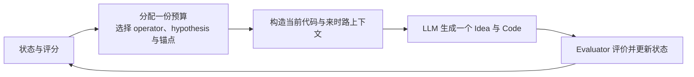

# TraceAAD V9.8：逐步轨迹分配与假设引导生成

> 状态：机制重构稿，尚未实现、尚未产生正式结果。当前可运行方法仍是 [V9.7](TraceAAD-v9.7完整机制设计.md)。
> 设计依据：正统 V9.7 批次 `20260814_150927` 的[搜索几何诊断](../analysis/TraceAAD-V9.7搜索几何诊断.md)、[机制有效性分析](../analysis/TraceAAD-V9.7机制有效性与任务异质性.md)、固定锚点来时路实验、[BaSE 阅读笔记](../references/LLM自动算法设计方法阅读笔记/28-Compute-Allocation-BaSE.md)与[研究认识](../knowledge/研究认识.md)。
> 版本边界：V9.8 保留“一次选择、一次生成、一次评价、一次更新”的原子循环。此前设计中的 protected probe、ticket、measurement block、三通道固定循环和 `1+3+2+2` 不再属于在线方法。

## 1. 核心问题与设计收缩

自动算法设计在有限真实评价预算下反复修改已有程序。搜索空间可能由多个潜在算法簇构成：Refine 倾向于在已有设计内发展，Explore 更可能改变核心决策原则。新方向的第一份实现可能暂时退步；同时，并非每个退步状态都值得获得固定深度的继续开发。

V9.7 已经保持一个正确的底层循环：选定一个历史锚点，构造匹配的来时路上下文，由 LLM 生成一个子代，真实评价后更新搜索状态。它的问题集中在循环前端：root route 不是稳定算法方向，历史最好质量加共享一步尺度又会使低于前沿的路线和 Explore child 进入不可恢复区。

V9.8 不再用宏观 scheduler 修补早夭，而把方法压回四层：



对应的原子过程是：

$$
o_t\sim\pi_t(o\mid\mathcal H_t),\qquad
z_t,a_t=\operatorname{Select}(o_t,\mathcal H_t),
$$

$$
C_t=\operatorname{Context}(a_t,h_t,o_t),
$$

$$
x_{t+1}\sim P(\cdot\mid a_t,C_t,o_t),\qquad
q_{t+1}=\operatorname{Evaluate}(x_{t+1}).
$$

每次模型响应后立即回到第一层。在线状态中没有未来三步的预算承诺，也没有必须完成的 lane、queue 或 block。

TraceAAD 仍只研究两个核心对象：轨迹感知的计算分配 $\mu(a_t\mid\mathcal H_t)$ 决定下一份预算投给哪个状态，轨迹条件生成 $P(x_{t+1}\mid x_t,h_t,o_t)$ 决定选中以后下一程序如何分布。第一版在操作上先抽取 $o_t$，再计算条件于该 operator 的锚点分配；Hypothesis 只是连接两者的轨迹分段标签，不构成第三个科学对象。

## 2. V9.7 证据与 V9.8 的最小回答

| V9.7 问题 | 已有证据 | V9.8 最小回答 |
| --- | --- | --- |
| root route 只是共同来源 | 12 个最终最好程序有 9 个改变所在 root 的静态宏簇 | Explore 启动新的 hypothesis 标记；Refine 继承该标记 |
| 当前质量主导跨路线分配 | 96 条路线中有 64 条没有 bootstrap 后续段 | hypothesis 分数显式读取已投入预算与历史发展表现 |
| Explore 即时回撤被同一步尺度截断 | Explore child 出生即淘汰率为 36%–87% | 新 hypothesis 获得随 Refine 投入衰减的边界宽限，而非固定 probe |
| Explore 与 Refine 的生成角色混在“大改/小改”中 | Explore 更常切换静态宏簇；12 个终局程序全部由 Refine 生成 | 将两者明确为替代方向提议与当前方向发展 |

上一版草案中的概念按以下方式收缩：

| 旧概念 | 当前归宿 | 在线作用 |
| --- | --- | --- |
| Hypothesis | 状态表示 | 标记 Explore 开启的轨迹分段，聚合前沿、投入与发展事实 |
| Protected probe | 删除为 scheduler | 用衰减边界宽限表达观察不足；固定续段仅用于离线实验 |
| Continuation ticket / block | 删除为 scheduler | 单步 frontier gain 进入历史平均发展收益，每次重新评分 |
| Discovery / continuation / exploitation lane | 删除为固定通道 | Explore、历史发展与当前质量分别成为 operator 或分数组件 |
| Discovery source selection | 并入逐步分配 | Explore 决策时按 $S_H^E$ 选择来源 hypothesis |

以下内容仍是待验证设计假设：

- Explore 定义的边界是否比 root provenance 更接近可利用的发展方向；
- 一次跨边界退步应在多大程度上被暂时中和，以及宽限应怎样随新证据衰减；
- 历史平均发展收益是否能预测下一份 Refine 计算的价值；
- 固定 `0.7/0.3` operator prior 是否适合四个任务；
- parent path 对 Refine 与 Explore 是否具有相同作用。

V9.8 第一版不在线估计真实算法 family，不学习长期边际计算价值，也不向 Explore 提供全局 hypothesis bank。静态宏簇、行为签名和强制续段只用于离线识别这些假设。

## 3. 在线状态表示

### 3.1 程序与锚点

程序 $x$ 是评价器执行过的一份全局唯一代码。记原始 fitness 为 $f(x)$，任务方向为 $d\in\{+1,-1\}$；最大化任务取 $d=+1$，最小化任务取 $d=-1$：

$$
q(x)=d f(x).
$$

搜索内部统一为 $q$ 越大越好。

锚点 $a$ 是程序在一条具体形成路径中的位置：

$$
a=\langle x(a),p(a),e(a),z(a),n_R(a),n_E(a)\rangle.
$$

其中 $p(a)$ 是结构父锚点，$e(a)$ 是形成事件，$z(a)$ 是 hypothesis 标记，$n_R(a)$ 与 $n_E(a)$ 分别记录从该锚点发起的 Refine 和 Explore 响应数。同一代码沿不同历史到达时仍保留不同锚点；程序评价事实复用，形成历史与计数不混合。

### 3.2 Hypothesis 只是 Explore 开启的轨迹分段

Hypothesis $z$ 的严格含义是 **Explore-initiated trajectory segment**。每个初始化 root 创建一个 root hypothesis；之后：

$$
z(a')=
\begin{cases}
z(a), & o=R,\\
\operatorname{NewHypothesis}(z(a),a'), & o=E.
\end{cases}
$$

第二种情况只在 Explore 产生全局未见、有效且可执行的新程序时发生。无效、no-op、祖先返回、重复关系和全局代码重复都记录为尝试，但不创建新 hypothesis。

每个 hypothesis 只保存或派生：

- `hypothesis_id`、入口锚点 $a_0(z)$、父 hypothesis 和创建它的 Explore 事件；
- root provenance，用于离线追踪，不参与在线选择；
- 入口质量 $q_0(z)=q(a_0(z))$；
- 非 root hypothesis 的来源基线 $q_{\mathrm{base}}(z)=q(p(a_0(z)))$；
- 当前前沿 $q^*(z)=\max_{a\in z}q(a)$；
- 从该 hypothesis 发起的 operator 响应计数 $N_R(z)$ 与 $N_E(z)$；
- Refine 带来的逐步前沿增益及其累计统计。

Hypothesis 没有 `probing / eligible / dormant` 状态，没有 probe 配额、ticket 或独立生命周期。它只让 allocation 知道某个状态属于哪一段发展历史，以及该段已经获得过多少计算。

### 3.3 原子发展观测

对 hypothesis $z$ 的第 $j$ 次 Refine 响应，记响应前后的 hypothesis 前沿为 $q^*_{j-1}(z)$ 与 $q^*_j(z)$。单步已实现前沿增益为：

$$
r_j(z)=q^*_j(z)-q^*_{j-1}(z)\ge 0.
$$

Invalid、no-op、重复和没有抬高前沿的有效结果都令 $r_j(z)=0$，并计入 Refine 响应数。由此得到历史平均发展收益：

$$
m_R(z)=\frac{q^*(z)-q_0(z)}{\max(1,N_R(z))}.
$$

该量只描述已经实现的单位响应收益。它可能偏爱处于容易进步区间的 hypothesis，不是未来边际价值或长期 ceiling 的无偏估计。

## 4. 初始化与任务内尺度

搜索生成 $K_0=8$ 个有效且代码互异的根程序，每个根创建一个 root hypothesis。代码互异只是最低实现条件，不代表八个真实算法簇。

与 V9.7 一致，每个 root 恰好接受一次 Refine bootstrap。该步骤用于留下第一条形成事件并估计任务内一步变化尺度，不扩展为三步初始化 probe。对成功形成新 child 的 bootstrap Refine 边收集：

$$
D_{\mathrm{init}}=\{|q(x')-q(x)|\}.
$$

固定尺度为：

$$
s_0=
\begin{cases}
\operatorname{median}(D_{\mathrm{init}}), & D_{\mathrm{init}}\ne\varnothing,\\
0, & D_{\mathrm{init}}=\varnothing.
\end{cases}
$$

$s_0$ 只给“观察不足”提供一个任务内的一步尺度。它不再承担 Explore 跨边界回撤的容忍尺度，也不被解释为置信区间或 trajectory potential。

## 5. 每一步重新计算的预算分配

### 5.1 分配的因子化

第一版把联合分配写成：

$$
\mu(a,o\mid\mathcal H_t)=\pi(o)\,\mu(z\mid o,\mathcal H_t)\,\mu(a\mid z,o,\mathcal H_t).
$$

为避免同时引入 operator 学习，V9.8 暂时沿用 V9.7 的固定 prior：

$$
\pi(R)=0.7,\qquad \pi(E)=0.3.
$$

每个原子决策先按预注册 seed schedule 抽取 operator，再按该 operator 的当前分数选择 hypothesis 与锚点。该 prior 以模型响应为单位，不保证真实评价口径仍为 `0.7/0.3`。固定 prior 是 allocation 的实现选择，不是已验证最优比例；它使第一版能够把“选谁”和“怎样生成”与 operator 频率分开检查。

### 5.2 三个逐步状态信号

对 operator $o$，hypothesis 的观察不足项为：

$$
u_o(z)=\frac{s_0}{\sqrt{N_o(z)+1}}.
$$

它只表达“该 hypothesis 在这一 operator 下获得的响应较少”。它不是未来收益的估计，且在 $s_0=0$ 时不产生作用。

对非 root hypothesis，Refine 的跨边界宽限为：

$$
c_R(z)=\frac{[q_{\mathrm{base}}(z)-q^*(z)]_+}{\sqrt{N_R(z)+1}}.
$$

其中 $[v]_+=\max(v,0)$。root hypothesis 取 $c_R(z)=0$。该项最多把当前 hypothesis 前沿暂时抬回 Explore 来源基线，不会使其因退步幅度更大而超过来源基线；每获得一次 Refine 响应便重新计算并衰减。

第三个信号是上一节定义的 $m_R(z)$。三者分别对应已投入预算、跨边界实现回撤和历史已实现发展，不合并成“已证明的潜力”。

### 5.3 Hypothesis 选择

Refine 与 Explore 使用不同的 hypothesis 分数：

$$
S_H^R(z)=q^*(z)+u_R(z)+c_R(z)+m_R(z),
$$

$$
S_H^E(z)=q^*(z)+u_E(z).
$$

Refine 分数同时考虑当前前沿、已投入 Refine 响应、Explore 边界回撤和历史单位发展收益。Explore source 分数只使用当前前沿与该 hypothesis 已经承担过多少次 Explore，避免把后代成功事后回传成来源信用。

选取对应分数最高的 hypothesis。同分时依次优先该 operator 响应数更少、$q^*$ 更高、创建更早的对象。

### 5.4 Hypothesis 内锚点选择

选定 hypothesis 后，对其中每个锚点计算：

$$
S_A^o(a\mid z)=q(a)+\frac{s_0}{\sqrt{n_o(a)+1}}.
$$

选择分数最高的锚点；同分时依次优先该 operator 响应数更少、代码更短、创建更早。该层保留 V9.7 的可回访锚点思想，但不再先按 root route 筛掉整片后代。

### 5.5 新 Explore child 为什么可能获得后续预算

设 Explore 从父锚点 $a$ 创建新 hypothesis $z'$。若入口立即退步，则创建时 $N_R(z')=0$、$q^*(z')=q_0(z')<q_{\mathrm{base}}(z')$，因此：

$$
S_H^R(z')=q_{\mathrm{base}}(z')+s_0.
$$

新方向在第一次 Refine 竞争中按来源基线而不是未成熟入口质量参与比较。这就是 V9.8 对早夭问题的最小机制回答。它仍不保证 $z'$ 一定入选：来源本身可能不是当前最值得投资的状态，下一次 operator 也可能是 Explore。若它获得 Refine，每次响应后的真实前沿、计数和平均收益都会立即改写下一轮分数；不存在“因为出生于 Explore 就自动再送三步”的承诺。

边界宽限是一项明确的设计 prior。它中和的是一次跨边界实现回撤，不证明该 child 具有长期价值。`c_R=0` 与上述完整宽限必须作为单因素对照。

## 6. 上下文构建与生成提议

### 6.1 共同上下文

选定锚点和 operator 后，沿真实父链回溯，提供当前完整程序与最近 $L_h=8$ 个形成事件。窗口可以跨越 hypothesis boundary；边界只作为事件标记，不截断或重写真实来时路。

每条事件包含当时的 operator、hypothesis 继承或创建、声明的 Idea、父子实际代码的紧凑修改、相对直接父代的结果和真实 fitness：

```text
[History i] Formation step
Operator: Refine | Explore
Hypothesis: inherit H_i | create H_j from H_i
Idea: <declared idea>
Change: +x/-y lines; removed: `...`; added: `...`
Result: improve | plateau | regress
Fitness: parent -> child
```

已有子代尝试不常驻提示。上下文超限时从最早事件开始删除；任务契约和当前完整代码始终保留。

### 6.2 Refine 与 Explore

Refine 的语义是发展当前算法方向：

> Develop the current algorithmic direction. Preserve its central design principle and make one focused change that improves, completes, or repairs its implementation, using the recorded formation path as evidence.

Explore 的语义是提出替代方向：

> Propose one coherent alternative algorithmic direction. Change the central decision principle rather than tuning parameters or adding cosmetic complexity. Return one complete valid implementation that later steps could refine.

Refine 的有效 child 继承当前 hypothesis；Explore 的全局新有效 child 创建新 hypothesis。修改行数不决定 operator 身份，真实静态或行为机制变化只在离线诊断中检查。

### 6.3 输出契约

每次模型调用仍只输出一个 `Idea + Code`：

````text
Idea: <one short statement of the implemented mechanism>
Code:
```python
<one complete executable implementation>
```
````

Code 是有效候选的硬条件；Idea 缺失时记录为 `unavailable`。若声明与代码不一致，状态、重复判断与离线机制标注均以实际代码为准。

### 6.4 Proposal 的能力边界

Explore 仍只看到当前代码与局部 formation path，不读取全局 hypothesis 清单。因此它是 local-trajectory-conditioned alternative proposal，还不是 search-history-aware discovery。V9.8 第一版不加入 Idea Bank、embedding、LLM judge 或在线聚类；代码新颖但静态或行为区域重访的比例必须离线报告。

## 7. 原子更新、重复与预算

### 7.1 每个响应后的更新顺序

1. 按 seed schedule 抽取 operator，计算全部候选 hypothesis 分数并选择 hypothesis；
2. 在该 hypothesis 内计算锚点分数并选择一个锚点；
3. 保存当时全部分数组件、候选集合、tie-break、operator 和 generation seed；
4. 构造当前代码与匹配来时路，调用模型一次；
5. 解析 Idea 与完整代码，检查 no-op、祖先返回、重复关系和全局代码缓存；
6. 对全局新程序调用 evaluator，并写入程序事实；
7. Refine 继承 hypothesis，Explore 仅在形成全局新有效程序时创建 hypothesis；
8. 增加对应的 $n_o(a)$ 与 $N_o(z)$，计算本次 Refine 的 $r_j(z)$，更新 $q^*$、$m_R$ 与下一步分数；
9. 追加原子事件日志、评价表和 best curve，原子保存 checkpoint；
10. 回到第一步，不保留未来预算承诺。

### 7.2 重复程序

Refine 返回已见但非父代、非祖先且尚无当前父子关系的程序时，可复用评价并在当前 hypothesis 创建新锚点，因为相同程序在不同来时路下具有不同生成条件。

Explore 返回任何全局已见程序时只记录缓存命中，不创建新 hypothesis。该规则防止同一可执行算法因不同文本重复取得新边界宽限。它仍不能阻止语义相同但代码不同的 proposal 创建多个 hypothesis。

### 7.3 两类成本与停止

正式预算 $B=1000$ 只计算真实 evaluator 调用。解析失败、no-op、祖先返回、重复关系和缓存命中不消耗 evaluator 预算，但消耗一个模型响应，并增加相应 operator 的锚点与 hypothesis 响应计数。因此它们会立即降低观察不足项，避免无效生成无限保留乐观信用。

每个原子响应只在尚有 evaluator 预算时启动。运行器还必须预声明模型响应总上限与连续错误上限；触发上限的运行标记 `search_aborted=true`，不得作为完成的正式重复。

预算耗尽后，从全部唯一程序中按真实任务目标选择最终程序；完全同分时依次偏好代码更短、发现更早。任何在线分数、hypothesis 身份和访问次数都不参与最终排序。

## 8. 完整算法

```text
Input: task, evaluator, LLM, evaluator budget B = 1000

Generate K0 = 8 valid code-unique roots.
Create one root hypothesis for each root.
Run one Refine bootstrap from every root and compute s0.

While evaluator budget remains:
    Draw one operator using the fixed seeded prior:
        Refine with probability 0.7, Explore with probability 0.3.

    Score every hypothesis for that operator.
    Select the highest-scoring hypothesis.
    Score its anchors for that operator.
    Select one anchor.

    Build current-code plus parent-path context.
    Generate one Idea and one complete program.
    Evaluate a globally new valid program, otherwise reuse or record failure.

    If Refine formed a child, keep the hypothesis identity.
    If Explore formed a globally new valid child, create a new hypothesis.
    Update response counts, frontier gain, score components, logs, and checkpoint.
    Reselect from the complete current state.

Return the globally best unique program by the true objective.
```

## 9. 可恢复性与工件

每次运行在 `<run_dir>/` 下保存两层工件。

结果层：

- `best_program.py`：当前或最终全局最优程序；
- `evaluations.csv`：每次真实评价一行，含 evaluator 顺序、响应顺序、operator、hypothesis、父子程序、原始 fitness、有向质量、结果与是否新最优；
- `best_curve.csv`：每次严格刷新全局最好时的评价顺序与分数；
- `logs/summary.json`：完成状态、预算、operator 构成和主要搜索统计。

事实层：

- `run_config.json`：任务、版本、$K_0$、$L_h$、operator prior、分数公式版本、seed、安全上限和代码提交；
- `programs/<program_id>.py`：全部全局唯一程序；
- `logs/events.jsonl`：每个模型响应一条，保存候选 hypothesis 分数及 $q^*,u,c_R,m_R$ 分解、候选锚点分数、选择结果、operator、父锚点、hypothesis 边界、Idea、diff、有效性、缓存、评价结果、计数更新和 seed；
- `logs/llm_calls.jsonl`：实际 prompt、原始 response、解析结果、token、延迟和重试；
- `logs/errors.jsonl`：异常与 traceback；
- `checkpoints/latest.json`：程序、锚点、hypothesis 标记、全部计数、operator seed 状态、pending response 和当前最好程序。

每个待发请求在调用模型前写入稳定 `response_id`、operator、hypothesis、锚点和 generation seed。恢复时以同一 ID 幂等重放已完成事件，不重复调用模型或计数。

## 10. 实现不变量与测试要求

1. 一次在线选择恰好对应一个 operator、一个锚点和一次模型响应；不存在隐含多步 rollout。
2. 每个响应完成后必须重新计算全部在线分数；状态中不得出现未来 probe、ticket、block 或 lane 承诺。
3. 有效新 Explore child 恰好创建一个 hypothesis；Refine child 必须继承父 hypothesis。
4. Hypothesis 只提供边界、聚合统计和来源事实，不维护 `probing / eligible / dormant` 状态。
5. 新 hypothesis 若入口低于来源，创建时的 Refine 分数必须满足 $S_H^R=q_{\mathrm{base}}+s_0$；每次 Refine 响应后按当前事实衰减。
6. Invalid、duplicate 和 cached 响应不消耗 evaluator 预算，但必须增加对应响应计数并改变下一步观察不足项。
7. Root provenance 不得参与在线 hypothesis 或锚点选择。
8. 固定 checkpoint、pending `response_id` 和 seed 状态必须恢复出相同 operator、hypothesis、锚点与 generation seed。
9. 原子事件日志必须足以从零重建所有分数组件、选择、hypothesis 边界和 evaluator 预算。
10. 最终选择只读取真实任务目标与确定性 tie-break。

## 11. 实验识别方案

### 11.1 Stage P：先识别 proposal kernel

**P1：固定锚点 Intent 实验。** 固定当前代码、parent path、采样 seed、输出契约和 evaluator，配对比较 Refine 与 Explore。报告有效率、immediate $\Delta q$、静态宏簇切换、行为切换和代码修改规模。它检验 operator 是否改变 transition kernel，不检验完整搜索收益。

**P2：History × Intent 因子实验。** 使用 `code-only / parent-path` 与 `Refine / Explore` 的 $2\times2$ 配对设计，检验 parent path 是否分别帮助两种 operator。任务和锚点质量层作为预先定义的 block；采样 seed 与运行顺序配对。

**P3：Explore child 强制续段。** 对同一批固定锚点 Explore child，在独立克隆状态上给予 $H\in\{0,1,3,5\}$ 次 Refine。child-chain 协议只沿当前链尖继续，用来测具体 proposal 的 recovery；hypothesis-level 协议允许在该 episode 内重选锚点，用来测区域级搜索机会。$H$ 是离线测量干预，不进入在线 scheduler。报告相对入口的内部增益、相对 Explore 父代的 recovery、有效后代数和最终机制代理。

P1 至 P3 只支持生成角色、历史作用和短期延迟价值。它们不证明边界宽限提高完整搜索，也不能把同一 child 的多个 horizon 当成独立重复。

### 11.2 Stage A：逐项识别 allocation score

Allocation 实验固定由 Stage P 确认的 prompt、operator 定义、root 生成、operator seed schedule 和单步输出契约。建议按以下证据梯度比较：

| 对照 | 唯一变化 | 回答的问题 |
| --- | --- | --- |
| Single vs Hypothesis-Uniform | 是否维护多个可选起点与 episode | pool value 是否存在 |
| Route-$Q+U$ vs Hypothesis-$Q+U$ | root provenance 或 Explore boundary | 动态分段是否是更合适的聚合单位 |
| Hypothesis-$Q+U$ vs $Q+U+C$ | 加入 $c_R$ | 中和跨边界即时回撤是否改善有限预算搜索 |
| $Q+U+C$ vs $Q+U+C+M$ | 加入 $m_R$ | 历史单位发展收益是否提供额外路由价值 |
| V9.7 vs 完整 V9.8 | 联合接口 | 最终搜索行为与 held-out 是否改善 |

其中 $Q$ 表示 hypothesis 当前前沿，$U$ 表示 operator-specific 观察不足，$C$ 表示跨边界宽限，$M$ 表示历史平均 Refine 发展收益。Uniform 对照按当前 hypothesis 均匀轮转，不读取质量或历史收益。不同 allocation 造成的后续候选差异是其真实下游效应，但不能归因给 proposal。

固定 `0.7/0.3` 是第一版控制条件。只有在上述选择层成立后，再单独比较 operator prior 或学习式 $\pi_t(o\mid\mathcal H_t)$，避免同时改变“投给谁”和“做什么”。

### 11.3 重复与报告

- 正式搜索以独立 run seed 为重复单位，每方法每任务至少三次；run 内锚点、候选和响应是嵌套过程观测，不是独立重复。
- 按 task × replicate 配对，平衡运行时段和服务容量；服务源统一记录为 Qwen3.6-27B。
- 搜索过程报告 100/250/500/1000 eval 的 best-at-budget、hypothesis 数与访问分布、operator response/eval 份额、$Q/U/C/M$ 各项改变选择的次数、边界宽限激活及衰减、Explore child 后续被选中的等待时间与次数、无效和缓存比例。
- Proposal 诊断报告 Refine/Explore 的静态与行为切换，以及新 hypothesis 对既有 proxy region 的重访；代理重访不等于真实 semantic duplication。
- 最终性能只使用完成的 held-out `results.json`，报告三重复均值与样本标准差。搜索 best、强制续段与未完成运行不得替代正式结论。
- evaluator 调用、LLM 响应、prompt/output token、缓存和墙钟时间分列报告。

### 11.4 结论门槛

每项机制依次回答：

1. **机制运行**：分数组件是否实际激活并改变选择；
2. **机制改变行为**：hypothesis 覆盖、Explore 后续选择和 proposal 分布是否改变；
3. **机制改善搜索**：best-at-budget 是否改善；
4. **机制改善最终质量**：held-out 是否在独立重复上同向改善。

完整 V9.8 的结果不能自动归因给 hypothesis boundary、边界宽限、历史发展收益或新 prompt 中任何单项。

## 12. 解释边界

- Hypothesis 是 Explore 开启的轨迹分段，不是真实 algorithm family，也不自动拥有预算权利。
- $c_R$ 是跨边界实现回撤的衰减 prior。它最多恢复到来源基线，不证明低质量 child 有潜力，也可能给无价值的结构改写额外机会。
- $u_o$ 是访问不足启发式，不是统计置信区间；$s_0$ 只来自八次 Refine bootstrap。
- $m_R$ 是历史平均 realized gain，可能偏爱容易进步区间，不等于下一份计算的边际价值。
- 第一版仍固定 operator prior，因此没有解决何时应 Refine、何时应 Explore 的自适应分配问题。
- 每一步重新选择消除了未来预算锁定，但不保证延迟价值一定被观察。来源较弱的新 hypothesis 仍可能一次 Refine 都得不到。
- Explore 只读取局部 formation path，不知道全局已经探索过什么；语义区域重访仍是 proposal 侧开放问题。
- 静态 family、行为距离、hindsight subtree success 和强制续段结果只作离线诊断，不写回在线信用。
- V9.8 的正式 held-out 只能评价联合协议；proposal 与 allocation 的独立主张分别依赖 Stage P 和 Stage A。

## 13. 与 V9.7 及上一版草案的最小差异

| 维度 | V9.7 | V9.8 当前设计 |
| --- | --- | --- |
| 原子循环 | 一次选择、一次生成、一次评价 | 保持不变 |
| 跨历史聚合 | root route | Explore-defined hypothesis 分段 |
| 新 Explore child | 原 route 内普通 anchor | 新 hypothesis 入口，获得衰减边界宽限 |
| 下一份预算 | route 分数后再选 anchor | 每步按 operator-specific hypothesis 分数再选 anchor |
| Operator | 固定 0.7/0.3 | 第一版保留，用于控制变量 |
| 轨迹发展信号 | 历史最好与访问数 | 前沿、operator 投入、边界回撤与历史平均发展收益 |
| 未来预算承诺 | 无 | 无；删除上一草案的 protected probe、ticket、block 与三通道循环 |
| 上下文 | 当前代码与最近 8 条父代来时路 | 保留，增加 operator 与 hypothesis boundary 标记 |
| Family 标签 | 离线诊断 | 仍只离线诊断 |

## 相关文档

- [TraceAAD V9.7 完整机制](TraceAAD-v9.7完整机制设计.md)
- [V9.7 搜索几何诊断](../analysis/TraceAAD-V9.7搜索几何诊断.md)
- [V9.7 机制有效性与任务异质性](../analysis/TraceAAD-V9.7机制有效性与任务异质性.md)
- [固定锚点单步生成识别实验](../experiments/TraceAAD-固定锚点单步生成识别实验.md)
- [研究认识](../knowledge/研究认识.md)
- [L0 状态表示](../research/L0-状态表示.md)
- [L2 预算分配](../research/L2-预算分配.md)
- [L3 单步生成](../research/L3-单步生成.md)
- [BaSE 阅读笔记](../references/LLM自动算法设计方法阅读笔记/28-Compute-Allocation-BaSE.md)
