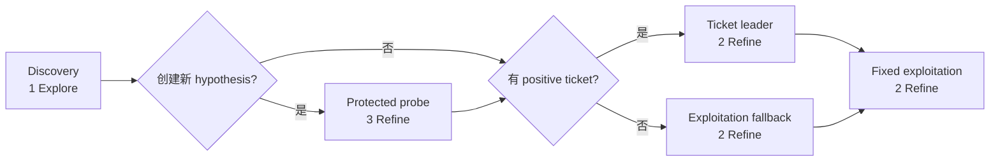

# TraceAAD V9.8：算法假设发现、发展与计算分配

> 状态：机制设计稿，尚未实现、尚未产生正式结果。当前可运行方法仍是 [V9.7](TraceAAD-v9.7完整机制设计.md)。
> 设计依据：正统 V9.7 批次 `20260814_150927` 的[搜索几何诊断](../analysis/TraceAAD-V9.7搜索几何诊断.md)、[机制有效性分析](../analysis/TraceAAD-V9.7机制有效性与任务异质性.md)、固定锚点来时路实验与[研究认识](../knowledge/研究认识.md)。
> 版本目标：同时重构 proposal 与 allocation 的接口，但保留可分别识别两层贡献的实验对照。
> 冻结边界：第一版骨架已收口；不在线估计长期边际计算价值，不向 Explore 注入全局 hypothesis awareness。完整 scheduler 与确认性协议在 Stage P 的 intent、history 和短续段前提通过后冻结。

## 1. 问题、动机与方法区别

自动算法设计在有限真实评价预算下反复修改已有程序。搜索对象具有算法结构：搜索空间由若干潜在算法簇构成，一次局部修改可能继续在族内开发，也可能进入另一种设计原则。新机制的初始实现经常不成熟，即时质量常有回撤，其价值需要经过若干次继续开发才能显现。有限预算下，系统既要提出新的算法假设，也要把足够计算交给有发展迹象的假设。

常见的逐步搜索把每个候选立即放回同一个质量排序。该做法适合修改尺度相近的同族优化；当一次操作改变核心算法结构时，即时质量同时承担了当前水平与未来潜力两种含义。V9.7 在路线层和锚点层都使用历史最好质量加同一个一步尺度，因而形成两个不可恢复区：低于路线前沿的来源失去未来预算，跨簇 child 也可能在得到第一次继续生成之前因即时退步被永久淘汰（早期截断/即时早夭）。

V9.8 将搜索过程组织为三个相互连接的动作：

1. **Hypothesis discovery**：Explore 改变核心决策原则，提出替代算法假设，并创建新的操作性投资单位；
2. **Hypothesis development**：Refine 在该单位内部继续实现、修正和深化；
3. **Compute allocation**：决定从哪个已有 hypothesis 发起发现，并用发现（Discovery）、短期延续（Continuation）和当前最好（Exploitation）三个通道配置后续计算。

轨迹仍是方法的核心信息结构。它记录一个算法假设怎样产生、怎样被实现、哪些修改有效，以及它获得过多少发展机会。Hypothesis 是轨迹上的操作分段，用于使 proposal 产生的结构边界与 allocation 使用的投资边界对齐；它不构成第三个科学研究对象。两个核心对象仍是轨迹条件生成 $P(x_{t+1}\mid x_t,h_t,o_t)$ 与轨迹感知的计算分配 $\mu(a_t\mid\mathcal H_t)$。Proposal 决定搜索空间中的 transition kernel；allocation 决定哪些 transition process 被启动、被观测并获得继续兑现的机会。

## 2. V9.7 的三个错位与 V9.8 的设计回答

| V9.7 错位 | 已有证据 | V9.8 设计回答 |
| --- | --- | --- |
| 投资单位错位 | Route 表示共同根来源；最终最好程序有 9/12 次改变所在根的静态宏簇 | Root 只产生初始 hypothesis；每个有效 Explore 新程序动态创建子 hypothesis |
| 价值度量错位 | $q$ 与 $q^*$ 只表示已经达到的质量；96 条路线中有 64 条没有 bootstrap 后续段 | 设立固定短续段观测窗口，直接测量 realized block gain 与 parent recovery，再决定延续分配 |
| 时间尺度错位 | Explore 的即时退步更大，36%–87% 的 Explore child 出生即淘汰 | Explore child 与原父代分开竞争，并保证 3 次受保护 Refine probe；跨边界退步不进入局部锚点比较 |

V9.8 不在线判断真实 algorithm family。静态宏簇目前只是离线代理，Refine 也可能发生实际换簇，Explore 也可能没有改变真实机制。当前版本中的 hypothesis 严格指 **Explore-initiated development episode**：由一次有效 Explore 启动、随后可被 Refine 继续开发的操作性片段。实际 family switch 只作为离线诊断量检查这一定义的构念效度。

上述设计直接修复的是跨 hypothesis 的即时早夭。它没有同时证明 hypothesis 内部的延迟改进已经解决；一个即时 regress 的 Refine child 仍可能在局部锚点竞争中得不到第二步。V9.8 第一版保留这条局部规则并显式测量其截断，避免未经识别地再给所有 Refine child 增加保护预算。

## 3. 证据、设计假设与实现选择

三类内容必须分开。

### 3.1 已有证据支持的保留项

- 当前完整程序与匹配的父代来时路构成默认生成上下文；已有子代尝试不常驻提示。
- 一次模型决策只产生一个 `Idea + Code`，随后立即评价、更新并重新决策。
- Refine 在完整搜索中具有更高即时 improve；Explore 更常改变静态宏簇，并贡献一部分大幅全局突破。
- 在 V9.7 的实际分配下，Refine regress child 被后代救回并超过原父代的比例为 TSP 15.8%、CVRP 21.8%、OP 2.4%、OBP 16.5%；这说明 hypothesis 内也存在延迟改进，但仍是选择性分配下的 realized value。
- 非单调状态保留为事实；regress 不自动获得正信用。
- 正式比较继续使用 1000 次真实 evaluator 调用，生成调用、token 和墙钟成本另报。

### 3.2 V9.8 新增的待验证假设

- Explore 定义的 episode boundary 能形成比 root route 更可利用的投资单位。`[待验证]`
- 三次 hypothesis-level 受保护 Refine 足以测到一部分区域级短期发展，并显著降低 Explore episode 的右删失。`[待验证]`
- 最近一次等长 Refine block 的已实现前沿增益可作为有限的短期 continuation 信号。`[待验证]`
- 将 discovery、continuation 与 exploitation 的用途结构化解耦，优于将三者压入同一个标量。`[待验证]`
- 从全局最好程序发起 Explore 能在保持强实现基线的同时产生足够的替代 episode，且不会形成新的 proposal-source collapse。`[待验证]`
- hypothesis 内局部锚点规则在不保护每个 Refine child 的条件下，不会截断过多有价值的延迟改进。`[待验证]`

### 3.3 协议常数

| 常数 | V9.8 设计值 | 作用 | 证据地位 |
| :---: | :---: | :--- | :--- |
| $B$ | 1000 eval | 正式真实评价预算 | 沿用统一协议 |
| $K_0$ | 8 | 初始 root hypothesis 数 | 为与 V9.7 可比而保留 |
| $H_{\mathrm{probe}}$ | 3 | 新 hypothesis 的受保护 Refine 尝试数 | 机制设计选择，需做 0/3/5 对照 |
| $H_{\mathrm{cont}}$ | 2 | 一次 continuation block 尝试数 | 机制设计选择 |
| $H_{\mathrm{exploit}}$ | 2 | 一次 exploitation block 尝试数 | 机制设计选择 |
| $L_h$ | 8 | 最大历史事件数 | 沿用 V9.7 上下文上限 |

这些常数定义第一版 structured allocation baseline，不代表已找到最优 depth--breadth 比例。一个成功 discovery cycle 的 `1 + 3 + 2 + 2` 本身就是强 allocation prior：一半响应槽位交给 discovery 及其 protected development。不得根据单次结果或目标干预率事后调整后再把同一批次写成验证。

## 4. 搜索状态与假设拓扑表示

### 4.1 程序与锚点

**程序** $x$ 是评价器执行过的一份唯一代码，保存原始 fitness、有向质量 $q(x)$、长度和首次发现顺序。记原始 fitness 为 $f(x)$，任务方向为 $d\in\{+1,-1\}$；最大化任务取 $d=+1$，最小化任务取 $d=-1$。搜索内部统一为越大越好：
$$
q(x)=d f(x).
$$

**锚点** $a$ 是程序在一条具体形成路径中的位置，记录五元组：
$$a=\langle x(a),p(a),e(a),z(a),n_R(a)\rangle.$$
其中 $z(a)$ 为所属 hypothesis，$n_R(a)$ 为自该锚点发起的 Refine 生成计数。同一代码沿不同历史到达时仍保留不同锚点；程序评价事实复用，路径事实不混合。

### 4.2 操作性 hypothesis

Hypothesis $z$ 的精确定义是一个 Explore-initiated development episode，而不是算法簇标签。它由一个入口锚点和其内部 Refine 后代组成；root hypothesis 是没有 Explore 前驱的初始化特例。每个 hypothesis 保存：

- 唯一 `hypothesis_id`；
- 入口锚点 $a_0(z)$；
- 父 hypothesis 与创建它的 Explore 事件；
- 非 root hypothesis 的创建前父锚点质量 $q_{\mathrm{base}}(z)=q(p(a_0(z)))$；root 的该字段为 `null`；
- hypothesis 内全部锚点与 Refine 事件；
- 已获得的 probe、continuation 与 exploitation 尝试数；
- 最近一次完整 Refine block 的前沿增益 $g_j(z)$；
- 当前最好锚点与质量 $q^*(z) = \max_{a \in z} q(a)$。
- 由当前事实派生的调度状态 `probing / eligible / dormant`。

初始根各自创建一个 root hypothesis。之后的身份传播规则为：
$$
z(a')=\begin{cases}z(a),&o=\mathrm{Refine},\\
\operatorname{NewHypothesis}(z(a),a'),&o=\mathrm{Explore}.
\end{cases}
$$

第二种情况只在 Explore 形成一份全局未见、有效且可执行的新程序时发生。无效、no-op、祖先返回、重复父子关系和全局代码重复都记录为尝试，不创建新的 hypothesis，也不获得 probe 槽位。

这条规则使 hypothesis identity 在操作上稳定：Refine 发展当前 episode，Explore 启动替代 episode。它不声称意图标签等于真实 family。Refine 发生的静态换簇和 Explore 未换簇都必须在离线诊断中报告；在该验证完成前，不加入 LLM judge、embedding clustering 或在线合并规则。

`probing` 表示承诺的初始化或 Explore probe 尚未完成；probe 完成后，具有未消费正 gain ticket 或当前位于全局质量前沿的 hypothesis 为 `eligible`；其余为 `dormant`。Dormant 只表示当前没有合法预算入口，不删除历史、不回收 ID，也不把“访问较少”转化为额外信用。

### 4.3 Hypothesis 图与内部树

全部 hypothesis 构成一片动态发现森林；也可以仅为可视化添加一个不参与选择的虚拟根。Root hypothesis 没有父 hypothesis；Explore 从 $z_i$ 的某个锚点创建 $z_j$ 时，记录有向边 $z_i \to z_j$。该边表示替代 episode 的生成来源，不把 $z_j$ 的后续成功回传为 $z_i$ 或 Explore Idea 的因果信用。

每个 hypothesis 内部是一棵以入口锚点为根的单父代锚点树。Explore child 是新树的入口，后续只有 Refine child 进入该树；创建它的原父代只通过跨 hypothesis 的发现边连接。这样，Explore 边负责 discovery，内部 Refine 边负责 development，两种时间尺度在状态结构上分开。

### 4.4 已实现发展观测

一次模型响应形成一个原子尝试，保存 lane、intent、父锚点、Idea、实际代码差异、有效性、评价结果和生成顺序。`improve / plateau / regress / invalid` 始终相对直接父锚点定义。

用于 continuation ticket 的 measurement block 一律包含 $H_{\mathrm{cont}}=2$ 个连续 Refine 响应槽位。设第 $j$ 个等长 measurement block 开始与结束时的 hypothesis 前沿分别为 $q^*_{j-1}(z)$ 与 $q^*_j(z)$，最近已实现发展增益为：
$$g_j(z) = q^*_j(z) - q^*_{j-1}(z) \ge 0$$

三步 protected probe 的第一个响应是 warm-up，最后两个响应构成一个 measurement block。$R_{\mathrm{probe}}$ 与 $D_{\mathrm{probe}}$ 读取完整三步前后的前沿；continuation ticket 只读取最后两个响应的 $g_j$。Continuation 与 exploitation 本身都以两步为一个 measurement block。这样所有进入 ticket 排序的 gain 具有相同响应 horizon；warm-up 若已带来高质量结果，仍可通过 $q^*$ 进入 exploitation，但不单独制造 continuation ticket。

对 Explore 创建的 hypothesis，probe 完成后的 parent recovery 与 internal development 分别为：
$$R_{\text{probe}}(z) = q^*_{\text{probe}}(z) - q_{\text{base}}(z)$$
$$D_{\text{probe}}(z) = q^*_{\text{probe}}(z) - q(a_0(z))$$

$R_{\text{probe}}$ 回答该 episode 区域在三次搜索机会后是否越过原父代，$D_{\text{probe}}$ 回答其内部前沿是否被推进。在线 probe 每步都允许按局部规则重新选择锚点，因此它测量的是 hypothesis-level development value：
$$
V_H^{\mathrm{hyp}}(z)=q_H^*(z)-q_{\mathrm{base}}(z).
$$

它不等于沿入口 child 单链继续得到的 child-specific continuation value。后者记为：
$$
V_H^{\mathrm{child}}(x')=\max_{0\le h\le H}q(x'_h)-q(x),
$$
其中 $x$ 是 Explore 父代，$x'_0=x'$，后续程序必须沿同一 descendant chain 形成。$V_H^{\mathrm{child}}$ 只在离线强制续段实验中测量，不进入 V9.8 在线分配。两类量都只描述已观测的有限 horizon，不外推无限预算 ceiling。

## 5. 初始化与局部尺度估计

搜索建立 $K_0=8$ 个有效且代码互异的根程序。每个根创建一个 root hypothesis。代码互异仍是最小实现条件，不被解释为八个真实算法簇。

每个 root hypothesis 依次获得 $H_{\mathrm{probe}}=3$ 次受保护 Refine。初始化采用等长 probe，目的有三项：
1. 为每个初始投资单位留下可比较的早期续段；
2. 避免根质量一次抽样直接决定全部长期预算；
3. 为 hypothesis 内局部 Refine 尺度，以及由最后两步形成的第一次等长 measurement gain 提供观测。

V9.8 删除跨 hypothesis 共享的全局尺度 $s$。对 hypothesis $z$，收集其内部所有成功形成新 child 的 Refine 边：
$$D_R(z)=\left\{|q(x')-q(x)|\;\middle|\;x\xrightarrow{R}x',\;x,x'\in z\right\}.$$

局部尺度为：
$$
s_R(z) = \begin{cases} \operatorname{median}(D_R(z)), & D_R(z) \neq \varnothing, \\ 0, & D_R(z) = \varnothing. \end{cases}
$$

它只用于同一 hypothesis 内的 Refine 锚点选择，不比较不同 hypothesis，也不评价 Explore 的跨边界退步。新证据写入后在线重算中位数。

## 6. 生成提议设计

### 6.1 Refine：发展当前算法假设

Refine 的搜索语义是保持当前核心设计原则，改善其实现、组件配合或局部决策。默认指令为：

> Develop the current algorithmic hypothesis. Preserve its central design principle and make one focused change that improves, completes, or repairs its implementation, using the recorded development path as evidence.

一个有效 Refine child 继承父锚点的 hypothesis。修改幅度本身不定义 Refine；实际静态机制是否保持由离线诊断检查。

Refine child 不因一次有效生成自动获得后续保护。若它即时 regress，下一次局部选择可能回到更高质量的旧锚点。这是 V9.8 第一版明确保留的局部即时门控，不得把“受保护 development”泛化为所有 Refine child 都具有固定 continuation depth。

### 6.2 Explore：提出替代算法假设

Explore 的搜索语义是改变核心决策原则，提出一份可以继续发展的替代实现。默认指令为：

> Propose one coherent alternative algorithmic hypothesis. Change the central decision principle rather than tuning parameters or adding cosmetic complexity. The result must be a complete valid implementation that later Refine steps can develop.

一个全局未见、有效且可执行的 Explore child 创建新 hypothesis。其入口质量可以低于父代；该事实不会获得正奖励，只触发固定、有限的 hypothesis-level probe，以测量该 episode 区域在三次额外搜索机会下的短期发展。

### 6.3 输出契约

模型仍只做一次新 `Idea + Code` 决策，不输出价值判断、family 标签、分配建议或多步 rollout。

````text
Idea: <one short statement of the implemented mechanism>
Code:
```python
<one complete executable implementation>
```
````

Code 是有效候选的硬条件；Idea 缺失时记录为 `unavailable`，不单独使候选无效。Idea 是声明，实际代码是机制事实。若二者不一致，状态、重复判断和离线机制标注均以代码为准。

### 6.4 Guided exploration 的能力边界

V9.8 的 Explore 是 **local-trajectory-conditioned alternative proposal**：它看到当前完整程序和该锚点的 parent path，知道当前算法怎样形成；它看不到全局 hypothesis 清单，也不知道其他 episode 已经覆盖过哪些算法机制。因此，V9.8 已能区分“发展当前 hypothesis”与“提出替代 hypothesis”，但还不是 search-history-aware hypothesis discovery。

这一边界可能造成语义区域重访：两个代码不同的 Explore child 都会创建 hypothesis，即使它们离线看来属于同一静态或行为机制区域。V9.8 第一版不把全局 Idea Bank、hypothesis summary、embedding、LLM judge 或在线聚类加入 prompt、创建门槛或分配规则；这些机制会同时改变 proposal context 与 hypothesis identity，必须等待重复区域的真实规模被测量后再单独设计。

## 7. 历史决策视图

V9.8 保留 V9.7 已识别有效的“当前完整算法 + 匹配来时路”。对任意锚点，沿真实结构父链回溯，展示最近 $L_h=8$ 个形成事件；窗口可以跨过 hypothesis boundary，不丢弃 Explore 之前仍位于最近八步内的真实历史。

每条事件写出：当时的 intent、hypothesis 边界、声明的 Idea、父子实际代码的紧凑修改（增删行数及样例行）、`improve / plateau / regress` 结局以及父子真实分数：

```text
[History i] Formation step
Intent: Refine | Explore
Hypothesis: inherit H_i | create H_j from H_i
Idea: <declared idea>
Change: +x/-y lines; removed: `...` | `...`; added: `...` | `...`
Result: improve | plateau | regress
Fitness: parent -> child
```

Explore 生成从当前父锚点出发，看到该锚点的最近父链；其有效 child 在后续 Refine 中继续看到同一条真实路径，直到更近的形成事件自然把旧事件挤出八步窗口。Hypothesis boundary 只提供结构标记，不替换、总结或重写既有事件。

历史压缩只改变模型视图，不删除事实层。上下文超限时从最早事件开始删除；任务契约与当前完整代码始终保留。该规则使 V9.8 的来时路内容尽量保持与 V9.7 可比，把主要变化留在 intent 语义和 allocation。

## 8. 三通道结构化计算分配

### 8.1 三个用途分立的计算通道

V9.8 不再用一个总分同时决定 discovery、continuation 与 exploitation。分配层实际回答两类问题：从哪个 hypothesis 发起 Explore，以及已有 hypothesis 如何获得 probe、continuation 或 exploitation。第一版使用 global-best-source discovery 和固定 lane schedule；两者都是待验证的 allocation prior。

正式搜索按以下循环执行三个通道。Probe 是 Discovery 成功创建 hypothesis 后必须完成的条件性承诺，不是独立的第四通道：



1. **Discovery packet**：一次 Explore；若创建新 hypothesis，立即给予 $H_{\mathrm{probe}}=3$ 次 Refine；
2. **Continuation block**：向具有未消费正 block gain 的 hypothesis 给予 $H_{\mathrm{cont}}=2$ 次 Refine；没有 ticket 时把该 block 交给 exploitation；
3. **Exploitation block**：向当前 $q^*$ 最高的 hypothesis 给予 $H_{\mathrm{exploit}}=2$ 次 Refine。

一个成功 discovery 循环包含 8 个模型响应槽位：1 次 Explore、3 次受保护 Refine、2 次 continuation 或其 exploitation fallback、2 次固定 exploitation。Explore 未创建新 hypothesis 时不生成三个虚构 probe 槽位，该循环只有 5 个实际响应。固定调度替代 V9.7 的独立 0.7/0.3 随机抽取，但不声称已经解出跨任务最优 depth--breadth balance；它是便于识别用途与成本的首个 structured allocation baseline。评价必须报告名义 schedule 与实际 lane、intent、有效候选、evaluator 调用及响应份额。

因此 `1 + 3 + 2 + 2` 是成功 cycle 的条件性 schedule，不是每个任务都会实现的固定全程比例。排除初始化后，记 Discovery 和新 hypothesis probe 的响应数为 $N_D,N_P$，全部模型响应数为 $N_{\mathrm{resp}}$；对应真实评价数为 $E_D,E_P,E_{\mathrm{all}}$。定义：
$$
\rho_{DD}^{\mathrm{resp}}=\frac{N_D+N_P}{N_{\mathrm{resp}}},\qquad
\rho_{DD}^{\mathrm{eval}}=\frac{E_D+E_P}{E_{\mathrm{all}}}.
$$

两者分别是 response 与 evaluator 口径的 **effective discovery-development share**。还必须报告 Explore 有效率、有效 proposal 的全局代码新颖率和 hypothesis 创建率：
$$
r_{\mathrm{valid}}=\frac{N_{D,\mathrm{valid}}}{N_D},\qquad
r_{\mathrm{new}\mid\mathrm{valid}}=\frac{N_{\mathrm{new\_hyp}}}{N_{D,\mathrm{valid}}},\qquad
r_{\mathrm{create}}=\frac{N_{\mathrm{new\_hyp}}}{N_D}.
$$

若某个统计窗口内 $N_{D,\mathrm{valid}}=0$，$r_{\mathrm{new}\mid\mathrm{valid}}$ 记为 `unavailable`，不得写成 0。

由于每次成功创建都会条件性触发三个 probe 响应，不同任务的 validity、代码新颖率与预算边界会自动形成不同的实际 allocation geometry。这是协议的可观测行为，不是偏离协议；初始化八个 root probe 的份额单列，不混入上述指标。

### 8.2 Discovery packet

Discovery 从当前全局最好程序所在 hypothesis 发起；锚点取有向质量 $q$ 最高者，同分时依次偏好更短、发现更早。Explore 成功创建新 hypothesis 后，probe queue 具有最高调度优先级，连续完成三次原子 Refine 尝试。每次尝试后都更新状态，并按该 hypothesis 的局部规则重新选择锚点；因此这里保证的是三次区域级搜索机会，不是从 Explore child 出发的三层单链。

从全局最好程序发起使不同 Explore proposal 共享较强的实现基线，减少“父代本身很差”对新 episode 评价的混杂。但 transition probability 依赖来源；若某个区域只能经由当前较弱 hypothesis 到达，global-best-only source 会把发现图压成星形并形成新的 proposal-source collapse。因此 discovery-source selection 是 allocation 的独立子问题。第一版保留 global best 只为形成明确基线，诊断必须报告 Explore parent 的 hypothesis 集中度、来源熵、发现森林深度和非根 hypothesis 再发现率，并与 hypothesis-uniform、continuation-leader source 做单因素对照。

只有在剩余 evaluator 预算至少为 $1+H_{\mathrm{probe}}$ 时才启动 discovery。该检查为最坏情况保留四次真实评价，因此一个已创建的新 hypothesis 不会因运行接近终点而拿不到承诺的三个响应槽位。

若 Explore 无效、no-op、重复或返回已见程序，当前 packet 不创建 hypothesis，也不产生或转移三个 probe 槽位，调度器直接进入 continuation。失败的 Explore 仍完整记录，并占用一个生成响应槽位。V9.8 不用 least-developed fallback；Discovery 与 protected probe 已经给新 episode 提供最小观测机会，probe 后的低访问量本身不构成继续投资证据。

### 8.3 Continuation block

每个完成的两步 measurement block 产生一个最新 $g_j(z)$。一个 hypothesis 最多持有一张 ticket；任何新 measurement block 完成后，都用最新 $g_j(z)$ 覆盖旧 ticket：正值产生 ticket，零值清除 ticket。Continuation 通道选择正 block gain 最大的 ticket；同分时依次选择 $q^*$ 更高、累计 Refine 尝试更少、创建更早的 hypothesis。

选中前先消费旧 ticket，再运行两次 Refine，完成后用新 block gain 决定是否产生下一张 ticket。一次局部恢复只能支持一次后续投资；只有新的实际前沿增益才能连续取得 continuation 预算。

若没有正 gain ticket，continuation block 直接转为一个额外的 exploitation block，选择规则与 8.4 相同，并记录 `fallback_reason=no_positive_ticket`。该回退不引入新的 coverage 目标，也不把零增益或低访问量解释为正潜力。

Continuation 通道只占固定的一部分响应槽位。它可能选择当前质量较低但仍在推进的 hypothesis；exploitation 通道独立保留对高质量前沿的投资，从结构上限制 V9.1 式“低质量回弹吞掉全部预算”的风险。

V9.8 第一版不从 V9.7 的选择性日志训练 continuation predictor。它通过等长 block 主动测量观测，再用刚刚实现的前沿增益决定是否继续分配。$g_j$ 的严格名称是 **recent realized development gain**，不是 continuation value。按绝对 gain 排序可能偏爱低质量、容易进步的 hypothesis；独立 exploitation lane 只把这种 easy-progress bias 限制在 continuation 份额内，并未证明其消失。待强制续段实验积累足够数据后，才讨论学习式长期价值估计。

更准确地说，当前 continuation 是 development momentum allocator：它回答“最近一个等长窗口推进过谁”，不回答“下一份计算的边际价值给谁最高”。后者可形式化为未来研究量：
$$
V_H^{\mathrm{marg}}(z)=\mathbb E\left[q^*_{t+H}(z)-q^*_t(z)\mid\mathcal H_t(z)\right],
$$
其中 $H$ 表示再给予固定数量 Refine 响应。该量只有在 proposal kernel、context policy、局部锚点规则和 horizon 固定时才有可比含义，不是 hypothesis 的内在 ceiling。V9.8 不在线估计该量，也不把 $g_j$ 当作它的无偏代理；第一版的作用是主动积累等长 continuation observations，为后续预测问题建立数据条件。

### 8.4 Exploitation block

Exploitation 通道选择 $q^*(z)$ 最高的 hypothesis。同分时依次偏好累计 Refine 尝试更少、创建更早者。选中后运行两次 Refine，每次重新选择 hypothesis 内锚点。

当前质量只控制 exploitation 通道，不关闭 discovery，也不取消新 hypothesis 的 probe。即使某个 hypothesis 长期保持全局最好，它也只能稳定获得 exploitation 份额；其他 hypothesis 仍可通过被选为 discovery source、protected probe 与正 block gain 获得计算。没有这些入口的 hypothesis 转为 dormant，而不是因访问较少自动获得预算。

### 8.5 Hypothesis 内锚点选择

三个 Refine 通道在选定 hypothesis 后使用同一局部规则。锚点 $a$ 的 Refine 次数为 $n_R(a)$，分数为：
$$S^{\text{local}}(a \mid z) = q(a) + \frac{s_R(z)}{\sqrt{n_R(a) + 1}}$$

选择分数最高的锚点；同分时优先 Refine 次数更少、创建更早。该分数只比较同一 hypothesis 内的实现状态。Explore 创建的新 hypothesis 以自己的入口锚点开始，原父代不进入其局部候选集合，因此跨假设的即时质量落差不会造成即时淘汰。

Probe、continuation 和 exploitation 都在每次 Refine 后重新计算 $s_R(z)$ 与锚点分数。这个重选允许 episode 回到入口或其他高分锚点；它不会保证即时 regress 的 Refine child 获得下一步，所以 hypothesis-level probe 与 child-chain continuation 必须分开解释。一次 block 是多次原子决策的调度承诺，不是单次模型调用生成多步代码。

## 9. 更新、缓存、预算与停止

### 9.1 状态更新

每个响应完成后按以下顺序更新：

1. 解析 Idea 与完整代码；
2. 检查 no-op、祖先返回、重复关系与全局代码缓存；
3. 对新程序调用 evaluator，并写入程序事实；
4. 按 intent 继承或创建 hypothesis；
5. 写入锚点、形成事件、局部尺度与 hypothesis 前沿；
6. block 完成时计算 $g_j$、$R_{\mathrm{probe}}$、$D_{\mathrm{probe}}$，覆盖 ticket 并更新派生调度状态；
7. 将该响应与当时选择输入追加写入原子事件日志；若发生真实评价，再追加 `evaluations.csv`；
8. 输出控制台单行进度；若产生全局新最优，更新 `best_program.py` 并追加 `best_curve.csv`；
9. 原子写入 checkpoint 后进入下一个原子尝试。

### 9.2 重复程序

Refine 返回已见但非父代、非祖先且尚无当前父子关系的程序时，可复用评价并在当前 hypothesis 创建新锚点，因为相同程序在不同来时路下仍具有不同生成条件。

Explore 返回任何全局已见程序时只记录缓存命中与来源，不创建新 hypothesis。该规则防止同一可执行算法因不同 Explore 文本重复获得 probe 预算。是否应允许“同代码、不同历史”的 Explore hypothesis 属于后续消融，不在 V9.8 第一版引入。

### 9.3 两类成本

正式预算 $B=1000$ 只计算真实 evaluator 调用。解析失败、no-op、祖先返回、重复关系和缓存命中不消耗 evaluator 预算，但会：

- 消耗一个 block 响应槽位；
- 增加对应锚点与 hypothesis 的生成尝试数；
- 计入 intent 有效率与生成成本；
- 推进可恢复的 scheduler cycle 状态。

因此同一 eval 预算下，不同方法的 LLM 调用、token 与墙钟成本可能不同，必须分列报告。

### 9.4 停止与最终程序

搜索在 1000 次真实评价耗尽时停止。任何原子响应都只能在尚有 evaluator 预算时启动；若候选无效或命中缓存，响应槽位继续推进但评价计数不变。Continuation 或 exploitation block 若在最后一次真实评价后只完成了部分响应槽位，记录为 `incomplete_at_budget`，不计算 $g_j$、不覆盖 ticket。由于 discovery 启动前已保留最坏情况下的四次评价，新 hypothesis 的三次 probe 不会被该规则截断。

最后不足以启动完整 discovery packet 时，不再创建新 hypothesis，剩余预算交替执行 continuation 与 exploitation 的原子 Refine，直到 evaluator 预算耗尽。运行器还必须在 `run_config.json` 中预声明模型响应与连续错误的安全上限；触发安全上限的运行标记 `search_aborted=true`，不得作为完成的 1000-eval 正式重复。

最终程序从全部唯一程序中按任务真实目标选择。完全同分时依次偏好代码更短、发现更早。Hypothesis 状态、lane、ticket、probe recovery 和访问次数都不参与最终排序。

## 10. 完整算法

```text
Input: task, evaluator, LLM, evaluator budget B = 1000

Generate K0 = 8 valid code-unique roots.
Create one root hypothesis for each root.
For each root hypothesis:
    run H_probe = 3 atomic Refine attempts;
    update local anchors, s_R, q*, and the latest block gain.

While evaluator budget remains:
    If at least 1 + H_probe evaluator calls remain:
        choose the globally best anchor;
        run one Explore attempt;
        if it creates a globally new valid program:
            create a child hypothesis;
            run H_probe = 3 protected atomic Refine attempts there;
        else:
            skip the conditional probe and continue the cycle.

    If evaluator budget remains:
        choose the largest unconsumed positive block-gain ticket;
        if none exists, choose the hypothesis with highest q* and record
        an exploitation fallback;
        run H_cont = 2 atomic Refine attempts.

    If evaluator budget remains:
        choose the hypothesis with highest q*;
        run H_exploit = 2 atomic Refine attempts.

    After every response and any evaluation it triggers:
        record the event, update facts, and save resumable state.

Near the budget boundary, stop opening hypotheses and alternate
continuation and exploitation until B is exhausted.

Return the globally best unique program by the true objective.
```

## 11. 可恢复性与工件保存

### 11.1 两层工件文件体系

V9.8 同时提供便于查看的结果层与完整可审计的事实层。CSV 和 best program 用于日常分析；它们不能替代原子事件、完整程序与模型调用记录。每次运行在 `<run_dir>/` 下生成：

结果层：

- `best_program.py`：当前或最终全局最优算法的纯 Python 文件，包含原始 Fitness、方向、发现评价步和响应顺序注释；
- `evaluations.csv`：每次真实评价一行，至少包含 `eval_count`、`sample_order`、`response_order`、`lane`、`resolved_lane`、`hypothesis_id`、`intent`、父子程序 ID、父子原始 fitness、父子有向质量、`outcome`、`is_new_best`；
- `best_curve.csv`：每次产生新最优时的评价步数、响应顺序、原始 fitness 与有向质量；
- `logs/summary.json`：运行结束时的全局统计、完成状态、预算构成与各 lane 汇总。

事实层：

- `run_config.json`：任务、方法版本、root 与 block 常数、prompt 版本、模型统一名称、run seed、模型响应与连续错误安全上限、代码提交和启动时间；
- `programs/<program_id>.py`：所有全局唯一、实际进入事实层的完整程序；
- `logs/events.jsonl`：每个模型响应一条追加记录，保存 scheduler cycle、请求 lane、实际 lane、fallback reason、discovery source、父锚点、hypothesis 边界、Idea、程序 ID、紧凑 diff、有效性、缓存与评价结果、block 起止前沿、ticket 更新、决策 tie-break 和 generation seed；
- `logs/llm_calls.jsonl`：实际 prompt、原始 response、解析结果、token、延迟和重试事实；
- `logs/errors.jsonl`：异常与 traceback；
- `checkpoints/latest.json`：原子断点，支持无缝恢复。

原始事实工件保留本地，不因生成 `summary.json` 或 CSV 而删除。任何搜索几何、prompt 行为或 allocation 归因都必须从事实层重建；结果层只用于快速查看和画图。

### 11.2 实时控制台进度监控

运行期间终端单行输出当前响应顺序、真实评价计数、调度通道与结果。`outcome` 始终按有向质量 $q$ 判定；示例显式标记原始 fitness 为最小化目标，避免把数值下降误读为退步：

- Discovery / Probe：`[Resp 052 | Eval 045/1000] Probe H3 (1/3) | fitness[min] 120.30 -> 118.50 [IMPROVE] | New best 118.50`
- Continuation：`[Resp 053 | Eval 046/1000] Cont H2 (2/2) | fitness[min] 118.50 -> 125.10 [REGRESS] | Best 118.50`
- Exploitation：`[Resp 054 | Eval 046/1000] Exploit H1 (1/2) | duplicate cache hit | Best 118.50`

### 11.3 Checkpoint 状态定义

原子 Checkpoint 必须保存完整恢复状态：

- 程序、锚点、hypothesis 发现森林和全部尝试；
- 当前 scheduler lane、cycle index 与 block 内剩余槽位；
- 未完成 probe queue；
- 每个 hypothesis 的 $q^*$、$s_R$、累计 Refine 尝试、最近 block gain、ticket 与 `probing / eligible / dormant` 状态；
- evaluator 调用数、模型响应数、generation seed 序列与 pending response；
- 当前全局最好程序 ID，以及最近一次 discovery-source 和 fallback 决策输入。

每个待发请求在调用模型前以稳定 `response_id`、lane、父锚点和 generation seed 写入 checkpoint。响应完成后，事件日志与 checkpoint 使用同一 `response_id`；若进程在事件追加后、状态 checkpoint 前中断，恢复过程从事件日志幂等重放该响应，不重新调用模型。日志保存事实与当时决策输入；family 标签、行为距离和 hindsight subtree value 全部离线计算，不写回在线状态。

## 12. 实现不变量与测试要求

1. 有效新 Explore child 恰好创建一个新 hypothesis；Refine child 必须继承父 hypothesis。
2. 新 hypothesis 的 probe 在任何跨 hypothesis 质量竞争之前完成，且恰好包含三个响应槽位；每步允许在该 hypothesis 内重新选锚点。
3. 新 hypothesis 的局部候选集合不包含创建它的原父代。
4. $s_R(z)$ 只读取 hypothesis 内有效 Refine 边，不读取 root gap、Explore edge 或其他 hypothesis。
5. 每个 hypothesis 最多持有一张正 gain ticket；任何完整新 block 都覆盖旧 ticket，ticket 最多触发一次 continuation block。
6. 固定 seed、相同 checkpoint 与相同 pending response 必须恢复出相同 lane、intent、anchor 和 generation seed。
7. Invalid、duplicate 与 cached 的 evaluator 预算、响应槽位和访问计数语义必须分别测试。
8. 接近预算终点时不得创建无法完成三次 probe 的新 hypothesis。
9. 每个模型响应只包含一个 `Idea + Code`；block 不得实现成一次多候选或多步 rollout。
10. 最终选择只读真实任务目标与确定性 tie-break。
11. Explore 未创建 hypothesis 时不得生成或转移 probe budget；没有 positive ticket 时只能回退到 exploitation，不得调用 least-developed coverage。
12. 原子事件日志必须足以从零重建 hypothesis 边界、block gain、ticket、source selection、lane fallback 与 evaluator budget；CSV 汇总不作为唯一事实源。
13. 到达评价预算时未完成的普通 Refine block 不产生 gain 或 ticket；protected probe 不得因预算边界成为 incomplete。
14. 相同 pending `response_id` 的恢复不得再次调用模型或重复计数；事件重放后必须得到相同 scheduler state。

## 13. 实验识别方案

V9.8 可以在最终版本中同时改变 proposal 与 allocation；证据链仍按两个对象分别建立。

### 13.1 Stage P：Proposal 与短续段

**完整实现前冻结门槛。** 状态表示、事实工件和 Stage P 实验基础设施可以先实现；完整 V9.8 scheduler 与确认性协议在 P1、P2、P3 完成后冻结。P1 检验 Explore 是否产生有意义的 transition，P2 检验短续段能否测到或救回新 episode，P3 决定 Refine 与 Explore 是否应共享 parent-path context。任一前提不成立时，应先修订 intent、probe horizon 或 context policy，而不是用完整搜索结果反向解释。P4 测量局部 Refine 截断，是第一版能力边界诊断，不作为启动完整实现的必要条件。

**P1：固定锚点意图实验。** 固定当前代码、parent path、采样 seed、输出契约和 evaluator，配对比较 Refine 与 Explore。主要过程量为有效率、immediate $\Delta q$、静态宏簇切换、行为切换和代码修改规模。该实验检验 intent 是否改变 transition kernel，不检验完整搜索收益。核心构念量是 Explore 启动不同 episode 的有效率，以及 `Explore 未换簇 / Refine 实际换簇` 两类错分。对同一源锚点的重复 Explore 还要报告每 $k$ 个有效 proposal 发现的累计静态/行为区域数与区域重访率，判断代码新颖是否主要在重复已有机制代理。

**P2a：Hypothesis-level probe 实验。** 对同一批 Explore 新程序运行五次原子 Refine，每步按 V9.8 局部规则在该 hypothesis 内重新选择锚点，并在 $H\in\{0,3,5\}$ 读取嵌套前缀：
$$
V_H^{\mathrm{hyp}}(z)=q_H^*(z)-q_{\mathrm{base}}(z).
$$
该协议直接对应在线 protected probe，回答一个 Explore-initiated episode 在固定数量区域级搜索机会下的 parent recovery 与 internal development。

**P2b：Child-chain 强制续段实验。** 从同一 Explore child 的独立克隆状态出发，每一步只从当前链尖生成；有效新 child 成为下一链尖，无效、no-op 或重复响应计入槽位但链尖不前移。按相同预注册 seed 序列运行五次原子 Refine，并读取：
$$
V_H^{\mathrm{child}}(x')=\max_{0\le h\le H}q(x'_h)-q(x),\qquad H\in\{0,3,5\}.
$$
P2b 回答具体 Explore proposal 经连续 development 后能否恢复，不作为在线分配量。P2a 与 P2b 共享 Explore child、任务和 horizon block，但属于不同 continuation protocol；二者差异本身衡量局部重选与沿 child 深挖的作用。

P2a/P2b 同时报告相对入口 child 的内部增益、相对 Explore 父代的 recovery、有效后代数和最终 family。$H=0,3,5$ 共用同一条协议内 continuation 前缀，不能当成三个独立样本；实验单位是源锚点或 Explore child，同一 child 的五步结果是重复测量。

**P3：History × Intent 因子实验。** 采用 `code-only / parent-path` 与 `Refine / Explore` 的 $2\times2$ 配对设计，检验来时路是在帮助 Refine 聚焦，还是同时压缩 Explore 的换簇质量。任务与锚点质量层作为预先定义的 block，运行顺序和采样 seed 配对。该实验完成前，当前两种 intent 共用 parent path 只是待验证 prompt baseline。

**P4：Refine regress 强制续段实验。** 从预先分层抽取的 Refine regress child 出发，按 P2b 的 child-chain 规则测量 $H\in\{0,3,5\}$ 的 recovery，并与匹配质量层的非 regress Refine child 分开报告。它检验 hypothesis 内 local allocator 可能遗漏多少 delayed improvement，不由此自动推出所有 Refine child 都应获得 protected depth。

**全局区域重访诊断。** P1 的固定锚点结果不能替代完整搜索中的全局重复测量。对 pilot 与正式运行，按 hypothesis 创建顺序离线标注入口程序和 probe 后最好程序的静态机制区域；若已有预注册的行为签名，再独立标注行为区域。对代理类型 $m$ 和第 $k$ 个新 hypothesis，定义：
$$
I_k^{(m)}=\mathbf 1\left[c_m(z_k)\in\{c_m(z_i):i<k\}\right].
$$

当 $K\ge2$ 时，run 内重访率为：
$$
R_{\mathrm{revisit}}^{(m)}=\frac{1}{K-1}\sum_{k=2}^{K}I_k^{(m)}.
$$

分别报告 entry/post-probe 的累计独特区域曲线、$R_{\mathrm{revisit}}^{(m)}$，以及投向 entry-revisited episode 的 probe response/eval 份额，并按 discovery source 分层；$K<2$ 时重访率记为 `unavailable`。这些量严格称为 **proxy-region revisit**：静态宏簇较粗，行为签名也依赖预注册定义，同一区域内的再次开发仍可能有价值，因此不能直接写成真实 semantic duplication 或浪费预算。

### 13.2 Stage A：Allocation

Allocation 实验固定已由 Stage P 冻结的提示、intent 定义、root 生成和单步输出契约。按以下顺序比较：

| 对照 | 唯一变化 | 回答的问题 |
| :--- | :--- | :--- |
| Single vs $K_0$-Uniform | 初始池规模 | 多个起点是否有 pool value |
| Route-Uniform vs Hypothesis-Uniform | 投资单位 | 动态 Explore boundary 是否比 root provenance 更适合分配 |
| Hypothesis-Uniform $H=0/3/5$ | probe horizon 与随之变化的预算份额 | protected development schedule 的敏感性 |
| Global-best vs Hypothesis-uniform vs Continuation-leader source | discovery source | 固定从全局最好发起是否造成 source collapse 或可达性损失 |
| $1+3+0+4$ vs $1+3+2+2$ vs $1+3+4+0$ | continuation / exploitation 配额 | structured lane schedule 对有限预算行为的影响 |
| Hypothesis-Uniform $H=3$ vs 默认三通道 | 基于已实现 gain 与质量的路由 | 默认 routing policy 是否优于均匀轮转 |
| V9.7 vs 完整 V9.8 | 联合系统 | 最终有限预算行为与 held-out 是否改善 |

Uniform 对照按等长 Refine block 轮转，不读取质量或 block gain。比较三通道时，proposal kernel 和总 evaluator 预算保持一致；不同选择造成的后续候选差异属于 allocation 的真实下游效应。

所有 allocation 臂都构建相同的 hypothesis 标签和历史决策视图。`Route-Uniform` 只在预算落点上忽略 hypothesis 边界、按 root provenance 轮转，因此与 `Hypothesis-Uniform` 的差异限于投资单位。

Discovery-source 对照只改变 Explore 的来源：global-best 使用 8.2 的规则；hypothesis-uniform 在所有完成 probe 的 hypothesis 间均匀采样，再取该 hypothesis 内 $q$ 最高锚点；continuation-leader 读取最大未消费 ticket 的 hypothesis 但不消费 ticket，没有 ticket 时回退 global-best。Continuation、exploitation、prompt、seed schedule 与锚点内规则保持一致。

$H=0/3/5$ 的完整搜索对照同时改变单个新 episode 的最小观测 horizon 与成功 cycle 中 discovery-related budget share，因而是 schedule sensitivity，不是纯 child-level horizon 效应；具体 proposal 的 horizon 效应由 P2 的嵌套实验回答。$H=3$ 由一个 warm-up 和一个两步 measurement block 组成；$H=5$ 由一个 warm-up 和两个连续 measurement block 组成，只有最近完整 block 决定 ticket；$H=0$ 不产生 probe ticket。三组 lane schedule 保持一次成功 cycle 共 8 个响应槽位及 `1 Discovery + 3 Probe` 不变，continuation 与 exploitation 都以两步 measurement block 为原子，只改变二者获得 0、1 或 2 个 block。默认 `1+3+2+2` 必须在看正式结果前预注册，其他 schedule 用于敏感性分析，不能在同一批结果上择优后再称为确认性 V9.8。

### 13.3 重复、阻断与报告

- 正式搜索以独立 run seed 为重复单位，每方法每任务至少三次；同一运行内的锚点、候选和 block 都是嵌套过程观测，不作为独立重复。
- 按 task × replicate 构造配对 block，平衡运行时段与服务容量。所有服务源统一记为 Qwen3.6-27B，不把服务名当成模型差异。
- 搜索过程报告 100/250/500/1000 eval 的 best-at-budget、hypothesis 创建数及 `probing / eligible / dormant` 构成、hypothesis-level 与 child-level probe recovery、ticket 产生/消费/覆盖、continuation fallback、$\rho_{DD}^{\mathrm{resp}}$、$\rho_{DD}^{\mathrm{eval}}$、$r_{\mathrm{valid}}$、$r_{\mathrm{new}\mid\mathrm{valid}}$、$r_{\mathrm{create}}$、其余 lane 的 response/eval 份额、discovery-source 集中度与森林深度、entry/post-probe proxy-region revisit 及其 probe cost share、无效与缓存比例。
- 最终性能只使用完成的 held-out `results.json`，报告三重复均值与样本标准差。搜索 best、固定锚点 probe 和未完成运行不得替代正式结论。
- 同时报告 evaluator 调用、LLM 响应、prompt/output token、缓存与墙钟时间。

### 13.4 结论门槛

每个新机制依次回答：
1. **机制运行**：hypothesis 是否创建、probe 是否完成、三个 lane 与 fallback 是否按规范获得预算；
2. **机制改变行为**：是否降低 Explore episode 的右删失，改变区域级 recovery、source topology 与 dormant/eligible 构成；
3. **机制改善搜索**：是否提高 best-at-budget；
4. **机制改善最终质量**：held-out 是否在独立重复上同向改善。

联合 V9.8 的最终结果不能自动归因给 hypothesis unit、protected probe、block gain 或新 prompt 中任何单项。

## 14. 解释边界

- Hypothesis 的严格含义是 Explore-initiated development episode，是由 operator boundary 定义的在线投资单位，不是真实算法 family 的已验证标签。
- 三次 probe 是 hypothesis-level 最小测量窗口，每步允许局部重选锚点；它不等于从 Explore child 出发的三步 descendant chain，也不保证足以识别长期 ceiling。
- 正 block gain 是 recent realized development gain，不是无偏的长期价值估计，也不应沿祖先回传；按绝对 gain 排序保留 easy-progress bias。
- Continuation 是短期 development momentum allocator，不估计额外计算的长期边际价值；学习式 $V_H^{\mathrm{marg}}$ 留给积累等长观测后的后续版本。
- 固定 discovery 循环保护的是提议类型的测量机会；regress 本身没有正奖励。持续投资仍需要新的 block gain 或进入 exploitation 前沿。
- `1 + 3 + 2 + 2` 是第一版 structured allocation schedule，不是已经验证的跨任务最优比例。
- 成功 Explore 才触发 probe，因此 effective discovery-development share 随任务的 Explore validity、代码新颖率和终点截断而变化；必须同时按 response 与 evaluator 口径报告。
- Global-best-source discovery 是显式待验证选择；它统一实现基线，也可能阻断经较弱 hypothesis 才可到达的多跳 transition。
- V9.8 没有独立 coverage lane。Explore 失败时跳过 probe；没有 ticket 时回退 exploitation；dormant hypothesis 不因访问较少自动复活。
- 局部 $q+s_R/\sqrt{n_R+1}$ 只处理 hypothesis 内 Refine 状态，不承担跨 hypothesis coverage 或 Explore 容忍，也可能截断即时 regress 的 Refine child。
- 真实 family、novelty 与行为距离在 V9.8 中只作离线诊断。没有经过固定锚点与跨任务验证前，不进入在线硬门控、合并或拒绝规则。
- 全局代码新颖不保证语义新颖。代码不同但机制重复的 Explore 仍可能创建多个 hypothesis 并消耗 probe；这一成本计入 Explore 有效率与 pool 诊断，不通过未经验证的在线聚类提前隐藏。
- Explore 只读取当前代码与局部 formation path，不读取全局已探索 hypothesis；V9.8 测量 proxy-region revisit，但不把全局 awareness 写入第一版 prompt。
- Parent path 对 Refine 与 Explore 是否具有同样作用仍未知；P3 完成前，共享历史视图只是一项 prompt baseline。
- V9.8 的完整 held-out 评价只支持联合协议；proposal 与 allocation 的独立主张以 Stage P 和 Stage A 的对应对照为准。

## 15. 与 V9.7 的最小差异表

| 维度 | V9.7 | V9.8 设计 |
| :--- | :--- | :--- |
| 长期投资单位 | Root route | 动态 Explore-defined hypothesis |
| Explore child 身份 | 原 route 内普通 anchor | 新 hypothesis 入口 |
| 最小续段 | 无 | 新 Explore episode 获得 3 次 hypothesis-level Refine |
| Discovery source | 随 0.7/0.3 抽取后的已选锚点 | 当前全局最好锚点，作为待验证基线 |
| 跨单位分配 | $q^*+s/\sqrt{N+1}$ | fixed discovery + realized-gain continuation + $q^*$ exploitation；无 coverage fallback |
| 局部分配 | 全局共享 $s$ | hypothesis 内 Refine 尺度 $s_R(z)$ |
| 意图调度 | 独立 0.7/0.3 抽取 | `1 + 3 + 2 + 2` structured baseline；失败 Explore 跳过 probe |
| 历史视图 | 最近 8 条完整父链事件 | 同一父链窗口，增加 intent 与 hypothesis boundary 标记 |
| Family 标签 | 离线诊断 | 仍只离线诊断 |

## 相关文档

- [TraceAAD V9.7 完整机制](TraceAAD-v9.7完整机制设计.md)
- [V9.7 搜索几何诊断](../analysis/TraceAAD-V9.7搜索几何诊断.md)
- [V9.7 机制有效性与任务异质性](../analysis/TraceAAD-V9.7机制有效性与任务异质性.md)
- [固定锚点单步生成识别实验](../experiments/TraceAAD-固定锚点单步生成识别实验.md)
- [研究认识](../knowledge/研究认识.md)
- [L0 状态表示](../research/L0-状态表示.md)
- [L2 预算分配](../research/L2-预算分配.md)
- [L3 单步生成](../research/L3-单步生成.md)
- [BaSE 阅读笔记](../references/LLM自动算法设计方法阅读笔记/28-Compute-Allocation-BaSE.md)
