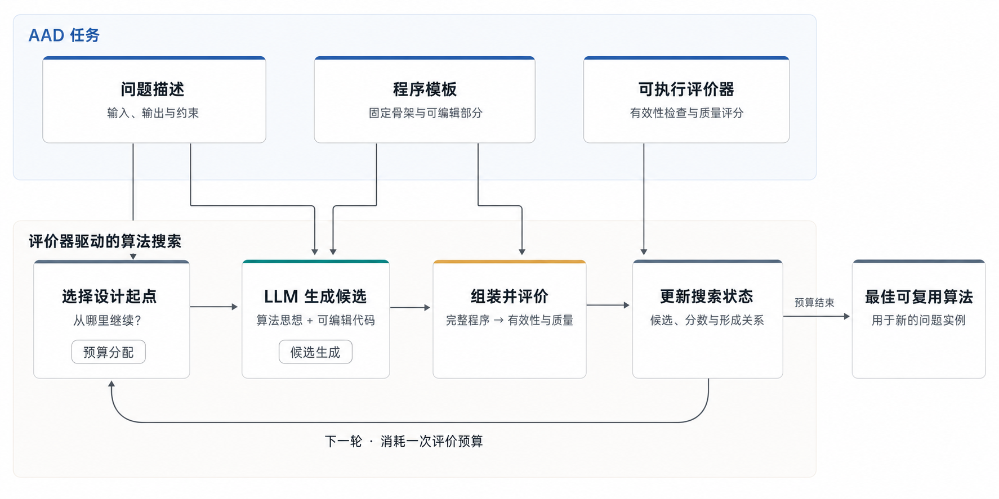
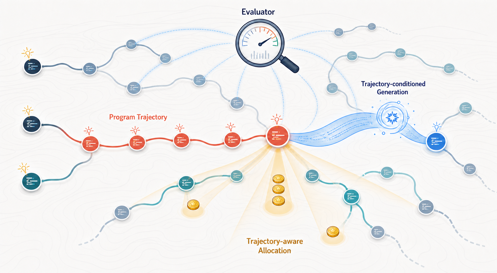
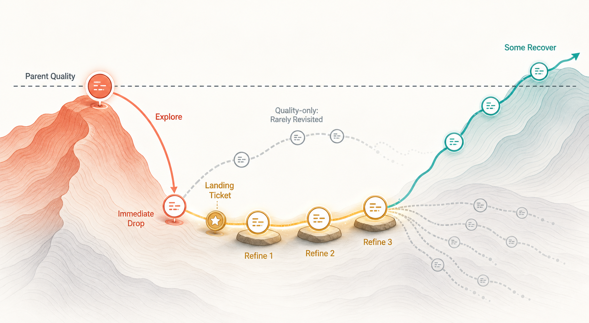

# TraceAAD：基于轨迹引导的自动算法设计

## 摘要

大语言模型能够提出并改写算法函数，进化机制用真实评价驱动选择；二者结合，在有限预算下优化该函数，使其能够求解一类问题。现有方法已经使用种群、反思、树和程序关系图保存搜索历史，但历史表示、候选生成和预算分配通常同时变化，因而难以判断历史通过哪条机制改善搜索。TraceAAD 将算法改进轨迹作为独立研究对象，并把它同时用于两件事：给哪一个节点一次决策机会，以及怎样帮它做出更好的决策。V9.16 针对前一问题引入随机三步短期精炼，为 Explore 子代提供固定发展机会。我们在五个任务上分别进行三次独立搜索，并与五种 AAD 方法比较。相对这五种对照，V9.16 在 TSP、OP 和 VRPTW 上取得最优 held-out 均值，在 18 个测试设置中的 12 个达到最优或并列最优，平均名次为 1.750。过程分析进一步表明，出生质量下降的 Explore 子代很少获得后续精炼，其中一小部分却能在连续三步内恢复。该结果揭示了即时质量与后续改进潜力之间的差异，但尚不能证明随机 landing 改善了最终性能。

## 1. 引言

组合优化、科学计算和程序优化中的许多任务需要面向具体问题结构设计专门算法。研究者通常先分析问题性质，再将领域知识转化为数据结构、搜索算子和决策规则，并通过多轮实现与实验完善设计。这一过程依赖专家经验，需要投入持续的开发和评价成本。

大语言模型为自动化算法设计提供了新的技术基础。模型可以将算法思想转化为代码，可执行评价器则能够在真实问题实例上检验程序的有效性和求解质量。自动算法设计（Automatic Algorithm Design, AAD）把 LLM 生成与进化机制结合：系统改写程序模板中的算法函数，执行并评价该函数，再根据已有结果选择下一轮改写起点 [1–4]。优化对象是能够求解一类问题的算法函数，每个实例上的解用于评价该函数。

实现有效的 AAD 仍面临两个基础问题。第一，给哪一个节点一次决策机会。第二，怎样帮它做出更好的决策。TraceAAD 的创新是把改进轨迹融入这两件事：轨迹参与评分与预算分配，轨迹辅助下一步决策。

现有方法已经从两个方向使用搜索历史。反思和记忆方法将评价结果压缩为后续生成上下文，树搜索和计算分配方法则利用候选关系安排下一次扩展位置 [3,5–7]。这些系统通常同时改变历史表示、生成提示、搜索结构和分配策略。端到端结果因此难以区分两类作用：历史是否改善了下一步候选分布，以及历史是否改善了有限预算的投资决策。

TraceAAD 将算法改进轨迹定义为候选函数的形成记录，包括父子关系、算法思想、实际修改、有效性、评价结果和发生顺序。本文用轨迹连接两个基础问题：给哪一个节点一次决策机会，以及怎样帮它做出更好的决策。轨迹参与评分与预算分配，也辅助下一步改写。V9.16 进一步收窄到一个具体问题：质量驱动的逐步重选是否会过早停止发展出生质量较低的 Explore 子代？为检验这一问题，V9.16 随机选择部分 Explore 入口，并连续执行三步 Refine。

本文的主要工作包括：

1. 将 AAD 中的搜索历史用于两个基础问题：给哪一个节点一次决策机会，以及怎样帮它做出更好的决策；
2. 提出以算法改进轨迹组织历史的 TraceAAD 框架，使形成事实能够参与评分、预算分配，并作为上下文辅助下一步改写；
3. 在五个任务上比较 V9.16 与五种 AAD 方法，并结合搜索曲线和 landing 观测分析即时质量分配对延迟改进方向的影响。

## 2. 问题设定：评价器驱动的自动算法设计

### 2.1 设计对象与评价目标

AAD 优化程序模板中的算法函数。对于一类问题实例，候选函数接收一个实例并输出满足约束的解。评价器在一组代表性实例上运行完整程序，检查程序和输出是否有效，并汇总解质量、运行成本或其他任务指标。系统最终返回评价结果最好的候选函数。单个实例上的解是评价该函数的观测结果。

### 2.2 可执行任务表示

一个可执行的 AAD 任务包含三个部分：

1. **问题描述**规定待解决问题的输入、输出、约束和评价目标；
2. **程序模板与可编辑部分**提供可运行的程序骨架，并界定由模型设计的函数或代码块；
3. **可执行评价器**将候选代码组装为完整程序，在训练实例上运行该程序，并返回有效性与质量评价。

记候选函数代码为 $r$，程序模板 $K$ 将其组装为完整程序 $K[r]$。给定训练集 $S_{\mathrm{train}}$、评价器 $\mathcal{E}$ 和最多 $B$ 次候选评价，AAD 的训练目标可以写为：

$$
r^\star = \operatorname*{arg\,max}_{r\in\mathcal{R}}
\mathcal{E}\bigl(K[r];S_{\mathrm{train}}\bigr),
\qquad N_{\mathrm{eval}}\le B.
$$

其中，$\mathcal{R}$ 表示候选代码空间，$N_{\mathrm{eval}}$ 表示已经消耗的候选评价次数。测试集 $S_{\mathrm{test}}$ 为不同规模的新实例，不参与优化。程序模板承担数据读取、状态维护和主要求解流程，使模型能够集中设计决定算法行为的关键部分。可编辑范围可以是一个函数，也可以由多个相互关联的代码块组成。评价器始终运行组装后的完整程序。

### 2.3 评价器驱动的搜索闭环

搜索从一个或多个可运行候选开始。在每轮迭代中，搜索器选择一个已有函数作为改写起点，并向 LLM 提供问题信息、当前代码和相关搜索记录。LLM 提出算法思想并生成新的候选函数，程序模板将其组装为完整程序，评价器再执行该程序并返回有效性与质量结果。搜索器将新候选、评价结果及其与已有候选的关系写入搜索状态。搜索在用完评价预算后终止，并返回评价结果最好的有效函数。



*图 1：评价器驱动的自动算法设计。问题描述、程序模板和可执行评价器共同规定设计任务；LLM 生成与进化机制在训练集上反复选择改写起点、生成候选函数、组装并评价完整程序以及更新搜索状态，最终返回训练集上最好的算法函数，再在不同规模的新实例上测试。*

每个新候选都消耗一次评价机会，因此每轮搜索包含两个基本决策。**预算分配**决定给哪一个节点一次决策机会，**上下文与提示**决定怎样帮它做出更好的决策。候选代码、算法思想、候选之间的形成关系及其评价结果共同构成搜索历史。

## 3. 相关工作

### 3.1 评价器驱动的程序进化

FunSearch、EoH 和 AlphaEvolve 建立了 LLM 程序生成与自动评价相结合的基本范式 [1,2,4]。这类方法以种群、岛屿或程序数据库保存候选，通过评价结果选择后续生成所使用的父代和参考程序。其核心作用是将开放式代码生成转化为可执行搜索，并通过持续保留高质量候选积累算法性能。

在这一范式中，搜索历史主要表现为候选集合及其分数。历史影响后续生成，但通常通过精英保留、种群采样或预设生成算子间接发挥作用。算法如何形成、哪些修改已经失败以及当前候选为何到达现有状态，并不总是以显式结构进入下一次决策。

### 3.2 历史条件化的候选生成

另一类方法将评价反馈转化为 LLM 可以直接使用的上下文。ReEvo 比较候选并生成短期反思，再将多轮经验压缩为长期反思，用于指导后续候选生成 [3]。这类方法将历史从候选分数扩展为语言经验，使模型能够复用成功设计并避免重复部分失败。

CALM 进一步把搜索产生的提示、响应和性能记录作为训练数据，在算法进化期间更新生成模型参数 [8]。这种方法让历史通过模型学习改变后续生成，反思和轨迹提示则在固定模型下改变每次请求的上下文。两条路线都作用于候选分布，但具有不同的训练成本和因果边界。

历史上下文的效果取决于信息选择与组织方式。摘要、完整父链和跨分支记忆包含不同粒度的证据，也可能同时改变生成方向、修改幅度和模型注意范围。因而，“使用历史”本身不足以解释效果，关键在于模型看到哪些与当前候选匹配的形成信息，以及这些信息如何改变下一步提议分布。

### 3.3 结构化搜索与计算分配

树搜索和规划方法将候选之间的派生关系显式纳入搜索控制。MCTS-AHD 把候选组织为树节点，通过扩展、价值回传和访问统计选择后续节点 [5]。PathWise 使用程序关系图和多角色规划组织候选生成，使派生历史同时参与状态表示与后续规划 [6]。BaSE 则直接研究固定计算预算下的深度与广度分配，并将不同搜索方向视为可以持续改善的投资单位 [7]。

这些方法说明，候选质量并非有限预算下的唯一决策变量。节点关系、访问次数、历史收益和方向间差异都会改变预算流向。与此同时，树、图或 bandit 状态也会改变模型接收的父代与上下文，因此搜索结构和生成条件通常共同变化。

### 3.4 文献综合与研究缺口

现有研究已经使搜索历史同时进入生成和选择。尚未解决的问题主要来自机制混合：一个新系统往往同时更换历史表示、提示内容、生成算子、候选保留规则和预算策略。最终性能提升无法直接说明历史改善了候选生成、预算分配，或两者的交互。

本文据此关注轨迹如何进入这两个基础问题。轨迹参与评分与预算分配，也作为上下文辅助下一步改写。TraceAAD 在统一轨迹记录上实现这两件事，并通过匹配对照分别识别其作用。

## 4. 由相关工作引出的核心问题

### 4.1 怎样帮节点做出更好的决策

LLM 每次给出算法函数的一个新版本，评价器返回该版本的有效性和质量。帮当前节点改写的本质，是给到合适、有价值的上下文与提示，避免冗余信息干扰。历史过少时，模型容易重复已经尝试的设计；历史过多或与当前候选不匹配时，无关信息会削弱生成任务。核心问题因此是如何从真实搜索记录中构造与当前函数和本次算子匹配的上下文。

算子与探索、利用结合：一些算子应鼓励有效探索，一些算子应鼓励有效利用。Refine 与 Explore 是现有版本中的两种提示协议。

### 4.2 给哪一个节点一次决策机会

程序执行使每个候选具有实际评价成本。搜索器无法充分发展所有候选，需要把下一次改写机会分给某一个节点。仅依据当前质量可以快速淘汰低分候选，但当前分数只描述现有实现。历史收益和访问统计提供额外信息，却可能把已经达到的成绩误当作继续投入的理由。预算分配使用当时可观测的信号。

### 4.3 轨迹怎样进入这两个问题

候选生成和预算分配共享同一搜索历史。轨迹参与评分与预算分配，也辅助下一步决策。两类机制在运行中相互影响，实验上仍需分别改变，以避免将联合结果归因给单个组件。

## 5. TraceAAD：以算法改进轨迹组织搜索

### 5.1 轨迹事实与决策视图

TraceAAD 将算法函数的改进视为逐步改写的形成过程。完整轨迹记录当前代码、父子关系、声明的算法思想、实际代码变化、程序有效性、评价结果和发生顺序。代码相同的候选可以具有不同的形成路径，因此它们面向下一次生成时不一定具有相同的上下文。

搜索器根据当前目的，从完整轨迹事实中构造有限的决策视图。生成视图向 LLM 提供与当前候选匹配的历史，分配视图则提取可以支持继续投资的状态。事实记录保持可追溯，决策视图允许压缩；两者的区分避免将语言摘要直接当作算法质量或未来价值。图 2 将两类决策放在同一算法形成地形中展示。



*图 2：TraceAAD 的总体框架。珊瑚色路径表示当前程序的形成轨迹；蓝色记忆带将来时路送入下一次候选生成，金色预算与聚光表示有限评价机会在不同形成分支之间的分配。评价器持续将程序质量写回搜索状态，使生成与分配共享同一组可追溯的轨迹事实。*

### 5.2 怎样帮节点做出更好的决策

生成本质是给当前节点合适、有价值的上下文与提示，辅助改写，避免冗余信息干扰。算子与探索和利用结合：一些算子应鼓励有效探索，一些应鼓励有效利用。当前实现用 Refine 与 Explore 两种提示协议，二者都输出完整的 `Idea + Code` 并接受真实评价。已有固定锚点实验支持包含父代形成路径的上下文对 Refine 单步生成具有价值。

### 5.3 给哪一个节点一次决策机会

分配策略根据已有候选和搜索历史，决定下一次评价预算落在哪个节点。分配器可以读取当前质量、访问次数和历史发展结果。这些量描述已经观测到的搜索过程，只有在能够预测后续生成响应时才是有效投资信号。TraceAAD 把轨迹事实、在线信用和未来价值估计分开处理。信用使用当时可观测的信号。

### 5.4 轨迹怎样进入这两个问题

创新在于轨迹参与评分与预算分配，也辅助下一步决策。树、entry、信用和记忆是实现这些决策的支撑结构。目前还没有办法真正区分算法簇。

## 6. TraceAAD V9.16：短期连续发展的机制识别

### 6.1 研究问题与直接对照

V9.16 研究质量驱动的逐步重选是否会使部分 Explore 子代在完成短期发展前失去后续机会。其干预为短期连续精炼（landing）：成功的 Explore 子代以固定概率获得一次三步 Refine。landing 暂停三次全局父节点重选，使同一入口得到一个固定的发展视界。

该问题需要以下匹配对照：

```text
q baseline     = quality-only allocation, no landing
q + landing    = the same generation protocol with fixed Explore landing
```

两个条件应固定模型、提示、初始根、随机种子、错误处理、Refine/Explore 比例和 primary evaluator slots。只有这一对照能够估计 landing 的增量作用。V9.16 与更早版本同时存在其他协议差异，跨版本结果只能比较联合搜索行为。

### 6.2 普通搜索：质量排序下的宽概率采样

普通搜索只使用当前真实质量为父节点打分：

$$
S(a)=q(a).
$$

系统通过 Boltzmann 分布采样父节点，并选择逆温度使分布达到目标有效样本量：

$$
ESS^*=\min\bigl(N,\max(0.1N,2)\bigr),
$$

其中 $N$ 是当前有效节点数。该规则偏向高质量节点，同时维持约占节点池 10% 的有效支持。随着节点池增长，普通搜索的绝对采样宽度也持续增加。生成意图固定为：

$$
P(\mathrm{Refine})=0.7,
\qquad
P(\mathrm{Explore})=0.3.
$$

### 6.3 Landing：随机提供三步 Refine

每个成功的 Explore 子代建立一个入口记录（entry），后续 Refine 子代继承该 entry。每个新 entry 以 `0.125` 的固定概率独立获得一次 landing ticket。抽中后，系统从 Explore 子代开始连续执行三步 Refine，后一步默认从前一步的最新有效子代继续。图 3 展示了出生回撤、普通分配和固定三步观察之间的关系。



*图 3：V9.16 的三步 landing。Explore 子代可能在首次实现时低于来源父代，因而很少被仅依据当前质量的普通分配再次选择。随机 landing ticket 为该入口提供三次连续 Refine，使短期恢复能够被观察。右侧保留多条未恢复的灰色轨迹，表示固定随机承诺并不保证改进；青色轨迹仅表示其中少量入口能够恢复或超过父代。*

landing 最多使用初始化后剩余 primary slots 的 10%。在 1000-slot 协议中，初始化使用 8 个根，landing 上限为 99 个 slots，最多形成 33 个完整三步 landing。landing 子代正常进入主树，参与全局最优更新和后续普通选择。entry 仅记录一次 Explore 入口及其后代来源，不能据此认定真实算法簇。

### 6.4 V9.16 实际使用的轨迹信息

V9.16 的生成提示使用当前父节点最近 8 条形成记录，保留 `Idea` 与 `Result/Fitness`。普通父节点分配只读取当前质量；entry 只记录一次 Explore 入口及其后代。V9.16 给当前节点来时路上下文，并用随机三步续改观察即时质量低的新节点后面还能不能变好。

## 7. 实验

### 7.1 实验设置

我们在 TSP Construct、CVRP-ACO、OP-ACO、Online Bin Packing 和 VRPTW Construct 上评估 V9.16，并与 EoH、ReEvo、MCTS-AHD、PathWise 和 CALM（w/o GRPO）比较。所有方法使用同一 Qwen3.6-27B 生成模型，在每个任务上进行三次独立搜索，每次搜索使用 1000 次真实评价。搜索结束后，我们在独立测试实例上评价每次运行得到的最终算法。表中报告三次运行的均值与样本标准差。TSP、CVRP、Online Bin Packing 和 VRPTW 的指标越低越好，OP 的指标越高越好。

VRPTW 在 16 个由 seed 2024 生成的 VRPTW50 实例上搜索。Held-out 测试使用 seed 2025，在 50、100 和 200 节点三个规模上分别生成 16 个实例。每次运行先根据搜索集固定最终程序，再在三个测试规模上评价；测试结果不参与程序选择。

### 7.2 Held-out 性能

**TSP Construct.** 指标为测试实例上的平均 tour length。

| 方法 | TSP50 ↓ | TSP100 ↓ | TSP200 ↓ |
| --- | ---: | ---: | ---: |
| EoH | 6.228240 ± 0.103448 | 8.642466 ± 0.119373 | 12.145391 ± 0.246453 |
| ReEvo | 6.596210 ± 0.447923 | 9.105136 ± 0.561099 | 12.769022 ± 0.583434 |
| MCTS-AHD | 6.318157 ± 0.127192 | 8.719380 ± 0.175825 | 12.234488 ± 0.264339 |
| PathWise | 6.490129 ± 0.186413 | 8.895653 ± 0.319771 | 12.409647 ± 0.347392 |
| CALM (w/o GRPO) | 6.250545 ± 0.079386 | 8.684303 ± 0.048566 | 12.119953 ± 0.114974 |
| **TraceAAD V9.16** | **5.850178 ± 0.073481** | **8.343712 ± 0.040299** | **11.763590 ± 0.119956** |

**CVRP-ACO.** 指标为测试实例上的平均最优路径长度。

| 方法 | CVRP50 ↓ | CVRP100 ↓ | CVRP200 ↓ |
| --- | ---: | ---: | ---: |
| EoH | **9.069143 ± 0.035767** | 15.479988 ± 0.123083 | 28.198821 ± 0.148972 |
| ReEvo | 9.471978 ± 0.403672 | 16.025671 ± 0.650593 | 28.416599 ± 1.448043 |
| MCTS-AHD | 9.093402 ± 0.157373 | **15.466284 ± 0.212533** | **27.900014 ± 0.389597** |
| PathWise | 9.354221 ± 0.122157 | 15.905908 ± 0.241743 | 28.372643 ± 0.487237 |
| CALM (w/o GRPO) | 9.313827 ± 0.116081 | 15.900745 ± 0.428614 | 28.820111 ± 0.755127 |
| **TraceAAD V9.16** | 9.177615 ± 0.204658 | 15.551875 ± 0.226103 | 28.065068 ± 0.592583 |

**OP-ACO.** 指标为测试实例上的平均 collected prize。

| 方法 | OP50 ↑ | OP100 ↑ | OP200 ↑ |
| --- | ---: | ---: | ---: |
| EoH | 15.119813 ± 0.187204 | 30.445387 ± 0.455741 | 54.754948 ± 1.398744 |
| ReEvo | 14.858840 ± 0.367110 | 30.237583 ± 0.818002 | 54.894583 ± 1.844302 |
| MCTS-AHD | 15.125559 ± 0.100494 | 30.512176 ± 0.526601 | 54.894583 ± 1.613211 |
| PathWise | 15.038228 ± 0.097637 | 30.324539 ± 0.319138 | 54.214323 ± 0.545583 |
| CALM (w/o GRPO) | 15.079566 ± 0.149169 | 30.363169 ± 0.489603 | 54.141094 ± 2.185716 |
| **TraceAAD V9.16** | **15.171288 ± 0.074001** | **30.616080 ± 0.272446** | **55.027708 ± 0.745524** |

**Online Bin Packing.** 六个设置由 item 数（1k、5k、10k）和 bin capacity（100、500）组合而成，指标为平均使用箱数。

| 方法 | 1k/100 ↓ | 5k/100 ↓ | 10k/100 ↓ | 1k/500 ↓ | 5k/500 ↓ | 10k/500 ↓ |
| --- | ---: | ---: | ---: | ---: | ---: | ---: |
| EoH | 417.067 ± 3.591 | 2058.533 ± 30.901 | 4108.133 ± 63.686 | 81.600 ± 1.386 | 404.067 ± 1.501 | 806.600 ± 1.217 |
| ReEvo | 416.800 ± 5.196 | 2069.667 ± 34.526 | 4128.067 ± 67.088 | **80.800 ± 0.000** | 403.067 ± 0.231 | 805.600 ± 0.346 |
| MCTS-AHD | **414.067 ± 3.062** | 2026.600 ± 3.219 | 4043.600 ± 5.892 | 80.933 ± 0.416 | 402.733 ± 0.643 | 804.867 ± 1.137 |
| PathWise | 424.067 ± 3.700 | 2068.067 ± 18.649 | 4124.933 ± 36.890 | 80.867 ± 0.115 | 403.067 ± 0.231 | 805.800 ± 0.200 |
| CALM (w/o GRPO) | 415.067 ± 0.833 | **2020.800 ± 1.039** | **4026.733 ± 2.802** | 81.800 ± 1.249 | 403.400 ± 0.721 | 805.733 ± 1.419 |
| **TraceAAD V9.16** | 420.467 ± 8.769 | 2027.467 ± 9.979 | 4044.533 ± 17.810 | **80.800 ± 0.000** | **402.333 ± 0.757** | **804.267 ± 1.553** |

**VRPTW Construct.** 指标为每个规模 16 个独立测试实例上的平均总距离。

| 方法 | VRPTW50 ↓ | VRPTW100 ↓ | VRPTW200 ↓ |
| --- | ---: | ---: | ---: |
| EoH | 19.520666 ± 0.544388 | 32.600220 ± 0.561485 | 54.730259 ± 1.708209 |
| ReEvo | 20.926078 ± 0.071295 | 34.719669 ± 0.191358 | 57.546709 ± 0.691021 |
| MCTS-AHD | 20.835880 ± 0.050207 | 35.142813 ± 1.008636 | 63.430645 ± 9.810073 |
| PathWise | 21.009466 ± 0.682553 | 34.863268 ± 0.355483 | 58.405659 ± 1.412384 |
| CALM (w/o GRPO) | 20.851889 ± 0.187868 | 34.746520 ± 0.383774 | 58.385329 ± 0.234196 |
| **TraceAAD V9.16** | **18.821875 ± 0.227396** | **32.125820 ± 0.617704** | **52.904945 ± 1.081021** |

在全部 18 个 held-out 设置上，V9.16 的平均名次为 1.750，在六种方法中排名第一，并在其中 12 个设置上取得最优或并列最优均值。优势集中在 TSP、OP、三个 VRPTW 规模和 capacity 500 的 Online Bin Packing；CVRP 与 capacity 100 的 Online Bin Packing 未取得领先。VRPTW 的结果尤其表明，在 VRPTW50 上搜索得到的算法能够将相对优势迁移到两倍和四倍规模。

### 7.3 搜索过程

1000 次评价内的 best-so-far（3 次均值）。TSP/CVRP/OP/OBP 的对照为 20260824 重跑批，VRPTW 为原批。


V9.16 在 TSP 和 VRPTW 上搜索期最优与 held-out 同向更好；CVRP 上两者均未领先。Online Bin Packing 的训练分数与跨容量 held-out 不完全一致。

### 7.4 Landing 揭示了什么

Landing 的目的可以概括为一个问题：新方向如果第一步变差，是否仍值得继续几步？V9.16 的过程记录给出三个直接观察。

| 问题 | 观察 | 含义 |
| --- | --- | --- |
| 出生质量下降的新方向是否容易获得后续机会？ | 未获得 landing ticket 时，出生回撤的 Explore 子代只有 `145/3246`（4.5%）后来得到普通 Refine；未回撤子代为 `174/294`（59.2%）。 | 当前质量强烈影响后续机会，第一步变差的方向通常会被放弃。 |
| 连续三步能否发现延迟改进？ | 456 次 landing 中有 415 次从低于来源父代的子代开始；其中 45 次在三步内恢复父代，23 次超过父代。 | 少量方向具有短期延迟改进，单看出生质量会漏掉这些方向。 |
| 随机 landing 能否稳定找到最终最好算法？ | Landing 产生 7 次过程中的全局新 best，但没有直接产生任何一次运行的最终 best。 | 随机分配能够观察延迟改进，但选择精度不足以支持最终收益结论。 |

这些结果解释了为什么轨迹可能对预算分配有用：分配器需要判断一个方向接下来是否还会改善，而当前分数只描述它已经达到的位置。V9.16 通过随机 landing 观察了这种差异，但没有利用轨迹预测哪些方向值得继续。由于实验缺少相同生成协议下的 `q baseline`，held-out 优势仍属于 V9.16 整体，不能单独归因于 landing。

## 8. 讨论

五任务结果首先说明，TraceAAD V9.16 能够在不同算法设计任务上优化出有竞争力的算法函数。其优势覆盖构造式搜索、ACO 启发式设计和 VRPTW，但没有扩展到所有任务条件。CVRP 和 capacity 100 的 Online Bin Packing 表明，当前搜索协议仍会在部分问题结构上落后于外部方法。因此，实验支持的是跨任务竞争力，而非统一占优。

过程记录表明：即时质量衡量候选现在有多好。第一步就退步的新节点，后面很少再被选到，其中少量能在三步内回来。随机续改能看见这种机会，没有给出该把机会给谁的规则。

当前实验尚未分别验证 TraceAAD 的两个核心机制。V9.16 的生成端只使用最近 8 条 `Idea + Result/Fitness`，没有与无轨迹或其他轨迹表示进行匹配比较；分配端也缺少无 landing 的直接对照。因此，现有性能结果评价的是 V9.16 联合系统，过程记录则支持“即时质量会忽略部分延迟改进方向”这一机制判断。

## 9. 结论

TraceAAD 把改进轨迹用于两个基础问题：给哪一个节点一次决策机会，以及怎样帮它做出更好的决策。与五种对照方法相比，V9.16 在五个任务上表现出较强的整体竞争力。搜索曲线与测试集进一步表明，这一优势在 TSP 和 VRPTW 上同时体现在训练集最优值与不同规模新实例上的测试结果中。

以即时质量选择父节点时，第一步就退步的新方向很少获得继续改写的机会，其中确有少量能通过后续修改恢复。V9.16 用随机续改看见了这件事。后续要回答的是：怎样用当时能看见的信号决定下一次机会给谁。

## 参考文献

[1] B. Romera-Paredes et al. [Mathematical discoveries from program search with large language models](https://doi.org/10.1038/s41586-023-06924-6). *Nature*, 625:468–475, 2024.

[2] F. Liu et al. [Evolution of Heuristics: Towards Efficient Automatic Algorithm Design Using Large Language Model](https://arxiv.org/abs/2401.02051). *ICML*, 2024.

[3] H. Ye et al. [ReEvo: Large Language Models as Hyper-Heuristics with Reflective Evolution](https://arxiv.org/abs/2402.01145). *NeurIPS*, 2024.

[4] A. Novikov et al. [AlphaEvolve: A Coding Agent for Scientific and Algorithmic Discovery](https://arxiv.org/abs/2506.13131). arXiv, 2025.

[5] Z. Zheng, Z. Xie, Z. Wang, and B. Hooi. [Monte Carlo Tree Search for Comprehensive Exploration in LLM-Based Automatic Heuristic Design](https://arxiv.org/abs/2501.08603). *ICML*, 2025.

[6] O. Gungordu, S. Xiong, and F. Fekri. [PathWise: Planning through World Model for Automated Heuristic Design via Self-Evolving LLMs](https://arxiv.org/abs/2601.20539). arXiv, 2026.

[7] S. Xing, H. He, K. Wu, Z. Yang, H. Luo, T. Fu, and A. Nagarajan. [Compute Allocation in Evolutionary Search: From Depth–Breadth to Multi-Armed Bandits](https://arxiv.org/abs/2605.29268). arXiv, 2026.

[8] Z. Huang, W. Wu, K. Wu, J. Wang, and W.-B. Lee. [CALM: Co-evolution of Algorithms and Language Model for Automatic Heuristic Design](https://arxiv.org/abs/2505.12285). *NeurIPS*, 2025.
