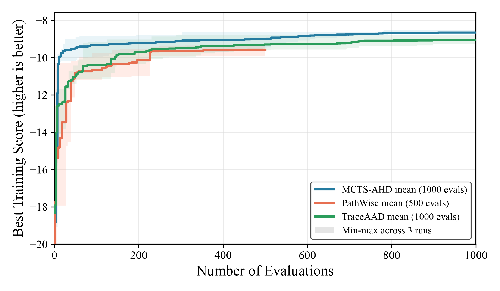

# CVRP-ACO Three-Method Comparison

Generated: `2026-07-12T17:45:15`

## Comparison protocol

All methods use `qwen3.6-27b-awq`, the same CVRP-ACO train/test split protocol, `n_ants=30`, `n_iterations=100`, and `aco_seed=1234`. Each method has three independent search runs. The table reports the held-out route-length objective mean +/- sample std; lower is better.

| Method | Search budget | test_50 objective | test_100 objective |
|---|---:|---:|---:|
| MCTS-AHD | 1000 | 8.961703 +/- 0.179934 | 15.114426 +/- 0.316653 |
| PathWise | 500 | 9.794713 +/- 0.271561 | 16.873145 +/- 0.448812 |
| TraceAAD | 1000 | 9.328123 +/- 0.174835 | 15.954865 +/- 0.442098 |

PathWise uses a 500-evaluation search budget, while MCTS-AHD and TraceAAD use 1000 evaluations. This is a comparison of the completed formal runs, not an equal-budget ablation.

## Search evolution

The solid lines are the mean best-so-far training score across three runs; bands show the min-max range. PathWise ends at 500 evaluations, while the other methods continue to 1000.
For readability, the plot y-axis starts at -20; early scores below -20 are intentionally clipped.

## Result sources

| Method | Authoritative result file | Evaluation artifact |
|---|---|---|
| MCTS-AHD | `mcts-ahd-qwen36-27b-cvrp-aco.md` | `LLM4AD/experiments/cvrp_aco/mcts_ahd/eval_20260712_all3/results.json` |
| PathWise | `pathwise-qwen36-27b-cvrp-aco.md` | `LLM4AD/experiments/cvrp_aco/pathwise/eval_20260712_all3/results.json` |
| TraceAAD | `traceaad-qwen36-27b-cvrp-aco.md` | `LLM4AD/experiments/cvrp_aco/traceaad/eval_20260712_all3/results.json` |

Evaluation scripts and run artifacts remain under `experiments/cvrp_aco/`; the method-specific pages contain every run-level test value and configuration.
