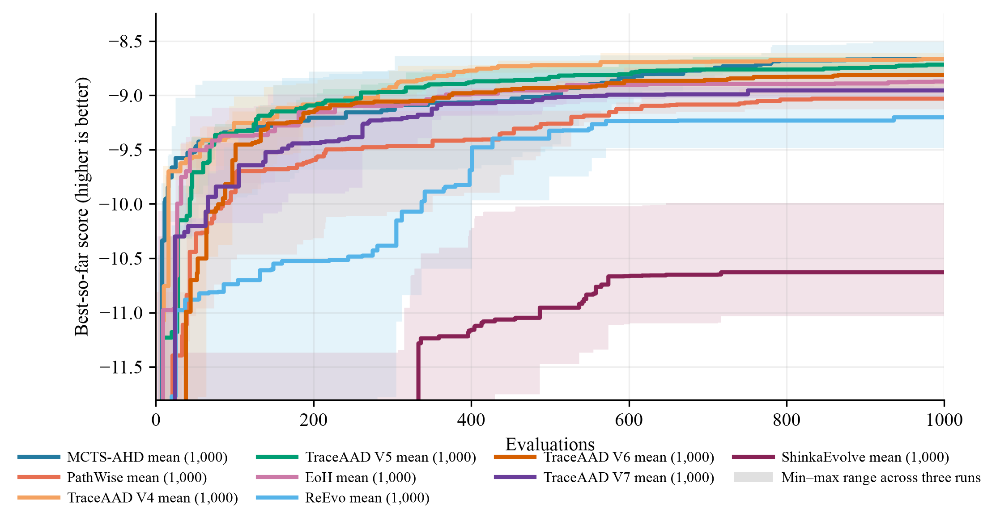

# CVRP-ACO 实验结果

## 实验设置与比较口径

本页比较 CVRP-ACO 方法在固定搜索协议下的 held-out 最优路径长度。比较单位是某方法在一个测试规模上的一次完整搜索运行。Qwen3.6-27B 在 10 个 CVRP50 实例上用于搜索，在 CVRP50/100 各 64 个实例上用于测试；搜索和测试使用 30 ants、100 iterations、`aco_seed=1234`。每种方法独立运行 3 次，搜索预算均为 1000。指标为平均最优路径长度，越低越好。

表中每个数值为 3 次运行的 held-out 均值 ± 样本标准差；± 仅描述运行间变异，不是置信区间，也不支持统计显著性判断。加粗表示该列的最佳均值。

## 三次运行平均

| 方法 | CVRP50 | CVRP100 |
| --- | ---: | ---: |
| MCTS-AHD | **8.961703 ± 0.179934** | **15.114426 ± 0.316653** |
| PathWise | 9.354221 ± 0.122157 | 15.905908 ± 0.241743 |
| TraceAAD V4 | 9.129223 ± 0.129956 | 15.413780 ± 0.294039 |
| TraceAAD V5 | 9.038972 ± 0.091240 | 15.428279 ± 0.229195 |
| TraceAAD V6 | 9.188645 ± 0.183330 | 15.631601 ± 0.263103 |
| TraceAAD V7 | 9.265195 ± 0.068425 | 15.978142 ± 0.143540 |
| EoH | 9.069143 ± 0.035767 | 15.479988 ± 0.123083 |
| ReEvo | 9.471978 ± 0.403672 | 16.025671 ± 0.650593 |
| ShinkaEvolve | 10.977667 ± 0.638444 | 18.553882 ± 1.311360 |

### 结果解释与限制

MCTS-AHD 在 CVRP50 和 CVRP100 的报告均值均为该列最低值。对应样本标准差为 0.179934 和 0.316653；该均值排序不应解释为统计显著性。结论限于给定 CVRP 实例、`aco_seed=1234`、搜索预算、评估设置和 3 次独立运行，不能据此推断对其他实例或运行预算的普遍优势。

搜索曲线提供搜索过程的补充证据，不能替代上述 held-out 结果。

## 可复现性工件

正式工件：V4 位于
[`traceaad_v4/version4`](../../../experiments/cvrp_aco/traceaad_v4/version4/)，
V5 位于
[`traceaad_v5/version5`](../../../experiments/cvrp_aco/traceaad_v5/version5/)（正式批次
`20260728_151736`；测试
[`eval_best_20260728_151736`](../../../experiments/cvrp_aco/traceaad_v5/eval_best_20260728_151736/)），
EoH 位于
[`eoh`](../../../experiments/cvrp_aco/eoh/)（批次
`eoh_paper_20260729_2350`；测试
[`eval_best_eoh_paper_20260730`](../../../experiments/cvrp_aco/eoh/eval_best_eoh_paper_20260730/)），
PathWise / ReEvo 位于对应目录；测试
[`eval_best_fair1000_20260730`](../../../experiments/cvrp_aco/pathwise/eval_best_fair1000_20260730/)
/
[`eval_best_fair1000_20260730`](../../../experiments/cvrp_aco/reevo/eval_best_fair1000_20260730/)）。
TraceAAD V6 位于
[`traceaad_v6/version6`](../../../experiments/cvrp_aco/traceaad_v6/version6/)（正式批次
`v6_20260802_170400`；测试
[`eval_best_20260803`](../../../experiments/cvrp_aco/traceaad_v6/eval_best_20260803/)），
TraceAAD V7 位于
[`traceaad_v7/version7`](../../../experiments/cvrp_aco/traceaad_v7/version7/)（正式批次
`v7_20260804_001931`；测试
[`eval_best_20260804`](../../../experiments/cvrp_aco/traceaad_v7/eval_best_20260804/)），
ShinkaEvolve 位于
[`shinka_evo`](../../../experiments/cvrp_aco/shinka_evo/)（批次
`fair1000_20260730_1755`；测试
[`eval_best_fair1000_20260730`](../../../experiments/cvrp_aco/shinka_evo/eval_best_fair1000_20260730/)）。
