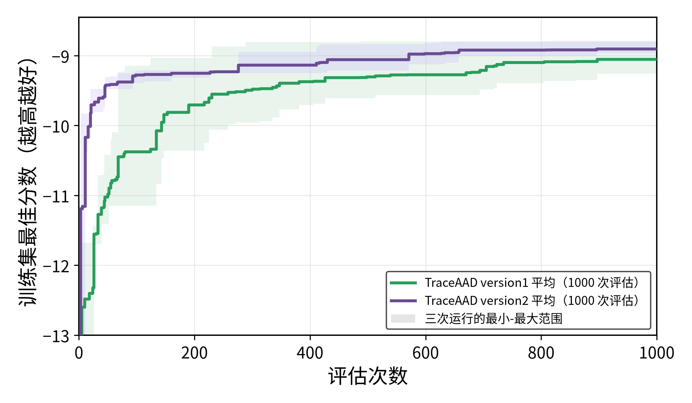

# CVRP-ACO 实验结果

## 实验参数

| 项目 | 配置 |
|---|---|
| 模型 | `Qwen3.6-27B` |
| 训练集 | `train`：10 个 CVRP50 实例，车辆容量 50 |
| 测试集 | `test_50`、`test_100`：每个 64 个实例 |
| ACO 参数 | 30 ants，100 iterations，`aco_seed=1234` |
| LLM 参数 | `temperature=1.0`，`max_tokens=16384` |
| 重复次数 | 每种方法 3 次独立运行 |
| 搜索预算 | MCTS-AHD：1000；PathWise：500；TraceAAD v1/v2：1000 |
| 方法配置 | MCTS-AHD / PathWise 使用 4 个 evaluators；TraceAAD 使用 `trajectory_ucb` |
| 指标 | `objective` 为平均最优路径长度，越低越好；`score=-objective` |
| TraceAAD 版本 | version1：`experiments/cvrp_aco/traceaad/version1/`；version2：`experiments/cvrp_aco/traceaad/version2/`（`20260718_193305_cvrp_rep{1,2,3}`） |

## 运行结果

### 各次运行

| 方法 | Run | 最优 sample | 训练集 best score | test_50 objective | test_100 objective |
|---|---|---:|---:|---:|---:|
| MCTS-AHD | `20260711_115024` | 791 | -8.748028 | 9.017702 | 15.352108 |
| MCTS-AHD | `20260712_021911` | 875 | -8.739437 | 9.106978 | 15.236207 |
| MCTS-AHD | `20260712_021957` | 910 | -8.505311 | 8.760428 | 14.754962 |
| PathWise | `20260711_115024` | 196 | -9.902782 | 10.095988 | 17.388369 |
| PathWise | `20260711_192005` | 458 | -9.481940 | 9.719379 | 16.663910 |
| PathWise | `20260711_192010` | 459 | -9.294031 | 9.568771 | 16.567156 |
| TraceAAD v1 | `20260711_115024` | 486 | -8.799423 | 9.239211 | 15.800265 |
| TraceAAD v1 | `20260712_041631` | 897 | -9.260267 | 9.529545 | 16.453503 |
| TraceAAD v1 | `20260712_041658` | 735 | -9.102390 | 9.215612 | 15.610828 |
| TraceAAD v2 | `20260718_193305_cvrp_rep1` | 896 | -8.962280 | 9.247470 | 16.000802 |
| TraceAAD v2 | `20260718_193305_cvrp_rep2` | 817 | -8.788474 | 9.079252 | 15.536715 |
| TraceAAD v2 | `20260718_193305_cvrp_rep3` | 697 | -8.965728 | 9.311981 | 15.896280 |

### 三次运行平均

| 方法 | 搜索预算 | test_50 objective | test_100 objective |
|---|---:|---:|---:|
| MCTS-AHD | 1000 | **8.961703 ± 0.179934** | **15.114426 ± 0.316653** |
| PathWise | 500 | 9.794713 ± 0.271561 | 16.873145 ± 0.448812 |
| TraceAAD v1 | 1000 | 9.328123 ± 0.174835 | 15.954865 ± 0.442098 |
| TraceAAD v2 | 1000 | 9.212901 ± 0.120154 | 15.811265 ± 0.243444 |

## Artifact

- TraceAAD v2 测试评估：`experiments/cvrp_aco/traceaad/version2/eval_best_20260719_all3/results.json`
- TraceAAD v1 测试评估：`experiments/cvrp_aco/traceaad/version1/eval_20260712_all3/results.json`
- 评估命令：`uv run python experiments/cvrp_aco/evaluate_best_on_test.py <run_dirs...> --output-dir <eval_dir>`
- 绘图命令：`MPLCONFIGDIR=/tmp/matplotlib uv run python experiments/plotting/plot_cvrp_aco_three_method_search.py`

## 简单分析

- MCTS-AHD 在 `test_50` 和 `test_100` 上仍是四种配置中最低的平均 objective。
- TraceAAD version2 相对 version1，在两个测试 split 上的平均 objective 都更低，跨 run 波动也更小。
- PathWise 只使用 500 次 evaluation；与 1000 次预算的方法比较时需同时考虑预算差异。
