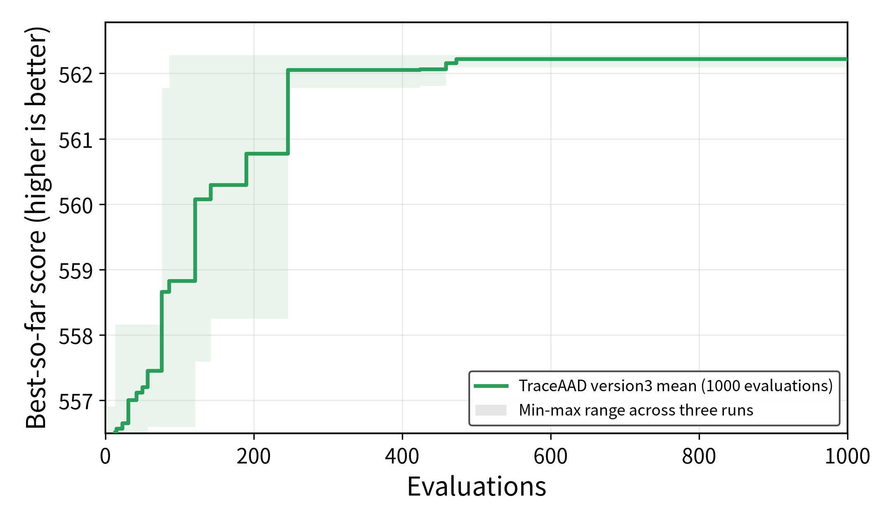

# Knapsack Construct 实验结果

## 新协议（训 KP100，测 KP50/100/200）

权威配置见 `docs/实验配置.md`。当前仅 TraceAAD v3 已按新协议完成训练与测试；MCTS-AHD / PathWise / TraceAAD v2 仍待按新规模重跑。

### 实验参数

| 项目 | 配置 |
|---|---|
| 模型 | `Qwen3.6-27B`（三源） |
| 训练集 | `n_instance=32`，`n_items=100`，`knapsack_capacity=100`，`seed=2024` |
| 测试集 | KP50/100/200 × 32，`capacity=100`，`seed=2025` |
| 重复次数 | 3 次独立运行 |
| 搜索预算 | TraceAAD v3：1000 |
| 指标 | 平均总价值，越高越好 |
| 测试方式 | 取每次搜索训练集 best heuristic，在各测试规模上完整评估 |
| TraceAAD 版本 | version3：`experiments/knapsack_construct/traceaad/version3/`（`20260720_233339_kp_v3_rep{1,2,3}`） |

### 各次运行

| 方法 | Run | 最优 sample | 训练集 best | KP50 | KP100 | KP200 |
|---|---|---:|---:|---:|---:|---:|
| TraceAAD v3 | `20260720_233339_kp_v3_rep1` | 473 | 562.281 | 456.656 | 568.656 | 673.500 |
| TraceAAD v3 | `20260720_233339_kp_v3_rep2` | 459 | 562.094 | 454.438 | 567.406 | 672.375 |
| TraceAAD v3 | `20260720_233339_kp_v3_rep3` | 86 | 562.281 | 455.969 | 568.656 | 673.812 |

### 三次运行平均

| 方法 | 搜索预算 | 训练集 | KP50 | KP100 | KP200 |
|---|---:|---:|---:|---:|---:|
| TraceAAD v3 | 1000 | 562.219 ± 0.108 | 455.688 ± 1.136 | 568.240 ± 0.722 | 673.229 ± 0.756 |

### Artifact

- TraceAAD v3 测试评估：`experiments/knapsack_construct/traceaad/version3/eval_best_20260720_233339/results.json`
- 评估命令：`uv run python experiments/knapsack_construct/evaluate_best_on_test.py <run_dirs...> --output-dir <eval_dir>`
- 绘图命令：`MPLCONFIGDIR=/tmp/matplotlib uv run python experiments/plotting/plot_knapsack_construct_three_method_search.py`

### 简单分析

- 三重复训练集分数几乎顶齐（562.09–562.28），跨 run 波动很小。
- 同分布 KP100 测试均值 **568.24**，略高于训练 best；KP50/KP200 外推分别为 455.69 / 673.23。
- 旧协议（训/测 KP50）分数不可与本表直接比较；待 MCTS / PathWise / v2 按新协议重跑后再做方法对比。

---

## 旧协议（训/测均为 `n_items=50`，历史）

> 下列结果仅作历史对照，不再作为权威口径。

### 实验参数

| 项目 | 配置 |
|---|---|
| 模型 | `Qwen3.6-27B`（rep1 zhong / rep2 server1 / rep3 Fang_lab） |
| 训练集 | `n_instance=32`，`n_items=50`，`knapsack_capacity=100`，`seed=2024` |
| 测试集 | 同规模，`seed=2025` |
| 重复次数 | 每种方法 3 次独立运行 |
| 搜索预算 | MCTS-AHD：1000；PathWise：500；TraceAAD v2：1000 |
| 指标 | 平均总价值，越高越好 |
| 测试方式 | 取每次搜索训练集 best heuristic，在 held-out `seed=2025` 上完整评估 |
| TraceAAD 版本 | version2：`experiments/knapsack_construct/traceaad/version2/` |
| 基线 | value/weight ratio：训练 467.656；测试 445.312 |

### 运行结果

#### 各次运行

| 方法 | Run | 最优 sample | 训练集 best | 测试 score |
|---|---|---:|---:|---:|
| MCTS-AHD | `20260719_223427_kp_rep1` | 771 | 473.438 | 454.500 |
| MCTS-AHD | `20260719_223427_kp_rep2` | 897 | 473.375 | 456.094 |
| MCTS-AHD | `20260719_223427_kp_rep3` | 173 | 473.625 | 456.656 |
| PathWise | `20260719_223427_kp_rep1` | 428 | 470.312 | 452.000 |
| PathWise | `20260719_223427_kp_rep2` | 384 | 472.406 | 453.312 |
| PathWise | `20260719_223427_kp_rep3` | 166 | 472.594 | 452.094 |
| TraceAAD v2 | `20260719_223427_kp_rep1` | 489 | 473.625 | 455.875 |
| TraceAAD v2 | `20260719_223427_kp_rep2` | 962 | 473.625 | 455.156 |
| TraceAAD v2 | `20260719_223427_kp_rep3` | 7 | 473.625 | 456.656 |

#### 三次运行平均

| 方法 | 搜索预算 | 训练集 score | 测试 score |
|---|---:|---:|---:|
| MCTS-AHD | 1000 | 473.479 ± 0.130 | 455.750 ± 1.118 |
| PathWise | 500 | 471.771 ± 1.266 | 452.469 ± 0.732 |
| TraceAAD v2 | 1000 | **473.625 ± 0.000** | **455.896 ± 0.750** |

### Artifact

- MCTS-AHD 测试评估：`experiments/knapsack_construct/mcts_ahd/eval_best_20260719_223427/results.json`
- PathWise 测试评估：`experiments/knapsack_construct/pathwise/eval_best_20260719_223427/results.json`
- TraceAAD v2 测试评估：`experiments/knapsack_construct/traceaad/version2/eval_best_20260719_223427/results.json`
