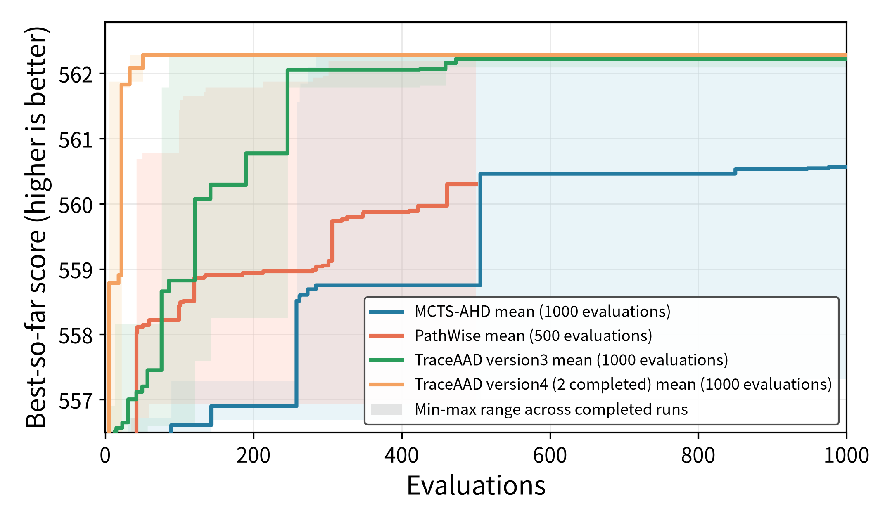

# Knapsack Construct 实验结果

> 下列结果按旧协议（训/测均为 `n_items=50`）。权威新配置为训 KP100、测 KP50/100/200，见 `docs/实验配置.md`。

## 实验参数

| 项目 | 配置 |
|---|---|
| 模型 | `Qwen3.6-27B`（rep1 zhong / rep2 server1 / rep3 Fang_lab） |
| 训练集 | `n_instance=32`，`n_items=50`，`knapsack_capacity=100`，`seed=2024` |
| 测试集 | 同规模，`seed=2025` |
| 重复次数 | 每种方法 3 次独立运行 |
| 搜索预算 | MCTS-AHD：1000；PathWise：500；TraceAAD v2：1000 |
| 指标 | 平均总价值，越高越好 |
| 测试方式 | 取每次搜索训练集 best heuristic，在 held-out `seed=2025` 上完整评估 |
| TraceAAD 版本 | version2：`experiments/knapsack_construct/traceaad/version2/` |
| 基线 | value/weight ratio：训练 467.656；测试 445.312 |

## 运行结果

### 各次运行

| 方法 | Run | 最优 sample | 训练集 best | 测试 score |
|---|---|---:|---:|---:|
| MCTS-AHD | `20260719_223427_kp_rep1` | 771 | 473.438 | 454.500 |
| MCTS-AHD | `20260719_223427_kp_rep2` | 897 | 473.375 | 456.094 |
| MCTS-AHD | `20260719_223427_kp_rep3` | 173 | 473.625 | 456.656 |
| PathWise | `20260719_223427_kp_rep1` | 428 | 470.312 | 452.000 |
| PathWise | `20260719_223427_kp_rep2` | 384 | 472.406 | 453.312 |
| PathWise | `20260719_223427_kp_rep3` | 166 | 472.594 | 452.094 |
| TraceAAD v2 | `20260719_223427_kp_rep1` | 489 | 473.625 | 455.875 |
| TraceAAD v2 | `20260719_223427_kp_rep2` | 962 | 473.625 | 455.156 |
| TraceAAD v2 | `20260719_223427_kp_rep3` | 7 | 473.625 | 456.656 |

### 三次运行平均

| 方法 | 搜索预算 | 训练集 score | 测试 score |
|---|---:|---:|---:|
| MCTS-AHD | 1000 | 473.479 ± 0.130 | 455.750 ± 1.118 |
| PathWise | 500 | 471.771 ± 1.266 | 452.469 ± 0.732 |
| TraceAAD v2 | 1000 | **473.625 ± 0.000** | **455.896 ± 0.750** |

## Artifact

- MCTS-AHD 测试评估：`experiments/knapsack_construct/mcts_ahd/eval_best_20260719_223427/results.json`
- PathWise 测试评估：`experiments/knapsack_construct/pathwise/eval_best_20260719_223427/results.json`
- TraceAAD v2 测试评估：`experiments/knapsack_construct/traceaad/version2/eval_best_20260719_223427/results.json`
- 评估命令：`uv run python experiments/knapsack_construct/evaluate_best_on_test.py <run_dirs...> --output-dir <eval_dir>`
- 绘图命令：`MPLCONFIGDIR=/tmp/matplotlib uv run python experiments/plotting/plot_knapsack_construct_three_method_search.py`

## 简单分析

- 同预算 1000 下，TraceAAD 与 MCTS-AHD 测试均值几乎持平（455.90 vs 455.75），TraceAAD 训练三路全部顶到 473.625 且测试方差更小。
- PathWise（预算 500）训练与测试均明显低于另两者，但仍大幅高于 ratio 基线（测试 445.31）。
- 三方法测试均高于 ratio；训练领先与测试领先方向一致，未见明显过拟合反转。
