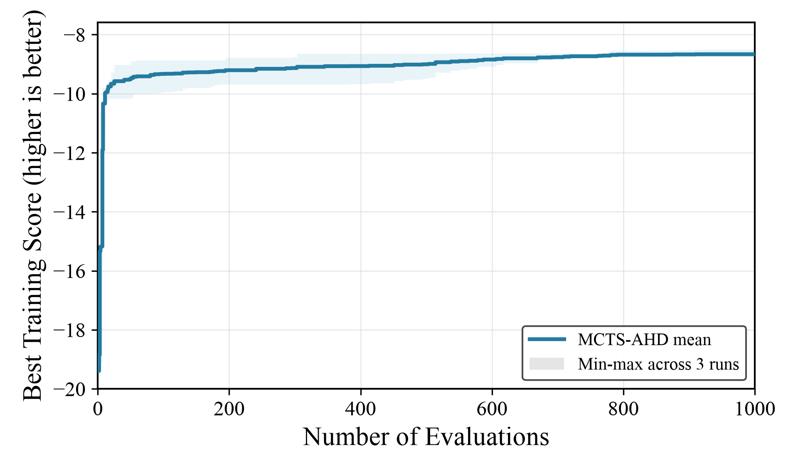

# MCTS-AHD + Qwen3.6-27B on CVRP-ACO

Generated: `2026-07-12T17:28:33`

## Experiment data

| Item | Value |
|---|---|
| Method / model | `mcts_ahd` / `qwen3.6-27b-awq` |
| Task | `cvrp_aco` |
| Search budget | `max_sample_nums=1000` per run |
| Search split | `train` (10 CVRP50 instances) |
| Test splits | `test_50`, `test_100` (64 instances each) |
| ACO configuration | `n_ants=30`, `n_iterations=100`, `aco_seed=1234` |
| Score semantics | score is negative mean best route length; higher score is better |
| Repeats | 3 independent completed runs |

The report uses the canonical 64-instance `test_50` and `test_100` held-out splits, matching the existing CVRP-ACO result protocol. The separate `paper_test_*` splits are not mixed into this comparison.

## Search runs

| Run | Status | Samples | Valid / failed | Best sample | Operator | Train best score | Duration | Artifact |
|---|---|---:|---:|---:|---|---:|---:|---|
| 20260711_115024 | `finished` | 1000 | 960 / 40 | 791 | `e2` | -8.748027892553 | 14.38 h | `LLM4AD/experiments/cvrp_aco/mcts_ahd/20260711_115024` |
| 20260712_021911 | `finished` | 1000 | 924 / 76 | 875 | `s1` | -8.739437070052 | 13.00 h | `LLM4AD/experiments/cvrp_aco/mcts_ahd/20260712_021911` |
| 20260712_021957 | `finished` | 1000 | 942 / 58 | 910 | `e2` | -8.505311193292 | 11.40 h | `LLM4AD/experiments/cvrp_aco/mcts_ahd/20260712_021957` |

## Held-out test results

Objective is mean best route length on the split; lower is better.

| Split | Run | Best sample | Operator | Objective | Score | Eval seconds |
|---|---|---:|---|---:|---:|---:|
| `test_50` | 20260711_115024 | 791 | `e2` | 9.017702375610 | -9.017702375610 | 11.26 |
| `test_50` | 20260712_021911 | 875 | `s1` | 9.106977975132 | -9.106977975132 | 11.63 |
| `test_50` | 20260712_021957 | 910 | `e2` | 8.760427853330 | -8.760427853330 | 11.25 |
| `test_100` | 20260711_115024 | 791 | `e2` | 15.352108370878 | -15.352108370878 | 18.96 |
| `test_100` | 20260712_021911 | 875 | `s1` | 15.236206680126 | -15.236206680126 | 18.80 |
| `test_100` | 20260712_021957 | 910 | `e2` | 14.754962177435 | -14.754962177435 | 18.76 |

## Three-run summary

Mean and sample standard deviation use the three independent run objectives (ddof=1).

| Split | Mean objective | Objective std | Mean score | Score std |
|---|---:|---:|---:|---:|
| `test_50` | 8.961702734691 | 0.179933922782 | -8.961702734691 | 0.179933922782 |
| `test_100` | 15.114425742813 | 0.316652556607 | -15.114425742813 | 0.316652556607 |

## Artifacts and commands

- Complete evaluation artifact: `LLM4AD/experiments/cvrp_aco/mcts_ahd/eval_20260712_all3/results.json`
- Best programs used for evaluation are stored beside `results.json`.
- Shared evaluator: `experiments/cvrp_aco/evaluate_best_on_test.py`.
- Evaluation command:

```bash
uv run python experiments/cvrp_aco/evaluate_best_on_test.py \
  experiments/cvrp_aco/mcts_ahd/20260711_115024 \
  experiments/cvrp_aco/mcts_ahd/20260712_021911 \
  experiments/cvrp_aco/mcts_ahd/20260712_021957 \
  --output-dir experiments/cvrp_aco/mcts_ahd/eval_20260712_all3 \
  --splits test_50,test_100 --workers 16
```

## Search evolution



The curve shows the mean best-so-far training score across the three runs; the band is the min-max range. Plot script: `docs/results/figures/plot_cvrp_aco_three_method_search.py`.
For readability, the plot y-axis starts at -20; early scores below -20 are intentionally clipped.

Method parameters inherited from the run config include `num_evaluators=4`.
