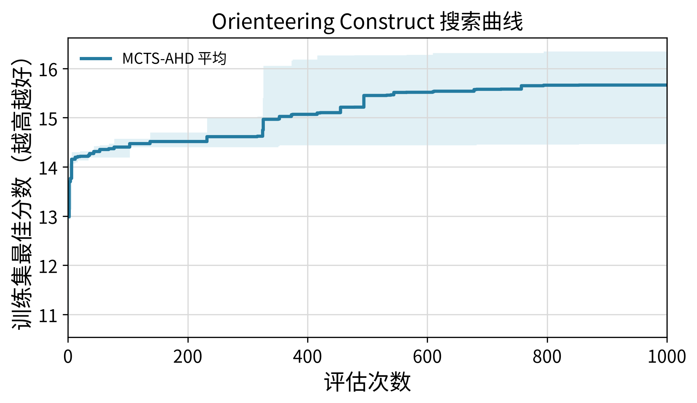

# MCTS-AHD Orienteering Construct 实验结果

## 实验参数

| 项目 | 配置 |
|---|---|
| 模型 | `qwen3.6-27b-awq` |
| 训练集 | OP50，16 个实例，`seed=2024` |
| 测试集 | OP50、OP100、OP200，各 16 个实例，`seed=2025` |
| 重复次数 | 3 次独立运行 |
| 搜索预算 | MCTS-AHD：1000 次评估 |
| 方法配置 | `init_size=4`、`pop_size=10`、`selection_num=2`、4 个 sampler、4 个 evaluator、`alpha=0.5`、`lambda_0=0.1` |
| 指标 | 平均 collected prize，越高越好 |
| 测试方式 | 取每次搜索得到的训练集 best heuristic，在固定 held-out 测试集上完整评估 |

## 运行结果

### 各次运行

| Run | 搜索 artifact | 最优 sample | 操作符 | 训练集 best score | OP50 | OP100 | OP200 |
|---|---|---:|---|---:|---:|---:|---:|
| `20260713_125413` | `experiments/orienteering_construct/mcts_ahd/20260713_125413` | 853 | m1 | 14.464375 | 14.817500 | 27.597500 | 50.165625 |
| `20260713_125707` | `experiments/orienteering_construct/mcts_ahd/20260713_125707` | 757 | e2 | 16.175000 | 16.234375 | 31.222500 | 58.271875 |
| `20260713_125712` | `experiments/orienteering_construct/mcts_ahd/20260713_125712` | 794 | m2 | 16.348750 | 16.388750 | 32.603750 | n/a |

### 三次运行平均

| 测试规模 | 成功 run 数 | mean ± std |
|---|---:|---:|
| `OP50` | 3/3 | 15.813542 ± 0.866044 |
| `OP100` | 3/3 | 30.474583 ± 2.585569 |
| `OP200` | 2/3 | 54.218750 ± 5.731984 |

## Artifact

- 测试评估汇总：`experiments/orienteering_construct/mcts_ahd/eval_best_qwen36_27b_20260714/results.json`
- 训练曲线：`docs/results/mcts-ahd-qwen36-27b-orienteering-construct-search-curve.png`
- 三个 best heuristic 程序保存在测试评估目录下，与 `results.json` 同目录。

## 简单分析

- OP50 和 OP100 的三个重复均成功完成测试，MCTS-AHD 的跨 run 平均 collected prize 分别为 15.813542 和 30.474583。
- OP200 的第三个 best heuristic 在 120 秒单次安全评估上限内超时，因此 OP200 的 mean ± std 只基于 2/3 个成功 run，不能视为完整三次重复结果。
- 不同测试规模的 prize 总量不同，分数不应跨 OP50/100/200 直接比较；应在同一规模内比较方法。
