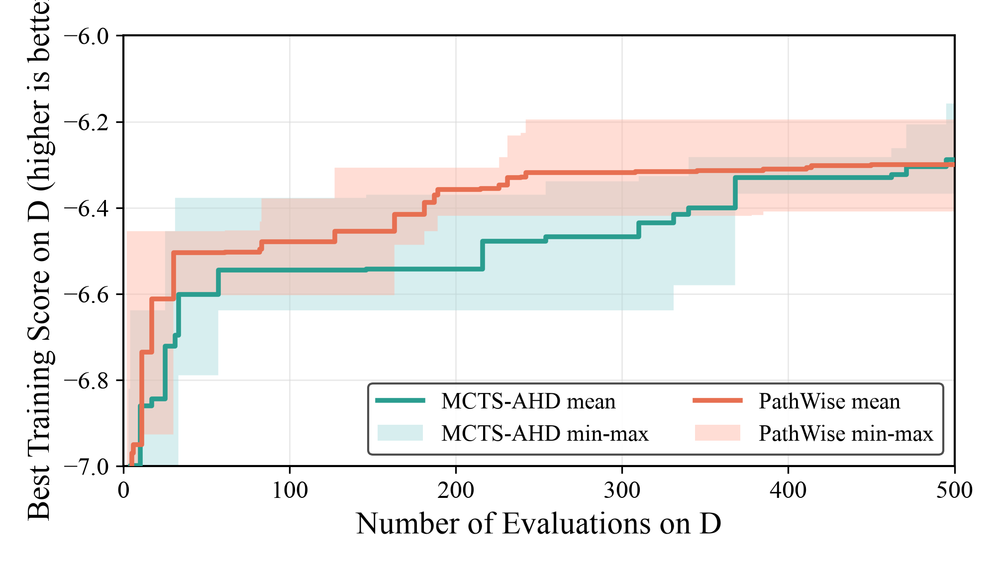

# MCTS-AHD + Qwen3.6-27B on TSP Construct

日期：2026-07-10

## 实验数据

| 数据类型 | 路径 |
|---|---|
| 三次搜索 run | `LLM4AD/experiments/tsp_construct/mcts_ahd/20260709_213505`<br>`LLM4AD/experiments/tsp_construct/mcts_ahd/20260709_213507`<br>`LLM4AD/experiments/tsp_construct/mcts_ahd/20260709_213510` |
| 500 代测试结果 JSON | `LLM4AD/experiments/tsp_construct/mcts_ahd/eval_prefix500_qwen36_27b_20260710/results.json` |
| 500 代测试评估脚本 | `LLM4AD/experiments/tsp_construct/mcts_ahd/evaluate_prefix500_on_eval.py` |
| 原始 1000 代结果 JSON | `LLM4AD/experiments/tsp_construct/mcts_ahd/eval_best_qwen36_27b_20260710/results.json` |

## 实验配置

| 项目 | 配置 |
|---|---|
| 方法 / 模型 | `mcts_ahd` / `qwen3.6-27b-awq` |
| 任务 | `tsp_construct` |
| 搜索 budget（本结果口径） | 每个已完成的 `max_sample_nums=1000` run 截取前 500 次 evaluation；取该前缀的 best heuristic |
| 搜索训练集 | `problem_size=50`, `n_instance=16`, `seed=2024` |
| 重复次数 | 3 个独立 run |
| 测试规模 | TSP50、TSP100、TSP200 |
| 测试集 | `n_instance=16`, `seed=2025` |
| 评估方式 | 每个 run 的 best heuristic 在测试集上完整运行 |
| 指标 | `score = - average_tour_length`；score 越高、objective 越低越好 |

评估命令：

```bash
cd /home/fang/code/LLM4AD/LLM4AD
uv run python experiments/tsp_construct/mcts_ahd/evaluate_prefix500_on_eval.py
```

每个 MCTS run 的前 500 次 evaluation 中最优样本分别为：`20260709_213505` 的 sample 368、`20260709_213507` 的 sample 254、`20260709_213510` 的 sample 495；均由 `e2` 产生。训练分复算与搜索 artifact 完全一致。

## 三次测试结果（等 500 evaluation 预算）

| 测试集 | 来源 run | best sample | operator | score | objective | 运行时间 |
|---|---|---:|---|---:|---:|---:|
| TSP50 | `20260709_213505` | 368 | `e2` | `-6.548384389629035` | `6.548384389629035` | `0.197s` |
| TSP50 | `20260709_213507` | 254 | `e2` | `-6.388790913633086` | `6.388790913633086` | `0.051s` |
| TSP50 | `20260709_213510` | 495 | `e2` | `-6.168461914477591` | `6.168461914477591` | `1.212s` |
| TSP100 | `20260709_213505` | 368 | `e2` | `-9.113503189756862` | `9.113503189756862` | `1.075s` |
| TSP100 | `20260709_213507` | 254 | `e2` | `-8.964275539925248` | `8.964275539925248` | `0.051s` |
| TSP100 | `20260709_213510` | 495 | `e2` | `-8.522714202071517` | `8.522714202071517` | `11.211s` |
| TSP200 | `20260709_213505` | 368 | `e2` | `-12.85041863795713` | `12.85041863795713` | `7.688s` |
| TSP200 | `20260709_213507` | 254 | `e2` | `-12.251272711107053` | `12.251272711107053` | `0.294s` |
| TSP200 | `20260709_213510` | 495 | `e2` | timeout | — | `60.091s` |

## 多次平均结果（等 500 evaluation 预算）

| 测试集 | 平均 score | 平均 objective | objective sample std |
|---|---:|---:|---:|
| TSP50 | `-6.368545739246571` | `6.368545739246571` | `0.1907686349894951` |
| TSP100 | `-8.86683097725121` | `8.86683097725121` | `0.30721244943624876` |
| TSP200 | `-12.550845674532091`（仅 2/3 成功） | `12.550845674532091`（仅 2/3 成功） | `0.42366014779598904`（仅 2/3 成功） |

TSP200 的第三个前缀最优在 60 秒内未完成；以 PathWise 单-run 评估入口按其 120 秒配置复测也没有返回可用分数。因此该规模不能作为完整三次重复的 500-budget 对比结论，表中保留成功的两次结果和超时事实，不以替代候选补齐。

## 搜索演化曲线



两条实线均为三次独立 run 的逐 evaluation 平均 best-so-far training score；色带为相应三个 run 的最小值至最大值区间。两种方法都截断在 500 evaluations。绘图脚本：`docs/results/figures/plot_mcts_ahd_pathwise_tsp_construct_search_500.py`。

原始 MCTS-AHD 的 1000 evaluation 全程曲线和全程最优测试结果仍保留在 `mcts-ahd-qwen36-27b-tsp-construct-search-curve.{png,pdf}` 与上表所列原始 JSON 中，不再作为与 PathWise 500-budget 的主结果口径。
