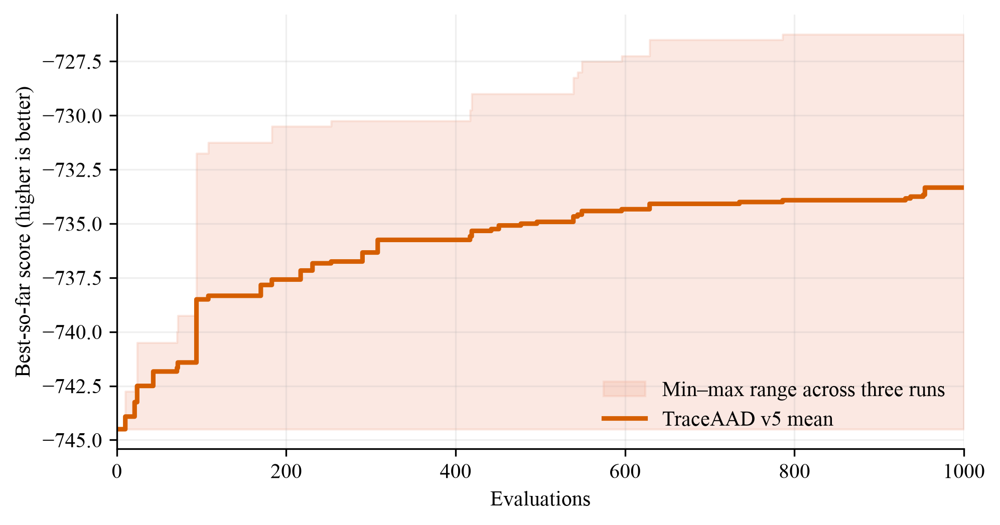

# Online Bin Packing 实验结果

本页同时保留两套协议的结果，不可混比：

1. **旧单容量训练协议**：只在 `5k,C=100` 上搜索；历史 MCTS / PathWise / TraceAAD v2–v4 结果见下方“历史结果”。
2. **当前多容量协议**（权威）：训练使用 `1k/5k × C=100/500` 四实例；测试使用不同 item 序列的 `1k/5k/10k × C=100/500`，仅 `10k` 为 OOD。TraceAAD v5 首轮结果见“新协议结果”。

## 新协议结果（TraceAAD v5）

### 实验参数

| 项目 | 配置 |
|---|---|
| 模型 | `Qwen3.6-27B-NVFP4`（Zhong） |
| 训练集 | 4 个固定实例，`1k/5k × capacity=100/500`，`seed=2024` |
| 测试集 | `1k/5k/10k × C∈{100,500}`，各 5 实例，`seed=2025`；仅 10k 为 OOD |
| 重复次数 | 3 次独立运行 |
| 搜索预算 | 1000 |
| 指标 | `score = -mean(bins used)`，越高越好；下表报告平均箱数（越低越好） |
| 运行批次 | `20260724_220827_obp_v5_rep{1,2,3}` |

### 训练集 best

| Run | 最优 sample | 算子 | 训练集 best score |
|---|---:|---|---:|
| `20260724_220827_obp_v5_rep1` | 786 | `trace_synthesize` | -726.250 |
| `20260724_220827_obp_v5_rep2` | 1 | `init` | -744.500 |
| `20260724_220827_obp_v5_rep3` | 954 | `trace_refine` | -729.250 |

三次训练均值：**-733.333 ± 9.786**。rep2 最优样本停在初始化，是训练均值被拉低的主因。

### 多规模测试（平均箱数，越低越好）

#### 三次运行平均

| 方法 | 预算 | 1k_100 | 5k_100 | 10k_100 | 1k_500 | 5k_500 | 10k_500 |
|---|---:|---:|---:|---:|---:|---:|---:|
| TraceAAD v5 | 1000 | 414.133 ± 4.908 | 2049.133 ± 35.643 | 4090.800 ± 67.208 | 82.200 ± 2.425 | 404.200 ± 2.646 | 805.867 ± 2.301 |

#### 各次运行

| Run | 1k_100 | 5k_100 | 10k_100 | 1k_500 | 5k_500 | 10k_500 |
|---|---:|---:|---:|---:|---:|---:|
| rep1 | 411.4 | 2022.4 | 4039.2 | 80.8 | 402.2 | 803.6 |
| rep2 | 419.8 | 2089.6 | 4166.8 | 80.8 | 403.2 | 805.8 |
| rep3 | 411.2 | 2035.4 | 4066.4 | 85.0 | 407.2 | 808.2 |

### Artifact（新协议）

- TraceAAD v5 测试：`experiments/online_bin_packing/traceaad_v5/version5/eval_best_20260724_220827_multiscale/results.json`
- 绘图脚本：`experiments/plotting/plot_online_bin_packing_traceaad_v5_search.py`
- 评估命令：`uv run python experiments/online_bin_packing/evaluate_best_on_test.py <run_dirs...> --output-dir <eval_dir>`
- 绘图命令：`MPLCONFIGDIR=/tmp/matplotlib uv run python experiments/plotting/plot_online_bin_packing_traceaad_v5_search.py`

### 简单分析（新协议）

- 这是当前权威协议下的首个完整方法结果；MCTS-AHD / PathWise / TraceAAD v4 仍待按新协议重跑，因此本表暂不与旧协议分数横向比较。
- `C=500` 六个规模中三次运行均保持正常箱数，没有出现旧协议 v4 rep1 那种每件一箱的崩溃。
- `C=100` 上 rep2 明显更差，与其训练最优停在 `init` 一致；`C=500` 上三次更接近。

---

## 历史结果（旧单容量训练协议）

MCTS-AHD / PathWise / TraceAAD v2 / TraceAAD v3 / TraceAAD v4 已完成旧
`5k,C=100` 搜索协议下的多规模 held-out 测试。下列数值仅作历史证据保留，
不能与上方新协议结果混为同一口径。

### 实验参数

| 项目 | 配置 |
|---|---|
| 训练集（旧协议） | Weibull，`n_instances=5`，`n_items=5000`，`capacity=100`，`seed=2024` |
| 测试集 | Weibull，`seed=2025`；规模 `1k/5k/10k × C∈{100,500}`，各 5 实例；物品裁剪上限 100 |
| 重复次数 | 每种方法 3 次独立运行 |
| 搜索预算 | MCTS-AHD：1000；PathWise：500；TraceAAD v2/v3/v4：1000 |
| 指标 | `score = -mean(bins used)`，越高越好；下表报告平均箱数（越低越好） |
| TraceAAD 版本 | version2：`experiments/online_bin_packing/traceaad/version2/`；version3：`.../version3/`（`20260720_233339_obp_v3_rep{1,2,3}`）；version4：`.../version4/`（`20260723_204526_obp_v4_rep{1,2,3}`） |

### 训练集 best（搜索过程）

| 方法 | Run | 最优 sample | 训练集 best score |
|---|---|---:|---:|
| MCTS-AHD | `20260719_150058_obp_rep1` | 886 | -2027.6 |
| MCTS-AHD | `20260719_150058_obp_rep2` | 848 | -2032.8 |
| MCTS-AHD | `20260719_150058_obp_rep3` | 996 | -2025.8 |
| PathWise | `20260719_150058_obp_rep1` | 473 | -2091.0 |
| PathWise | `20260719_150058_obp_rep2` | 448 | -2088.2 |
| PathWise | `20260719_150058_obp_rep3` | 1 | -2091.8 |
| TraceAAD v2 | `20260719_150058_obp_rep1` | 968 | -2026.2 |
| TraceAAD v2 | `20260719_150058_obp_rep2` | 241 | -2041.2 |
| TraceAAD v2 | `20260719_150058_obp_rep3` | 810 | -2030.4 |
| TraceAAD v3 | `20260720_233339_obp_v3_rep1` | 875 | -2032.8 |
| TraceAAD v3 | `20260720_233339_obp_v3_rep2` | 972 | -2030.0 |
| TraceAAD v3 | `20260720_233339_obp_v3_rep3` | 930 | -2022.6 |
| TraceAAD v4 | `20260723_204526_obp_v4_rep1` | 588 | -2024.2 |
| TraceAAD v4 | `20260723_204526_obp_v4_rep2` | 984 | -2023.0 |
| TraceAAD v4 | `20260723_204526_obp_v4_rep3` | 225 | -2023.4 |

三次训练均值：MCTS **-2028.733 ± 3.635**；PathWise -2090.333 ± 1.890；TraceAAD v2 -2032.600 ± 7.738；TraceAAD v3 **-2028.467 ± 5.270**；TraceAAD v4 **-2023.533 ± 0.611**。

### 多规模测试（平均箱数，越低越好）

#### 三次运行平均

| 方法 | 预算 | 1k_100 | 5k_100 | 10k_100 | 1k_500 | 5k_500 | 10k_500 |
|---|---:|---:|---:|---:|---:|---:|---:|
| MCTS-AHD | 1000 | **415.000 ± 3.995** | **2030.600 ± 2.425** | **4052.533 ± 8.705** | 86.133 ± 6.700 | 408.600 ± 5.600 | 812.400 ± 5.200 |
| PathWise | 500 | 421.533 ± 0.462 | 2095.067 ± 1.973 | 4188.467 ± 3.349 | **81.600 ± 0.000** | **404.600 ± 0.000** | **809.267 ± 0.115** |
| TraceAAD v2 | 1000 | 415.800 ± 4.303 | 2035.467 ± 8.298 | 4063.400 ± 15.470 | 85.000 ± 6.063 | 407.733 ± 5.601 | 811.933 ± 5.116 |
| TraceAAD v3 | 1000 | 414.800 ± 2.107 | 2031.600 ± 5.173 | 4053.733 ± 9.309 | 117.200 ± 35.433 | 545.200 ± 207.404 | 1080.867 ± 423.988 |
| TraceAAD v4 | 1000 | 415.467 ± 2.873 | **2026.267 ± 0.416** | **4044.000 ± 2.821** | 387.667 ± 530.296 | 1936.133 ± 2653.386 | 3872.267 ± 5306.773 |

#### 各次运行（平均箱数）

| 方法 | Run | 1k_100 | 5k_100 | 10k_100 | 1k_500 | 5k_500 | 10k_500 |
|---|---|---:|---:|---:|---:|---:|---:|
| MCTS-AHD | rep1 | 412.4 | 2029.2 | 4052.2 | 83.2 | 406.2 | 809.6 |
| MCTS-AHD | rep2 | 413.0 | 2033.4 | 4061.4 | 81.4 | 404.6 | 809.2 |
| MCTS-AHD | rep3 | 419.6 | 2029.2 | 4044.0 | 93.8 | 415.0 | 818.4 |
| PathWise | rep1 | 421.8 | 2096.0 | 4190.4 | 81.6 | 404.6 | 809.2 |
| PathWise | rep2 | 421.0 | 2092.8 | 4184.6 | 81.6 | 404.6 | 809.4 |
| PathWise | rep3 | 421.8 | 2096.4 | 4190.4 | 81.6 | 404.6 | 809.2 |
| TraceAAD v2 | rep1 | 411.6 | 2028.0 | 4051.2 | 92.0 | 414.2 | 817.8 |
| TraceAAD v2 | rep2 | 415.6 | 2044.4 | 4080.8 | 81.4 | 404.4 | 808.4 |
| TraceAAD v2 | rep3 | 420.2 | 2034.0 | 4058.2 | 81.6 | 404.6 | 809.6 |
| TraceAAD v3 | rep1 | 416.8 | 2036.2 | 4062.8 | 102.6 | 435.8 | 854.4 |
| TraceAAD v3 | rep2 | 415.0 | 2032.6 | 4054.2 | 91.4 | 415.4 | 818.2 |
| TraceAAD v3 | rep3 | 412.6 | 2026.0 | 4044.2 | 157.6 | 784.4 | 1570.0 |
| TraceAAD v4 | rep1 | 416.6 | 2026.4 | 4041.4 | 1000.0 | 5000.0 | 10000.0 |
| TraceAAD v4 | rep2 | 412.2 | 2026.6 | 4047.0 | 81.6 | 403.8 | 807.6 |
| TraceAAD v4 | rep3 | 417.6 | 2025.8 | 4043.6 | 81.4 | 404.6 | 809.2 |

### Artifact（旧协议）

- MCTS-AHD：`experiments/online_bin_packing/mcts_ahd/eval_best_20260719_150058_multiscale/results.json`
- PathWise：`experiments/online_bin_packing/pathwise/eval_best_20260719_150058_multiscale/results.json`
- TraceAAD v2：`experiments/online_bin_packing/traceaad/version2/eval_best_20260719_150058_multiscale/results.json`
- TraceAAD v3：`experiments/online_bin_packing/traceaad/version3/eval_best_20260720_233339_multiscale/results.json`
- TraceAAD v4：`experiments/online_bin_packing/traceaad/version4/eval_best_20260723_204526_multiscale/results.json`
- 评估命令：`uv run python experiments/online_bin_packing/evaluate_best_on_test.py <run_dirs...> --output-dir <eval_dir>`
- 绘图命令：`MPLCONFIGDIR=/tmp/matplotlib uv run python experiments/plotting/plot_online_bin_packing_three_method_search.py`

### 简单分析（旧协议）

- **C=100（与训练同容量）**：v4 在 5k/10k 上取得当时最好均值（2026.3 / 4044.0），三次运行的方差也很小；1k 上与 MCTS/v3 接近。
- **C=500（旧协议中的容量外推）**：v4 rep2/rep3 保持稳定并接近 PathWise，但 rep1 在三个规模上都退化为每件物品使用一个新箱（1000/5000/10000），使 v4 聚合均值和方差失去竞争力。
- 旧协议结果不能替代新协议重跑，也不能与上方 TraceAAD v5 新协议分数直接比较。
