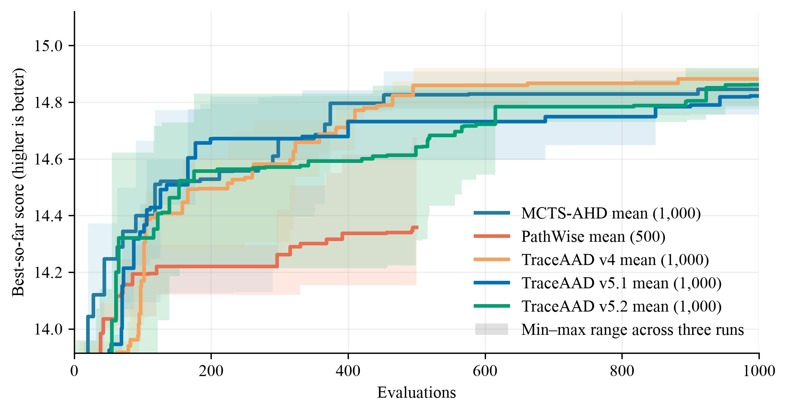

# OP-ACO 实验结果

## 实验设置与比较口径

本页比较 OP-ACO 方法在固定搜索协议下的 held-out collected prize。比较单位是某方法在一个测试规模上的一次完整搜索运行。Qwen3.6-27B 在 OP50 × 5（`seed=1234`）上用于搜索，在 OP50/100/200 各 64 个实例（`seed=4567`）上用于测试；搜索和测试使用 20 ants、50 iterations。每种方法独立运行 3 次，搜索预算均为 1000。指标为平均 collected prize，越高越好。

表中每个数值为 3 次运行的 held-out 均值 ± 样本标准差；± 仅描述运行间变异，不是置信区间，也不支持统计显著性判断。加粗表示该列的最佳均值。

## 三次运行平均

| 方法 | OP50 | OP100 | OP200 |
| --- | ---: | ---: | ---: |
| MCTS-AHD | **15.125559 ± 0.100494** | 30.512176 ± 0.526601 | 54.894583 ± 1.613211 |
| PathWise | 15.038228 ± 0.097637 | 30.324539 ± 0.319138 | 54.214323 ± 0.545583 |
| TraceAAD V4 | 15.069351 ± 0.090613 | 30.216914 ± 0.673457 | 53.509375 ± 2.611692 |
| TraceAAD V5 | 15.111948 ± 0.115030 | **30.710591 ± 0.245109** | **55.792500 ± 0.613045** |
| TraceAAD V6 | 14.957832 ± 0.046858 | 29.705866 ± 0.344617 | 52.015729 ± 1.409646 |
| TraceAAD V7 | 15.038097 ± 0.152669 | 30.055356 ± 0.666976 | 53.636667 ± 2.117391 |
| TraceAAD V8 | 14.930511 ± 0.055848 | 30.238432 ± 0.237306 | 54.048125 ± 1.112009 |
| TraceAAD V8.2 | 15.099413 ± 0.022836 | 30.488170 ± 0.475165 | 54.605625 ± 1.812693 |
| TraceAAD V8.3 | 14.860355 ± 0.207994 | 29.819902 ± 0.622454 | 52.740625 ± 1.850203 |
| EoH | 15.119813 ± 0.187204 | 30.445387 ± 0.455741 | 54.754948 ± 1.398744 |
| ReEvo | 14.858840 ± 0.367110 | 30.237583 ± 0.818002 | 54.894583 ± 1.844302 |

### 结果解释与限制

按均值排序，MCTS-AHD 在 OP50 的报告均值最高，TraceAAD V5 在 OP100 和 OP200 的报告均值最高。V8.2 三规模均值均高于 V8，但未取得任一列最佳；V8.3 三规模均值均低于 V8 / V8.2。相应的运行间样本标准差见表；这些排序不应解释为统计显著性。结论限于给定 OP 实例、`seed=4567`、搜索预算、ACO 设置和 3 次独立运行，不能据此推断对其他实例或规模的普遍优势。

搜索曲线提供搜索过程的补充证据，不能替代上述 held-out 结果。

## 可复现性工件

正式工件：V4 位于
[`traceaad_v4/version4`](../../../experiments/op_aco/traceaad_v4/version4/)，
V5 位于
[`traceaad_v5/version5`](../../../experiments/op_aco/traceaad_v5/version5/)（正式批次
`20260728_151736`；测试
[`eval_best_20260728_151736`](../../../experiments/op_aco/traceaad_v5/eval_best_20260728_151736/)），
EoH 位于
[`eoh`](../../../experiments/op_aco/eoh/)（批次
`eoh_paper_20260729_2350`；测试
[`eval_best_eoh_paper_20260730`](../../../experiments/op_aco/eoh/eval_best_eoh_paper_20260730/)），
PathWise 位于
[`pathwise`](../../../experiments/op_aco/pathwise/)（批次
`fair1000_20260730_1755`；测试
[`eval_best_fair1000_20260730`](../../../experiments/op_aco/pathwise/eval_best_fair1000_20260730/)）。
ReEvo 位于
[`reevo`](../../../experiments/op_aco/reevo/)（测试
[`eval_best_fair1000_20260730`](../../../experiments/op_aco/reevo/eval_best_fair1000_20260730/)）。
TraceAAD V6 位于
[`traceaad_v6/version6`](../../../experiments/op_aco/traceaad_v6/version6/)（正式批次
`v6_20260802_170400`；测试
[`eval_best_20260803`](../../../experiments/op_aco/traceaad_v6/eval_best_20260803/)），
TraceAAD V7 位于
[`traceaad_v7/version7`](../../../experiments/op_aco/traceaad_v7/version7/)（正式批次
`v7_20260804_001931`；测试
[`eval_best_20260804`](../../../experiments/op_aco/traceaad_v7/eval_best_20260804/)），
TraceAAD V8 位于
[`traceaad_v8/version8`](../../../experiments/op_aco/traceaad_v8/version8/)（正式批次
`v8_20260804_173300`；协议 `traceaad-v8`；测试
[`eval_best_20260805`](../../../experiments/op_aco/traceaad_v8/eval_best_20260805/)），
TraceAAD V8.2 同目录（正式批次 `v82_20260804_203128`；协议
`traceaad-v8.2-adaptive-expand`；测试
[`eval_best_v82_20260805`](../../../experiments/op_aco/traceaad_v8/eval_best_v82_20260805/)），
TraceAAD V8.3 位于
[`traceaad_v8_3/version8_3`](../../../experiments/op_aco/traceaad_v8_3/version8_3/)（正式批次
`v83_20260805_final`；协议 `traceaad-v8.3`；测试
[`eval_best_v83_20260806`](../../../experiments/op_aco/traceaad_v8_3/eval_best_v83_20260806/)）。
