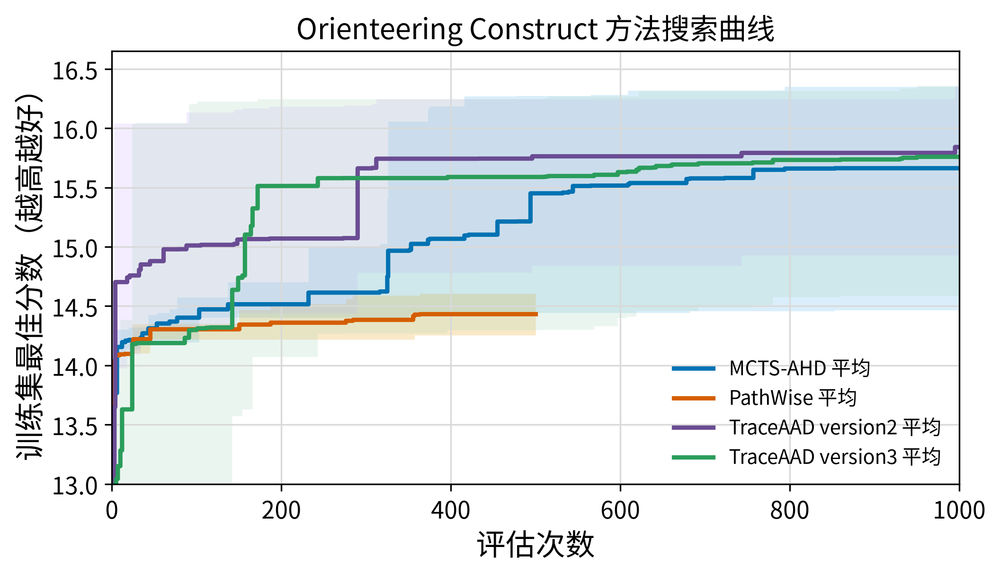

# Orienteering Construct 实验结果

## 实验参数

| 项目 | 配置 |
|---|---|
| 模型 | `Qwen3.6-27B` |
| 训练集 | OP50，16 个实例，`seed=2024` |
| 测试集 | OP50、OP100、OP200，各 16 个实例，`seed=2025` |
| 重复次数 | 3 次独立运行 |
| 搜索预算 | MCTS-AHD：1000 次评估；PathWise：500 次评估；TraceAAD v2/v3：1000 次评估 |
| 方法配置 | MCTS-AHD：`init_size=4`、`pop_size=10`、`selection_num=2`、4 个 sampler、4 个 evaluator、`alpha=0.5`、`lambda_0=0.1`；TraceAAD 使用 `trajectory_ucb` |
| 指标 | 平均 collected prize，越高越好 |
| 测试方式 | 取每次搜索得到的训练集 best heuristic，在固定 held-out 测试集上完整评估 |
| TraceAAD 版本 | version2：`experiments/orienteering_construct/traceaad/version2/`（`20260718_215554_op_rep{1,2,3}`）；version3：`experiments/orienteering_construct/traceaad/version3/`（`20260720_233339_op_v3_rep{1,2,3}`） |

## 方法对比汇总

| 方法 | 搜索预算 | 成功 run 数 | OP50 mean ± std | OP100 mean ± std | OP200 mean ± std |
|---|---:|---:|---:|---:|---:|
| MCTS-AHD | 1000 | 3/3 | 15.813542 ± 0.866044 | 30.474583 ± 2.585569 | 55.671250 ± 4.770439 |
| PathWise | 500 | 3/3 | 14.405000 ± 0.036379 | 27.028333 ± 0.259698 | 50.210417 ± 0.504938 |
| TraceAAD v2 | 1000 | 3/3 | **15.855833 ± 0.885775** | **31.046667 ± 2.144658** | **56.932917 ± 4.042834** |
| TraceAAD v3 | 1000 | 3/3 | 15.787917 ± 1.192654 | 30.530208 ± 3.217514 | 56.135625 ± 5.424441 |

## MCTS-AHD 运行细节

### 各次运行

| Run | 搜索 artifact | 最优 sample | 操作符 | 训练集 best score | OP50 | OP100 | OP200 |
|---|---|---:|---|---:|---:|---:|---:|
| `20260713_125413` | `experiments/orienteering_construct/mcts_ahd/20260713_125413` | 853 | m1 | 14.464375 | 14.817500 | 27.597500 | 50.165625 |
| `20260713_125707` | `experiments/orienteering_construct/mcts_ahd/20260713_125707` | 757 | e2 | 16.175000 | 16.234375 | 31.222500 | 58.271875 |
| `20260713_125712` | `experiments/orienteering_construct/mcts_ahd/20260713_125712` | 794 | m2 | 16.348750 | 16.388750 | 32.603750 | 58.576250 |

### Artifact

- 测试评估汇总：`experiments/orienteering_construct/mcts_ahd/eval_best_qwen36_27b_20260714/results.json`

## PathWise 运行细节

### 各次运行

| Run | 搜索 artifact | 有效样本 | 最优 sample | 训练集 best score | OP50 | OP100 | OP200 |
|---|---|---:|---:|---:|---:|---:|---:|
| PathWise `20260714_105543_rep1` | `experiments/orienteering_construct/pathwise/20260714_105543_rep1` | 496 | 357 | 14.254375 | 14.391250 | 26.795000 | 49.975625 |
| PathWise `20260714_105543_rep2` | `experiments/orienteering_construct/pathwise/20260714_105543_rep2` | 486 | 363 | 14.605000 | 14.446250 | 27.308125 | 50.790000 |
| PathWise `20260714_105543_rep3` | `experiments/orienteering_construct/pathwise/20260714_105543_rep3` | 494 | 355 | 14.440000 | 14.377500 | 26.981875 | 49.865625 |

### Artifact

- 测试评估汇总：`experiments/orienteering_construct/pathwise/eval_best_qwen36_27b_20260714/results.json`

## TraceAAD version2 运行细节

| Run | 搜索 artifact | 有效样本 | 最优 sample | 操作符 | 训练集 best score | OP50 | OP100 | OP200 |
|---|---|---:|---:|---|---:|---:|---:|---:|
| TraceAAD v2 `20260718_215554_op_rep1` | `experiments/orienteering_construct/traceaad/version2/20260718_215554_op_rep1` | 973 | 743 | `simplify` | 14.926875 | 14.833125 | 28.590625 | 52.273125 |
| TraceAAD v2 `20260718_215554_op_rep2` | `experiments/orienteering_construct/traceaad/version2/20260718_215554_op_rep2` | 975 | 312 | `endpoint_refine` | 16.244375 | 16.355000 | 32.000000 | 59.019375 |
| TraceAAD v2 `20260718_215554_op_rep3` | `experiments/orienteering_construct/traceaad/version2/20260718_215554_op_rep3` | 978 | 995 | `mechanism_crossover` | 16.353125 | 16.379375 | 32.549375 | 59.506250 |

### Artifact

- 测试评估汇总：`experiments/orienteering_construct/traceaad/version2/eval_best_20260719_all3/results.json`
- 评估命令：`uv run python experiments/orienteering_construct/evaluate_best_on_test.py <run_dirs...> --output-dir <eval_dir>`
- best heuristic 程序保存在测试评估目录下，与 `results.json` 同目录。

## TraceAAD version3 运行细节

| Run | 搜索 artifact | 有效样本 | 最优 sample | 操作符 | 训练集 best score | OP50 | OP100 | OP200 |
|---|---|---:|---:|---|---:|---:|---:|---:|
| TraceAAD v3 `20260720_233339_op_v3_rep1` | `experiments/orienteering_construct/traceaad/version3/20260720_233339_op_v3_rep1` | 962 | 950 | `endpoint_refine` | 16.357500 | 16.508125 | 32.553125 | 59.334375 |
| TraceAAD v3 `20260720_233339_op_v3_rep2` | `experiments/orienteering_construct/traceaad/version3/20260720_233339_op_v3_rep2` | 938 | 860 | `endpoint_refine` | 14.587500 | 14.411250 | 26.820000 | 49.872500 |
| TraceAAD v3 `20260720_233339_op_v3_rep3` | `experiments/orienteering_construct/traceaad/version3/20260720_233339_op_v3_rep3` | 967 | 930 | `endpoint_refine` | 16.331250 | 16.444375 | 32.217500 | 59.200000 |

### Artifact

- 测试评估汇总：`experiments/orienteering_construct/traceaad/version3/eval_best_20260720_233339/results.json`

## 曲线 Artifact

- 五方法对比：`docs/results/orienteering_construct/搜索曲线_方法对比.png`
- 绘图命令：`MPLCONFIGDIR=/tmp/matplotlib uv run python experiments/plotting/plot_orienteering_construct_search_comparison.py`
- 曲线口径：绘制训练集 best-so-far 的均值曲线和 min-max 区间；MCTS-AHD/TraceAAD 预算 1000，PathWise 预算 500。

## 简单分析

- TraceAAD v2 仍是 constructive OP 上三规模均值最好的版本；v3 均值略低于 v2，也略低于或接近 MCTS-AHD，方差更大。
- v3 的跨 run 分化明显：rep1/rep3 在 OP50/100/200 上很强（接近或超过 v2 最好单次），rep2 明显掉队，拖累三次平均。
- 不同测试规模的 prize 总量不同，分数不应跨 OP50/100/200 直接比较。
