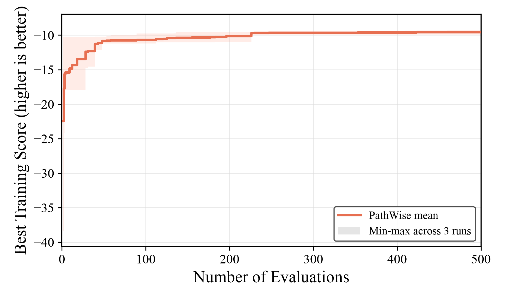

# PathWise + Qwen3.6-27B on CVRP-ACO

Generated: `2026-07-12T17:30:08`

## Experiment data

| Item | Value |
|---|---|
| Method / model | `pathwise` / `qwen3.6-27b-awq` |
| Task | `cvrp_aco` |
| Search budget | `max_sample_nums=500` per run |
| Search split | `train` (10 CVRP50 instances) |
| Test splits | `test_50`, `test_100` (64 instances each) |
| ACO configuration | `n_ants=30`, `n_iterations=100`, `aco_seed=1234` |
| Score semantics | score is negative mean best route length; higher score is better |
| Repeats | 3 independent completed runs |

The report uses the canonical 64-instance `test_50` and `test_100` held-out splits, matching the existing CVRP-ACO result protocol. The separate `paper_test_*` splits are not mixed into this comparison.

## Search runs

| Run | Status | Samples | Valid / failed | Best sample | Operator | Train best score | Duration | Artifact |
|---|---|---:|---:|---:|---|---:|---:|---|
| 20260711_115024 | `finished` | 500 | 491 / 9 | 196 | `world_model` | -9.902781548317 | 7.49 h | `LLM4AD/experiments/cvrp_aco/pathwise/20260711_115024` |
| 20260711_192005 | `finished` | 500 | 494 / 6 | 458 | `world_model` | -9.481939791907 | 5.99 h | `LLM4AD/experiments/cvrp_aco/pathwise/20260711_192005` |
| 20260711_192010 | `finished` | 500 | 495 / 5 | 459 | `world_model` | -9.294031306081 | 8.25 h | `LLM4AD/experiments/cvrp_aco/pathwise/20260711_192010` |

## Held-out test results

Objective is mean best route length on the split; lower is better.

| Split | Run | Best sample | Operator | Objective | Score | Eval seconds |
|---|---|---:|---|---:|---:|---:|
| `test_50` | 20260711_115024 | 196 | `world_model` | 10.095987786938 | -10.095987786938 | 11.81 |
| `test_50` | 20260711_192005 | 458 | `world_model` | 9.719379204147 | -9.719379204147 | 11.16 |
| `test_50` | 20260711_192010 | 459 | `world_model` | 9.568771422062 | -9.568771422062 | 11.76 |
| `test_100` | 20260711_115024 | 196 | `world_model` | 17.388369383129 | -17.388369383129 | 19.57 |
| `test_100` | 20260711_192005 | 458 | `world_model` | 16.663910062373 | -16.663910062373 | 18.81 |
| `test_100` | 20260711_192010 | 459 | `world_model` | 16.567156094068 | -16.567156094068 | 18.55 |

## Three-run summary

Mean and sample standard deviation use the three independent run objectives (ddof=1).

| Split | Mean objective | Objective std | Mean score | Score std |
|---|---:|---:|---:|---:|
| `test_50` | 9.794712804382 | 0.271561479856 | -9.794712804382 | 0.271561479856 |
| `test_100` | 16.873145179857 | 0.448812118067 | -16.873145179857 | 0.448812118067 |

## Artifacts and commands

- Complete evaluation artifact: `LLM4AD/experiments/cvrp_aco/pathwise/eval_20260712_all3/results.json`
- Best programs used for evaluation are stored beside `results.json`.
- Shared evaluator: `experiments/cvrp_aco/evaluate_best_on_test.py`.
- Evaluation command:

```bash
uv run python experiments/cvrp_aco/evaluate_best_on_test.py \
  experiments/cvrp_aco/pathwise/20260711_115024 \
  experiments/cvrp_aco/pathwise/20260711_192005 \
  experiments/cvrp_aco/pathwise/20260711_192010 \
  --output-dir experiments/cvrp_aco/pathwise/eval_20260712_all3 \
  --splits test_50,test_100 --workers 16
```

## Search evolution



The curve shows the mean best-so-far training score across the three runs; the band is the min-max range. Plot script: `docs/results/figures/plot_cvrp_aco_three_method_search.py`.

Method parameters inherited from the run config include `num_evaluators=4`.
