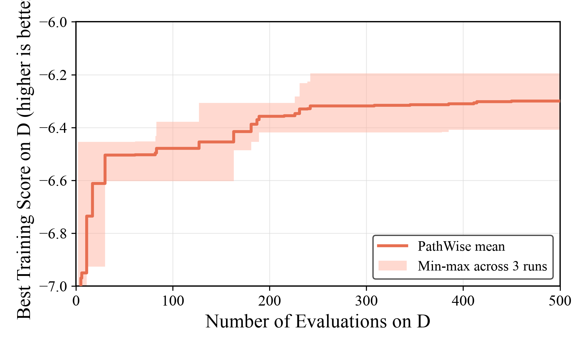

# PathWise + Qwen3.6-27B on TSP Construct

日期：2026-07-10

## 实验数据

| 数据类型 | 路径 |
|---|---|
| 三次搜索 run | `LLM4AD/experiments/tsp_construct/pathwise/20260710_123444` (rep1)<br>`LLM4AD/experiments/tsp_construct/pathwise/20260710_123450` (rep2)<br>`LLM4AD/experiments/tsp_construct/pathwise/20260710_123456` (rep3) |
| 测试评估脚本 | `LLM4AD/experiments/tsp_construct/eval_best_on_test.py` |

## 实验配置

| 项目 | 配置 |
|---|---|
| 方法 / 模型 | `pathwise` / `qwen3.6-27b-awq` |
| 任务 | `tsp_construct` |
| 搜索 budget | `max_sample_nums=500` |
| PathWise 参数 | `pop_size=6, init_pop_size=30, num_actions=2, num_rollouts=2, max_inner_steps=3, num_evaluators=4`，扰动概率 0.5→0.25 |
| 搜索训练集 | `problem_size=50`, `n_instance=16`, `seed=2024` |
| 重复次数 | 3 个独立 run |
| 测试规模 | TSP50、TSP100、TSP200 |
| 测试集 | `n_instance=16`, `seed=2025`（held-out，与 mcts 测试集一致以便对比） |
| 评估方式 | 每个 run 的 best heuristic 在测试集上完整运行 |
| 指标 | `score = - average_tour_length`；score 越高、objective 越低越好 |

评估命令：

```bash
cd /home/fang/code/LLM4AD/LLM4AD
NO_PROXY=222.201.145.8,localhost,127.0.0.1,::1 uv run python experiments/tsp_construct/eval_best_on_test.py <run_dir>
```

脚本自动取该 run 的 best（score 最高）样本，并先在 train (seed=2024) 复跑作 sanity（与 `run_summary.json` 的 `best_score` 完全一致）。tsp100/tsp200 用 eval 种子(2025) 自行构造更大实例（`n_instance=16`, `timeout=120s`）。

## 三次搜索结果 (train)

| run | status | best sample | operator | train best score | finished_at |
|---|---|---:|---|---:|---|
| rep1 (`20260710_123444`) | finished | 450 | `world_model` | `-6.296053` | 2026-07-10 20:10:53 |
| rep2 (`20260710_123450`) | finished | 385 | `world_model` | `-6.408664` | 2026-07-10 19:47:44 |
| rep3 (`20260710_123456`) | finished | 242 | `world_model` | `-6.195115` | 2026-07-10 22:20:50 |

\* rep3 搜索途中累计 24 次瞬时 502（vLLM 服务抖动），均被 PathWise 的 fallback/retry 处理，未影响最终 `status=finished`（跑满 500 sample）。

## 三次测试结果

| 测试集 | 来源 run | best sample | operator | score | objective | 运行时间 |
|---|---|---:|---|---:|---:|---:|
| TSP50 | rep1 (`20260710_123444`) | 450 | `world_model` | `-6.801010` | `6.801010` | `0.08s` |
| TSP50 | rep2 (`20260710_123450`) | 385 | `world_model` | `-6.635784` | `6.635784` | `0.12s` |
| TSP50 | rep3 (`20260710_123456`) | 242 | `world_model` | `-6.377093` | `6.377093` | `0.12s` |
| TSP100 | rep1 (`20260710_123444`) | 450 | `world_model` | `-9.132097` | `9.132097` | `0.15s` |
| TSP100 | rep2 (`20260710_123450`) | 385 | `world_model` | `-9.192803` | `9.192803` | `0.32s` |
| TSP100 | rep3 (`20260710_123456`) | 242 | `world_model` | `-8.861517` | `8.861517` | `0.25s` |
| TSP200 | rep1 (`20260710_123444`) | 450 | `world_model` | `-12.985336` | `12.985336` | `0.40s` |
| TSP200 | rep2 (`20260710_123450`) | 385 | `world_model` | `-12.789604` | `12.789604` | `1.47s` |
| TSP200 | rep3 (`20260710_123456`) | 242 | `world_model` | `-12.446022` | `12.446022` | `0.79s` |

## 三次平均结果

三路独立 run 的平均 objective 与 sample std（ddof=1，与 mcts 结果文件口径一致）：

| 测试集 | 平均 score | 平均 objective | objective sample std |
|---|---:|---:|---:|
| TSP50 | `-6.604629` | `6.604629` | `0.213669` |
| TSP100 | `-9.062139` | `9.062139` | `0.176375` |
| TSP200 | `-12.740321` | `12.740321` | `0.273014` |

## 搜索演化曲线



实线为三次独立 run 的逐 evaluation 平均 best-so-far training score；色带为三个 run 在同一 evaluation 的最小值至最大值区间。绘图脚本：`docs/results/figures/plot_pathwise_tsp_construct_search.py`。

## 备注

- 泛化 gap：TSP50 测试分相对各自 train best 的增量（objective，越低越差）分别为 rep1 +0.50、rep2 +0.23、rep3 +0.18，属正常轻度泛化损失。
- rep3 在 train 与三个测试规模上均为三路最优（train -6.195、TSP50 6.377、TSP100 8.862、TSP200 12.446）。
- train best ≠ test best：rep2 的 train best（-6.409）差于 rep1（-6.296），但 TSP50 测试分（6.636）优于 rep1（6.801）；最终方法间对比应以 test 为准。
- 与 mcts 对比时注意 budget 不同（pathwise=500, mcts=1000），非公平对比。当前 mcts（budget=1000）三路均值 TSP50 6.318 / TSP100 8.719 / TSP200 12.234，均优于 pathwise（budget=500），但 mcts 用了 2× 预算。如需等预算对比，可取 mcts 各 run 在 sample≤500 段的 best 再评估（mcts 不随预算改策略，prefix 合法）。
