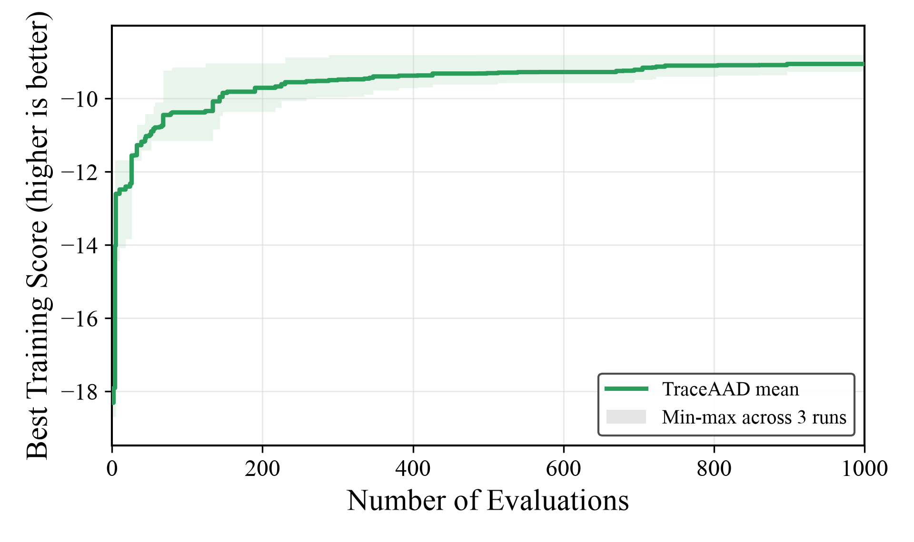

# TraceAAD + Qwen3.6-27B on CVRP-ACO

Generated: `2026-07-12T17:31:41`

## Experiment data

| Item | Value |
|---|---|
| Method / model | `traceaad` / `qwen3.6-27b-awq` |
| Task | `cvrp_aco` |
| Search budget | `max_sample_nums=1000` per run |
| Search split | `train` (10 CVRP50 instances) |
| Test splits | `test_50`, `test_100` (64 instances each) |
| ACO configuration | `n_ants=30`, `n_iterations=100`, `aco_seed=1234` |
| Score semantics | score is negative mean best route length; higher score is better |
| Repeats | 3 independent completed runs |

The report uses the canonical 64-instance `test_50` and `test_100` held-out splits, matching the existing CVRP-ACO result protocol. The separate `paper_test_*` splits are not mixed into this comparison.

## Search runs

| Run | Status | Samples | Valid / failed | Best sample | Operator | Train best score | Duration | Artifact |
|---|---|---:|---:|---:|---|---:|---:|---|
| 20260711_115024 | `finished` | 1000 | 964 / 36 | 486 | `mechanism_crossover` | -8.799423256421 | 16.38 h | `LLM4AD/experiments/cvrp_aco/traceaad/20260711_115024` |
| 20260712_041631 | `finished` | 1000 | 897 / 103 | 897 | `endpoint_refine` | -9.260266693939 | 13.16 h | `LLM4AD/experiments/cvrp_aco/traceaad/20260712_041631` |
| 20260712_041658 | `finished` | 1000 | 922 / 78 | 735 | `distill_simplify` | -9.102390490555 | 12.50 h | `LLM4AD/experiments/cvrp_aco/traceaad/20260712_041658` |

## Held-out test results

Objective is mean best route length on the split; lower is better.

| Split | Run | Best sample | Operator | Objective | Score | Eval seconds |
|---|---|---:|---|---:|---:|---:|
| `test_50` | 20260711_115024 | 486 | `mechanism_crossover` | 9.239211034218 | -9.239211034218 | 11.30 |
| `test_50` | 20260712_041631 | 897 | `endpoint_refine` | 9.529545175947 | -9.529545175947 | 11.28 |
| `test_50` | 20260712_041658 | 735 | `distill_simplify` | 9.215612280090 | -9.215612280090 | 11.42 |
| `test_100` | 20260711_115024 | 486 | `mechanism_crossover` | 15.800265262067 | -15.800265262067 | 18.82 |
| `test_100` | 20260712_041631 | 897 | `endpoint_refine` | 16.453502697156 | -16.453502697156 | 18.70 |
| `test_100` | 20260712_041658 | 735 | `distill_simplify` | 15.610828147466 | -15.610828147466 | 18.72 |

## Three-run summary

Mean and sample standard deviation use the three independent run objectives (ddof=1).

| Split | Mean objective | Objective std | Mean score | Score std |
|---|---:|---:|---:|---:|
| `test_50` | 9.328122830085 | 0.174835483694 | -9.328122830085 | 0.174835483694 |
| `test_100` | 15.954865368896 | 0.442098398490 | -15.954865368896 | 0.442098398490 |

## Artifacts and commands

- Complete evaluation artifact: `LLM4AD/experiments/cvrp_aco/traceaad/eval_20260712_all3/results.json`
- Best programs used for evaluation are stored beside `results.json`.
- Shared evaluator: `experiments/cvrp_aco/evaluate_best_on_test.py`.
- Evaluation command:

```bash
uv run python experiments/cvrp_aco/evaluate_best_on_test.py \
  experiments/cvrp_aco/traceaad/20260711_115024 \
  experiments/cvrp_aco/traceaad/20260712_041631 \
  experiments/cvrp_aco/traceaad/20260712_041658 \
  --output-dir experiments/cvrp_aco/traceaad/eval_20260712_all3 \
  --splits test_50,test_100 --workers 16
```

## Search evolution



The curve shows the mean best-so-far training score across the three runs; the band is the min-max range. Plot script: `docs/results/figures/plot_cvrp_aco_three_method_search.py`.

Method parameters inherited from the run config include `num_evaluators=1`, `sampling_strategy=trajectory_ucb`.
