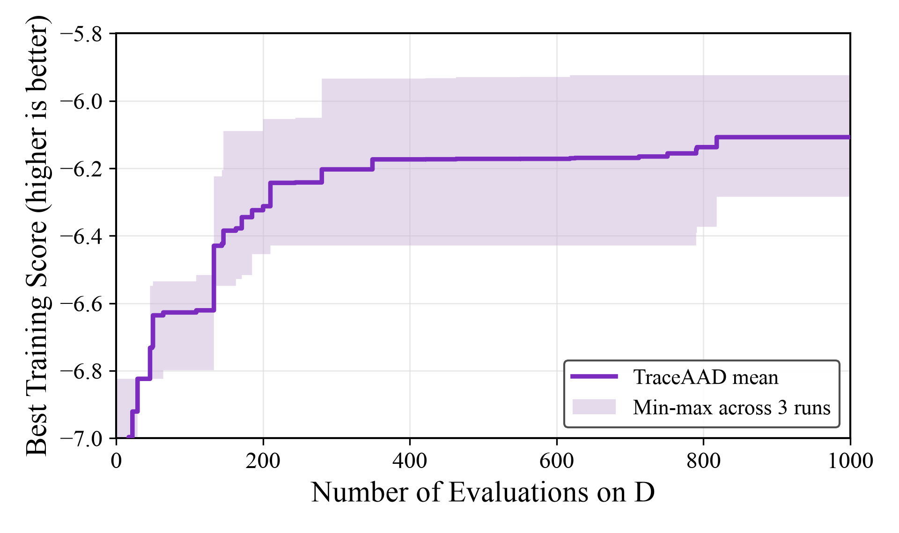

# TraceAAD + Qwen3.6-27B on TSP Construct

日期：2026-07-11

## 实验数据

| 数据类型 | 路径 |
|---|---|
| 三次搜索 run | `LLM4AD/experiments/tsp_construct/traceaad/20260710_203531` (rep1)<br>`LLM4AD/experiments/tsp_construct/traceaad/20260710_203541` (rep2)<br>`LLM4AD/experiments/tsp_construct/traceaad/20260710_203551` (rep3) |
| 测试结果 JSON | `LLM4AD/experiments/tsp_construct/traceaad/eval_best_qwen36_27b_20260711/results.json` |
| 测试评估脚本 | `LLM4AD/experiments/tsp_construct/eval_best_on_test.py` |

## 实验配置

| 项目 | 配置 |
|---|---|
| 方法 / 模型 | `traceaad` / `qwen3.6-27b-awq` |
| 任务 | `tsp_construct` |
| 搜索 budget | `max_sample_nums=1000` |
| 搜索训练集 | `problem_size=50`, `n_instance=16`, `seed=2024` |
| 重复次数 | 3 个独立 run |
| 测试规模 | TSP50、TSP100、TSP200 |
| 测试集 | `n_instance=16`, `seed=2025` |
| 评估方式 | 每个 run 的最高 training score heuristic 在测试集上完整运行 |
| 超时 / 并行 | 常规评测 120 秒串行；rep3 TSP200 最终复测为 16 workers、1000 秒上限 |
| 指标 | `score = - average_tour_length`；score 越高、objective 越低越好 |

评估命令：

```bash
cd /home/fang/code/LLM4AD/LLM4AD
uv run python experiments/tsp_construct/eval_best_on_test.py <run_dir> --workers 16 --timeout 1000
```

## 三次搜索结果 (train)

| run | status | best sample | operator | train best score | finished_at |
|---|---|---:|---|---:|---|
| rep1 (`20260710_203531`) | finished | 818 | `endpoint_refine` | `-6.284352058801078` | 2026-07-11 06:31:55 |
| rep2 (`20260710_203541`) | finished | 751 | `distill_simplify` | `-6.11483043627728` | 2026-07-11 06:21:23 |
| rep3 (`20260710_203551`) | finished | 618 | `endpoint_refine` | `-5.923946561001779` | 2026-07-11 08:48:07 |

三个 best heuristic 在 `problem_size=50, seed=2024` 上复算均与搜索 artifact 完全一致。

## 三次测试结果

| 测试集 | 来源 run | best sample | operator | score | objective | 运行时间 |
|---|---|---:|---|---:|---:|---:|
| TSP50 | rep1 (`20260710_203531`) | 818 | `endpoint_refine` | `-6.403005` | `6.403005` | `0.12s` |
| TSP50 | rep2 (`20260710_203541`) | 751 | `distill_simplify` | `-6.219307` | `6.219307` | `0.56s` |
| TSP50 | rep3 (`20260710_203551`) | 618 | `endpoint_refine` | `-5.981222` | `5.981222` | `8.12s` |
| TSP100 | rep1 (`20260710_203531`) | 818 | `endpoint_refine` | `-9.031695` | `9.031695` | `0.42s` |
| TSP100 | rep2 (`20260710_203541`) | 751 | `distill_simplify` | `-8.459609` | `8.459609` | `2.50s` |
| TSP100 | rep3 (`20260710_203551`) | 618 | `endpoint_refine` | `-8.489722` | `8.489722` | `104.15s` |
| TSP200 | rep1 (`20260710_203531`) | 818 | `endpoint_refine` | `-12.543740` | `12.543740` | `1.99s` |
| TSP200 | rep2 (`20260710_203541`) | 751 | `distill_simplify` | `-11.921825` | `11.921825` | `12.64s` |
| TSP200 | rep3 (`20260710_203551`) | 618 | `endpoint_refine` | `-12.451602` | `12.451602` | `140.95s`（16 workers） |

## 三次平均结果

平均 objective 与 sample std 使用三个 run 计算（ddof=1，与 MCTS-AHD、PathWise 结果口径一致）：

| 测试集 | 平均 score | 平均 objective | objective sample std |
|---|---:|---:|---:|
| TSP50 | `-6.201178` | `6.201178` | `0.211475` |
| TSP100 | `-8.660342` | `8.660342` | `0.321953` |
| TSP200 | `-12.305722` | `12.305722` | `0.335642` |

rep3 的 TSP200 串行评测在原 120 秒上限内未完成；使用完全相同的 16 个 held-out 实例，以 16 workers、1000 秒上限复测后在 140.95 秒完成。并行 TSP50 等价性检查得到 `-5.981222`，与原串行结果一致。

## 搜索演化曲线



实线为三次独立 run 在 1000 evaluations 内的逐 evaluation 平均 best-so-far training score；色带为三个 run 在同一 evaluation 的最小值至最大值区间。绘图脚本：`docs/results/figures/plot_traceaad_tsp_construct_search.py`。

## 观察

- rep3 的 train、TSP50 和 TSP100 均为三路最优，但其 best heuristic 计算复杂度较高：串行 TSP100 耗时 104.15 秒，并行 TSP200 仍耗时 140.95 秒。质量和运行效率需要同时报告。
- rep2 的 `distill_simplify` best 在 TSP100/TSP200 上兼具较好 objective 与明显更低的运行时间，是三路中更稳定的尺度泛化结果。
- TraceAAD 当前是 1000-evaluation 预算；与 PathWise 的 500-evaluation 最终结果直接比较时需注明预算差异。
