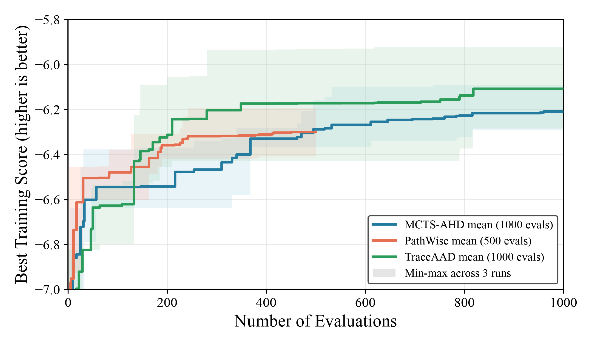

# TSP Construct 三方法结果对比

日期：2026-07-11

## 对比口径

三个方法均使用 `qwen3.6-27b-awq`，在 TSP50 train instances（`n_instance=16, seed=2024`）上搜索；每个方法包含 3 个独立 run。测试使用同一 held-out seed `2025`，分别构造 16 个 TSP50、TSP100、TSP200 实例。

本页比较各方法在其正式搜索预算下得到的最终 best heuristic：

| 方法 | 搜索预算 | 测试候选选择 |
|---|---:|---|
| MCTS-AHD | 1000 evaluations | 各 run 前 1000 evaluations 的 best |
| PathWise | 500 evaluations | 各 run 前 500 evaluations 的 best |
| TraceAAD | 1000 evaluations | 各 run 前 1000 evaluations 的 best |

因此本页是当前完整实验结果的横向汇总，不是严格等预算比较。PathWise 的搜索预算只有另外两种方法的一半。

## Held-out 测试结果

表中为三次独立 run 的 objective mean ± sample std；objective 为平均 tour length，越低越好。

| 方法 | TSP50 | TSP100 | TSP200 |
|---|---:|---:|---:|
| MCTS-AHD (1000) | `6.318157 ± 0.127192` | `8.719380 ± 0.175825` | **`12.234488 ± 0.264339`** |
| PathWise (500) | `6.604629 ± 0.213669` | `9.062139 ± 0.176375` | `12.740321 ± 0.273014` |
| TraceAAD (1000) | **`6.201178 ± 0.211475`** | **`8.660342 ± 0.321953`** | `12.305722 ± 0.335642` |

TSP50 上 TraceAAD 最优；TSP100 上 TraceAAD 的 mean 最优，但跨 run 波动大于 MCTS-AHD；TSP200 上 MCTS-AHD 最优，TraceAAD 非常接近。PathWise 使用一半搜索预算，三个测试规模上的 objective 均高于两个 1000-budget 方法，因此不能将差距完全归因于搜索机制。

## 搜索演化曲线

每条实线为对应方法三次 run 的逐 evaluation 平均 best-so-far training score，色带为同一 evaluation 下的 min-max。PathWise 只绘制其实际 500 evaluations；MCTS-AHD 与 TraceAAD 绘制完整 1000 evaluations。曲线比较的是 train score，最终方法判断应以 held-out 测试表为主。

绘图脚本：`docs/results/figures/plot_tsp_construct_three_method_search.py`。

## 结果来源

| 方法 | 权威结果文件 | 原始测试 artifact |
|---|---|---|
| MCTS-AHD | `docs/results/mcts-ahd-qwen36-27b-tsp-construct.md` | `LLM4AD/experiments/tsp_construct/mcts_ahd/eval_best_qwen36_27b_20260710/results.json` |
| PathWise | `docs/results/pathwise-qwen36-27b-tsp-construct.md` | 三次 run 由 `LLM4AD/experiments/tsp_construct/eval_best_on_test.py` 评测，逐 run 数值见权威结果文件 |
| TraceAAD | `docs/results/traceaad-qwen36-27b-tsp-construct.md` | `LLM4AD/experiments/tsp_construct/traceaad/eval_best_qwen36_27b_20260711/results.json` |

## 评测效率备注

TraceAAD rep3 best heuristic 内含候选 rollout 与反复 2-opt，计算复杂度明显高于其他 best。其 TSP200 串行评测超过原 120 秒上限；将同一批 16 个实例分配给 16 workers 后，在 140.95 秒完成并得到 objective `12.451602`。并行只改变墙钟时间，不改变实例集合、单实例算法或最终平均值。
