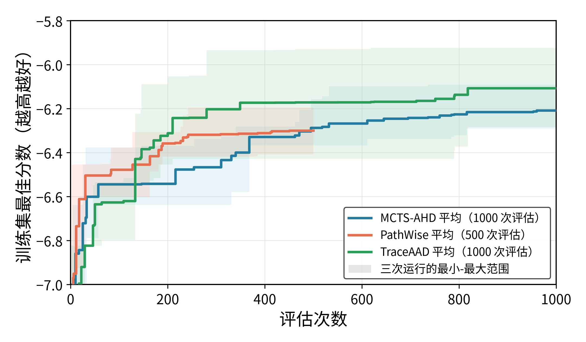

# TSP Construct 实验结果

## 实验参数

| 项目 | 配置 |
|---|---|
| 模型 | `qwen3.6-27b-awq` |
| 训练集 | TSP50，16 个实例，`seed=2024` |
| 测试集 | TSP50、TSP100、TSP200，各 16 个实例，`seed=2025` |
| 重复次数 | 每种方法 3 次独立运行 |
| 搜索预算 | MCTS-AHD：1000；PathWise：500；TraceAAD：1000 |
| 方法配置 | MCTS-AHD 4 evaluators；PathWise 4 evaluators；TraceAAD 使用 `trajectory_ucb`、1 个 evaluator |
| 指标 | `objective` 为平均 tour length，越低越好；`score=-objective` |
| 测试方式 | 取每次搜索得到的训练集 best heuristic，在同一 held-out 测试集上完整评估 |

## 运行结果

### 各次运行

| 方法 | Run | 最优 sample | 训练集 best score | TSP50 objective | TSP100 objective | TSP200 objective |
|---|---|---:|---:|---:|---:|---:|
| MCTS-AHD | `20260709_213505` | 960 | -6.245047 | 6.396046 | 8.757032 | 12.376769 |
| MCTS-AHD | `20260709_213507` | 816 | -6.291167 | 6.387044 | 8.873330 | 12.397212 |
| MCTS-AHD | `20260709_213510` | 736 | -6.091061 | 6.171380 | 8.527779 | 11.929484 |
| PathWise | `20260710_123444` | 450 | -6.296053 | 6.801010 | 9.132097 | 12.985336 |
| PathWise | `20260710_123450` | 385 | -6.408664 | 6.635784 | 9.192803 | 12.789604 |
| PathWise | `20260710_123456` | 242 | -6.195115 | 6.377093 | 8.861517 | 12.446022 |
| TraceAAD | `20260710_203531` | 818 | -6.284352 | 6.403005 | 9.031695 | 12.543740 |
| TraceAAD | `20260710_203541` | 751 | -6.114830 | 6.219307 | 8.459609 | 11.921825 |
| TraceAAD | `20260710_203551` | 618 | -5.923947 | 5.981222 | 8.489722 | 12.451602 |

### 三次运行平均

| 方法 | 搜索预算 | TSP50 objective | TSP100 objective | TSP200 objective |
|---|---:|---:|---:|---:|
| MCTS-AHD | 1000 | 6.318157 ± 0.127192 | 8.719380 ± 0.175825 | **12.234488 ± 0.264339** |
| PathWise | 500 | 6.604629 ± 0.213669 | 9.062139 ± 0.176375 | 12.740321 ± 0.273014 |
| TraceAAD | 1000 | **6.201178 ± 0.211475** | **8.660342 ± 0.321953** | 12.305722 ± 0.335642 |

## 简单分析

- TraceAAD 在 TSP50 和 TSP100 上取得最低的平均 objective；MCTS-AHD 在 TSP200 上最好。
- PathWise 的三个测试规模结果都高于另外两种方法，但它只使用 500 次 evaluation，不能把差距完全归因于机制本身。
- TraceAAD 在 TSP100 上平均最好但跨 run 波动较大；MCTS-AHD 在三个规模上的结果更稳定。
