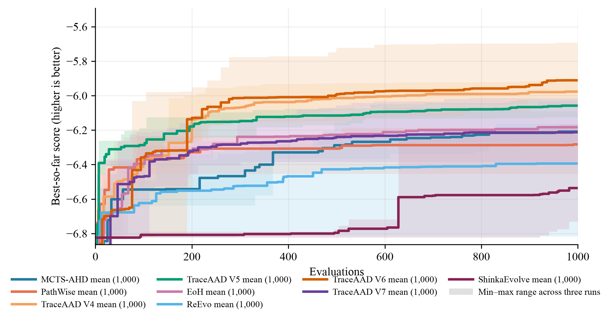

# TSP Construct 实验结果

## 实验设置与比较口径

本页比较 TSP Construct 方法在固定搜索协议下的 held-out tour length。比较单位是某方法在一个测试规模上的一次完整搜索运行。Qwen3.6-27B 在 TSP50 × 16（`seed=2024`）上用于搜索，在 TSP50/100/200 各 16 个实例（`seed=2025`）上用于测试。每种方法独立运行 3 次，搜索预算均为 1000。指标为平均 tour length，越低越好。

表中每个数值为 3 次运行的 held-out 均值 ± 样本标准差；± 仅描述运行间变异，不是置信区间，也不支持统计显著性判断。加粗表示该列的最佳均值。

## 三次运行平均

| 方法 | TSP50 | TSP100 | TSP200 |
| --- | ---: | ---: | ---: |
| MCTS-AHD | 6.318157 ± 0.127192 | 8.719380 ± 0.175825 | 12.234488 ± 0.264339 |
| PathWise | 6.490129 ± 0.186413 | 8.895653 ± 0.319771 | 12.409647 ± 0.347392 |
| TraceAAD V4 | 6.040012 ± 0.160757 | 8.503962 ± 0.223707 | 11.886306 ± 0.140818 |
| TraceAAD V5 | 6.187259 ± 0.062425 | 8.569365 ± 0.197009 | 12.046895 ± 0.364253 |
| TraceAAD V6 | **5.956746 ± 0.314421** | **8.285381 ± 0.379067** | **11.880971 ± 0.640664** |
| EoH | 6.228240 ± 0.103448 | 8.642466 ± 0.119373 | 12.145391 ± 0.246453 |
| ReEvo | 6.596210 ± 0.447923 | 9.105136 ± 0.561099 | 12.769022 ± 0.583434 |
| ShinkaEvolve | 6.752927 ± 0.467579 | 9.315053 ± 0.583263 | 12.890186 ± 0.713860 |

### 结果解释与限制

TraceAAD V6 在 TSP50、TSP100 和 TSP200 的报告均值均为该列最低值。其报告的运行间样本标准差在三个尺度上分别为 0.314421、0.379067 和 0.640664；因此，表中最佳均值不应解释为统计显著性。该结论限于给定实例、随机种子、搜索预算和 3 次独立运行，不能据此推断对其他数据分布或预算的普遍优势。

搜索曲线提供搜索过程的补充证据，不能替代上述 held-out 结果。

## 可复现性工件

正式工件：V4 位于
[`traceaad_v4/version4`](../../../experiments/tsp_construct/traceaad_v4/version4/)，
V5 位于
[`traceaad_v5/version5`](../../../experiments/tsp_construct/traceaad_v5/version5/)，
EoH 位于
[`eoh`](../../../experiments/tsp_construct/eoh/)（批次
`eoh_paper_20260729_2350`；测试
[`eval_best_eoh_paper_20260730`](../../../experiments/tsp_construct/eoh/eval_best_eoh_paper_20260730/)），
PathWise / ReEvo 位于对应目录；测试
[`eval_best_fair1000_20260730`](../../../experiments/tsp_construct/pathwise/eval_best_fair1000_20260730/)
/
[`eval_best_fair1000_20260730`](../../../experiments/tsp_construct/reevo/eval_best_fair1000_20260730/)）。
TraceAAD V6 位于
[`traceaad_v6/version6`](../../../experiments/tsp_construct/traceaad_v6/version6/)（正式批次
`v6_20260802_170400_occamv1`；测试
[`eval_best_occamv1_20260803`](../../../experiments/tsp_construct/traceaad_v6/eval_best_occamv1_20260803/)），
ShinkaEvolve 位于
[`shinka_evo`](../../../experiments/tsp_construct/shinka_evo/)（批次
`fair1000_20260730_1755`；测试
[`eval_best_fair1000_20260730`](../../../experiments/tsp_construct/shinka_evo/eval_best_fair1000_20260730/)）。
