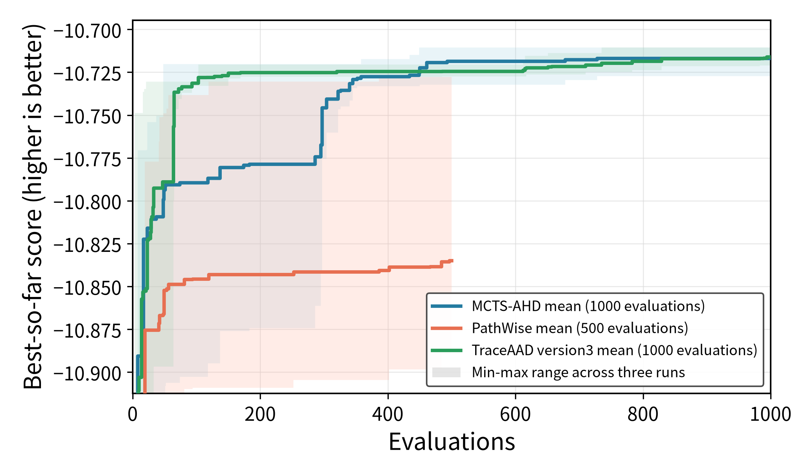
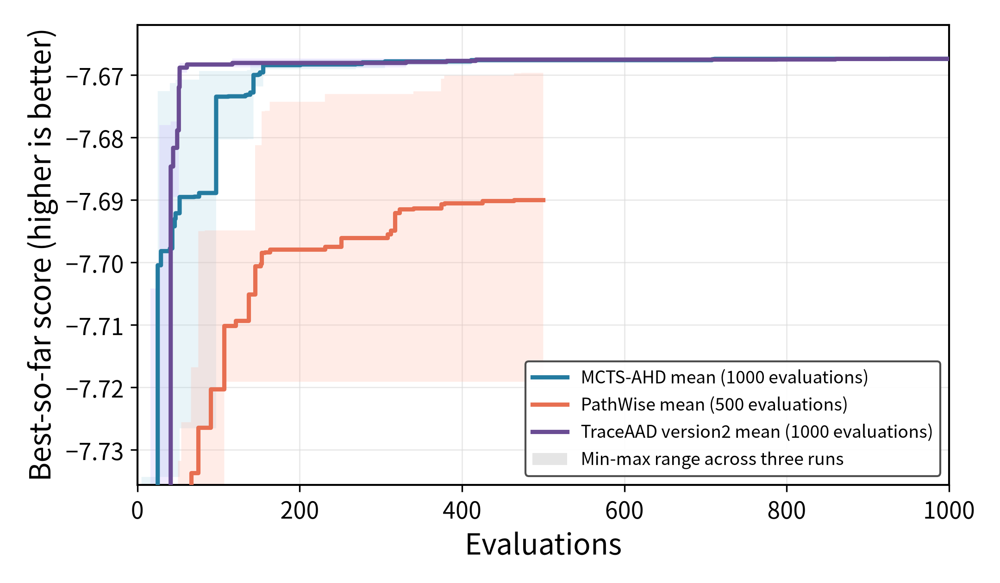

# TSP-GLS 实验结果

> **Task 难度判断（2026-07-24）**：TSP-GLS 的计算问题本身不简单，但强 GLS 后端已经完成大部分优化，当前模板到最好方法的训练改善约 0.35%，属于低信号、细粒度改进场景。既有实验结果继续保留并报告，后续不再启动 TSP-GLS v4 或其他新增实验。

## 新协议（训 TSP200，测 TSP100/200/500/1000）

权威配置见 `docs/实验配置.md`。MCTS-AHD / PathWise / TraceAAD v3 均已按新协议完成训练与测试。

### 实验参数

| 项目 | 配置 |
|---|---|
| 模型 | `Qwen3.6-27B`（三源等价） |
| 任务 | `tsp_gls_2O`，`TSPGLSEvaluation`（`-mean_tour_cost`） |
| 训练集 | `n_instance=16`，`problem_size=200`，`seed=2024`，`timeout_seconds=120` |
| 测试集 | TSP100/200/500/1000 × 16，`seed=2025`（多规模评估不设 timeout） |
| 重复次数 | 每种方法 3 次独立运行 |
| 搜索预算 | MCTS-AHD：1000；PathWise：500；TraceAAD v3：1000 |
| 指标 | `score = -mean_tour_cost`，越高越好；下表测试列报告 mean tour cost（越低越好） |
| 运行批次 | MCTS/PathWise：`20260722_152153`；TraceAAD v3：`20260720_233339` |

### 各次运行

| 方法 | Run | 最优 sample | 训练集 best | TSP100 | TSP200 | TSP500 | TSP1000 |
|---|---|---:|---:|---:|---:|---:|---:|
| MCTS-AHD | `20260722_152153_tspgls_rep1` | 449 | -10.710568 | 7.702027 | 10.769720 | 16.859863 | 23.727902 |
| MCTS-AHD | `20260722_152153_tspgls_rep2` | 728 | -10.727270 | 7.716346 | 10.790946 | 16.884064 | 23.691557 |
| MCTS-AHD | `20260722_152153_tspgls_rep3` | 493 | -10.713009 | 7.701785 | 10.783018 | 16.824589 | 23.594396 |
| PathWise | `20260722_152153_tspgls_rep1` | 49 | -10.889403 | 7.812211 | 10.956761 | 17.130884 | 23.950310 |
| PathWise | `20260722_152153_tspgls_rep2` | 496 | -10.887611 | 7.761648 | 10.925593 | 17.148069 | 24.003308 |
| PathWise | `20260722_152153_tspgls_rep3` | 386 | -10.727727 | 7.705348 | 10.787962 | 16.882883 | 23.710949 |
| TraceAAD v3 | `20260720_233339_tspgls_v3_rep1` | 983 | -10.721076 | 7.705540 | 10.787051 | 16.891743 | 23.658512 |
| TraceAAD v3 | `20260720_233339_tspgls_v3_rep2` | 735 | -10.710589 | 7.711831 | 10.774837 | 16.786606 | 23.533784 |
| TraceAAD v3 | `20260720_233339_tspgls_v3_rep3` | 994 | -10.716636 | 7.699934 | 10.765988 | 16.867333 | 23.571849 |

### 三次运行平均（mean tour cost，越低越好）

| 方法 | 预算 | 训练集 score | TSP100 | TSP200 | TSP500 | TSP1000 |
|---|---:|---:|---:|---:|---:|---:|
| TraceAAD v3 | 1000 | **-10.716100 ± 0.005264** | **7.705768 ± 0.005952** | **10.775959 ± 0.010577** | **16.848561 ± 0.055025** | **23.588048 ± 0.063922** |
| MCTS-AHD | 1000 | -10.716949 ± 0.009021 | 7.706719 ± 0.008338 | 10.781228 ± 0.010726 | 16.856172 ± 0.029909 | 23.671285 ± 0.069023 |
| PathWise | 500 | -10.834914 ± 0.092830 | 7.759736 ± 0.053457 | 10.890105 ± 0.089821 | 17.053945 ± 0.148393 | 23.888189 ± 0.155765 |

### Artifact

- MCTS-AHD：`experiments/tsp_gls/mcts_ahd/eval_best_20260722_152153/results.json`
- PathWise：`experiments/tsp_gls/pathwise/eval_best_20260722_152153/results.json`
- TraceAAD v3：`experiments/tsp_gls/traceaad/version3/eval_best_20260720_233339/results.json`
- 评估命令：`uv run python experiments/tsp_gls/evaluate_best_on_test.py <run_dirs...> --output-dir <eval_dir>`
- 绘图命令：`MPLCONFIGDIR=/tmp/matplotlib uv run python experiments/plotting/plot_tsp_gls_three_method_search.py`

### 简单分析

- TraceAAD v3 在四个测试规模上均值均最好，且方差最小；同分布 TSP200 与外推 TSP500/1000 都略优于 MCTS。
- MCTS 与 TraceAAD 训练最优接近（约 −10.717），差距主要在 held-out 与大实例外推。
- PathWise 预算 500，训练与测试均明显更弱，且跨 run 波动更大（rep3 相对最好）。

---

## 旧协议（训/测均为 TSP100，历史）

> 下列结果仅作历史对照，不再作为权威口径。

### 实验参数

| 项目 | 配置 |
|---|---|
| 模型 | `Qwen3.6-27B`（三源等价调度） |
| 任务 | `tsp_gls_2O`，`TSPGLSEvaluation`（`-mean_tour_cost`） |
| 训练集 | `n_instance=16`，`problem_size=100`，`seed=2024`，`timeout_seconds=60` |
| 测试集 | 同规模，`seed=2025` |
| 搜索预算 | MCTS-AHD / TraceAAD：1000；PathWise：500 |
| 指标 | `score = -mean_tour_cost`，越高越好 |
| 模板基线 | 训练 -7.670824 / 测试 -7.705642 |

### 各次运行

| 方法 | Run | 最优 sample | 训练集 best | 测试 score | 测试 mean cost |
|---|---|---:|---:|---:|---:|
| MCTS-AHD | `20260720_140109_tspgls_rep1` | 708 | -7.667370 | -7.708199 | 7.708199 |
| MCTS-AHD | `20260720_140109_tspgls_rep2` | 201 | -7.667520 | -7.700392 | 7.700392 |
| MCTS-AHD | `20260720_140109_tspgls_rep3` | 711 | -7.667370 | -7.704806 | 7.704806 |
| PathWise | `20260720_140109_tspgls_rep1` | 90 | -7.719102 | -7.775695 | 7.775695 |
| PathWise | `20260720_140109_tspgls_rep2` | 473 | -7.669659 | -7.701191 | 7.701191 |
| PathWise | `20260720_140109_tspgls_rep3` | 425 | -7.681216 | -7.738770 | 7.738770 |
| TraceAAD v2 | `20260720_140109_tspgls_rep1` | 788 | -7.667370 | -7.711423 | 7.711423 |
| TraceAAD v2 | `20260720_140109_tspgls_rep2` | 117 | -7.667370 | -7.702169 | 7.702169 |
| TraceAAD v2 | `20260720_140109_tspgls_rep3` | 927 | -7.667520 | -7.705226 | 7.705226 |

### 三次运行平均

| 方法 | 预算 | 训练集 score | 测试 score | 测试 mean cost |
|---|---:|---:|---:|---:|
| MCTS-AHD | 1000 | -7.667420 ± 0.000087 | **-7.704466 ± 0.003914** | **7.704466 ± 0.003914** |
| TraceAAD v2 | 1000 | -7.667420 ± 0.000087 | -7.706273 ± 0.004715 | 7.706273 ± 0.004715 |
| PathWise | 500 | -7.689992 ± 0.025863 | -7.738552 ± 0.037252 | 7.738552 ± 0.037252 |
| 模板基线 | — | -7.670824 | -7.705642 | 7.705642 |

### Artifact

- MCTS-AHD：`experiments/tsp_gls/mcts_ahd/eval_best_20260720_140109/results.json`
- PathWise：`experiments/tsp_gls/pathwise/eval_best_20260720_140109/results.json`
- TraceAAD v2：`experiments/tsp_gls/traceaad/version2/eval_best_20260720_140109/results.json`
