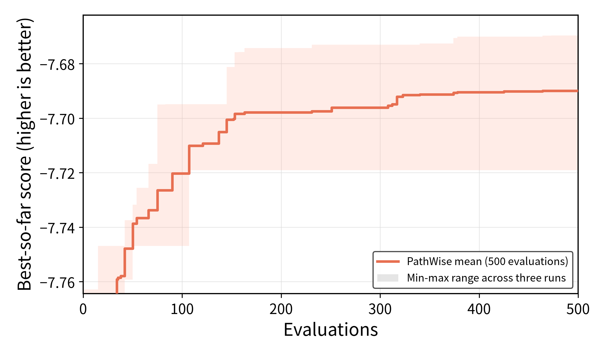

# TSP-GLS 实验结果

> 当前仅 PathWise 三重复完成并完成 held-out 测试；MCTS-AHD / TraceAAD 仍在跑，完整三方法对比页待其结束后再更新。

## 实验参数

| 项目 | 配置 |
|---|---|
| 模型 | `Qwen3.6-27B`（rep1 zhong Q4_K_M / rep2 server1 awq / rep3 Fang_lab） |
| 任务 | `tsp_gls_2O`，实验评估器 `TSPGLSEvaluation`（只取 `-mean_tour_cost`） |
| 训练集 | `n_instance=16`，`problem_size=100`，`seed=2024`，`timeout_seconds=60` |
| 测试集 | 同规模，`seed=2025` |
| 重复次数 | PathWise：3 次独立运行 |
| 搜索预算 | PathWise：500（MCTS-AHD / TraceAAD：1000，进行中） |
| 指标 | `score = -mean_tour_cost`，越高越好；下表同时给出平均 tour cost（越低越好） |
| 测试方式 | 取每次搜索训练集 best heuristic，在 held-out `seed=2025` 上完整评估 |
| 模板基线 | `evaluation.py` 内置 `update_edge_distance`：训练 -7.670824 / 测试 -7.705642 |

## PathWise 运行结果

### 各次运行

| 方法 | Run | 最优 sample | 训练集 best score | 测试 score | 测试 mean cost |
|---|---|---:|---:|---:|---:|
| PathWise | `20260720_140109_tspgls_rep1` | 90 | -7.719102 | -7.775695 | 7.775695 |
| PathWise | `20260720_140109_tspgls_rep2` | 473 | -7.669659 | -7.701191 | 7.701191 |
| PathWise | `20260720_140109_tspgls_rep3` | 425 | -7.681216 | -7.738770 | 7.738770 |

### 三次运行平均

| 方法 | 搜索预算 | 训练集 score | 测试 score | 测试 mean cost |
|---|---:|---:|---:|---:|
| PathWise | 500 | -7.689992 ± 0.025863 | -7.738552 ± 0.037252 | 7.738552 ± 0.037252 |
| 模板基线 | — | -7.670824 | -7.705642 | 7.705642 |

## Artifact

- PathWise 测试评估：`experiments/tsp_gls/pathwise/eval_best_20260720_140109/results.json`
- 评估命令：`uv run python experiments/tsp_gls/evaluate_best_on_test.py <run_dirs...> --output-dir <eval_dir>`
- 绘图命令：`MPLCONFIGDIR=/tmp/matplotlib uv run python experiments/plotting/plot_tsp_gls_pathwise_search.py`

## 简单分析

- 三路 PathWise 中仅 rep2 训练/测试略优于模板基线；rep1、rep3 均明显弱于模板，均值被拖低。
- 训练领先与测试领先方向一致（rep2 最好，rep1 最差），未见明显过拟合反转。
- 相对 OBP/KP，本任务上 PathWise（预算 500）尚未表现出稳定超越模板的能力；待 MCTS-AHD / TraceAAD 完成后做同页对比。
