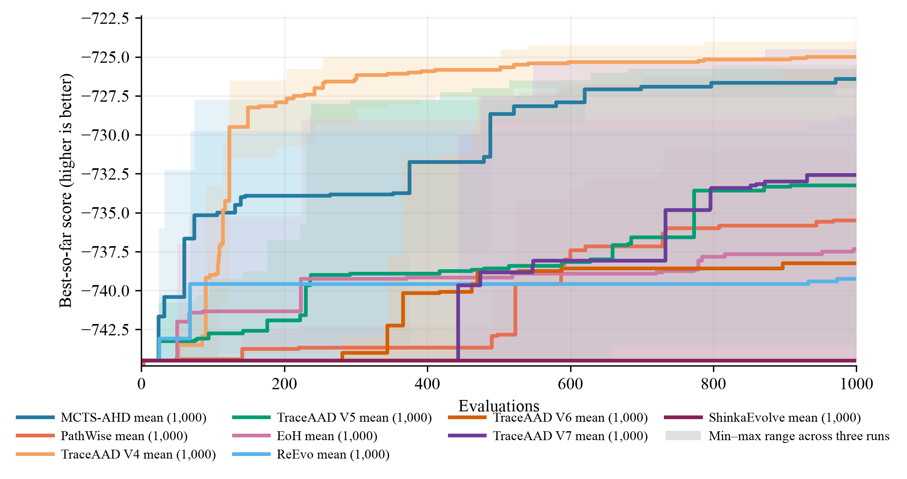

# 跨任务实验总汇

## 1. 实验设置

所有方法使用 Qwen3.6-27B 和 1000 次搜索评估。每种方法独立运行 3 次；表中为 held-out 均值 ± 样本标准差，加粗表示最佳均值，不代表统计显著性。

| Task | 搜索协议 | Held-out 测试协议 | 指标与方向 |
| --- | --- | --- | --- |
| TSP Construct | TSP50 × 16，`seed=2024` | TSP50/100/200，各 16 个实例，`seed=2025` | tour length，越低越好 |
| CVRP-ACO | 10 个 CVRP50 实例，30 ants × 100 iterations，`aco_seed=1234` | CVRP50/100，各 64 个实例 | 最优路径长度，越低越好 |
| OP-ACO | OP50 × 5，`seed=1234`，20 ants × 50 iterations | OP50/100/200，各 64 个实例，`seed=4567` | collected prize，越高越好 |
| Online Bin Packing | `1k/5k × capacity={100,500}` 固定实例 | `1k/5k/10k × capacity={100,500}`，各 5 个实例 | 箱数，越低越好 |

## 2. 最终测试结果

### 2.1 TSP Construct

| 方法 | TSP50 ↓ | TSP100 ↓ | TSP200 ↓ |
| --- | ---: | ---: | ---: |
| MCTS-AHD | 6.318157 ± 0.127192 | 8.719380 ± 0.175825 | 12.234488 ± 0.264339 |
| PathWise | 6.490129 ± 0.186413 | 8.895653 ± 0.319771 | 12.409647 ± 0.347392 |
| TraceAAD V4 | **6.040012 ± 0.160757** | **8.503962 ± 0.223707** | **11.886306 ± 0.140818** |
| TraceAAD V5 | 6.187259 ± 0.062425 | 8.569365 ± 0.197009 | 12.046895 ± 0.364253 |
| EoH | 6.228240 ± 0.103448 | 8.642466 ± 0.119373 | 12.145391 ± 0.246453 |
| ReEvo | 6.596210 ± 0.447923 | 9.105136 ± 0.561099 | 12.769022 ± 0.583434 |

### 2.2 CVRP-ACO

| 方法 | CVRP50 ↓ | CVRP100 ↓ |
| --- | ---: | ---: |
| MCTS-AHD | **8.961703 ± 0.179934** | **15.114426 ± 0.316653** |
| PathWise | 9.354221 ± 0.122157 | 15.905908 ± 0.241743 |
| TraceAAD V4 | 9.129223 ± 0.129956 | 15.413780 ± 0.294039 |
| TraceAAD V5 | 9.038972 ± 0.091240 | 15.428279 ± 0.229195 |
| EoH | 9.069143 ± 0.035767 | 15.479988 ± 0.123083 |
| ReEvo | 9.471978 ± 0.403672 | 16.025671 ± 0.650593 |

### 2.3 OP-ACO

| 方法 | OP50 ↑ | OP100 ↑ | OP200 ↑ |
| --- | ---: | ---: | ---: |
| MCTS-AHD | **15.125559 ± 0.100494** | 30.512176 ± 0.526601 | 54.894583 ± 1.613211 |
| PathWise | 15.038228 ± 0.097637 | 30.324539 ± 0.319138 | 54.214323 ± 0.545583 |
| TraceAAD V4 | 15.069351 ± 0.090613 | 30.216914 ± 0.673457 | 53.509375 ± 2.611692 |
| TraceAAD V5 | 15.111948 ± 0.115030 | **30.710591 ± 0.245109** | **55.792500 ± 0.613045** |
| EoH | 15.119813 ± 0.187204 | 30.445387 ± 0.455741 | 54.754948 ± 1.398744 |
| ReEvo | 14.858840 ± 0.367110 | 30.237583 ± 0.818002 | 54.894583 ± 1.844302 |

### 2.4 Online Bin Packing

| 方法 | 1k/100 ↓ | 5k/100 ↓ | 10k/100 ↓ | 1k/500 ↓ | 5k/500 ↓ | 10k/500 ↓ |
| --- | ---: | ---: | ---: | ---: | ---: | ---: |
| MCTS-AHD | 414.067 ± 3.062 | 2026.600 ± 3.219 | 4043.600 ± 5.892 | 80.933 ± 0.416 | **402.733 ± 0.643** | **804.867 ± 1.137** |
| PathWise | 424.067 ± 3.700 | 2068.067 ± 18.649 | 4124.933 ± 36.890 | 80.867 ± 0.115 | 403.067 ± 0.231 | 805.800 ± 0.200 |
| TraceAAD V4 | **413.600 ± 3.292** | **2023.600 ± 7.203** | **4037.333 ± 16.008** | 81.333 ± 0.462 | 403.133 ± 0.902 | 805.133 ± 1.332 |
| TraceAAD V5 | 415.467 ± 3.802 | 2050.133 ± 32.883 | 4093.400 ± 64.420 | 81.200 ± 0.693 | 403.600 ± 0.529 | 805.533 ± 0.987 |
| EoH | 417.067 ± 3.591 | 2058.533 ± 30.901 | 4108.133 ± 63.686 | 81.600 ± 1.386 | 404.067 ± 1.501 | 806.600 ± 1.217 |
| ReEvo | 416.800 ± 5.196 | 2069.667 ± 34.526 | 4128.067 ± 67.088 | **80.800 ± 0.000** | 403.067 ± 0.231 | 805.600 ± 0.346 |

## 3. 搜索过程曲线

曲线为三次运行的 mean best-so-far，阴影为 min–max。纵轴统一为越高越好；测试表保留原始指标方向。

### TSP Construct

### CVRP-ACO

### OP-ACO

### Online Bin Packing

## 4. 结论

没有方法在所有任务上占优：TraceAAD V4 领先 TSP 和 OBP capacity=100，TraceAAD V5 领先 OP100/200，MCTS-AHD 领先 CVRP 和部分 OBP 配置。方法排序依赖任务结构与测试尺度；搜索曲线和 held-out 结果分别反映搜索过程与最终泛化，不能相互替代。

## 5. 结果来源

- [TSP Construct 结果汇总](tsp_construct/结果汇总.md)
- [CVRP-ACO 结果汇总](cvrp_aco/结果汇总.md)
- [OP-ACO 结果汇总](op_aco/结果汇总.md)
- [Online Bin Packing 结果汇总](online_bin_packing/结果汇总.md)
- [实验配置](../experiments/配置.md)
- [实验覆盖](../experiments/覆盖.md)
